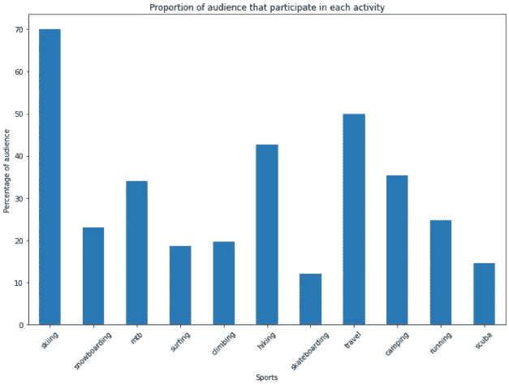
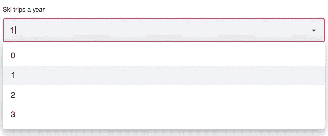
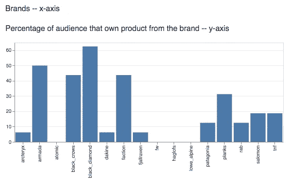

# 使用 Streamlit 上的调查数据构建应用程序

> 原文：<https://towardsdatascience.com/building-an-application-with-survey-data-on-streamlit-5e7628597f31?source=collection_archive---------47----------------------->

乔里斯·贝特洛在 [Unsplash](https://unsplash.com?utm_source=medium&utm_medium=referral) 上的照片

在过去的几个月里，我一直在玩 Streamlit，因为它是一种仅用一个 Python 脚本就能生成数据科学 web 应用程序的非常棒的方式。

这项技术的美妙之处在于，它消除了对前端技术进行编程的要求，让您专注于好东西——讲述一个引人入胜的数据故事。

我处理大量的调查信息，我认为用我们从基于滑雪的调查中收集的数据构建一个应用程序会很有趣。

我用 Streamlit 开发这款应用的动机有几个原因:

*   可共享性——将应用程序投入生产非常容易，它将位于 Streamlit 云上，并且为您提供了一个唯一的 url，您可以共享它，这使得它非常容易访问。它也是移动优先的，这对于跨设备兼容性非常好。
*   互动性——我希望我的品牌合作伙伴和同事能够与应用程序互动和互动，通过调整输入参数产生不同的结果，从而提供更多价值。

Alex Lange 在 [Unsplash](https://unsplash.com?utm_source=medium&utm_medium=referral) 上拍摄的照片

*本文将介绍如何在高层次上构建该应用程序，还有许多其他关于 Streamlit 复杂性的优秀文章。*

## 数据清理

当调查数据从另一端出来时，通常会非常混乱——这是因为调查的问题和答案格式通常不会转换成清晰的格式化数据集。话虽如此，随着时间的推移，我利用我的经验来调整调查的问题结构，以使数据格式化过程更有效。

第一个目的地是将数据输入到 Jupyter 笔记本中，这样 Pandas 就可以用来将数据框格式化成我可以进行分析的东西。

在这里，我删除了包含调查问题信息的行，这样就只剩下了用户数据，并格式化了列，使它们易于使用——缩短名称、小写、无空格等。

## 数据工程

一旦我得到了我想要的信息，我就运行一些数据可视化来更好地理解数据，这让我可以开始构建我的故事。

探索性数据可视化

我想展示我们的观众根据他们一年滑雪的次数和他们喜欢的滑雪方式购买的品牌。

为了测试这一点，我在笔记本中构建了一个函数，然后调用该函数来查看输出。

## 简化 Python 脚本

一旦我从工程的角度理解了应用程序将如何运行，我就开始在一个. py 文件中构建应用程序。

如上所述，交互性对这个项目非常重要，我希望应用程序的用户能够选择输入数据，然后直接输入到脚本的核心功能中，然后产生输出数据和关键可视化。

选择框示例

我使用了 Streamlit 的 selectbox，它将选择的数据保存为变量，然后输入到核心函数并生成柱状图。

输出柱状图

## 结论

Streamlit 与我在 Python 中的数据分析技能相结合，使我能够创建一个[交互式网络应用](https://share.streamlit.io/gilesdean/ski_clustering/main/ski.py)，将行人调查数据转化为一个工具，允许没有分析技能的用户提取大量价值。我很高兴看到技术的进步，我将继续探索 Streamlit 可以创造什么。

如果你想了解关于这个项目的更多信息，请在 [LinkedIn](https://www.linkedin.com/in/gilesdean/) 上与我联系，我将很乐意接受对话，该项目的源代码也可在 [my GitHub](https://github.com/gilesdean/ski_clustering) 上获得。