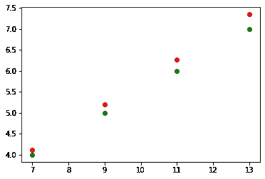

# 用一行代码构建一个人工神经网络

> 原文：<https://towardsdatascience.com/building-an-artificial-neural-network-in-one-line-of-code-9addc414c5e9?source=collection_archive---------17----------------------->

## TensorFlow 2 最简单的神经网络


图片由维基媒体上的 [mikemacmarketing](https://commons.wikimedia.org/w/index.php?search=Artificial+neural+network&title=Special:MediaSearch&go=Go&type=image) 提供

关于人工神经网络的解剖和数学有大量的理论文章，所以我将采用另一种方法来撰写和教授这个主题。在这篇文章中，我们要马上动手了！

让我们直接开始吧。如果您想跳过安装部分，可以选择下面的部分。

[安装](#f418)
∘ [选项 1](#4078)
∘ [选项 2](#d671)
[数据](#7b19)
[模型](#1566)
[为什么要 TensorFlow？](#e664)

# 装置

> 如果您已经安装了需求，那么您可以跳过这一节。

## 选项 1

我们需要做的第一件事是确保我们已经安装了 Python 编程语言，如果你还没有，那么就在这里[安装它](https://www.python.org/downloads/)。

请注意，如果在安装过程中询问您是否要将 Python 添加到 PATH 变量中，请务必同意。接下来要做的是打开终端或 CMD，这取决于您的操作系统。

如果您使用的是 windows，请按 Windows 按钮并键入“cmd”。然后双击结果顶部显示“命令提示符”的黑色图标。

现在只需输入:

```
pip install numpy
pip install matplotlib
```

和

```
pip install tensorflow
```

请注意，如果您在 Mac 或 Linux 上，您可能必须键入“pip3”而不是“pip”。

接下来你需要做的就是打开某种文本编辑器或 IDE，比如 nodepad、Pycharm、VSCode、Sublime 或其他编辑器。

## 选项 2

在你的谷歌硬盘中安装谷歌的合作实验室。你可以在网站上获得这样做所需的所有信息。

[](https://colab.research.google.com/notebooks/intro.ipynb#recent=true) [## 谷歌联合实验室

### 编辑描述

colab.research.google.com](https://colab.research.google.com/notebooks/intro.ipynb#recent=true) 

Google Colab 的一个好处是你可以免费使用大量的计算能力。具体来说，你可以在云中的 GPU 上训练你的模型，这使得它成为一个很好的研究框架。

# 数据

当我们训练有监督的机器学习算法时，我们需要标记的数据。也就是说，我们需要一个数据集，其中对于每个示例 ***x*** 我们需要一个标签 ***y*** ，模型应该预测它何时被馈送 ***x*** 。

在本文中，我们将尽可能做最简单的事情。我们不会考虑测试，所以这是关于最佳实践的**而不是**！我们将简单地考虑一种线性关系，并通过在谷歌的机器学习库 **TensorFlow** 中建立一个只有一个神经元的神经网络来尝试拟合该模型。

让我们打开我们选择的编辑器，输入

这段代码确保加载了所有相关的库。对于某些 x ≥ 0 的情况，您可能希望 TensorFlow 的版本是 2.x，所以尝试一个简单的

```
print(tf.__version__)
```

您应该会看到类似 2.5.0 的内容。

让我们创建数据。我们将创建自己的数据。简单地像这样自己创造一个线性关系。

作为一个聪明的人，你可能已经注意到了这个模式。

> 如果你猜对了 *f(x) = 1/2 + x/2* ，你就猜对了。

# 模型

想法是这样的:我们将显示来自 **xs** 数组的网络值，并以 ***ys*** 数组的形式告诉模型正确的答案，以便对于 x 的每个值，模型将做出猜测，并通过查看真实的对应 y 值来纠正自己。

然后，该模型将通过称为反向传播的东西来调整自己(我们将使用**随机梯度下降**)，并且对于每个示例，该模型将会改进。

我们没有太多的数据，所以这当然会限制模型的准确性，但本文的唯一目标是捕捉神经网络的思想，并了解张量流的一些简单语法。

我们将在一行代码中创建单个节点的人工神经网络，即:

现在我们已经建立了网络，让我们来训练它。

优化器确保网络改进其猜测，并且损失函数测量单个猜测的好坏。

现在我们来做个预测。

我们大约得到了 **4.12** 。现在让我们策划一些预测。

我们得到的输出是下图，绿色显示地面实况，红色显示模型预测。



作者图片

请注意，这是**而不是**线性回归，因为这与“最佳拟合”没有任何关系，而是每次尝试都试图自我修正的模型的结果。数据的缺乏和模型的简单很能说明问题，但我们仍然设法在这个简单的任务中捕捉到了神经网络的本质。

为了充分理解这一点，请尝试再次运行此代码。你不会得到完全相同的预测，因为这是一个新模型，而机器学习模型本质上是概率性的。

例如，当我第二次运行它时，当我给模型输入数字 7 时，我得到了一个新的预测。我大概弄了 **4.08** 。你会得到与我不同的东西！

您可以尝试使用这段代码来熟悉(hyper)参数的语法和效果。

例如，尝试将纪元设置为 200 或 1000。试试其他线性关系。

# 为什么是 TensorFlow？

如果你想学习如何建立机器学习模型，TensorFlow 是一个非常好的选择，有几个原因。

TensorFlow 是当今最受欢迎的深度学习框架之一。

它是一个非常成熟的库，因为它是由 Google 构建的，并且它可以与 Python 一起使用，这是两个重要的原因，但是我们为什么不看看一些使用它的公司，感受一下它在行业中的重要性。

使用 TensorFlow 的公司包括

*   爱彼迎（美国短租平台）
*   空中巴士
*   可口可乐
*   谷歌
*   美国英特尔公司(财富 500 强公司之一ˌ以生产 CPU 芯片著称)
*   联想（电脑的品牌名）
*   贝宝
*   Spotify
*   推特

这样的例子不胜枚举…

所以 TensorFlow 将会一直存在，如果你想在未来成为一名数据科学家或 ML 工程师，有很多公司会雇佣 TensorFlow 开发人员，所以学习这个伟大的框架绝对值得你花时间。

我们到了这个关于张量流和神经网络的小而简单的介绍的结尾。

在未来，我会发布越来越多的高级机器学习帖子，但我们需要从简单开始。

如果您有任何问题、意见或顾虑，请联系 LinkedIn。

[](https://www.linkedin.com/in/kasper-m%C3%BCller-96ba95169/) [## Kasper Müller -高级顾问，数据和分析，金融服务，技术咨询- EY | LinkedIn

### 编程、数学和教学是我最大的兴趣。数据科学、机器学习和…

www.linkedin.com](https://www.linkedin.com/in/kasper-m%C3%BCller-96ba95169/) 

下次见。