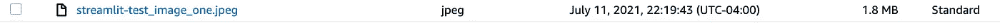
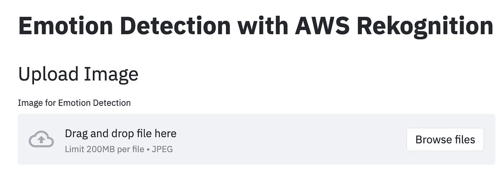
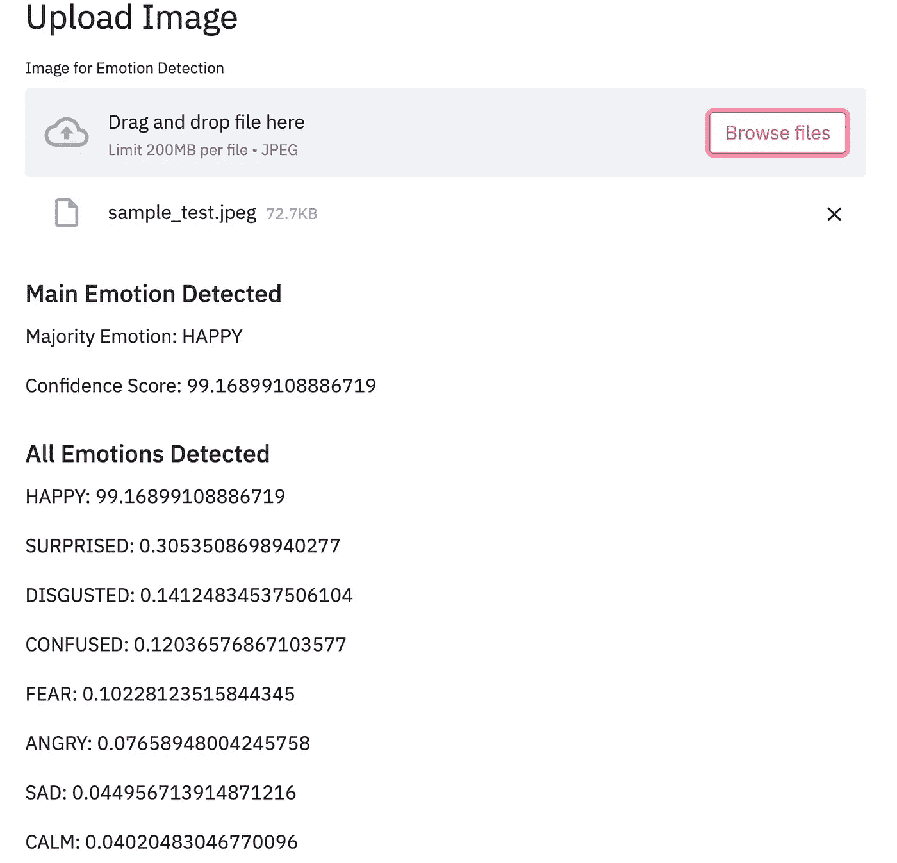

# 构建情绪检测应用程序

> 原文：<https://towardsdatascience.com/building-an-emotion-detection-application-54697de9ae01?source=collection_archive---------32----------------------->

## 使用 AWS Rekognition 用不到 50 行 Python 代码构建计算机视觉项目

图片来自 [Unsplash](https://unsplash.com/photos/muS2RraYRuQ)

计算机视觉(CV)可能是一个非常理论化和紧张的领域，需要大量的 ML 和数学知识来解开和理解为对象检测、面部识别和对象跟踪等主题提供动力的算法。如果你在理论上没有必要的经验，或者没有时间来构建一个定制的 ML/CV 模型， [AWS Rekognition](https://aws.amazon.com/rekognition/?blog-cards.sort-by=item.additionalFields.createdDate&blog-cards.sort-order=desc) 可以让你通过 API 调用来构建强大的 CV 应用。AWS Rekognition 是 AWS 提供的众多自动人工智能服务之一。这些服务是为那些**在 **ML** 中没有**太多**背景**的开发人员，或者时间**少的数据科学家**快速构建强大的 ML 应用程序，或者**根据你可能正在开发的**定制模型进行性能基准测试。AWS Rekognition 是 AWS 上用于计算机视觉的事实上的自动人工智能服务。如果您对构建定制模型感兴趣，请查看关于如何在那里部署定制 TensorFlow 模型的 [AWS SageMaker](https://aws.amazon.com/sagemaker/) 和我的[文章](/training-and-deploying-custom-tensorflow-models-with-aws-sagemaker-72027722ad76)。对于本文，我们将构建一个 [Streamlit](https://streamlit.io/) 应用程序，它接受一幅图像，并使用 Rekognition 返回图像中检测到的主要情感。

**注意**:对于 AWS 的新手来说(有一些经验来完全理解这篇文章是很好的)，如果你想继续下去，请确保在下面的 [**链接**](https://aws.amazon.com/console/) 中做一个记录。我还将提供一个我们将使用的服务列表，以及更深入的定义。如果您已经熟悉了这些服务，可以直接跳到代码演示。

# 目录

1.  AWS 服务
2.  设置简化应用程序
3.  集成认知
4.  整个代码和结论

# AWS 服务

[**AWS Rekognition**](https://boto3.amazonaws.com/v1/documentation/api/latest/reference/services/rekognition.html#Rekognition.Client.detect_faces):AWS 主要的 Auto-AI 计算机视觉服务。有大量的功能，从人脸检测，文本检测，到物体跟踪。

[**AWS S3**](https://aws.amazon.com/s3/) :亚马逊的主要存储服务，我们将使用该服务来存储我们的**训练数据**和**模型工件**/信息。

[**Boto3**](https://boto3.amazonaws.com/v1/documentation/api/latest/index.html) :针对 Python 开发者的 AWS 软件开发包( **SDK** )，可以用这个来配合 AWS 服务。在这个用例中，我们将使用 Boto3 与 S3 一起访问我们的图像并调用 Rekognition。

[**身份访问和管理(IAM)**](https://aws.amazon.com/iam/) :通过权限和角色管理 AWS 服务的访问。在使用我的代码时，您可能希望通过 AWS CLI 对用户进行身份验证。这里有一篇[文章](https://blog.gruntwork.io/authenticating-to-aws-with-the-credentials-file-d16c0fbcbf9e)详细介绍了设置过程，如果你需要帮助的话。

# 设置简化应用程序

在我们开始处理 Rekognition 部分之前，我们需要设置我们的 web 应用程序。我们希望我们的应用程序能够**上传**一个**文件**，然后我们可以使用 Rekognition 在后端处理它。Streamlit 有一个简洁的文件上传特性，我们可以在这个用例中使用。我已经为**样本图像**创建了一个小的**目录**，我们可以调用它进行分析。

将文件上传到 S3

我们从样本图像目录中捕获文件。然后，我们使用 Boto3 与 S3 合作，将我们的本地图像存储在我们创建的 S3 存储桶中。要创建 S3 存储桶，您可以转到 AWS 控制台手动创建，或者如果您有 [AWS CLI](https://aws.amazon.com/cli/) 设置，您可以简单地运行**AWS MB unique-bucket-name**来创建您的存储桶。我们需要我们在 S3 的数据，因为 **Rekognition** 直接**与 S3** 集成，用于其 API 调用，从而将我们的图像上传到 S3 的代码。

文件上传到 S3(作者截图)

Streamlit 应用程序设置(作者截图)

我们现在有了一个 Streamlit 应用程序集，可以接受图像并将其推送到 S3，以便与 Rekognition 一起使用。

# 集成认知

我们现在可以专注于对样本图像进行情感检测。Rekognition 在 [**detect_faces**](https://boto3.amazonaws.com/v1/documentation/api/latest/reference/services/rekognition.html#Rekognition.Client.detect_faces) 中有一个 API 调用，它获取输入图像并返回各种参数，例如:年龄范围、性别、眼睛睁开情况、情绪等等。出于这一应用的目的，我们将关注于**情绪参数**。我们首先需要为 Rekognition 创建一个 boto3 客户端，就像我们对 S3 所做的那样。

识别客户端

我们现在有了客户机，现在可以向 detect_faces API 调用输入适当的数据了。

重新确认 API 调用

现在我们已经得到了 API 响应，我们希望解析输出，将注意力集中在面部表情上。我们为演示上传的示例图像如下所示。

图片来自 [Unsplash](https://unsplash.com/photos/IF9TK5Uy-KI)

我们现在解析响应，以显示检测到的多数情绪和所有其他情绪，以及 Rekognition 在该情绪中的**置信度**得分。

解析 Rekognition 输出

现在，如果我们使用**streamlit run filename . py**运行我们的 streamlit 应用程序，我们应该会看到我们的应用程序成功运行。

显示重新识别结果(作者截图)

我们看到大多数情绪以及 Rekognition 检测到的所有情绪，为了清理 UI，您还可以添加一个 CV 库，如 [PIL](https://pypi.org/project/Pillow/) 来显示您正在上传的样本图像或文件。

# 整个代码和结论

<https://github.com/RamVegiraju/MoodDetectionApp>  

要访问该项目的完整代码，请单击上方的链接**。Auto-AI 正在快速扩张，AWS、Azure 和 GCP 等云提供商也在增长，并提供各种尖端服务，如 Rekognition，使您能够以简单的方式使用 ML 来支持应用程序。对于数据科学家和那些没有 ML 背景的人来说，Rekognition 对于快速启动和运行计算机视觉应用程序非常有用。在这些[博客](https://aws.amazon.com/blogs/machine-learning/tag/amazon-rekognition/)中查看一些更酷的 AWS 重新识别用例。**

我希望这篇文章对那些从事计算机视觉项目或探索 AWS 的人有用。请随时在 LinkedIn 上与我联系，或者在 T2 媒体上关注我，了解我更多的写作内容。分享任何想法或反馈，谢谢阅读！