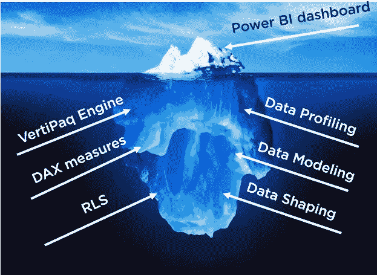
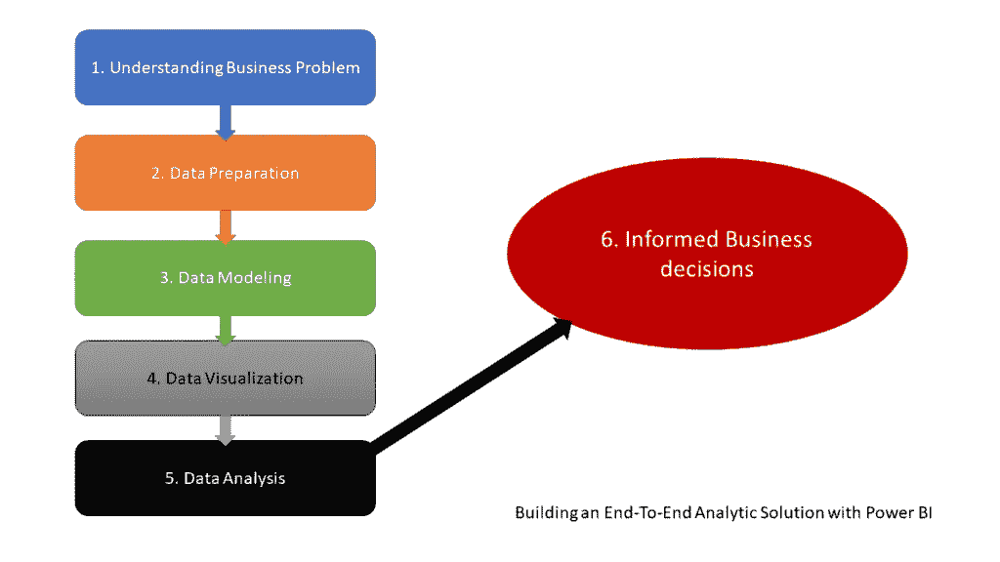

# 在 Power BI 中构建端到端分析解决方案:第 1 部分—理解业务问题

> 原文：<https://towardsdatascience.com/building-an-end-to-end-analytic-solution-in-power-bi-part-1-understanding-the-business-problem-85db9e2d745b?source=collection_archive---------24----------------------->

## 当我与不深入 Power BI 世界的人交谈时，我经常得到的印象是，他们认为 Power BI 只是一个可视化工具。在这一系列文章中，我将向您展示如何使用 Power BI 来创建一个成熟的分析解决方案。

## 在第一部分中，我们通过定义构建成功的分析解决方案的所有阶段来搭建舞台！

[https://unsplash.com/photos/qwtCeJ5cLYs](https://unsplash.com/photos/qwtCeJ5cLYs)

*当我与不了解 Power BI 世界的人交谈时，我经常得到的印象是，他们认为 Power BI 只是一个可视化工具。虽然这在一定程度上是对的，但在我看来，他们没有看到更大的图景，或者更好的说法是，他们看到的只是冰山一角！这个冰山一角是那些闪亮的仪表盘，KPI 箭头，花哨的人工智能东西，等等。*

*然而，事情远不止如此，因为真实的事情隐藏在表面之下……*

*在这一系列文章中，我将向您展示如何使用 Power BI 来创建成熟的解析解决方案* *。从不提供任何有用信息的原始数据开始，构建不仅仅是好看的可视化，而是提取可用于定义适当行动的洞察力——我们称之为知情决策。*

当我与不深入 Power BI 世界的人交谈时，我经常得到的印象是，他们认为 Power BI 只是一个可视化工具。虽然这在一定程度上是对的，但在我看来，他们没有看到更大的图景，或者更好的说法是，他们看到的只是冰山一角！这个冰山一角是那些闪亮的仪表盘，KPI 箭头，花哨的人工智能东西，等等。

然而，事情远不止如此，因为真实的东西就在表面之下…

作者使用 PowerPoint 的插图

这下面的部分，由多个单独的，但有凝聚力的部分组成，使表面上的作品闪闪发光！

在这一系列文章中，我将向您展示如何使用 Power BI 来创建一个成熟的解析解决方案。从不提供任何有用信息的原始数据开始，构建不仅仅是好看的可视化，而是提取可用于定义适当行动的洞察力——我们称之为知情决策。

## 搭建舞台

在这一系列文章中，我将使用一个包含纽约市汽车碰撞数据的开放数据集，可以在这里找到。这个数据集包含大约 180 万行。每一行代表纽约市发生的一起事故，至少有一人受伤/死亡，或者总损失至少为 1000 美元。数据来自 CSV 文件，包含 29 列。

[晋振伟在 Unsplash 拍摄的照片](https://unsplash.com/photos/ipHlSSaC3vk)

现在，在我们开始构建我们的解决方案之前，我们需要定义工作流并确定流程中的特定阶段。因此，第一个也是最重要的任务是设定创造最终结果的必要步骤。以下是我的清单:

1.  ***了解业务问题*** —这是起点，因为不了解业务问题，我们的解决方案就无法解决业务需求。我想增加销售额吗？留住客户是我的主要目标吗？如果我在下一季度放弃一些服务，会发生什么？这些是需要使用数据洞察来回答的业务问题的一些典型示例。在这个例子中，我们的“业务”问题是识别碰撞的关键位置，并试图防止将来发生事故
2.  ***数据准备*** —在这一阶段，我们需要执行一些步骤来使我们的数据为进一步的消化做好准备。从[数据剖析](/go-getem-sherlock-doing-data-profiling-in-power-bi-like-a-pro-44f448730e6c)开始，这样我们可以识别可能的异常值和异常，然后应用各种[数据整形](/power-bi-101-data-shaping-in-a-nutshell-1df4681bdfd3)技术在数据成为我们数据模型的一部分之前准备数据
3.  ***数据建模*** —当我们构建一个解析解决方案时，数据模型必须满足(或者至少应该满足)一些与数据建模相关的一般假设。对于大多数分析系统，包括 Power BI，维度建模是必经之路——因此，我们需要分解原始的宽事实表，并利用星型模式概念来建立适当的数据模型
4.  ***数据可视化*** —这是文章开头的人最喜欢的阶段:)…是时候用数字来取悦我们的眼睛，并使用方便的 Power BI 视觉效果来显示它们了
5.  ***数据分析***——有一个好看的视觉是好的，但它需要给一个看着它的人提供一些洞察力。因此，这一阶段的主要目的是提供洞察力——例如，纽约市车祸的高峰时间是什么时候？最危险的地点是哪里？皇后区有多少行人受伤？等等…
6.  ***明智的业务决策*** —这是一个可选阶段，可以从该解决方案中排除，完全留给业务利益相关者。但是，嘿，让我们一直扮演我们的数据分析师角色，并根据我们在前一阶段获得的见解给出一些建议！

作者使用 PowerPoint 的插图

# 1.理解业务问题

构建您的(成功的)分析解决方案的第一步也是最重要的一步，为了达到其目的并被用户***采用，就是给出关键业务问题的答案。没有人需要漂亮的仪表板和酷炫的视觉效果，如果它们不能提供洞察力并帮助决策者理解正在发生的事情及其原因。***

我如何能增加我的销售？为什么上个季度那么多客户离开我们？我能做些什么来改善交付流程？什么时候是针对市场进行促销的最佳时期？

这些只是商业利益相关者最常问的几个问题。不仅如此——也许对底层数据的洞察可以帮助用户识别全新的模式并提出一个问题: ***我们正在解决正确的问题吗？***

[斯蒂芬·道森在 Unsplash 上拍摄的照片](https://unsplash.com/photos/qwtCeJ5cLYs)

因此，在一开始就确定关键问题是极其重要的，这样我们就可以对我们的数据进行塑造和建模，以最有效的方式来回答这些问题。

对于我们的数据集，我们不必处理“经典”的业务问题——因为没有销售、产品、促销……然而，这并没有降低它的“价值”,更不用说允许我们跳过上面定义的一些步骤。我们的一些“业务”问题可能是:

*   这个城市最危险的地方是哪里？
*   一天中的哪个时间最关键？
*   行人占所有受伤者的百分比是多少？
*   哪个行政区的事故率最高？
*   什么类型的汽车最容易发生事故？

找到这些问题的答案的最终目标是确定导致碰撞的关键指标(数据分析阶段)，并设法采取行动，防止未来的事故，或至少减少事故数量(做出明智的决策)。

## 结论

Power BI 不仅仅是一个可视化工具！不断重复这句话，不要忘了开头的冰山插图。

在本文中，我们奠定了理论背景，并解释了每个成功的分析解决方案的关键支柱的概念。在下一部分中，我们将开始探索我们的数据集，尝试识别可能的异常，检查数据集的某些部分是否需要增强或重构，并最终将数据塑造成能够让我们为流程中的后续阶段构建高效数据模型的形式。

感谢阅读！

成为会员，阅读 Medium 上的每一个故事！