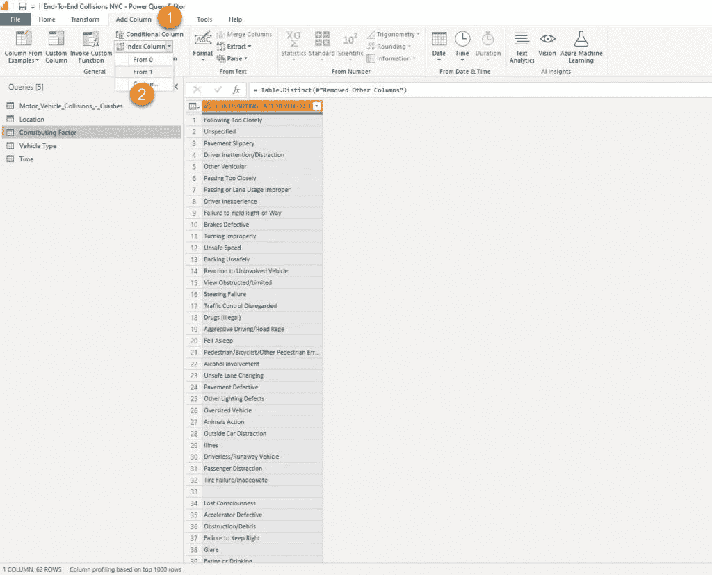

# 在 Power BI 中构建端到端分析解决方案:第 3 部分——提高数据建模水平！

> 原文：<https://towardsdatascience.com/building-an-end-to-end-analytic-solution-in-power-bi-part-3-level-up-with-data-modeling-cfbf3e4e2cd?source=collection_archive---------20----------------------->

## 在我们清理和塑造了我们的数据之后，是时候升级游戏了！了解为什么星型模式和 Power BI 是天作之合，以及如何在 Power BI 中直接构建它！


[福克斯在 pexels.com 拍摄的图片](https://www.pexels.com/photo/green-neon-bubble-level-on-metal-bracket-in-dark-room-3829224/)

> 当我与不深入 Power BI 世界的人交谈时，我经常得到的印象是，他们认为 Power BI 只是一个可视化工具。虽然这在一定程度上是对的，但在我看来，他们没有看到更大的图景，或者更好的说法是，他们看到的只是冰山一角！这个冰山一角是那些闪亮的仪表盘，KPI 箭头，花哨的人工智能东西，等等。
> 
> 然而，事情远不止如此，因为真实的东西就在表面之下…
> 
> 在这一系列文章中，我将向您展示如何使用 Power BI 来创建一个成熟的分析解决方案。从不提供任何有用信息的原始数据开始，构建不仅仅是好看的可视化，而是提取可用于定义适当行动的洞察力——我们称之为知情决策。

*   [*第一部分——理解业务问题*](/building-an-end-to-end-analytic-solution-in-power-bi-part-1-understanding-the-business-problem-85db9e2d745b)
*   [*第二部分—准备数据*](/building-an-end-to-end-analytic-solution-in-power-bi-part-2-preparing-the-data-c5a1641ec897)


作者图片

在我们奠定了构建端到端分析解决方案流程背后的一些理论背景，并解释了为什么在构建解决方案之前理解业务问题*至关重要，并应用了一些基本的数据分析和数据转换之后，现在是时候升级我们的游戏并花些时间来阐述我们的分析解决方案的最佳数据模型了。提醒一下，我们使用了一个关于纽约机动车碰撞的公开数据集，可以在[这里](https://data.cityofnewyork.us/Public-Safety/Motor-Vehicle-Collisions-Crashes/h9gi-nx95)找到。*

## 简而言之，数据建模

当您构建一个分析解决方案时，创建一个 ***高效*** 解决方案的关键先决条件之一是拥有一个合适的数据模型。我不会深入解释如何构建企业数据仓库、OLTP 和 OLAP 模型设计之间的区别、谈论规范化等等，因为这些都是您需要掌握的极其广泛和重要的主题，尽管您使用的是 Power BI 或其他开发工具。

解析解决方案中最常见的数据建模方法是*维度建模*。本质上，这个概念假设所有的表都应该被定义为事实表或维度表。事实表存储事件或观察结果，如销售交易、汇率、温度等。另一方面，维度表是描述性的—它们包含关于实体的数据—产品、客户、位置、日期…

> 请务必记住，这一概念并不仅仅与 Power BI 相关，它是一个通用概念，已经在各种数据解决方案中使用了几十年！

如果你真的想从事数据领域的工作(不一定是 Power BI)，我强烈推荐阅读这本书: [**《数据仓库工具包:维度建模权威指南**](https://www.kimballgroup.com/data-warehouse-business-intelligence-resources/books/data-warehouse-dw-toolkit/) ，作者 Ralph Kimball 和 Margy Ross。这是所谓的维度建模的“圣经”,并彻底解释了在构建解析解决方案中使用维度建模的整个过程和好处。

## 星象图和权力 BI——天作之合！

现在，事情变得越来越有趣了！对立双方之间正在进行讨论——是使用包含所有数据的单一平面表更好(就像我们目前在纽约碰撞数据集中使用的那样),还是规范化这个“胖”表并创建一个维度模型(称为星型模式)更有意义？


作者图片

在上图中，你可以看到一个典型的维度建模的例子，叫做星型模式。我想我不需要向你解释它为什么被这样称呼:)你可以在 Power BI [这里](https://docs.microsoft.com/en-us/power-bi/guidance/star-schema)阅读更多关于星型模式相关性的内容。有一个有趣的讨论，星形模式是否是比在数据模型中只有一个表更有效的解决方案——星形模式反对者的主要论点是性能——在他们看来，如果没有连接、关系等，Power BI 应该工作得更快。

然后， *Amir Netz* ，微软分析公司的首席技术官和负责构建 [VertiPaq 引擎](/how-to-reduce-your-power-bi-model-size-by-90-76d7c4377f2d)的人员之一，在 Twitter 上澄清了所有的不确定性:


作者截图

如果你不相信一个完全知道事情如何在引擎盖下工作的人，那么也有一些由经验证的专家提供的额外的精彩解释，为什么星型模式应该是你在 Power BI 中建模数据的首选方式，例如【Patrick(立方体中的家伙)的这个视频，或者 [Alberto Ferrari (SQL BI)](https://www.youtube.com/watch?v=qEWrYO1ioe0) 的这个视频。

而且，这不仅仅关乎效率，还关乎在您的报告中获得准确的结果！[在这篇文章](https://www.sqlbi.com/articles/the-importance-of-star-schemas-in-power-bi/)中，Alberto 展示了在一个平面表上编写 DAX 计算如何会导致意想不到的(或者说不准确的)结果。

不用深入解释为什么应该使用星型模式，让我向您展示使用一个平面表会产生不正确的数字，即使是一些琐碎的计算！


作者图片

这是我的平面表，其中包含一些关于销售的虚拟数据。假设业务请求是找出客户的平均年龄。如果有人问你顾客的平均年龄是多少，你会怎么回答？30，对吗？我们有一个 20 岁、30 岁和 40 岁的客户，所以平均年龄是 30 岁，对吗？来看看实力 BI 怎么说…

```
AVG Customer Age = AVERAGE(Table1[Customer Age])
```


作者图片

这怎么可能呢？！32 真的吗？！让我们看看我们是如何得到这个意外的(不正确的)数字的…如果我们将所有客户年龄值相加，我们将得到 320…320 除以 10(这是销售数字)，瞧！好了，这是你的 32 个普通顾客的年龄！

现在，我将开始构建一个维度模型，并将客户数据放入一个单独的维度表中，删除重复的数据并保留 customers 维度中的唯一值:


作者图片

我还从原始销售表中删除了客户年龄，并在客户键列中建立了这两者之间的关系:


作者图片

最后，我只需要重写我的度量来引用新创建的维度表:

```
AVG Customer Age = AVERAGE(Customers[Customer Age])
```


作者图片

当然，有一种方法可以编写更复杂的 DAX，甚至可以用一个平面表来检索正确的结果。但是，为什么要这样做呢？我相信我们会同意，最直观的方法是像我一样编写一个度量，并用一个简单的 DAX 语句返回一个适当的数字。

所以，不仅仅是效率的问题，还有准确性的问题！因此，这里的关键要点是: ***尽可能将您的数据建模为星型模式！***

## 为 NYC 碰撞数据集构建星型模式

既然我们已经得出结论，星型模式是可行的，那么让我们开始为数据集构建最佳数据模型。第一步是去掉缺失值超过 90%的列，因为我们无法从中提取任何信息。我已经删除了 9 列，现在还剩下 20 列。

乍一看，我有 5 个潜在的维度表要创建:

*   日期维度
*   时间限度
*   位置维度(区+邮政编码)
*   促成因素维度
*   车辆类型尺寸

但是，在我们继续创建它们之前，我想对我的崩溃时间列应用一个额外的转换。因为我们不需要在分钟级别上分析数据(要求的是小时级别的粒度)，所以我将值四舍五入到起始小时:


作者图片

我现在将复制我的原始平面表 4 次(对于所需的每个维度，除了日期维度，因为我想使用一组更复杂的属性，例如星期几)。不要担心，因为我们将只保留每个维度中的相关列，并删除所有其他列。以下是位置维度的一个示例:


作者图片

下一个重要步骤是确保我们在每个维度中都有唯一的值，这样我们就可以在维度和事实表之间建立适当的 1-M 关系。我现在将选择我的所有维度列并删除重复项:


作者图片

我们需要对数据模型中的每个维度都这样做！从这里开始，由于我们在原始表中没有“经典的”键列(例如，在前面的例子中，当我们计算平均客户年龄时，我们在原始平面表中有 Customer 键列)，有两种可能的方法:更简单的方法假设在文本列上建立关系——这“本身”没有问题，但是它可能对大型模型中的数据模型大小有影响。

因此，我们将走另一条路，为我们的每个维度创建一个代理键列。按照维度建模中的定义，代理键不具有任何业务意义——它只是一个简单的整数(或 bigint)值，该值按顺序递增并唯一地标识表中的行。

使用索引列转换在 Power Query 中创建代理键非常简单。



作者图片

这里只需要注意一点:默认情况下，使用索引列转换将[中断查询折叠](/what-is-a-query-folding-in-power-bi-and-why-should-i-care-5b89f42f38d7)。然而，由于我们处理的是根本不支持查询折叠的 CSV 文件，我们可以安全地应用索引列转换。

下一步是将这个整数列添加到事实表中，并将其用作维度表的外键，而不是文本值。如何才能实现这一点？我将简单地将位置维度与我的碰撞事实表合并:


作者图片

出现提示后，我将对唯一标识维度表中一行的列执行合并操作(在本例中，是行政区和邮政编码的组合键):


作者图片

在 Power Query 应用这种转换之后，我将能够展开合并后的位置表，并从那里获取索引列:


作者图片

现在，我可以使用这一个整数列作为 Location 维度表的外键，只需删除两个属性列 BOROUGH 和 ZIP CODE——这样，我的表不仅更加整洁，而且还需要更少的内存空间——我们现在有一个整数列，而不是两个文本列！


作者图片

我将对其他维度(除了时间维度)应用相同的逻辑—包括索引列作为外键，并删除原始文本属性。

## 用日期维度和关系增强数据模型

现在，我们已经完成了 Power Query editor 中的数据建模，并准备好进入 Power BI，通过使用 DAX 创建一个日期维度来增强我们的数据模型。我们也可以在 Power Query 中使用 M 来完成，但是我有意将它留给 DAX，只是为了向您展示 Power BI 中数据建模的多种不同功能。

为了使 DAX 时间智能功能以正确的方式工作，[设置正确的日期/日历维度](/tiq-part-3-ultimate-guide-to-date-dimension-creation-98b951ffa68c)至关重要。

为了创建一个日期维度，我使用了由 SQL BI 人员提供的[这个](https://www.sqlbi.com/articles/creating-a-simple-date-table-in-dax/)脚本。

```
Date =
VAR MinYear = YEAR ( MIN ( Collisions[CRASH DATE] ) )
VAR MaxYear = YEAR ( MAX ( Collisions[CRASH DATE] ) )
RETURN
ADDCOLUMNS (
    FILTER (
        CALENDARAUTO( ),
        AND ( YEAR ( [Date] ) >= MinYear, YEAR ( [Date] ) <= MaxYear )
    ),
    "Calendar Year", "CY " & YEAR ( [Date] ),
    "Month Name", FORMAT ( [Date], "mmmm" ),
    "Month Number", MONTH ( [Date] ),
    "Weekday", FORMAT ( [Date], "dddd" ),
    "Weekday number", WEEKDAY( [Date] ),
    "Quarter", "Q" & TRUNC ( ( MONTH ( [Date] ) - 1 ) / 3 ) + 1
i
```

在我将这个[表标记为数据表](/tiq-part-2-your-majesty-date-dimension-b4d54db84be9)之后，就该构建我们的星型模式模型了。我将切换到模型视图并建立表之间的关系:


作者图片

这让你想起什么了吗？没错，看起来就像上面的星形插图。因此，我们遵循 Power BI 中关于数据建模的最佳实践，构建了一个星型模式模型。不要忘记，我们能够在不离开 Power BI 桌面环境的情况下做到这一点，只使用 Power Query Editor，并且不编写任何代码！我听到了，我听到了，但是日期维度的 DAX 代码不算:)

## 结论

我们的分析解决方案正在慢慢改进。在我们执行必要的数据清理和整形后，我们通过构建星型模式模型达到了更高的水平，这将使我们的 Power BI 分析解决方案能够高效地执行并提高整体可用性——既消除了不必要的复杂性，又能够为不同的计算编写更简单的 DAX 代码。

正如您所看到的，我们再次证明了 Power BI 不仅仅是一个可视化工具！

在本系列的下一部分，我们将最终移动到球场的那一边，开始构建一些很酷的视觉效果，利用我们在后台创建的数据模型的功能。

感谢阅读！

成为会员，阅读 Medium 上的每一个故事！