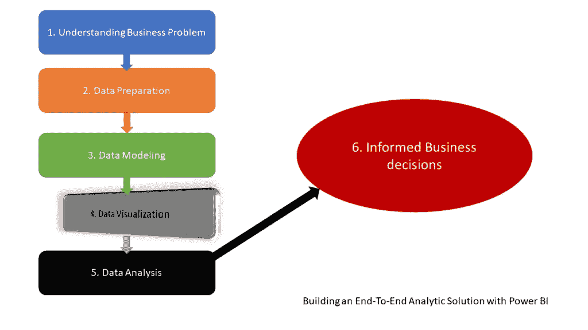
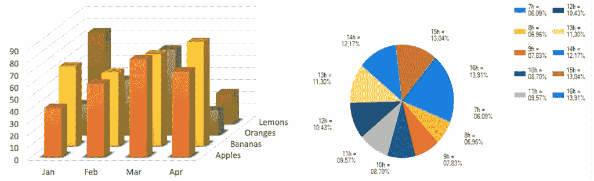
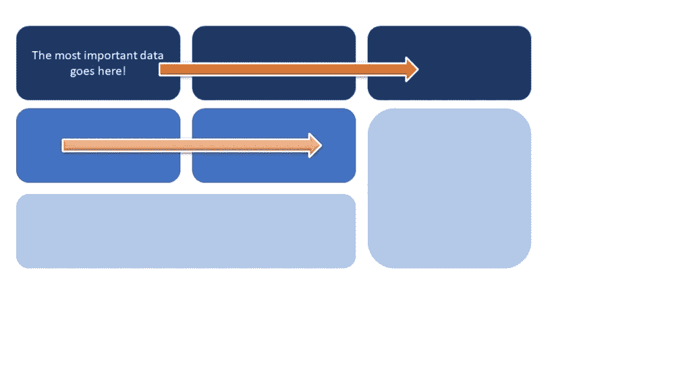
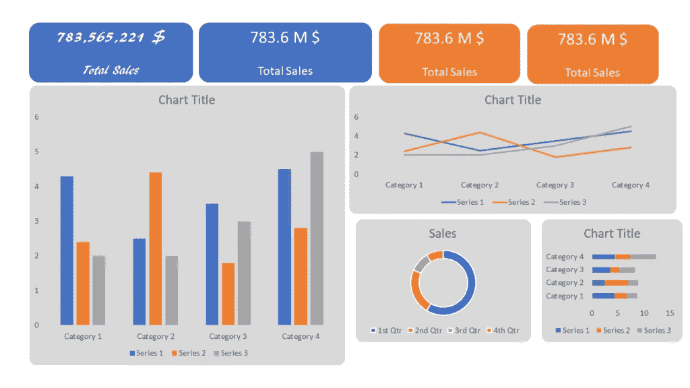
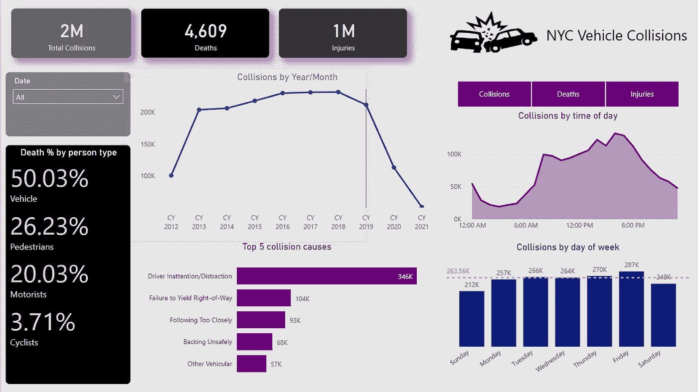

# 在 Power BI 中构建端到端分析解决方案:第 4 部分——从图表到洞察！

> 原文：<https://towardsdatascience.com/building-an-end-to-end-analytic-solution-in-power-bi-part-4-from-chart-to-insight-56a543861477?source=collection_archive---------31----------------------->

## 准备好一些很酷的数据可视化了吗？在这一部分，我们将根据一些最佳的数据 viz 实践来构建我们的报告！

拉胡尔·潘迪特关于 pexels.com 的图片

*当我与不了解 Power BI 世界的人交谈时，我经常得到的印象是，他们认为 Power BI 只是一个可视化工具。虽然这在一定程度上是对的，但在我看来，他们没有看到更大的图景，或者更好的说法是，他们看到的只是冰山一角！这个冰山一角是那些闪亮的仪表盘，KPI 箭头，花哨的人工智能东西，等等。*

*然而，事情远不止如此，因为真实的事情隐藏在表面之下……*

*在这一系列文章中，我将向您展示如何使用 Power BI 来创建成熟的解析解决方案* *。从不提供任何有用信息的原始数据开始，构建不仅仅是好看的可视化，而是提取可用于定义适当行动的洞察力——我们称之为知情决策。*

*   [*第一部分——理解业务问题*](/building-an-end-to-end-analytic-solution-in-power-bi-part-1-understanding-the-business-problem-85db9e2d745b)
*   [*第二部分—准备数据*](/building-an-end-to-end-analytic-solution-in-power-bi-part-2-preparing-the-data-c5a1641ec897)
*   [*第三部分—数据建模*](/building-an-end-to-end-analytic-solution-in-power-bi-part-3-level-up-with-data-modeling-cfbf3e4e2cd)

作者插图

好消息，伙计们-缓慢但稳步地，我们正在接近我们的目标-仅使用 Power BI 构建高效的端到端分析解决方案！我们强调了在创建解决方案之前理解业务问题*的重要性，执行了一些简单的数据清理和转换，在前面的部分中，我们了解了为什么 Star schema 和 Power BI 是天造地设的一对，以及为什么您应该始终努力以这种方式对数据建模。*

现在，是时候构建一些引人注目的可视化工具了，它们将帮助我们以最有效的方式讲述数据故事，并为业务决策者提供见解-最终，基于这些见解，他们将能够做出明智的决策-基于数据的决策，而不是基于个人的预感或直觉！

***免责声明:*** 我认为自己不是一个有审美天赋的人，所以我的数据可视化解决方案大多基于我在书中读到的最佳实践(例如[这一个](https://www.amazon.com/Storytelling-Data-Visualization-Business-Professionals/dp/1119002257))、博客，并受到一些了不起的社区成员的启发，例如 Armand Van Amersfoort、Daniel Marsh-Patrick、Kerry Kolosko、Ried Havens、Andrej Lapajne ( [Zebra BI](https://zebrabi.com/) )或来自 [powerbi.tips](https://powerbi.tips/) 。

## 数据可视化——我的首选

在我们卷起袖子开始可视化我们的数据之前，我想指出一些我一路收集的关于数据可视化的最佳实践。

***1。一个仪表盘来统治所有人***

这一条不仅仅适用于数据可视化，它更像是一条通用规则。没有单一的解决方案可以满足每一项业务需求！句号！首先，您应该确定仪表板的用途— ***操作仪表板*** 为消费者提供时间关键型数据。我喜欢把操作仪表板想象成汽车或飞机的驾驶舱……另一方面， ***分析仪表板*** 更侧重于从历史数据中识别趋势和模式，从而更好地做出中长期决策。

在我们的这个博客系列中，我们正在构建一个分析仪表板。

**2。挑选合适的可视化类型**

呃，这个可能是最难定义的了。从字面上看，有数百篇来自知名作者的博客文章、书籍和视频，解释了使用哪种可视化类型来表示特定的数据。基于您想要提供哪种洞察—例如，两个数据点之间的比较、特定值的分布、不同数据之间的关系、随时间的变化、整体的部分，等等—应该使用*的某些视觉类型。*

作者插图

我故意用了“应该”这个词，因为没人能禁止你在仪表盘上使用仪表图、饼状图、三维图，尽管很多公认的专家都反对这样做——只是要小心谨慎，注意在什么场景下使用什么视觉类型。

***3。定义最重要的数据点***

显然，一些数据点比其他数据点更重要。如果你的总收入比上个月低 50%，这肯定比看图表显示每种产品颜色的个别数字要重要得多。考虑到这一点，试着将所有关键数据点放在左上角，因为我们星球上的大多数人都是从左到右，从上到下阅读(想象一下阅读一本书，或报纸)，这个位置自然会立刻引起他们的注意。

作者插图

***4。保持一致！***

这是需要记住的关键事情之一！一致性是什么意思？例如，坚持使用已定义的布局和设计，将相关信息放在一起，或者对类似类型的信息使用类似的视觉类型—您不希望在一个仪表板部件中使用饼图按区域显示销售额，然后使用柱形图按区域显示订单总数。

***5。移开注意力***

我已经写了一个关于[从 Power BI 报告](https://data-mozart.com/how-to-remove-distractions-from-the-power-bi-report/)中排除干扰的具体案例。在你的仪表板上有很多可能的干扰物。让我们从字体开始:倾向于使用标准字体而不是艺术字体，因为它们更容易消费:

作者插图

上图展示了左侧卡片的可读性，它使用了一种标准字体(Calibri)。它还展示了另一个需要考虑的问题——缩短数字也是一种从你的仪表盘上消除干扰的好方法。

此外，注意适当的对齐，给你的视觉效果留出一些空间:

**视觉效果之间适当的对齐和空间将提高清晰度** —作者插图

我想我们都同意上图中的仪表板比下图更易读:

作者插图

谈到数据可视化，还有更多最佳实践、技巧和建议。正如我已经强调的，我不认为自己是一个“数据 viz”向导，但是我仍然试图坚持本文前面部分提到的一些通用规则。

最后，尽管对于许多仪表板创建者来说，第一步是设置总体仪表板设计，然后将数据元素放入预定义的模板中，但我更喜欢反其道而行之:首先，我创建所有数据元素，然后基于我想用这些元素“讲述”的故事，我正在构建最终的解决方案…

## 可视化车辆碰撞数据

好了，现在我们已经确定了一些通用的数据可视化最佳实践，是时候动手使用 Power BI 来讲述纽约市的车辆碰撞事件了。

作者图片

这是我的报告的样子。在这一部分，我们不会深入每个视觉细节，但让我简单介绍一下整体概念。有两个页面——主页包含最重要的数据点，如碰撞、死亡和受伤的数量。还有一些“经典”的视觉效果，如折线图和柱形图，这将帮助我们从不同的角度提取对数据的见解。多行卡视觉快速说明谁是交通中最危险的。

一天中的时间是我们的关键分析类别之一，因此报告用户可以充分灵活地在同一视觉效果(碰撞、死亡、受伤)的不同指标之间切换，密切关注动态标题，这增强了整体用户体验！

请记住，我们在这里定义了一组问题，我们将尝试使用此报告来回答这些问题。可以使用日期切片器从日历的角度对数据进行切片。

详细信息页面提供了深入了解事故细节的可能性——介绍了针对行政区和邮政编码的附加切片器。小倍数视觉很好地将数字分为两类——人的类型和区，而其他元素扩展了主页的逻辑。

## 结论

在本系列的这一部分中，我们已经介绍了很多内容。这并不是说我们只是构建了自己的报告来可视化来自原始数据集的数据，我还与您分享了一些关于数据可视化的一般最佳实践，以及来自该主题的成熟专家的建议。

我再重复一遍:我认为自己远没有成为一名“设计师”的天赋，我相信你们中的许多人可以创造出一份更好看的 Power BI 报告。然而，最终目标是将关键数据点有效地传达给报告消费者，并使他们能够根据这种传达所提供的见解做出决策。

考虑到这一点，我相信我们已经为在本系列的最后部分总结所有内容打下了坚实的基础——我们将尝试从我们刚刚创建的报告中提取一些有意义的信息，并根据这些发现建议某些行动。

感谢阅读！

[成为会员，阅读媒体上的每一个故事！](https://datamozart.medium.com/membership)