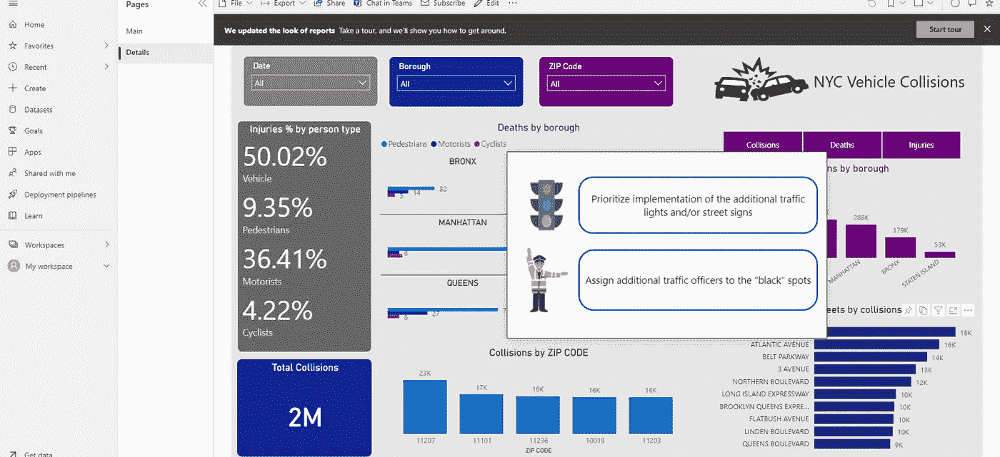
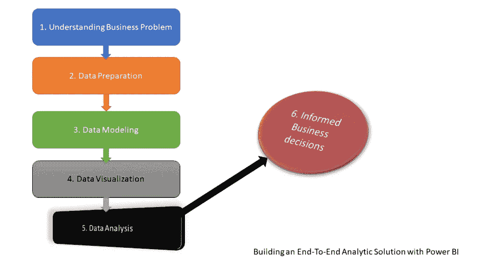
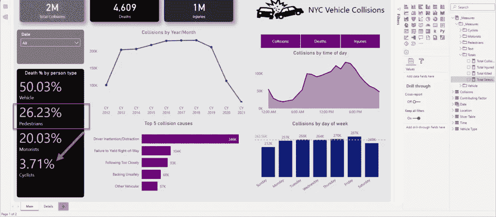
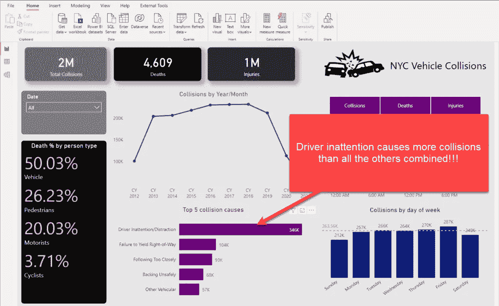
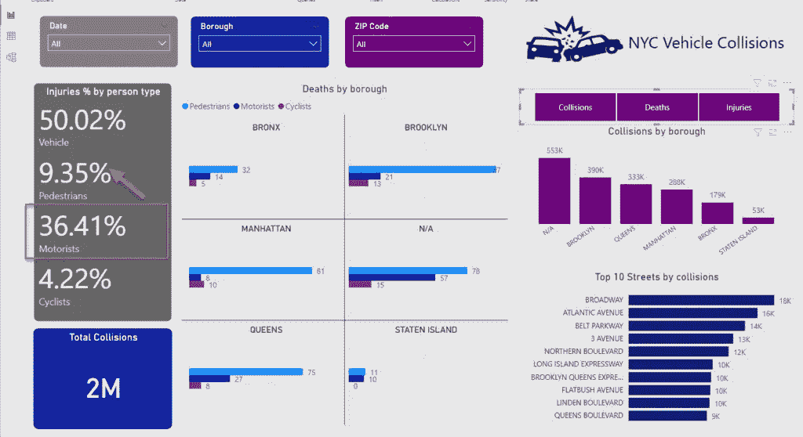
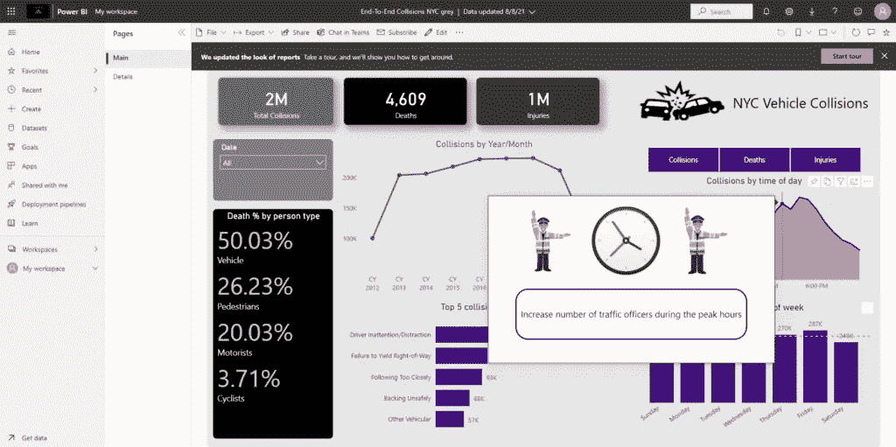
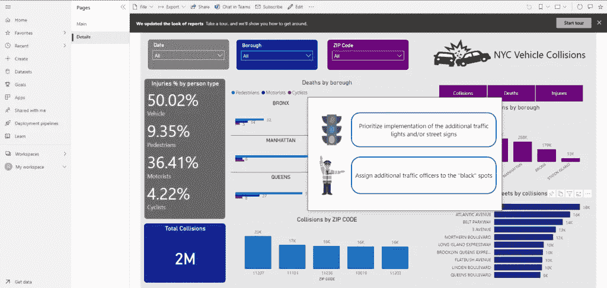
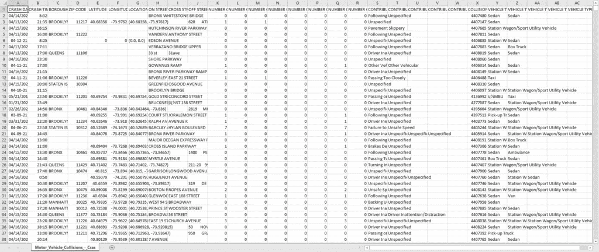
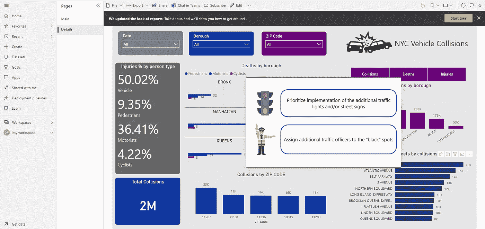

# 在 Power BI 中构建端到端分析解决方案:第 5 部分——请行动起来！

> 原文：<https://towardsdatascience.com/building-an-end-to-end-analytic-solution-in-power-bi-part-5-action-please-a60dd23802a3?source=collection_archive---------31----------------------->

## 在最后一部分，我们将把我们的分析技能提升到另一个层次！不仅如此——基于所获得的见解，我们将推荐某些行动！

作者图片

当我和那些没有深入了解 Power BI 世界的人交谈时，我经常得到的印象是，他们认为 Power BI 只是一个可视化工具。虽然这在一定程度上是对的，但在我看来，他们没有看到更大的图景，或者更好的说法是，他们看到的只是冰山一角！这个冰山一角是那些闪亮的仪表盘，KPI 箭头，花哨的人工智能东西，等等。

*然而，事情远不止如此，因为真实的东西隐藏在表面之下……*

*在这一系列文章中，我将向您展示如何使用 Power BI 来创建成熟的解析解决方案* *。从不提供任何有用信息的原始数据开始，构建不仅仅是好看的可视化，而是提取可用于定义适当行动的洞察力——我们称之为知情决策。*

*   [*第一部分——理解业务问题*](/building-an-end-to-end-analytic-solution-in-power-bi-part-1-understanding-the-business-problem-85db9e2d745b)
*   [*第二部分—准备数据*](/building-an-end-to-end-analytic-solution-in-power-bi-part-2-preparing-the-data-c5a1641ec897)
*   [*第三部分—数据建模*](/building-an-end-to-end-analytic-solution-in-power-bi-part-3-level-up-with-data-modeling-cfbf3e4e2cd)
*   [*第四部分—数据分析*](/building-an-end-to-end-analytic-solution-in-power-bi-part-4-from-chart-to-insight-56a543861477)

作者插图

在这里，我们以 CSV 文件的形式获取[原始数据，定义一组需要使用该数据回答的业务问题，然后清理和塑造原始数据集并构建高效的数据模型(星型架构)，在前面的部分中，我们创建了引人注目的可视化，为业务决策者提供不同的见解。现在，是时候分析见解，并根据我们从这些见解中提取的信息，推荐一些行动了！](https://data.cityofnewyork.us/Public-Safety/Motor-Vehicle-Collisions-Crashes/h9gi-nx95)

## 提取洞察力

先来分析一下碰撞造成的死亡。如果我们排除在车内的人，我们可以看到行人是最危险的交通参与者——与骑自行车的人相比，几乎多 8 倍的行人被杀！

作者图片

我们可以得出的下一个结论是，碰撞的主要原因是司机不注意/分心！如果我们看一下前 5 大冲突原因，您会发现所有其他原因加起来都低于前一个原因。

作者图片

继续，我们可以发现的下一个模式是下午早些时候，特别是下午 4 点和 5 点的碰撞高峰。这是有道理的，因为很多人在那段时间从办公室开车回家:

作者图片

这大约比早上(上午 8-9 点)高 30%,而在早上，交通参与者在辛苦工作一天后可能不会感到疲劳和分心。

让我们继续详细概述事故，并努力找出城市中的“黑点”。乍一看，大多数人是在布鲁克林被杀的，或多或少，所有其他区都遵循不同交通参与者之间的“死亡分布”模式，除了曼哈顿，那里骑自行车的人比开车的人被杀的多。

如果我们分析受伤的百分比，趋势与死亡率有很大不同:现在，司机是最危险的(同样，不包括车上的人)——司机受伤的人数几乎是行人的 4 倍！

作者图片

再往下，冲突最频繁的邮政编码是 11207 和 11101(一个在布鲁克林，另一个在皇后区)。如果我们关注具体的街道，我们可以看到百老汇(曼哈顿)和大西洋大道(布鲁克林，邮编 11207)是纽约市最关键的景点！

作者图片

## 请开拍！

好了，现在我们有了更多的信息来支持我们的业务决策。而且，因为我们已经定义了需要回答的一系列问题，所以让我们专注于提供适当的行动建议！

这个想法是以工具提示的形式显示建议——当有人将鼠标悬停在特定的视觉对象上时，相应的操作应该会显示出来！我已经写了如何使用工具提示页面增强你的报告，这里我们将遵循类似的方法:

作者图片

因此，当我将鼠标悬停在显示 5 大碰撞原因的画面上时，将会推荐一些行动:

*   对违法者的更高处罚
*   针对驾驶员的附加培训

同样，如果您想根据大多数碰撞发生的时间采取行动，只需将鼠标悬停在该画面上，您就会看到在这些高峰时段增加交通官员数量的建议:

作者图片

此外，为了能够减少特定位置的碰撞和伤亡数量，我们强调了增设交通灯和在“交通黑点”指派更多交通官员的重要性:

作者图片

## 结论

伙计们，收工了！提醒你一下，这是我们开始的地方:

作者图片

这是我们结束的地方:

作者图片

在这一过程中，我们清理和转换了我们的数据，使用星型模式构建了合适的数据模型，并可视化了关键数据点。你猜怎么着— ***我们使用一个工具完成了所有这些:Power BI！*** 这就是我将这一系列博客文章命名为:用 Power BI 构建端到端分析解决方案的原因——我相信我们会同意这些文章毫不夸张地证明了这一点。

所以，下次当你听到“Power BI 只是一个可视化工具”时，请记住我们专门使用这个工具能够实现什么，并自己得出结论！

感谢阅读整个系列！

[成为会员，阅读 Medium 上的每一个故事！](https://datamozart.medium.com/membership)