# 构建端到端的开源现代数据平台

> 原文：<https://towardsdatascience.com/building-an-end-to-end-open-source-modern-data-platform-c906be2f31bd?source=collection_archive---------4----------------------->

## 帮助您浏览现代数据堆栈并使用开源技术构建自己的平台的详细指南。


克里斯多夫·伯恩斯在 [Unsplash](https://unsplash.com?utm_source=medium&utm_medium=referral) 上拍摄的照片

在过去几年中，数据工程领域的重要性迅速上升，为加速创新和进步打开了大门——因为今天比以往任何时候都有更多的人在思考数据资源以及如何更好地利用它们。这种进步反过来导致了第三次数据技术的浪潮***。***

*******第一波****由 ETL、OLAP 和关系数据仓库组成，它们是商业智能(BI)生态系统的基石，无法应对[大数据的四个 v](https://bernardmarr.com/what-are-the-4-vs-of-big-data/)的指数级增长。由于双向堆栈的潜力有限，我们随后见证了第二波***:这是一个存储和计算可扩展性的时代，这要归功于 Hadoop 生态系统(允许公司横向扩展其数据平台)和 Apache Spark(为大规模高效内存数据处理打开了大门)。********

***我们称之为“ ***第三次浪潮*** ”的时代是我们不再担心可扩展性或分布式存储的时代。相反，我们正在成熟的分布式数据平台上构建砖块和新功能。我们现在有可能考虑元数据管理、大规模数据发现和数据可靠性等主题。我们正处于可互换的 SaaS 模块、基于云的平台、ELT 和民主化数据访问的时代。欢迎来到 ***现代数据栈*** 浪潮。***

**在本文中，我们将从头开始构建一个端到端的现代数据平台，仅仅依靠**开源**技术和云提供商提供的资源。本文还附有一个 GitHub repo，其中包含构建平台所需的必要代码和基础设施代码(IaC)脚本。**

**[](https://github.com/mahdiqb/modern_data_platform) [## GitHub-mahdikb/modern _ data _ platform:部署现代数据平台的示例配置。

### 这个存储库包含不同的 IaC 脚本来部署一个样本现代数据平台，并附有一个样本…

github.com](https://github.com/mahdiqb/modern_data_platform) 

该平台将由以下组件组成:

*   数据仓库:这是我们设计中最重要的部分，因为不管其他部分有多复杂，低效的数据仓库都会给我们带来问题。从根本上说，数据仓库背后 40 年的概念和范例至今仍然适用，但与来自*、【第二波】、*的水平可伸缩性相结合，实现了高效的 ELT 架构。
*   **数据集成**:不出所料，我们实际上需要将数据放入我们的平台。由于现代数据堆栈，以前配置和实现连接器的繁琐任务现在已经解决了。
*   **数据转换**:一旦我们将数据放入我们的仓库(因此我们完成了 ELT 架构的 EL 部分)，我们将需要在它上面构建管道来 ***转换*** 它，以便我们可以直接消费它，并从中提取价值和见解——这个过程是我们 ELT 中的 T，直到最近，它通常由管理不善的大型 SQL 查询或复杂的 Spark 脚本组成。 但是，在这个“*第三次浪潮*”中，我们现在拥有了更好地管理数据转换的必要工具。
*   **编排(可选——目前)**:我们仍然需要编排管道的执行，以确保数据尽快可用，并且数据生命周期从一个组件平稳地运行到下一个组件。这被标记为可选的，因为我们将使用的一些工具提供了开箱即用的调度功能，因此在平台生命周期的第一阶段，您不应该真正需要专用的编排组件(这会增加不必要的复杂性)。尽管如此，我们仍将在本文中讨论编排选项，因为您最终需要在您的平台上添加一个。
*   **数据监控(可选—目前)**:更多的数据意味着更多潜在的质量问题。为了能够信任我们的数据，我们需要监控它，并确保我们基于它生成准确的见解。这被标记为可选的，因为在开始时，最有效的选择是利用其他组件的数据测试功能，但是我们将在本文中讨论数据监控工具。
*   **数据可视化**:这是我们实际探索数据并以不同数据产品的形式从中产生价值的地方，比如仪表板和报告。这个时代的主要优势之一是，我们现在拥有成熟的开源数据可视化平台，可以以简化的方式进行部署。
*   **元数据管理**:我们平台的大部分功能(如数据发现和数据治理)都依赖于元数据，因此我们需要确保元数据在整个平台中得到集中和利用。

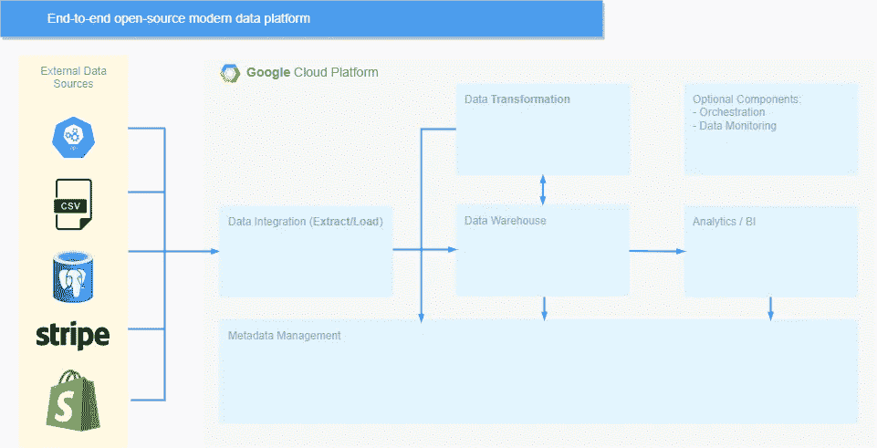

平台的架构(图片由作者提供)

最后，请记住，尽管我们将讨论的技术和工具是开源的，但我们将在云环境中构建平台，因此我们将使用的资源(用于计算、存储等)。)本身并不免费，但我们不会超过[GCP 免费试用版](https://cloud.google.com/free)提供的 300 美元预算。

如果您想避免建立云环境，您仍然可以在本地试验不同的工具，您只需要用一个开源的替代方案(像 PostgreSQL 这样的 RDBMS)替换数据仓库(在我们的例子中是 BigQuery)。

现在，事不宜迟，让我们建立我们的现代数据平台。** 

# **首先，我们来谈谈数据**

**要构建一个样本数据平台，流程的第一步是挑选一个或多个数据集进行处理。这是一个探索在线可用的多个开放数据集之一的机会，我建议搜索一个你个人感兴趣的数据集-这将使这个过程更加愉快，因为你会对这些数据真正感兴趣。如果您想要一些灵感，请从以下数据集之一开始:**

*   **一级方程式世界锦标赛(1950–2021):你可以[从 Kaggle](https://www.kaggle.com/rohanrao/formula-1-world-championship-1950-2020) 下载或直接从[er gast HTTP API](http://ergast.com/mrd/)检索的这个数据集包含了从 1950 年到 2021 年的一级方程式比赛、车手、制造商、排位赛、赛道、圈速、进站和锦标赛的所有可用数据点。如果你像我一样是 F1 粉丝，这个数据集可以给你许多关于这项运动的有趣见解。**
*   **[世界发展指标](https://datacatalog.worldbank.org/search/dataset/0037712)(1960–2020):这个由世界银行提供的数据集无疑是你能在网上找到的最丰富的开放数据集之一。它包含大约 1500 个发展指标，你可能会迷失其中。**

# **数据仓库:BigQuery**

**如上所述，为您的用例选择正确的数据仓库是我们难题中最重要的一块。主要的三个选项是[雪花](https://www.snowflake.com/)、[大查询](https://cloud.google.com/bigquery/)和[红移](https://aws.amazon.com/redshift/)——是的，它们都不是开源的，但它们都提供了一个 ***无服务器*** 选项。这意味着我们可以利用复杂的现代数据仓库的功能，同时只需为我们在存储和计算方面消耗的资源付费。**

**好消息是，无服务器选项正是我们在这个阶段寻找的，即使该产品不是开源的。这是因为我们希望能够在存储和查询性能方面进行扩展，而不需要专门的维护工作。因此，入门时的理想选择是无服务器托管产品——这适用于我们所有需要弹性的组件，而不仅仅是数据仓库。**

**出于各种原因，BigQuery 非常适合这一需求，其中我们可以提到以下两点:**

*   **首先，它本质上是无服务器的。[其背后的设计](https://cloud.google.com/blog/products/data-analytics/new-blog-series-bigquery-explained-overview)由于存储和计算的分离，允许提高效率，使其成为所有类型使用情形的非常可靠的选择。另一方面，Redshift 的无服务器产品仍处于测试阶段。**
*   **其次，它是云提供商产品的一部分，因此已经与 GCP 生态系统的所有组件实现了无缝集成。这进一步简化了我们的架构，因为它最小化了配置工作。**

**因此，对于我们来说，利用 BigQuery 作为这个平台的数据仓库是有意义的，但这并不能概括这个选择，因为在其他场景中，选择另一个选项可能更有意思。在选择数据仓库时，您应该考虑定价、可伸缩性和性能等因素，然后选择最适合您的用例的选项。**

**为了开始，我们只需要[创建一个数据集](https://cloud.google.com/bigquery/docs/datasets)，但是请随意熟悉 BigQuery 的一些更高级的概念，比如[分区](https://cloud.google.com/bigquery/docs/partitioned-tables)和[物化视图](https://cloud.google.com/bigquery/docs/materialized-views-intro)。**

**在 ELT 架构中，数据仓库用于存储我们所有的数据层。这意味着我们不仅仅使用它来存储数据或查询分析用例，我们还将利用它作为不同转换的执行引擎。**

**现在我们已经选择了我们的数据仓库，架构看起来如下:**

**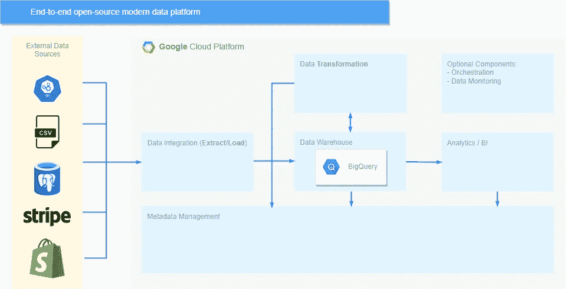**

**架构的当前状态(图片由作者提供)**

**在我们进入下一个组件之前，[让我们将 BigQuery 审计日志存储在一个专用的数据集](https://cloud.google.com/architecture/building-a-bigquery-data-lineage-solution#setting_the_environment) ( [附加指令](https://github.com/GoogleCloudPlatform/bigquery-utils/tree/master/views/audit#getting-started-with-bigquery_audit_logs_v2sql))，因为当我们设置元数据管理组件时，这些信息将会派上用场。**

# **获取数据:Airbyte**

**当考虑现代数据堆栈中的数据集成产品时，您会发现少数公司(使用闭源产品)竞相在最短的时间内添加最多的连接器。遗憾的是，这意味着更慢的创新(因为对每个产品做出贡献的人更少)和定制现有解决方案的可能性更小。**

**异常的亮点肯定是 Airbyte，这是这个领域中唯一一家从一开始就选择开源其核心产品的大公司。这使得它在成立不到一年的时间里迅速发展成一个大型贡献者社区，并提供了 120 多个连接器。**

**[部署 Airbyte 对所有云提供商来说都是轻而易举的事情](https://docs.airbyte.io/deploying-airbyte)。在 GCP 上，我们将使用具有足够资源的计算引擎实例。理想情况下，您会希望通过 IaC 配置您的部署，这将使管理版本和自动化过程更加容易。(随附的报告中提供了 Terraform 配置示例。)**

**一旦启动并运行，我们只需通过定义以下内容来添加连接:**

*   ****源**:您可以使用 UI 选择**“文件”**源类型，然后根据您的数据集和您上传数据的位置对其进行配置，或者如果您更喜欢冒险，您可以利用 [Airbyte 的 Python CDK](https://docs.airbyte.io/connector-development/cdk-python) 构建一个新的 HTTP API 源，从您想要使用的 API 中获取数据。**
*   ****A destination** :这里您只需要指定与数据仓库交互所需的设置(在我们的例子中为 **BigQuery** )。**

**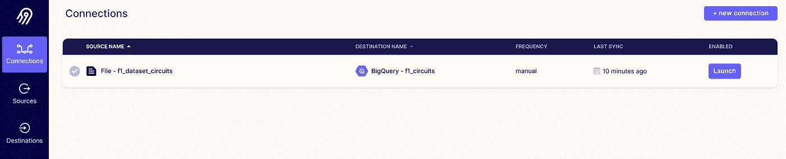**

**样本 Airbyte 连接(图片由作者提供)**

**值得注意的是，Airbyte——就目前而言——仅仅是为批量数据摄取而设计的(ELT 中的 EL ),所以很遗憾，如果您正在构建一个事件驱动的平台，它不在您的选择之列。如果你有这样的用例，那么你的最佳选择将是[柔术](https://jitsu.com/)、[细分](https://segment.com/)的开源替代方案。**

**现在，我们已经启动并运行了 Airbyte，数据接收也已完成，我们的平台如下所示:**

**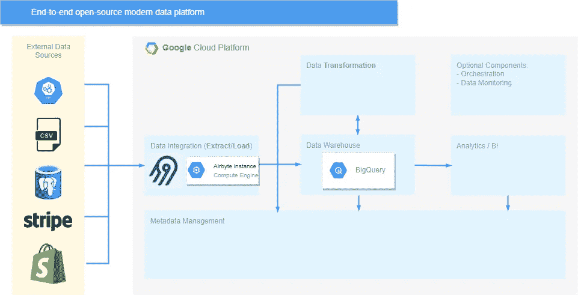**

**架构的当前状态(图片由作者提供)**

# **管理我们英语教学中的 T: dbt**

**当我们想到现代数据堆栈时，dbt 可能是第一个想到的工具。这个始于 2016 年的项目(从一开始就是开源的)解决了当时一个普遍存在的问题:数据管道的版本很差，文档记录很差，并且没有遵循软件工程的最佳实践。**

**dbt 是第三次数据技术浪潮的理想代表，因为它代表了这一浪潮背后的主要目标:添加特性和功能，以更轻松地管理现有的数据平台，并从底层数据中获取更多价值。得益于 dbt，数据管道(我们 ELT 中的 T)可以划分为一组`SELECT`查询(称为“ ***模型*** ”)，这些查询可以由数据分析师或分析工程师直接编写。这种能力为多种特性打开了大门，比如数据沿袭、版本控制、数据测试和文档。**

**设置 dbt 环境有两种不同的方式:**

*   ****dbt Cloud** :这是 dbt 实验室托管的基于 web 的集成开发环境(IDE)。这是一个需要最少工作的选项，但提供了更多功能，如计划作业、CI/CD 和警报。锦上添花的是，通过开发者计划，它实际上是免费的。**
*   ****dbt CLI** :该选项允许您直接与 dbt Core 交互，无论是通过使用`pip`在本地安装它，还是像我们之前部署的 Airbyte 一样在 Google Compute Engine 上运行 docker 映像。通过使用 CLI，您可以体验不同的 dbt 命令，并在您选择的 IDE 中工作。**

**为了允许 dbt 与您的 BigQuery 数据仓库进行交互，您需要生成所需的凭证(您可以创建一个具有必要角色的服务帐户),然后在您的`profiles.yml`文件中指明特定于项目的信息。这在 dbt Labs 的“[”*入门*”教程](https://docs.getdbt.com/tutorial/setting-up)中有很好的解释，它介绍了你需要熟悉的所有概念。**

**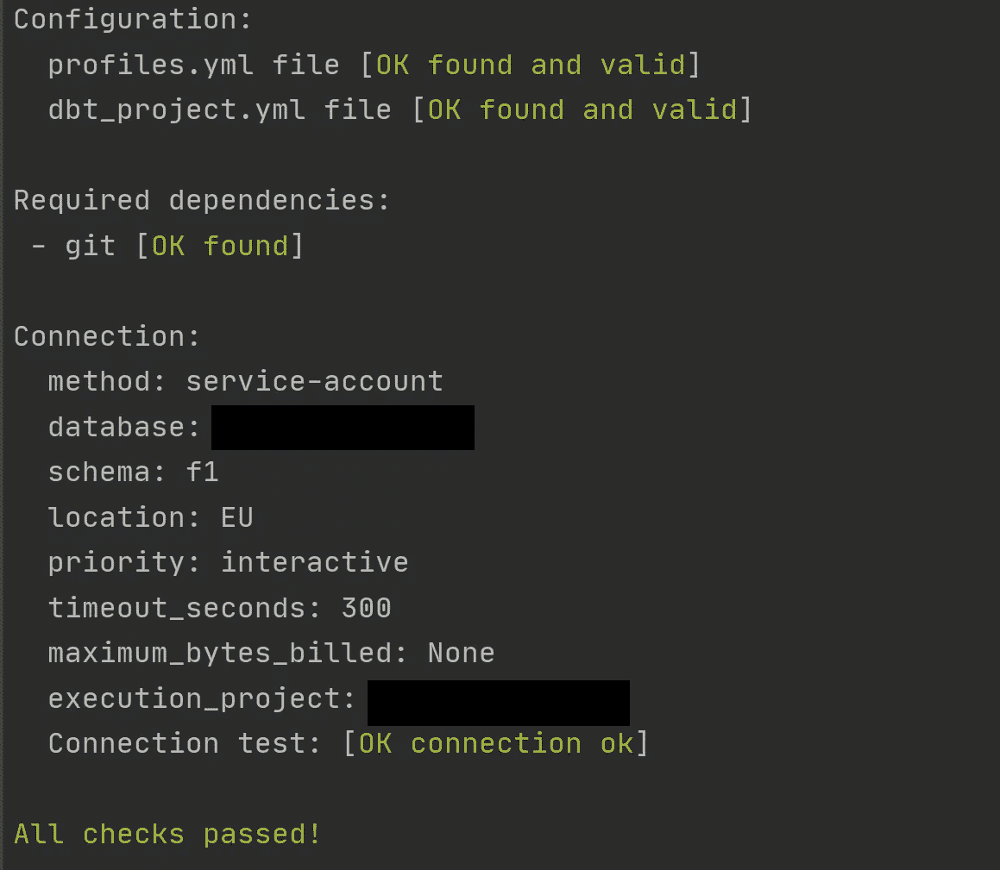**

**运行 dbt 调试后的预期输出(图片由作者提供)**

**在最初的努力之后，现在是您享受数据的时候了:您可以使用 dbt 来定义模型以及它们之间的依赖关系。例如，对于 F1 数据集，您可以生成一个包含冠军得主数据的`championship_winners`模型(总积分、每场比赛的平均进站时间、整个赛季的最快圈数、平均排位等。)对于您正在处理的任何数据集，当涉及到数据可以回答的问题时，您会发现可能性的数量令人难以置信——这是一个很好的练习，会让您在处理新数据集时更有信心。**

**在处理完您的模型之后，您可以执行命令`dbt docs generate`来生成我们项目的文档(目录和清单文件)。**

**在这个阶段，在设置好 dbt 之后，我们现在有了可以处理 ELT 流程的三个步骤的组件，架构如下所示:**

**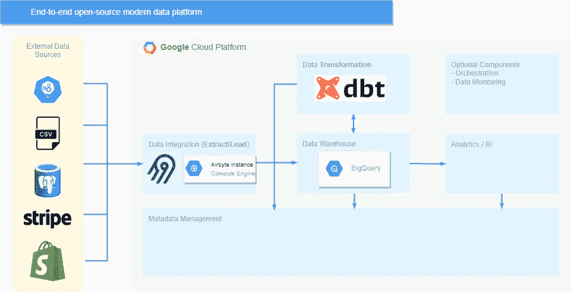**

**架构的当前状态(图片由作者提供)**

**当我们第一次介绍该架构时，我们说过编排和数据监控/测试现在都可以由另一个组件来处理——您可能已经猜到该组件是 dbt。借助 dbt Cloud，我们可以管理[我们的管道](https://docs.getdbt.com/docs/running-a-dbt-project/running-dbt-in-production#ways-to-run-dbt-in-production)的调度，并定义不同的执行触发器(例如通过 web hooks 定义[)，同时 dbt 还有一个强大的基于 SQL 的](https://docs.getdbt.com/docs/dbt-cloud/using-dbt-cloud/cloud-enabling-continuous-integration#overview)[测试功能](https://docs.getdbt.com/docs/building-a-dbt-project/tests)，我们可以利用它来确保数据质量问题不会被检测到。**

****

**运行 dbt 测试后的示例输出(图片由作者提供)**

# **神奇的地方:Apache 超集**

**既然我们已经处理了我们的数据，并生成了不同的视图和表格来提供见解，那么是时候通过一组 ***数据产品*** 来实际可视化这些见解了。(如果你对这个术语不熟悉，[Simon O ' Regan](/designing-data-products-b6b93edf3d23)的这篇文章详尽地概述了不同类型的数据产品。)**

**我们在这一阶段的目标是构建最终用户可以直接访问的仪表盘和图表(无论是用于分析还是监控，取决于您的数据集)，就像过去的商业智能(BI)一样。**

**BI 是少数几个没有被数据技术的“*第二波*”破坏的领域之一，这主要是因为 Hadoop 生态系统专注于大规模处理数据，而不影响最终用户消费数据的方式。这意味着在很长一段时间内，BI 和数据可视化领域由专有工具(Tableau、PowerBI 和最近的 Looker)主导，只有少数缺乏开源项目的利基用例。**

**然后出现了 Apache Superset。当它在 2016 年首次由 Airbnb 开源时，它代表了第一个真正替代现有 BI 工具的开源工具，提供了企业级所需的所有功能。今天，由于其庞大的开源社区，它是第三次浪潮的领先技术之一。**

**生产超集部署由多个组件组成(如专用元数据数据库、缓存层、身份验证和潜在的异步查询支持)，因此为了简单起见，我们将依赖一个非常基本的设置。**

**我们将再次利用 Google Compute Engine 来构建一个超集实例，我们将通过 Docker Compose 在其上运行一个容器。本文附带的报告中提供了必要的 Terraform 和 init 脚本。**

**一旦超集启动并运行，就可以通过以下命令连接到实例:**

```
**gcloud --project=your-project-id beta compute ssh superset-instance -- -L 8088:localhost:8088 -N**
```

**在登录到超集实例(通过官方文档中提供的步骤[之后，您只需要](https://superset.apache.org/docs/installation/installing-superset-using-docker-compose#4-log-in-to-superset)[将它连接到 BigQuery](https://superset.apache.org/docs/databases/bigquery) ，这样它就可以开始与您的不同数据集进行交互。**

**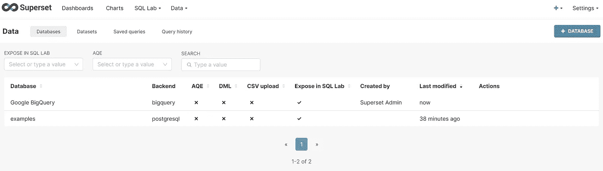**

**添加 BigQuery 连接后的预期结果(图片由作者提供)**

**建立连接后，您可以试验不同的图表类型，构建仪表板，甚至利用内置的 SQL 编辑器向 BigQuery 实例提交查询。**

**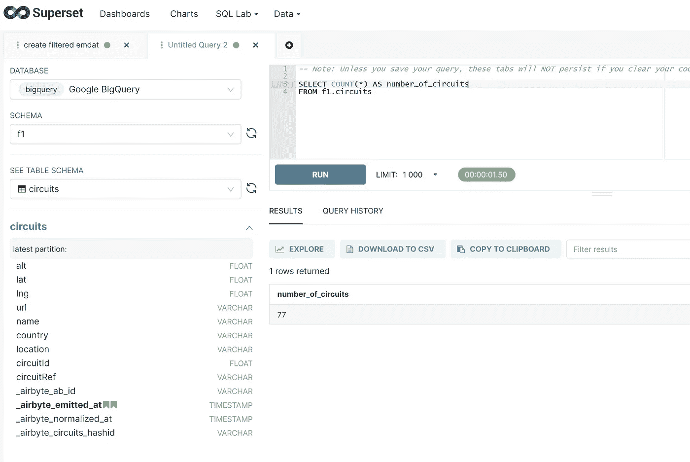**

**通过 SQL 编辑器查询 BigQuery 数据(作者图片)**

**现在，我们可以让最终用户通过超集直接访问数据，我们的数据平台如下所示:**

**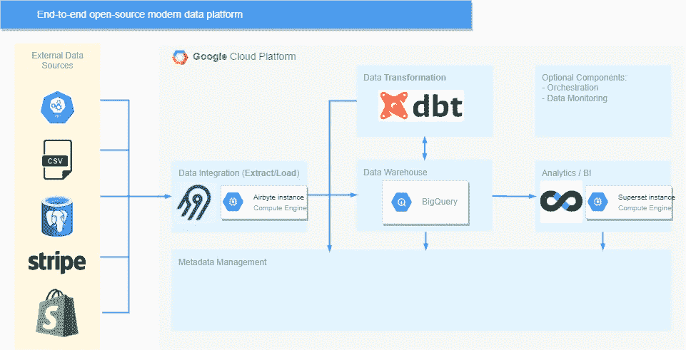**

**架构的当前状态(图片由作者提供)**

**当谈到超集的功能时，您会很高兴地知道我们只是触及了表面。你可以[管理访问角色](https://superset.apache.org/docs/security)，利用[缓存](https://superset.apache.org/docs/installation/cache)，[构建自己的定制 viz 插件](https://superset.apache.org/docs/installation/building-custom-viz-plugins)，使用[丰富的 API](https://superset.apache.org/docs/rest-api)，甚至[执行行级访问策略](https://superset.apache.org/docs/security#row-level-security)。此外，通过[预设](https://preset.io/)，您可以选择一个托管版本，让您不必考虑部署。**

# **堆栈的基石:OpenMetadata**

**元数据管理可能是数据社区中对如何处理分歧最大的领域。这是一个非常分散的空间( [25 种工具和计数](https://twitter.com/MahdiKarabiben/status/1439221748994650115))，不同的工具在如何解决这个问题上采取了截然不同的方法。**

**在我个人看来，我坚信优步数据平台团队开源的产品 [OpenMetadata](https://open-metadata.org/) 在这个领域采取了正确的方法。通过专注于提供水平元数据产品，而不仅仅是架构中的一块砖，它使拥有集中式元数据存储成为一个可实现的目标。它有[非常丰富的 API](https://docs.open-metadata.org/openmetadata/apis/overview)，执行[元数据模式](https://docs.open-metadata.org/openmetadata/schemas)，并且已经有[一长串连接器](https://docs.open-metadata.org/connectors)。**

**其他产品正在实现他们自己的管理元数据的方式，并且是在闭门造车的情况下进行的，这将导致在将它们添加到我们的平台时产生不必要的开销，而 OpenMetadata 专注于提供元数据的单一来源，其他产品可以通过其 API 与之交互。通过将它添加到体系结构中，数据发现和治理就成为了一种必然，因为它已经具备了实现这些目标的所有必要特性。如果你想在将它添加到我们的平台之前见证它的能力，你可以首先探索它的[沙箱](https://docs.open-metadata.org/take-it-for-a-spin)。**

**像 Airbyte 和 Superset 一样，我们将通过 Google Compute Engine 实例部署 OpenMetadata(像往常一样，Terraform 和 init 脚本在附带的 repo 中提供)。部署完成后，您会注意到实际上有四个容器在虚拟机上运行，用于以下目的:**

*   **在 MySQL 上存储元数据目录**
*   **通过 Elasticsearch 维护元数据索引**
*   **通过气流编排元数据摄取**
*   **运行 OpenMetadata UI 和 API 服务器**

**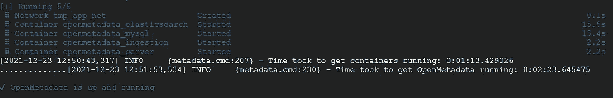**

**启动 OpenMetadata 后的预期输出(图片由作者提供)**

**OpenMetadata 在后台尽职尽责地管理这些组件，无需您进行任何必要的配置，因此我们可以立即开始像利用任何其他产品一样利用它。启动并运行后，您可以首先通过以下命令连接到 Airflow 端口:**

```
**gcloud --project=your-project beta compute ssh openmetadata-instance -- -L 8080:localhost:8080 -N**
```

**然后在`http://localhost:8080/`(用户名:`admin`，密码:`admin`)进入气流 UI。您会注意到一些 Dag 已经运行来加载和索引一些样本数据。之后，让我们通过以下命令连接到 OpenMetadata UI(然后可以在`[http://localhost:8585/](http://localhost:8080/)`访问该 UI):**

```
**gcloud --project=your-project beta compute ssh openmetadata-instance -- -L 8585:localhost:8585 -N**
```

**现在，您只需通过 SSH 登录 GCE 实例，并将 OpenMetadata 连接到 [BigQuery](https://docs.open-metadata.org/connectors/bigquery) 、 [BigQuery 使用数据](https://docs.open-metadata.org/connectors/bigquery-usage)、 [dbt](https://docs.open-metadata.org/connectors/dbt) 和[超集](https://docs.open-metadata.org/connectors/superset)。之后，您可以探索其不同的特性和功能，如数据发现和沿袭。**

****

**连接到 BigQuery 后打开元数据 UI(图片由作者提供)**

**既然我们已经将 OpenMetadata 添加到平台中，让我们来看看我们最终确定的架构:**

**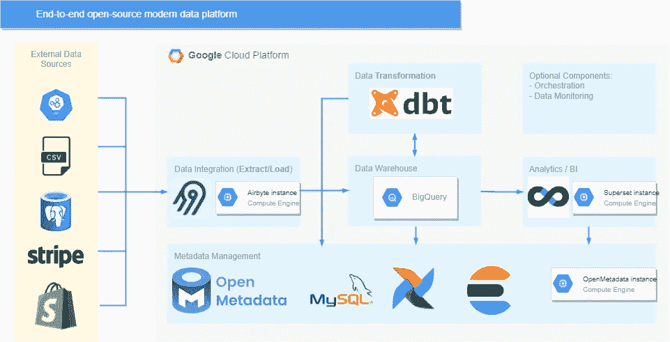**

**最终确定的平台架构(图片由作者提供)**

# **更上一层楼:可选组件**

**在本文的开始，我们提到了两个可选组件:编排和数据监控。在理论层面上，这是我们的数据平台的两个非常重要的功能，但是正如我们所看到的，dbt 在这个阶段可以很好地实现这两个功能。尽管如此，让我们讨论一下这两个组件在需要时如何集成。**

## **编排我们的管道:阿帕奇气流**

**当平台进一步成熟，我们开始集成新的工具和编排复杂的工作流时，dbt 调度最终会变得不足以满足我们的用例。一个简单的场景是当特定的 dbt 模型更新时超集缓存失效——这是我们无法单独通过 dbt Cloud 的调度实现的。**

**自 2015 年由 Airbnb 开源以来，Airflow 一直是数据工作流编排领域的首选工具。这使得它成为多家科技公司大型数据平台不可或缺的一部分，确保了围绕它的一个庞大而非常活跃的开源社区——这反过来又帮助它在编排方面保持标准，即使在“*第三次浪潮*”中也是如此。**

**您应该推迟考虑气流(或其替代品)的原因是专用编排工具带来的额外复杂性。Airflow 以自己的方式看待世界，为了能够充分利用它，您需要做出妥协并调整您的工作流程以匹配其特性。**

**在集成编排工具时，您还应该考虑如何触发您的管道/工作流。Airflow 确实支持基于事件的触发(通过[传感器](https://airflow.apache.org/docs/apache-airflow/stable/concepts/sensors.html)，但是问题可能会很快出现，让你仅仅因为工具而适应你的需求——而不是让工具帮助你满足你的需求。**

## **帮助我们晚上睡得更好:Soda SQL**

**就像编排一样，数据监控(最终将允许我们考虑数据的可观察性)是一种需求，dbt 最终将不再为我们的平台充分处理这种需求。**

**我们不只是验证 dbt 模型的数据，而是希望跟踪整个平台的数据问题，以便我们可以立即确定特定问题的来源并相应地修复它。**

**像数据集成一样，数据可观察性是公司仍然采用闭源方法的领域，这将不可避免地减缓创新和进步。另一方面，有两个开源产品可以满足我们的大部分需求: [Soda SQL](https://github.com/sodadata/soda-sql) 和 [Great Expectations](https://github.com/great-expectations/great_expectations) 。**

**Soda SQL 是一个很好的起点，因为它不需要太多的投资，并且提供了多种方便的特性。你只需要几个 YAML 文件就可以启动并运行，然后你就可以定义[定制测试](https://docs.soda.io/soda-sql/tests.html#example-tests-using-custom-metrics)和[协调扫描](https://docs.soda.io/soda-sql/orchestrate_scans.html)。**

# **接下来是什么？**

**这是一段漫长的旅程。我们经历了不同的技术——其中一些是我们正在见证的“*第三次浪潮*的产品，其他的是经过时间考验的“*第二次浪潮*的老手。在这一点上，主要的收获是，构建一个功能齐全的数据平台比以往任何时候都更容易—如果您遵循实施过程，您会发现自己在不到一个小时的时间内就构建了一个随时可用的现代数据平台。**

**当然，现代数据堆栈仍然是支离破碎的，在我们讨论的一些技术上下注可能是一个冒险的决定。除了 dbt 之外，没有任何现代数据堆栈工具在它所做的事情上是明显的赢家，因此生态系统将在未来几年通过整合和竞争不断变化。不过，可以肯定的是，激动人心的时刻就在我们面前。**

***要了解更多数据工程内容，您可以订阅我的双周刊时事通讯 Data Espresso，我将在其中讨论与数据工程和技术相关的各种主题:***

**[](https://dataespresso.substack.com/) [## 数据浓缩咖啡

### 数据工程更新和评论伴随您的午后咖啡。点击阅读数据咖啡，由马赫迪…

dataespresso.substack.com](https://dataespresso.substack.com/)**