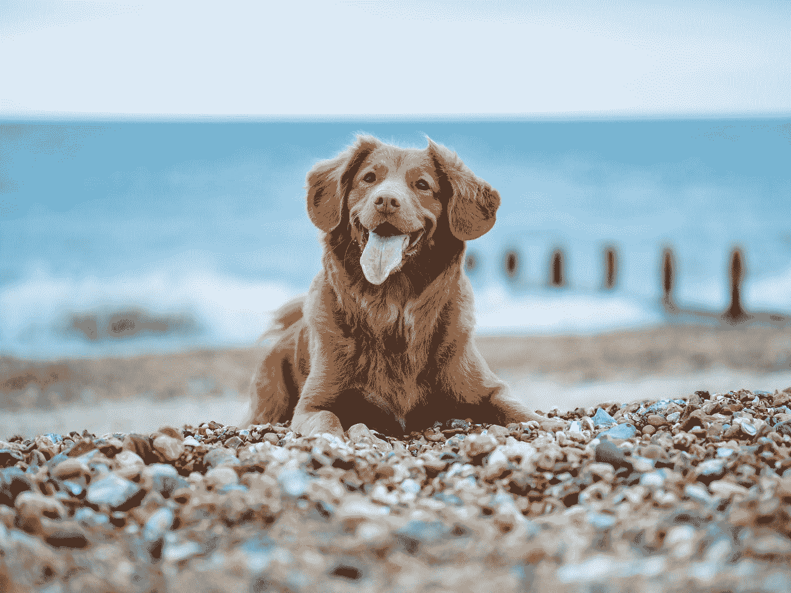

# 用 Keras 建立图像字幕模型

> 原文：<https://towardsdatascience.com/building-an-image-captioning-model-with-keras-ebccaadb98b9?source=collection_archive---------54----------------------->

## 如何用 Python 构建 CNN-LSTM 架构


照片由[海伦娜·赫兹](https://unsplash.com/@imperiumnordique?utm_source=medium&utm_medium=referral)在 [Unsplash](https://unsplash.com?utm_source=medium&utm_medium=referral) 上拍摄

我一直在做一个探索性的项目，以建立一个概念描述模型，为艺术品生成解释。首先，我开始使用 CNN-LSTM 架构，它可以作为一个简单的字幕生成器。在这篇文章中，我将描述如何构建一个基本的 CNN-LSTM 架构来创建一个可以基于图像输出文本标题的模型。请稍后继续关注我的项目。

# CNN LSTM 频道

这种图像字幕的主要方法分为三个部分:1 .使用预先训练的对象识别网络从图像中获取特征；为了将这些提取的特征嵌入映射到文本序列，最后 3 .在给定特征图和文本序列的情况下，使用长-短时记忆(LSTM)来预测序列后面的单词。

# 数据

这是一个监督网络，我们将图像映射到一组特定的标题。所以我们需要一组有图片和说明的数据。这里有一些公开的数据集可供探索。

*   [**Flickr30K**](http://bryanplummer.com/Flickr30kEntities/) **数据集:** Bryan Plummer 及其同事对来自 Flickr 的 3 万张图片以及多个对应描述的工作。
*   [**概念说明**](https://ai.google.com/research/ConceptualCaptions) **数据集:** Google AI 从网络上收集概念说明的努力。它包含 300 多万张图片的标题和 URL 链接。

我不会在这里详细介绍如何下载或调整图片大小。我已经调整了所有图片的大小，使其适合 500x500 像素，并且是 jpg 格式。每个文件名都应该是将文件链接到图像描述的标识 ID。

# 特征抽出

第一步是使用预先训练的网络提取特征。该代码获取包含 jpg 文件的本地目录，并输出引用字典，该字典以图像 ID 作为键，以特征嵌入作为值。

这个过程可能需要一段时间，所以我添加了一段代码，让您可以在每 1000 次迭代时将进度转储到本地驱动器上。

# 描述预处理

附带的字幕需要预处理。该函数假设描述集采用具有嵌套元组`(id, description)`的列表格式。一些图像可能有多个相关联的描述，每一对都应该表示为一个单独的元组。在这一步中，我们还在每个句子中添加特殊的单词来标记序列的开始和结束(*塞奇尼*和*塞格芬*)。

```
[(id1, 'description1-1'), (id1, 'description1-2'), (id2, 'description2-1') ... ]
```

此外，我添加了一个随机选择描述数量的功能，这样我就可以设置最大的标题数量，以防每张图片有太多的标题。

此函数将描述元组列表转换为预处理描述的字典，格式如下:

```
{ 'id1': ['description1-1', 'description1-2', ...], 'id2': ... } 
# or
{ 'id1': 'description1', 'id2': 'description2 }
```

# 交叉验证

现在我们有了数据集，让我们把它们分成训练集、验证集、测试集(这里我把它分成 7:1.5:1.5)。

```
**from** sklearn.model_selection **import** train_test_split
train_list, test_list = **train_test_split**(list(descriptions.keys()), test_size = 0.3)
val_list, test_list = **train_test_split**(test_list, test_size = 0.5)
```

# 序列发生器

概括地说，现在我们有三个 id 列表，分别用于训练集、测试集和验证集。我们还有描述词典和特征词典。现在我们需要将描述转换成一个序列。比如说一个 id 为 **1234** 的图片，有一个描述说“*狗在跑*”。这需要分解成如下的输入和输出集:

*   **1234** : [ *塞奇尼*→[*狗* ]
*   **1234** : [ *塞奇尼* ][ *狗* ] → [ *是* ]
*   **1234** : [ *塞奇尼* ][ *狗* ][ *是* ] → [ *跑步*
*   **1234** : [ *塞奇尼* ][ *狗* ][ *是* ][ *奔跑* ] → [ *塞奇尼】*

但是我们不仅需要将句子标记成文本序列，还需要将它们映射成整数标签。例如，假设我们的整个语料库都有这些独特的单词:[ *seqini，fast，dog，is，running，seqfin* ]。我们可以把这些映射成一个整数映射:[0，1，2，3，4，5]。这将产生以下集合:

*   **1234** : [0] → [2]
*   **1234** : [0，2] → [3]
*   **1234** : [0，2，3] → [4]
*   **1234** : [0，2，3，4] → [5]

因此，逻辑是将整个训练描述集中的唯一单词分配给唯一索引，以创建文本到序列映射。然后我们遍历每个描述，对它们进行符号化，创建序列开发的子集(输入→输出)，然后将它们转换成整数序列。因为我们使用在训练集期间创建的几个变量来处理测试集，所以我将它们全部放入一个序列生成器对象类中。

这将为每个训练集和验证集返回两组输入和一组输出。


休息一下…马特·霍夫曼在 [Unsplash](https://unsplash.com?utm_source=medium&utm_medium=referral) 上拍摄的照片

# 模特培训

现在让我们使用 Keras 训练模型。正如该方法中所提到的，其思想是通过 LSTM 层训练单词序列，以便它可以导出遵循该序列的最佳可能单词(实际上是分配给单词的数字)。

# 预言；预测；预告

预测测试图像的步骤与上述步骤相反。您计算测试图像的特征嵌入，并将其与初始序列一起输入到模型中，初始序列是起始单词' *seqini'* 的整数表示。然后，您获取预测，将其添加到序列中，并再次将其输入到模型中，并重复进行，直到模型预测出结尾单词' *seqfin'* 的整数序列。然后使用标记器，我们将整数转换回映射的词汇表。下面的函数将在给定图像 id 的情况下进行预测。

# 估价

评估机器生成的字幕并不像我们想象的那样简单。相反，我们可以看看预测的 n-grams 与参考标题的匹配程度。这个衡量标准被称为 **BLEU(双语评估替角)分数**。这个想法是取在机器生成的标题中找到的参考描述中 1-4 克的百分比的平均值，然后对可能夸大百分比的文本应用惩罚。

```
**from** nltk.translate.bleu_score **import** corpus_bleubleu_1 = **corpus_bleu**(references, # list (or next list)
                     predictions, # list 
                     weights = (1, 0, 0, 0)) # 1-4 grams weights 
```

我们研究了如何使用 CNN-LSTM 架构创建图像字幕模型。对于人类来说，描述视觉场景涉及不同层次的语言表达和感知，这取决于一个人过去的经验和当前的背景。此外，在人类认知中开发句子序列可能实际上不是“连续的”，因为句法并不直接匹配视觉显著性。因此，有一些重要的区别可以考虑，以推动这个模型进一步取得更成功和更像人类的表现。

# 快乐学习！



照片由[杰米街](https://unsplash.com/@jamie452?utm_source=medium&utm_medium=referral)在 [Unsplash](https://unsplash.com?utm_source=medium&utm_medium=referral) 拍摄