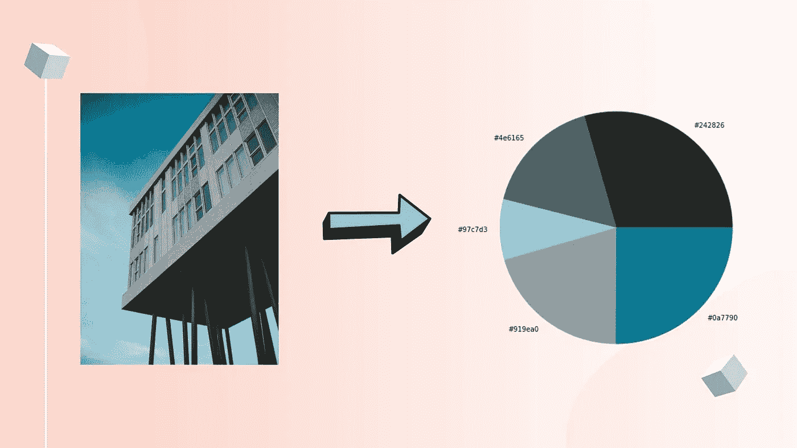
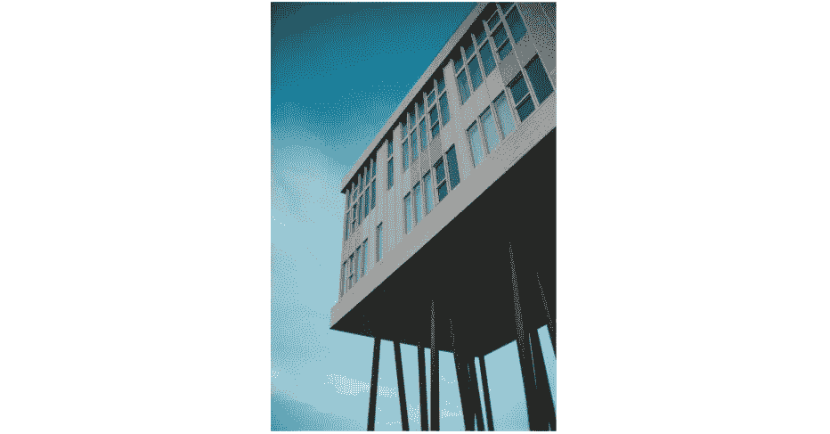
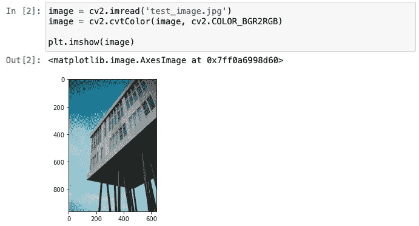
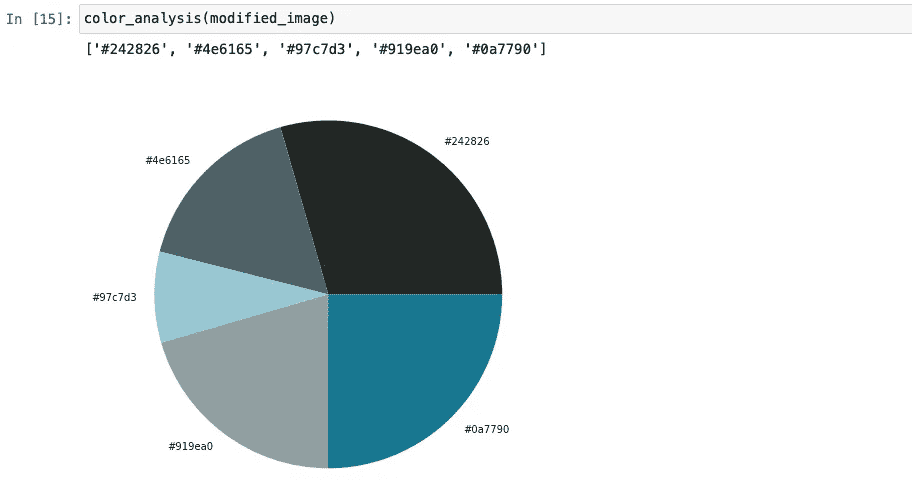
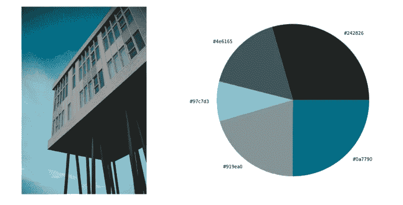

# 使用 Python 构建图像颜色分析器

> 原文：<https://towardsdatascience.com/building-an-image-color-analyzer-using-python-12de6b0acf74?source=collection_archive---------8----------------------->

## 使用 Scikit-learn 和 OpenCV 的机器学习项目



埃里克·麦克林的照片|作者设计

在这篇文章中，我将向你展示如何创建一个程序来检测颜色，然后计算图像中颜色的权重。这将是一个有趣和简单的基于机器学习的计算机视觉项目，其中我们将使用 Scikit-learn 和 OpenCV 作为我们的主要模块。特别是，平面设计师和网页设计师会发现这个程序非常有帮助。不仅可以检测颜色，还可以在图像中看到它们的音量，这是一个非常好的功能。

作为一名技术和艺术爱好者，我喜欢从事与这两个领域都密切相关的项目。这就是我喜欢编程的原因。*你的极限是你的想象力！*

如果你对艺术/编程感兴趣，你可以在我的博客上找到很多这样的动手项目。抓紧时间，让我们开始工作吧！

## 目录

*   *入门*
*   *库*
*   *读取图像*
*   *功能*
*   *图像颜色分析仪在工作*
*   *结论*

# 入门指南

在这个色彩分析项目中，我们将使用两个主要模块。它们是 Scikit-learn 和 OpenCV。Scikit-learn 是一个著名的人工智能和机器学习模块。而 OpenCV 是必备的计算机视觉模块。下面是 OpenCV 的一个简短定义。

> OpenCV(开源计算机视觉库)是一个开源的计算机视觉和机器学习软件库。OpenCV 旨在为计算机视觉应用提供一个公共基础设施，并加速商业产品中的机器感知。
> 
> 参考:[https://opencv.org](https://opencv.org)

# 图书馆

首先，让我给你介绍一下图书馆。这个项目我们需要五个图书馆。而这些库可以列举如下: *OpenCV，Scikit-learn，NumPy，Matplotlib 和 Collections* 。

现在，让我们使用 pip 来安装它们，pip 是一个 python 库管理器。顺便说一下，我们不需要安装 c*collections；*Python 默认自带。

```
pip install opencv-python scikit-learn numpy matplotlib 
```

安装完成后，我们可以继续导入它们。顺便说一下，这个项目我会用 Jupyter 笔记本。这是记录过程时间线的好方法。

```
from collections import Counter
from sklearn.cluster import KMeans
from matplotlib import colors
import matplotlib.pyplot as plt
import numpy as np
import cv2
```

这里是每个图书馆的官方链接。请随意查看，了解更多信息。

*   [OpenCV](https://docs.opencv.org/4.5.2/index.html)
*   [Scikit-learn](https://scikit-learn.org/stable/user_guide.html)
*   [Matplotlib](https://docs.python.org/3/library/collections.html)
*   [Numpy](https://numpy.org)
*   [系列](https://docs.python.org/3/library/collections.html)

# ***读取图像***

我们需要选择一个图像来开始。这是我将在这个项目中使用的图像。



照片由[埃里克·麦克林](https://www.pexels.com/@introspectivedsgn?utm_content=attributionCopyText&utm_medium=referral&utm_source=pexels)从 [Pexels](https://www.pexels.com/photo/white-concrete-building-under-blue-sky-8266933/?utm_content=attributionCopyText&utm_medium=referral&utm_source=pexels) 拍摄

```
image = cv2.imread('test_image.jpg')
image = cv2.cvtColor(image, cv2.COLOR_BGR2RGB)plt.imshow(image)
```

我们使用 OpenCV 的 *imread* 方法来读取图像。然后，我们使用 *cvtColor* 将颜色格式从 BGR 转换成 RGB。我们在设备上看到的日常图像是 RGB 格式的。



作者图片

# 功能

在这一步，正如你从标题中可以理解的，我们将编写函数。我将定义三个对我们有用的函数。函数也是简化程序的好方法。

以下是这些函数及其定义。

## rgb_to_hex

```
def rgb_to_hex(rgb_color):
    hex_color = "#"
    for i in rgb_color:
        i = int(i)
        hex_color += ("{:02x}".format(i))
    return hex_color
```

在这个函数中，我们将 RGB 颜色转换为十六进制颜色格式。这个函数将有助于最终可视化我们的分析结果。我们将有一个输出:十六进制值，而不是三个不同的值(红、绿、蓝)。

## 准备 _ 图像

```
def prep_image(raw_img):
    modified_img = cv2.resize(raw_img, (900, 600), interpolation = cv2.INTER_AREA)
    modified_img = modified_img.reshape(modified_img.shape[0]*modified_img.shape[1], 3)
    return modified_img
```

这个函数主要完成图像的预处理。如果您想在分析颜色之前对图片进行任何更改，这是您可以使用的功能。在这一步中，我们将调整图像的大小和形状。调整大小是可选的，但是为了使颜色分析模型正确工作，需要进行整形。我们将在下面的函数中看到它。

## 颜色分析

这就是奇迹发生的地方。我将重点介绍函数中发生的事情。

```
def color_analysis(img):
    clf = KMeans(n_clusters = 5)
    color_labels = clf.fit_predict(img)
    center_colors = clf.cluster_centers_ counts = Counter(color_labels)
    ordered_colors = [center_colors[i] for i in counts.keys()]
    hex_colors = [rgb_to_hex(ordered_colors[i]) for i in counts.keys()] plt.figure(figsize = (12, 8))
    plt.pie(counts.values(), color_labels = hex_colors, colors = hex_colors)
    plt.savefig("color_analysis_report.png") print(hex_colors)
```

*   首先，我们使用 k-Means 聚类顶部的颜色。在函数内部，我们传递我们想要划分多少个集群的值。[这里的](https://scikit-learn.org/stable/modules/generated/sklearn.cluster.KMeans.html)是 K 均值聚类的文档。聚类之后，我们预测权重最大的颜色，这意味着在图像上获得最大的面积。
*   其次，我们调用计数器函数。Counter 为作为字典键的元素创建一个容器，它们的容量作为字典值存储。如果您不熟悉字典，它们将数据存储在键:值对中。它们就像函数，当你传入“key”时，你可以“value”作为返回。然后我们根据颜色排序。
*   第三，我们在 *rgb_to_hex* 函数中传递这些颜色，这样我们就可以得到这些颜色的十六进制值。
*   最后，结果的可视化。我决定用饼状图，这样会有助于了解整张图片中每种颜色的权重。绘制完图形后，我也使用 *savefig* 方法将其保存到计算机中。这样，我们就有了结果的记录。

在我们进入最后一步之前，我想分享一篇与我们的计算机视觉项目相关的引人注目的文章:[Salma Ghoneim](/object-detection-via-color-based-image-segmentation-using-python-e9b7c72f0e11)使用 Python 通过基于颜色的图像分割进行对象检测。

# 运行中的图像颜色分析器

快好了！我们准备好了幕后场景。现在我们可以开始行动了。我们有前面定义的图像，并将其分配给“image”变量。我们将调用 *prep_image* 函数对图像进行预处理。

```
modified_image = prep_image(image)color_analysis(modified_image)
```



作者图片

# 结论

恭喜你！我们已经创建了一个程序来分析图像并以绘图的形式返回彩色报告。一个令人兴奋的特性是，我们可以定义我们想要将颜色分成多少组。我使用了五个集群，但是可以随意使用不同的值来尝试这个模型。剩下的用 Scikit-learn K-means 模型预测和 OpenCV 来完成。

最终结果出来了:



作者图片

希望你喜欢读这篇文章，并在今天学到一些新的东西。从事动手编程项目是提高编码技能的最佳方式。如果您在执行代码时有任何问题，请随时[联系我](https://sonsuzdesign.blog/contact)。

> 我们来连线。查看我的[博客](https://medium.com/@lifexplorer)和 [youtube](https://www.youtube.com/watch?v=7I9eg3G1mnE&list=PLudLCLvpppAJ7OsgrQxqY-n8Ok9Nt-Rtr) 以获得灵感。谢谢你，

## ML/人工智能项目

</building-a-face-recognizer-in-python-7fd6630c6340>  </extracting-speech-from-video-using-python-f0ec7e312d38> 