# 从头开始构建智能语音助手

> 原文：<https://towardsdatascience.com/building-an-intelligent-voice-assistant-from-scratch-3d5749f4af07?source=collection_archive---------6----------------------->

## 在 RaspberryPi 和 Arduino Nano 33 BLE 上模拟谷歌助手


图片由[穆罕默德·哈桑](https://pixabay.com/users/mohamed_hassan-5229782/?utm_source=link-attribution&utm_medium=referral&utm_campaign=image&utm_content=4071801)拍摄，来自[皮克斯拜](https://pixabay.com/?utm_source=link-attribution&utm_medium=referral&utm_campaign=image&utm_content=4071801)

在我的文章[用 Alexa 实现家庭自动化](/home-automation-with-alexa-69f71524f164)中，我们学习了如何模拟物联网设备，并使用语音助理设备远程控制它们。在那里，我们使用了一个 Echo-Dot，每当 Alexa 这个词被发现时，它就会“醒来”。

> *但是，语音助手是如何工作的呢？*

我们将在这个项目中尝试回答这个问题，使用 RaspberryPi 和 Arduino Nano 模拟谷歌助手。

# 介绍

首先，有必要认识到，市场上的语音助手，如 Google Home 或亚马逊 Echo-Dot，只有在被特定关键词“唤醒”时才会对人类做出反应，第一个关键词是“嘿谷歌”，第二个关键词是“Alexa”。

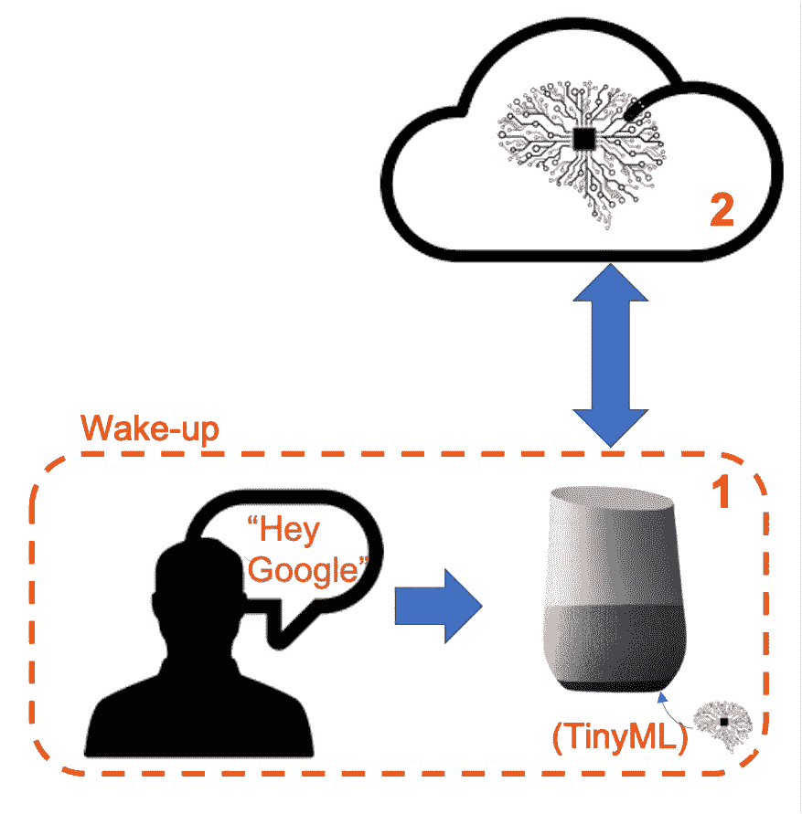

作者创造的形象

换句话说，识别语音命令的整个过程基于多阶段模型或级联检测。

**第一阶段:**Echo-Dot 或 Google Home 内部的一个更小的微处理器持续监听声音，等待关键词被发现。对于这种检测，在边缘使用 TinyML 模型。

**阶段 2:** 只有在被触发时，数据才会被发送到云端，并在更大的模型上进行处理。

> [***TinyML***](https://www.tinyml.org/home/index.html)*是一个极好的概念，让机器智能就在物理世界旁边；此外，在微处理器级别运行机器学习模型(ML)可以避免延迟、功耗和安全性等问题。*

对于这个项目的第一阶段(KWS 或关键词识别)，我们将使用一个 [Arduino Nano 33 BLE 感知](https://store.arduino.cc/usa/nano-33-ble-sense-with-headers)微控制器。在几个集成的传感器中，它有一个数字麦克风，将用于识别关键词。对于第二阶段，RaspberryPi 将用于联系云端上的 Google 服务，以执行由 Arduino 触发的更复杂的任务。

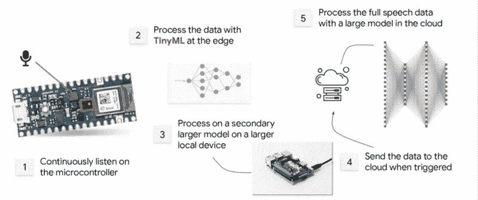

“级联检测”:多阶段模型([改编自 TinyML 教程— HarvardX](https://courses.edx.org/dashboard/programs/f7868191-7d7f-4292-b117-64549f1f483a/) )

该项目将分为两部分:

第 1 部分:在 RPi 上模拟 Google Assistant

第 2 部分:在 Arduino Nano 上实现 KWS

在这里你可以对最终项目有一个概念:

# 第 1 部分—在 RPi 上模拟 Google Assistant

除了允许 RPi 模拟谷歌助手的软件之外，一些额外的硬件也是必要的。您可以安装外部麦克风和扬声器，或者为了简单起见使用帽子。在这个项目中，我们将使用一顶帽子，即 **ReSpeaker 2-Mics Pi 帽子。**

## [**再代言人 2-Mics Pi 帽子**](https://wiki.seeedstudio.com/ReSpeaker_2_Mics_Pi_HAT/)

这是帽子的示意图。

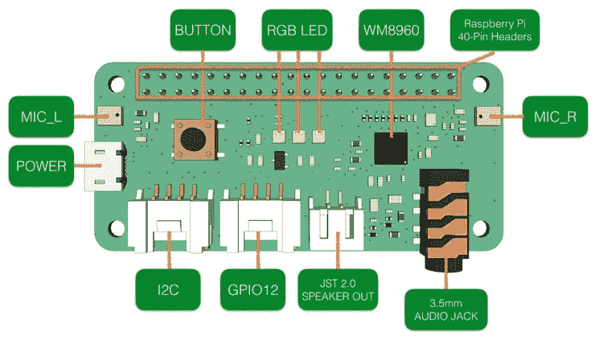

图片来自[https://wiki.seeedstudio.com/ReSpeaker_2_Mics_Pi_HAT/](https://wiki.seeedstudio.com/ReSpeaker_2_Mics_Pi_HAT/)

它的安装非常简单:

**将 ReSpeaker 2-Mics Pi HAT 连接到 Raspberry Pi**

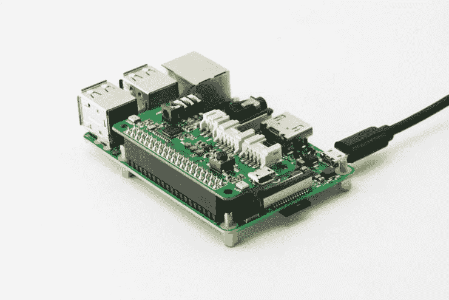

图片来自[https://wiki.seeedstudio.com/ReSpeaker_2_Mics_Pi_HAT/](https://wiki.seeedstudio.com/ReSpeaker_2_Mics_Pi_HAT/)

**在 Raspberry Pi 上设置驱动程序**

```
sudo apt-get update
sudo apt-get upgrade
git clone https://github.com/respeaker/seeed-voicecard.git
cd seeed-voicecard
sudo ./install.sh
reboot
```

**检查安装在 RPi 上的声卡**

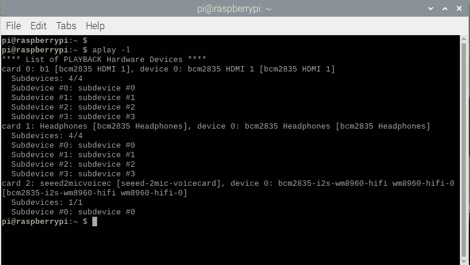

作者终端打印屏幕

所以，在我的例子中，声卡是:

*   卡 0: RPi HDMI
*   卡 1: RPi 耳机音频插孔
*   卡片 2:2-麦克风皮帽子

卡 2 应该是默认的，您可以在 Pi 首选项/音频设备设置中验证它:

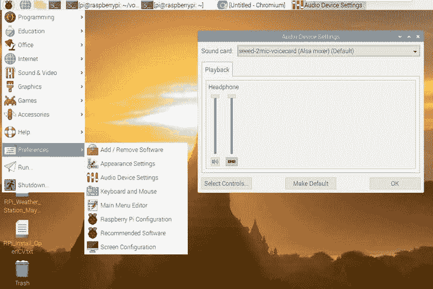

作者打印屏幕

> *在我的例子中，ReSpeaker 2-Mics Pi HAT(音频插孔)上的输出无法正常工作，所以我将卡 2 定义为输入(ReSpeaker 上的 Mics)，将标准 Rpi 音频插孔(卡 1)作为输出。*

这种配置是通过编辑。作为/home/pi 文件夹中的 undrc 文件。要编辑该文件，请执行以下终端命令:

```
sudo nano /home/pi/.asoundrc
```

并将 pcm.output 从卡 2 更改为卡 1:

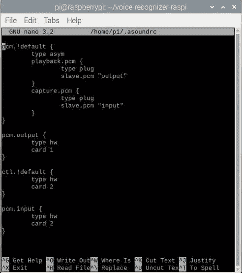

作者终端打印屏幕

> *每当 Pi 首选项/音频设备设置发生变化时，必须检查上述文件。此外，可以在声卡 1 —耳机(RPi 音频插孔)的同一菜单中更改输出音量。*

此时，可以进行一些测试:

**测试音频输出:**

```
speaker-test -t wav
```

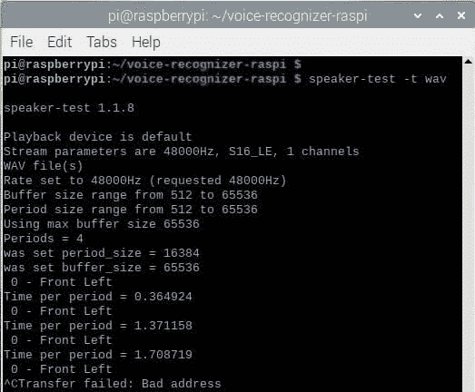

作者终端打印屏幕

你应该听扬声器里重复的“前”和“左”。按[CTRL]+[C]退出。

**测试音频输入:**

首先，安装 Python 库 pyaudio，用于在 RPi 上播放和录制音频:

```
sudo pip install pyaudio
```

在 puAudio 的网页上，[http://people.csail.mit.edu/hubert/pyaudio/,](http://people.csail.mit.edu/hubert/pyaudio/)你可以找到如何使用该库的信息和示例。

使用下面的脚本，录制几秒钟(5s)的音频:

```
import pyaudio
import waveRESPEAKER_INDEX = 2 # refer to input device id (card 2)
RESPEAKER_RATE = 16000
RESPEAKER_CHANNELS = 2
RESPEAKER_WIDTH = 2
CHUNK = 1024
RECORD_SECONDS = 5
WAVE_OUTPUT_FILENAME = "record_test.wav"p = pyaudio.PyAudio()
stream = p.open(
    rate=RESPEAKER_RATE,
    format=p.get_format_from_width(RESPEAKER_WIDTH),
    channels=RESPEAKER_CHANNELS,
    input=True,
    input_device_index=RESPEAKER_INDEX,)
print("* recording")frames = []
for i in range(0, int(RESPEAKER_RATE / CHUNK * RECORD_SECONDS)):
    data = stream.read(CHUNK)
    frames.append(data)
print("* done recording")stream.stop_stream()
stream.close()
p.terminate()wf = wave.open(WAVE_OUTPUT_FILENAME, 'wb')
wf.setnchannels(RESPEAKER_CHANNELS)
wf.setsampwidth(p.get_sample_size(p.get_format_from_width(RESPEAKER_WIDTH)))
wf.setframerate(RESPEAKER_RATE)
wf.writeframes(b''.join(frames))
wf.close()
```

名为“record_test.wav”的文件应该出现在执行脚本的文件夹中。

要验证录制的音频，请执行以下脚本:

```
import pyaudio
import waveCHUNK = 1024
WAVE_INPUT_FILENAME = "record_test.wav"print("Playing a wave file: {}".format(WAVE_INPUT_FILENAME))
wf = wave.open(WAVE_INPUT_FILENAME, 'rb')
p = pyaudio.PyAudio()
stream = p.open(format=p.get_format_from_width(wf.getsampwidth()),
    channels=wf.getnchannels(),
    rate=wf.getframerate(),
    output=True)data = wf.readframes(CHUNK)
while data != b'':
    stream.write(data)
    data = wf.readframes(CHUNK)stream.stop_stream()
stream.close()
p.terminate()
```

如果你听你录的，太好了！我们在出差！

在开始准备我们的 RPi 来模拟 Google Assistant 之前，让我们先来看看安装在 ReSpeaker 2-Mics Pi 帽子上的按钮和 RGB LEDs:

## **按钮**

有一个板载用户按钮连接到 GPIO17，如下图所示。

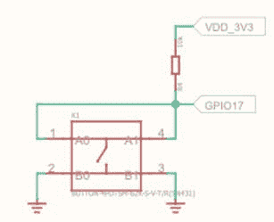

ReSpeaker 2-Mics Pi HAT 原理图的一部分—参见

现在我们将尝试使用 python 和 RPi.GPIO 来检测它。

首先，安装 RPi。GPIO 库

```
sudo pip install rpi.gpio
```

接下来，您可以执行下面的脚本来测试按钮:

```
import RPi.GPIO as GPIO
import timeBUTTON = 17GPIO.setmode(GPIO.BCM)
GPIO.setup(BUTTON, GPIO.IN)while True:
    try:
        state = GPIO.input(BUTTON)
        if state:
            print("off")
        else:
            print("on")
        time.sleep(1)
    except KeyboardInterrupt:
        break
```

在终端上，您将验证按钮何时被按下。

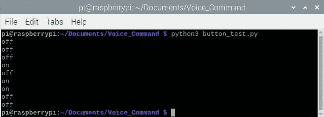

作者终端打印屏幕

## **车载 RGB 发光二极管(APA102)**

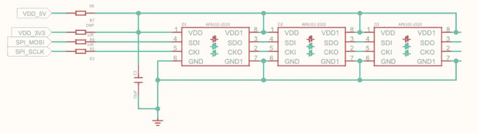

ReSpeaker 2-Mics Pi HAT 原理图的一部分—参见

三个板载 APA102 RGB LEDs 各有一个额外的驱动芯片。驱动芯片负责通过其输入线接收所需的颜色，然后保持该颜色，直到接收到新的命令。

安装 spidev 库:

```
sudo pip install spidev
```

并克隆以下文件:

```
git clone [https://github.com/respeaker/mic_hat.git](https://github.com/respeaker/mic_hat.git)
```

在 mic_hat 子文件夹中，执行 pixels.py 脚本，该脚本将对所有 led 执行测试。使用[CTRL]+[C]键关闭指示灯

```
python3 pixels.py
```

像素类有几个准备好的函数:

*   pixels.wakeup():打开所有 LEDS
*   pixels.off():关闭所有发光二极管
*   pixels.think():逐个打开 led，变换颜色
*   pixels.speak():打开所有发光二极管，改变其亮度

要在最终代码中有效地使用该函数，请将文件 apa102.py 和 pixels.py 放在同一个目录中。这样，您可以使用类似下面的简单代码来访问 led:

```
from pixels import Pixelspixels = Pixels()pixels.wakeup()
pixels.off()
pixels.think()
pixels.off()
pixels.speak()
pixels.off()
```

## **谷歌语音服务**

此时，所有硬件都正常工作:

*   音频输入
*   音频输出
*   纽扣
*   发光二极管

是时候在我们的 RaspberryPi 上安装谷歌语音服务了。为此，我们将听取优秀教程[http://www.makerspace-uk.co.uk/respeaker-2-mics-pi-hat/.](http://www.makerspace-uk.co.uk/respeaker-2-mics-pi-hat/)的建议

**安装谷歌助手 API**

转到 Rpi 主目录，在子目录/voice-recognizer-raspi 下克隆 VoiceKit GitHub

```
cd ~
git clone -b voicekit https://github.com/google/aiyprojects-raspbian.git ~/voice-recognizer-raspi
```

转到这个创建的子目录，运行脚本来安装文件:

```
cd ~/voice-recognizer-raspi
scripts/install-deps.sh
```

要使用谷歌 Voicekit，必须有 [picotts](https://www.home-assistant.io/integrations/picotts/) ，这是一个文本到语音的平台，它使用离线 pico 文本到语音引擎以自然的声音阅读文本。要在系统(通常是 Debian)上安装 pico TTS 库，请执行以下操作:

```
sudo apt-get install libttspico-utils
```

在一些 Raspbian 版本中，这个包是缺失的，但是你可以从 Debian 复制 arm deb 包。例如，在 Debian Buster 上，软件包丢失了，所以使用下面的命令来安装它:

```
wget http://ftp.us.debian.org/debian/pool/non-free/s/svox/libttspico0_1.0+git20130326-9_armhf.debwget http://ftp.us.debian.org/debian/pool/non-free/s/svox/libttspico-utils_1.0+git20130326-9_armhf.debsudo apt-get install -f ./libttspico0_1.0+git20130326-9_armhf.deb ./libttspico-utils_1.0+git20130326-9_armhf.deb
```

**安装 gRPC(远程过程调用)**

我为什么要使用 [gRPC](https://grpc.io/docs/what-is-grpc/introduction/) ？

主要使用场景:

*   低延迟、高度可扩展的分布式系统。
*   开发与云服务器通信的移动客户端。
*   设计一种新的协议，它需要准确、高效且独立于语言。
*   支持扩展的分层设计，例如身份验证、负载平衡、日志记录和监控等。

```
sudo pip install grpcio
sudo pip install grpcio-tools
```

现在，该安装 Google API 和 Google Assistant 库了:

```
sudo pip install --upgrade google-api-python-client
sudo pip install --upgrade google-assistant-library==1.0.1
sudo pip install --upgrade google-assistant-sdk[samples]==0.5.1
```

此时，安装了主要的软件包，重新启动系统:

```
reboot
```

**原始谷歌语音工具包需要更改:**

打开文件:

```
/home/pi/voice-recognizer-raspi/src/aiy/_apis/_speech.py
```

并注释以下几行:

```
#try:
# from google.cloud import speech
# from google.cloud.speech import enums
# from google.cloud.speech import types
#except ImportError:
# print("Failed to import google.cloud.speech. Try:")
# print(" env/bin/pip install -r requirements.txt")
# sys.exit(1)
```

现在，打开文件:

```
/home/pi/voice-recognizer-raspi/src/aiy/voicehat.py
```

并将按钮 GPIO(应该显示为 23)更改为在 ReSpeaker 2-Mics Pi HAT 上使用的按钮(应该为 17)

```
_GPIO_BUTTON = 17
```

此时，所有硬件和软件都应完成。缺少的部分是从 Google 获得在我们的树莓上运行语音工具包的凭证。

## **启用谷歌助手 API**

启用 API 的所有步骤都可以在[谷歌 AIY 语音工具包网站](https://aiyprojects.withgoogle.com/voice#users-guide-1-1--connect-to-google-cloud-platform)的“获取凭证”部分找到。

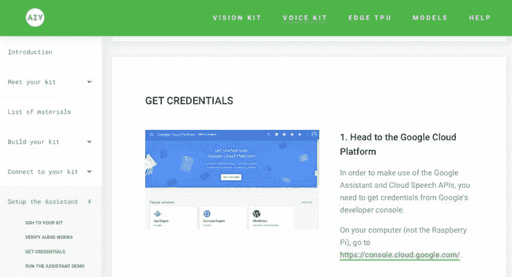

作者打印屏幕

这个部分位于页面的最下方(大约是一个长网站的一半)。你应该打开第二页的[https://console.cloud.google.com/](https://console.cloud.google.com/)(谷歌云平台)，然后按照第一页的指示去做。如果一切都正确，您的计算机上应该已经下载了一个 JSON 文件。这些说明还解释了如何创建一个 file assistant.json，其中必须保存此类下载文件的内容。该文件必须保存在您的 RPi 主目录中:

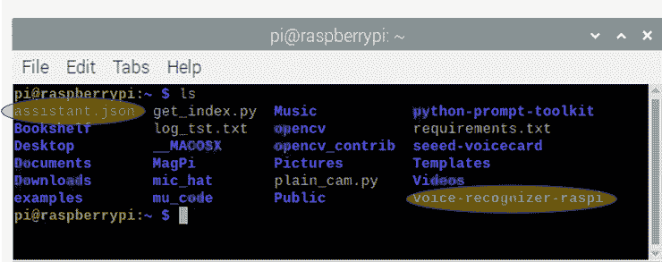

作者终端打印屏幕

除了上述说明之外，我还使用 OAuth 同意屏幕页面上的+添加用户选项，将我的电子邮件作为“测试用户”包括在内:

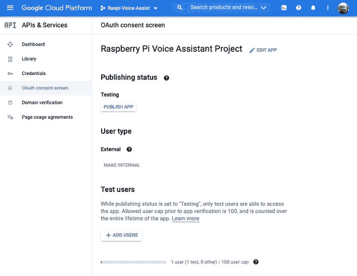

作者打印屏幕

就是这样！考验我们语音助手的时候到了！

**测试语音助手**

转到安装语音工具包的子文件夹:

```
cd ~/voice-recognizer-raspi
```

并运行位于/src 子文件夹中的演示程序:

```
python3 src/assistant_grpc_demo.py
```

如果一切正常，您应该在终端上看到以下消息:

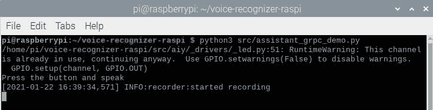

作者终端打印屏幕

语音助手正在等待您按下按钮开始对话:

比如我按了按钮，出现了“正在收听…”的信息。我问:“现在几点了？”那也出现在终端上。同时，助理会说出答案。

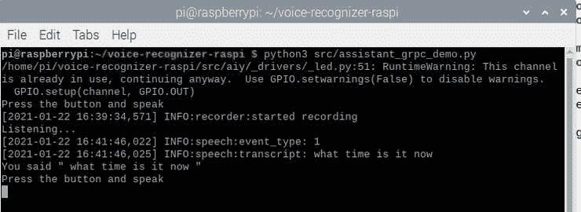

作者终端打印屏幕

下面的视频更好地说明了一个真实的对话:

作为项目的最后一部分，让我们在上面的代码中包含帽子上可用的 led，如下所示:

> 将两个文件 apa102.py 和 pixels.py 复制到同一个目录中，在该目录中运行以下代码(在本例中为:“voice-recognizer-raspi/src ”)

```
import time
import aiy.assistant.grpc
import aiy.audio
import aiy.voicehat
from pixels import Pixels
import loggingpixels = Pixels()
pixels.off()logging.basicConfig(
    level=logging.INFO,
    format="[%(asctime)s] %(levelname)s:%(name)s:%(message)s"
)def wakeup_assistant():
    pixels.wakeup()
    pixels.think()
    time.sleep(3)
    pixels.speak()
    time.sleep(3)
    pixels.off()def main():
    wakeup_assistant()
    status_ui = aiy.voicehat.get_status_ui()
    status_ui.status('starting')
    assistant = aiy.assistant.grpc.get_assistant()
    button = aiy.voicehat.get_button() with aiy.audio.get_recorder():
        while True:
            pixels.off()
            status_ui.status('ready')
            print('Press the button and speak')
            button.wait_for_press()
            status_ui.status('listening')
            print('Listening...')
            pixels.think()
            text, audio = assistant.recognize()
            if text:
                if text == 'goodbye':
                    status_ui.status('stopping')
                    print('Bye!')
                    pixels.off()
                    time.sleep(1)
                    break
                print('You said "', text, '"')
            if audio:
                pixels.speak()
                aiy.audio.play_audio(audio)
                pixels.off()
    pixels.off()if __name__ == '__main__':
main()
```

现在，一种“唤醒 LED 显示”将在启动过程中增加(一次)。此外，每次按下按钮时，语音助手都会“思考”等待我们的问题，为此我们将使用 pixels.think()函数强制 led 滚动。当助手“说话”时也是如此，led 将保持其 RGB 颜色，但会“褪色”。

注意，如果你说“再见”，助手将被关闭。

## 玩 GPIOs

在 RPi 上模拟 Google Assistant 的一个显著优势是，我们可以使用它的 GPIOs 来控制现实世界中的外部事物。我们已经使用 ReSpeaker 2-Mics Pi HAT 内置 led 和按钮实现了这一点。HAT 通过 Grove 连接器留有 2 个可用的 gpio(12 和 13)，如其电路图所示:

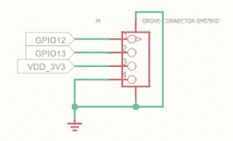

ReSpeaker 2-Mics Pi HAT 原理图的一部分—参见

现在，我们在 RPI GPIO 13 上安装一个外部按钮，在 GPIO 12 上安装一个 LED，如下图所示:

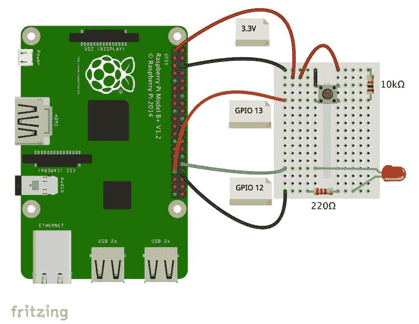

作者创建的图像

我们把之前用来测试帽子按钮的脚本改成现在，测试外接按钮和 LED。每次按下按钮时，LED 都会亮起:

```
import RPi.GPIO as GPIO
import timeBUTTON = 13
LED = 12GPIO.setmode(GPIO.BCM)
GPIO.setup(BUTTON, GPIO.IN)
GPIO.setup(LED, GPIO.OUT)
GPIO.output(LED, GPIO.LOW)while True:
    try:
        state = GPIO.input(BUTTON)
        if state:
            GPIO.output(LED,GPIO.LOW)
            print("off")
        else:
            GPIO.output(LED,GPIO.HIGH)
            print("on")
        time.sleep(1)
    except KeyboardInterrupt:
        GPIO.cleanup()
        breakprint("clean up")
GPIO.cleanup() # cleanup all GPIO
```

视频展示了结果:

**使用外部按钮唤醒语音助手**

唯一需要做的就是改变助手的按钮 GPIO。打开文件:

```
/home/pi/voice-recognizer-raspi/src/aiy/voicehat.py
```

并将按钮 GPIO(应该显示为 17)更改为我们的外部按钮(13)所使用的按钮

```
_GPIO_BUTTON = 13
```

从现在开始，只要按下外部按钮，语音助手就会“醒来”。

**用语音控制外部设备:**

让我们也改变之前使用的完整代码，以纳入 LED，这应该接收一些语音控制:

*   发动
*   关掉
*   眨眼

完整的代码如下:

```
import time
import aiy.assistant.grpc
import aiy.audio
import aiy.voicehat
from pixels import Pixels
import logging
import RPi.GPIO as GPIOLED = 12
GPIO.setmode(GPIO.BCM)
GPIO.setup(LED, GPIO.OUT)
GPIO.output(LED, GPIO.LOW)pixels = Pixels()
pixels.off()logging.basicConfig(
    level=logging.INFO,
    format="[%(asctime)s] %(levelname)s:%(name)s:%(message)s"
)def led_blink():
    for i in range (0,6):
    GPIO.output(LED,GPIO.HIGH)
    time.sleep(0.25)
    GPIO.output(LED,GPIO.LOW)
    time.sleep(0.25)def wakeup_assistant():
    pixels.wakeup()
    pixels.think()
    time.sleep(3)
    pixels.speak()
    time.sleep(3)
    pixels.off()def main():
    wakeup_assistant()
    status_ui = aiy.voicehat.get_status_ui()
    status_ui.status('starting')
    assistant = aiy.assistant.grpc.get_assistant()
    button = aiy.voicehat.get_button() with aiy.audio.get_recorder():
        while True:
            play_audio = True
            pixels.off()
            status_ui.status('ready')
            print('Press the button and speak')
            button.wait_for_press()
            status_ui.status('listening')
            print('Listening...')
            pixels.think()
            text, audio = assistant.recognize() if text:
                if text == 'goodbye':
                    status_ui.status('stopping')
                    print('Bye!')
                    pixels.off()
                    time.sleep(1)
                    break
                if 'turn on' in text:
                    pixels.off()
                    GPIO.output(LED,GPIO.HIGH)
                    play_audio = False
                if 'turn off' in text:
                    pixels.off()
                    GPIO.output(LED,GPIO.LOW)
                    play_audio = False
                if 'blink' in text:
                    pixels.off()
                    led_blink()
                    play_audio = False
                print('You said "', text, '"') if play_audio:
                if audio:
                    pixels.speak()
                    aiy.audio.play_audio(audio)
                    pixels.off()
    pixels.off()if __name__ == '__main__':
main()
```

结果在这里:

# 第 2 部分使用关键词识别(KWS)

到目前为止，在我们的语音助手上，用来唤醒它的方法是使用一个物理按钮，但正如在介绍中讨论的那样，语音助手，像 Google Home，应该在特定关键字被用作“嘿 Google”时做出反应。

该项目将使用一种被称为 KWS 或关键字识别的机制，用“虚拟按钮”取代物理按钮。我们将使用一个 [Arduino Nano 33 BLE Sense](https://store.arduino.cc/usa/nano-33-ble-sense-with-headers) ，这是一个集成了数字麦克风的微控制器，将用于识别关键词。

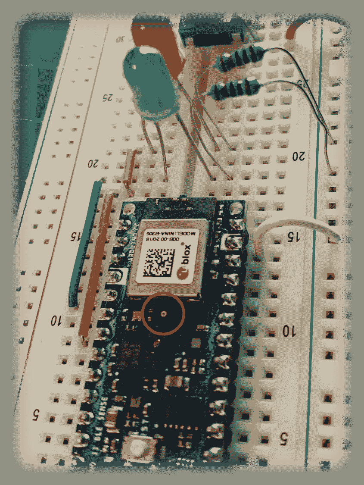

作者照片

为了简化(曾经这个项目的主要对象不是神经网络模型的开发)，让我们重新使用 Google incorporated 在 Arduino IDE 上开发的一个代码，使用 TensorFlowLite 创建，命名为“micro_speech”。这幅草图包含了一个模型，它可以识别两个词:是，不是，除了未知和沉默。您可以从示例选项卡中获取，如下所示:

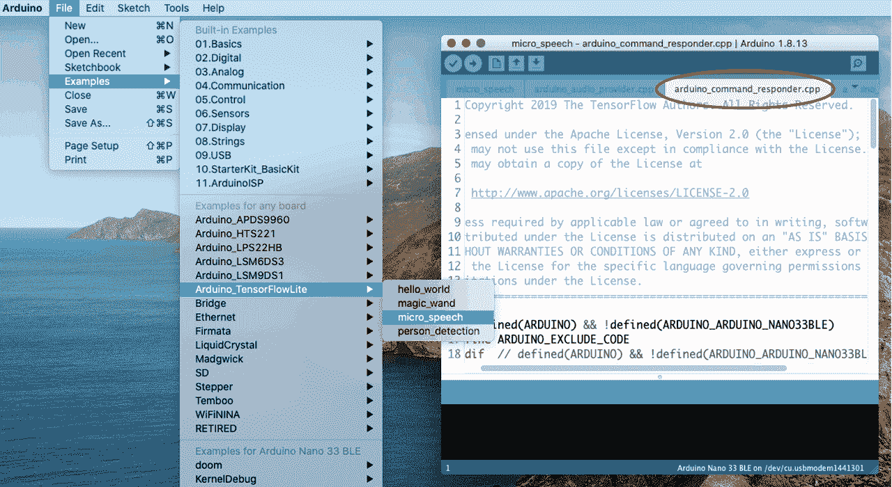

作者打印屏幕

为了测试，你可以把代码上传到你的 Arduino Nano 上，然后通过说“是”或“否”来测试。发现时，内部 RGB LED 应亮起(是:绿色，否:红色)。

## **快速回顾语音识别在微处理器上的工作原理**

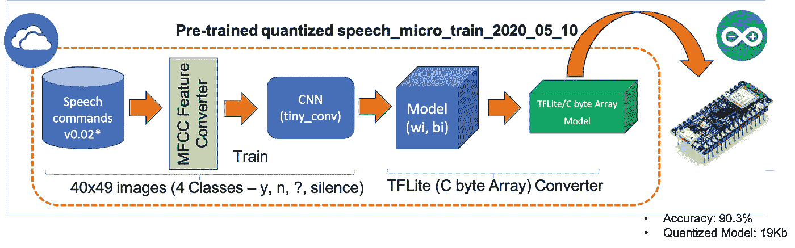

作者图片

Arduino 将在使用 TensorFlow 开发的预训练模型中执行推理。卷积神经网络模型(tiny_conv)用+100，000 个每秒(或更少)的记录样本来训练。wave 格式)的 35 个不同音素([谷歌语音命令数据集](https://arxiv.org/abs/1804.03209))。TensorFlowLite 将训练好的模型转换为 C 字节数组，以在小型微处理器上用作 Nano(最终模型的准确度超过 90%，大小仅为 19K 字节)。

观察原始数据(声音输入。波形格式)不能直接用于 CNN 模型。首先，声音数据应该转换成图像(40x49 像素)，这是使用 MFCC 特征转换器完成的，如下所示:

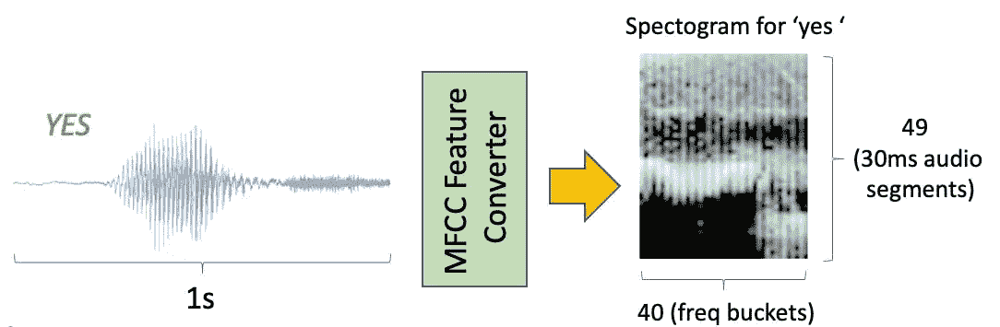

作者图片

> [*Mel-频率倒谱系数*](https://en.wikipedia.org/wiki/Mel-frequency_cepstrum)*(MFCC)是共同构成 MFC 的系数，也就是说，它是声音的短期功率谱的表示，基于对数功率谱在非线性 Mel 频率标度上的线性余弦变换。*

**让我们看看代码一般是如何工作的**:

1.Arduino 应该会持续聆听周围的声音。麦克风采集音频样本(1 秒)，将其转换为 16 位数据(脉冲编码调制——PCM)。音频提供模块完成这项任务。

2.PCM 数据在用作推断之前应该进行预处理。在模块特征提供程序中，MFCC 特征转换器将原始数据转换为图像。每个样本将是单色图像(或大小为:[1，49，40，1]的张量)

3.TFLite 解释器运行推理，或者更好地说，将输入张量分为四个不同的类别。输出将是维数为[1，4]的张量，其中的值是输入声音为无声、未知、是或否的概率。

4.基于这些概率，模块命令识别器和响应器将使用 TFLite 解释器输出来决定是否听到命令并采取适当的行动。例如，如果声音是“是”的概率较高，内部绿色 RGB LED 将打开，如果是“否”，则打开红色 LED，最后，对于任何其他可能的单词，打开蓝色 LED。该模型被量化为 8 位整数，因此概率从 0 到 255。如果概率大于 200(80%左右)，则执行该命令。

下图恢复了该过程:

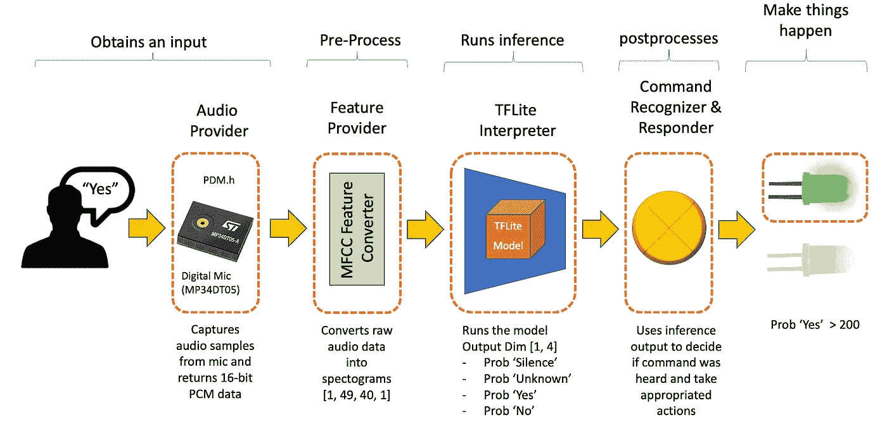

作者图片

**修改硬件**

我们将安装两个外部 LED，复制 Nano 内部 RGB LED 的功能。绿色发光二极管将连接到纳米输出 D2 和红色的 D4。纳米输出 D3(与 GND 一起)将取代连接到 RPi GPIO13 的外部物理按钮。

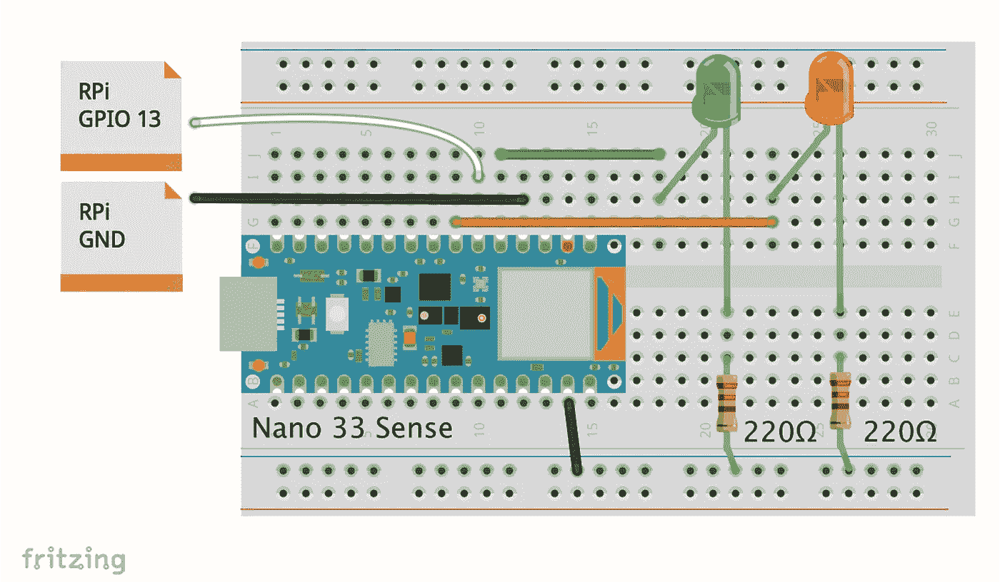

作者图片

**修改代码**

我们必须修改代码，以便每次发现单词 YES(我们的唤醒词)时，外部绿色 LED 就会亮起，并向 RPi 发送一个脉冲，模拟按下一个按钮。

如您所见，唯一应该更改的模块是命令识别器& Responder 那会让事情发生的！这段代码在选项卡上:arduino_command_responder.cpp(这个选项卡在之前显示的 Arduino IDE 图像上高亮显示)。

下面是应该添加到 arduino_command_responder.cpp 中的新代码部分:

```
...#define GREEN_LED_PIN 2
#define SIM_BUT_PIN 3
#define RED_LED_PIN 4// Create a function to simulate a button pressed for 500msvoid buttonSimulator(){
  pinMode(SIM_BUT_PIN, OUTPUT);
  digitalWrite(SIM_BUT_PIN, LOW);
  delay(500);
  pinMode(SIM_BUT_PIN, INPUT);
}...pinMode(GREEN_LED_PIN, OUTPUT);
pinMode(RED_LED_PIN, OUTPUT);
pinMode(SIM_BUT_PIN, INPUT); // Open state...// If we hear a command, light up the appropriate LEDs and send signal to RPi
    if (found_command[0] == 'y') {
      last_command_time = current_time;
      digitalWrite(LEDG, LOW);  // Green for yes
      digitalWrite(GREEN_LED_PIN, HIGH);  // HIGH for yes
      buttonSimulator(); // Simulate button 
    } if (found_command[0] == 'n') {
      last_command_time = current_time;
      digitalWrite(LEDR, LOW);  // Red for no
      digitalWrite(RED_LED_PIN, HIGH);  // HIGH for yes
    }...// If last_command_time is non-zero but was >3 seconds ago, zero it
  // and switch off the LED.
  if (last_command_time != 0) {
    if (last_command_time < (current_time - 3000)) {
      last_command_time = 0;
      digitalWrite(LED_BUILTIN, LOW);
      digitalWrite(GREEN_LED_PIN, LOW);
      digitalWrite(RED_LED_PIN, LOW);
      digitalWrite(LEDR, HIGH);
      digitalWrite(LEDG, HIGH);
      digitalWrite(LEDB, HIGH);
    }...
```

要了解更多关于 TinyML 和原始代码是如何开发的，我强烈建议阅读由[彼得·沃顿](https://www.amazon.com/Pete-Warden/e/B00699O74G/ref=dp_byline_cont_ebooks_1)和[丹尼尔·斯图纳亚克](https://www.amazon.com/s/ref=dp_byline_sr_ebooks_2?ie=UTF8&field-author=Daniel+Situnayake&text=Daniel+Situnayake&sort=relevancerank&search-alias=digital-text)、 [TinyML 的伟大著作:在 Arduino 和超低功耗微控制器上使用 TensorFlow Lite 进行机器学习](https://www.amazon.com/TinyML-Learning-TensorFlow-Ultra-Low-Power-Microcontrollers-ebook-dp-B082TY3SX7/dp/B082TY3SX7/ref=mt_other?_encoding=UTF8&me=&qid=1611864250)

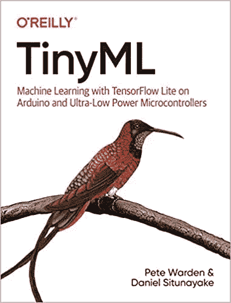

图书封面

就是这样！

结果可以在简介中的视频和我的 [GitHub](https://github.com/Mjrovai/Inteligent_Voice_Assistant) 中完整修改的 Arduino 代码上得到验证。

# 结论


一如既往地希望这个项目能帮助其他人在 AI、电子和 IoT 的激动人心的世界中找到自己的路！

请访问我的 GitHub 获取更新文件:[智能语音助手](https://github.com/Mjrovai/Inteligent_Voice_Assistant)

更多项目，请访问我的博客:[MJRoBot.org](https://mjrobot.org/)

来自世界南部的 Saludos！

我的下一篇文章再见！

谢谢你

马塞洛