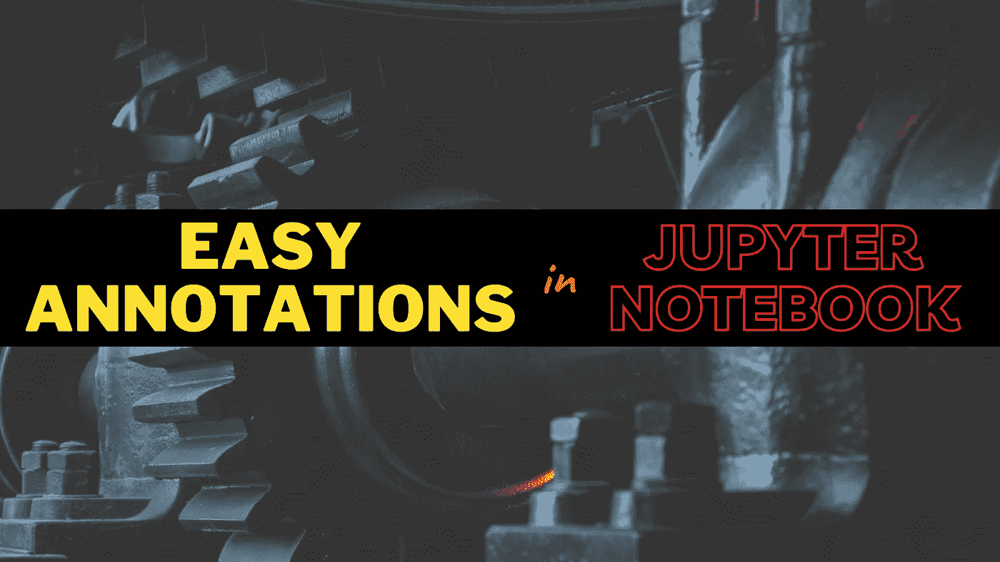
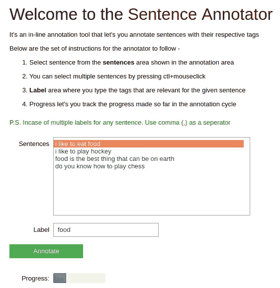
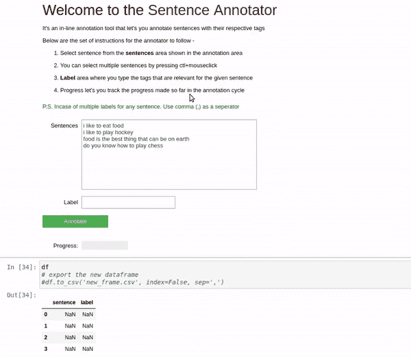

# 在 Jupyter Notebook 中构建交互式注释工具

> 原文：<https://towardsdatascience.com/building-an-interactive-annotation-tool-inside-jupyter-notebook-f3d92570ee16?source=collection_archive---------10----------------------->

## 朱庇特笔记本是❤️️的



来自[源](https://unsplash.com/photos/hsPFuudRg5I)的修改图像

在这篇博客中，我将讨论如何使用 [ipywidgets](https://ipywidgets.readthedocs.io/en/latest/) 模块，并在你自己的 [Jupyter 笔记本](https://jupyter.org/)中构建一个**交互式注释工具**。所有现在或曾经在任何初创公司担任**数据科学家**的人都知道他们需要做的工作范围。其中，构建任何类型的接口*(用于展示 API 功能、注释等)*都很常见，由他们来设计和开发。这种用户界面从来不会出现在公众面前，而是季节性地用于内部目的和开发。

在这篇博客中，我们将会看到如何轻松地构建一个注释工具，并利用 Jupyter 笔记本来完成同样的任务。我假设您已经熟悉 Jupyter 笔记本，但是，如果我不得不写一行关于它的话，它是一个基于浏览器的交互式编码环境**具有许多令人惊叹的功能，如就地图形渲染、将代码导出为文档 *(latex、pdf 等)*等等。**

我们将专注于为构建一个非常简单的注释工具奠定基础，该工具用于注释句子分类任务的数据，例如*情感分类、意图分类等等*。这同样可以扩展到图像。同样的**也可以扩展到图像**。下面的代码片段显示了我们将要构建的句子注释器工具的最终产品



使用 ipywidgets 在 Jupyter 笔记本中进行交互式注释|作者图片

我们首先从构建工具的**描述部分**开始。正如在下面的代码中可以看到的，我们从应该被注释的句子列表中读取输入，但是合并从文件系统中读取也不难，可以使用 glob 模块遍历文件，这将返回给定文件夹中所有文件的路径列表。

我们要做的下一件事是创建一个长度等于要注释的句子数量的空数据帧。然后，我们使用 **HTML 小部件**在我们的笔记本中呈现 HTML 样式的内容。这样，我们定义了可能需要的标题、任何指令等，帮助注释者顺利完成工作。

```
# data for text classification annotation  
 sentences = ["i like to eat food", "i like to play hockey", "food is the best thing that can be on earth", "do you know how to play chess"]  
 ####################################################################################################  
 # Instead of list you can take input from your LFS or Drive and transform data in the list format  
 ####################################################################################################  
 #to be shown at a time  
 BATCH = 10  
 # output dataframe  
 cols = ['sentence', 'label']  
 df = pd.DataFrame(columns=cols, index=range(len(sentences)))  
 title_widget = widgets.HTML(  
   value="""<h1>Welcome to the <font color='maroon'> Sentence Annotator</font></h1>  
   <p>It's an in-line annotation tool that let's you annotate sentences with their respective tags</p>  
   <p>Below are the set of instructions for the annotator to follow - </p>  
   <ol>  
    <li>Select sentence from the <b>sentences</b> area shown in the annotation area</li>  
    <li>You can select multiple sentences by pressing ctl+mouseclick</li>  
    <li><b>Label</b> area where you type the tags that are relevant for the given sentence</li>  
    <li>Progress let's you track the progress made so far in the annotation cycle</li>  
   </ol>  
   <p><font color='green'>P.S. Incase of multiple labels for any sentence. Use comma (,) as a seperator</font></p>""",  
 )  
 display(title_widget)
```

我们关注的下一件事是构建**文本选择片段**，在这方面，我们计划提供多选功能，因为这将加快进程，并帮助注释者一次选择多个句子并一次性注释它们。我们使用 **SelectMultiple** **小部件**来实现这一点。我们还传入一些必要的参数，比如句子、批处理*(一次显示多少)*、段的描述以及要显示的宽度。

```
# sentence placeholder  
 sentence_widget = widgets.SelectMultiple(  
   options=sentences,  
   rows=BATCH,  
   description='Sentences',  
   disabled=False,  
   layout= widgets.Layout(width='50%')  
 )  
 display(sentence_widget)
```

接下来，我们研究如何制作**标签、按钮和进度部分**。我们使用**文本小部件**，它为我们提供了一个输入类标签的文本输入空间。我们还使用一个**按钮小部件**来冻结到目前为止为一个给定的批处理完成的注释，并用相关的字段进行初始化，比如描述、样式和工具提示。我们还使用 **IntProgress** **小部件**制作了一个进度条，它为我们制作的每个注释更新一个单位的进度条。我们用最小值和最大值分别作为 0 和句子总数来初始化它。

```
# class placeholder  
 label = widgets.Text(description="Label", value='')  
 display(label)  
 # button placeholder  
 button = widgets.Button(description="Annotate", disabled=False, button_style="success", tooltip="Annotate")  
 output = widgets.Output()  
 display(button, output)  
 # progress bar placeholder  
 progress = widgets.IntProgress(  
   min=0,  
   max=len(sentences),  
   step=1,  
   description='Progress:',  
   orientation='horizontal',  
   layout= widgets.Layout(width='20%')  
 )  
 display(progress)
```

到目前为止，我们已经介绍了该工具的外观和感觉，现在我们继续编写相同的后端功能。我们的函数 **annotate** 负责所有这些事情，单击 annotate 按钮调用它。我们检查标签和句子小部件下的值，并通过某些强制检查来正确地获取它们。然后，我们遍历句子，将它们一个接一个地添加到我们之前创建的空数据框中。

```
counter = 0 #keep count of progress in dataframe  
 def annotate(_):  

   global counter  

   with output:  
     label_value = label.value  
     selected_sentence = sentence_widget.value  

     if not len(selected_sentence):  
       print("No sentence selected!")  
       return  
     if not label_value:  
       print("No class name selected!")  
       return  

     progress.value += len(selected_sentence)  

     for i in selected_sentence:  
      df.loc[counter].sentence = i  
      df.loc[counter].label = label_value  
      counter += 1  

 button.on_click(annotate)
```

这篇博客到此为止。随意访问 [*Colab 笔记本*](https://colab.research.google.com/drive/1rVhQsIQMi7zB2aLvapqwHl6LvhCJRpFX) *，也可以查看这个牛逼库的* [*官方自述*](https://www.blogger.com/u/1/blog/post/edit/398922166976263290/7168229139890636270#) *。*



Jupyter 笔记本中的句子注释演示|图片由作者提供

*注:如果 collab 笔记本无法使用，请考虑将笔记本下载到您的系统中，并在本地启动 Jupyter。*

我希望这本书值得你花时间阅读。谢谢大家！