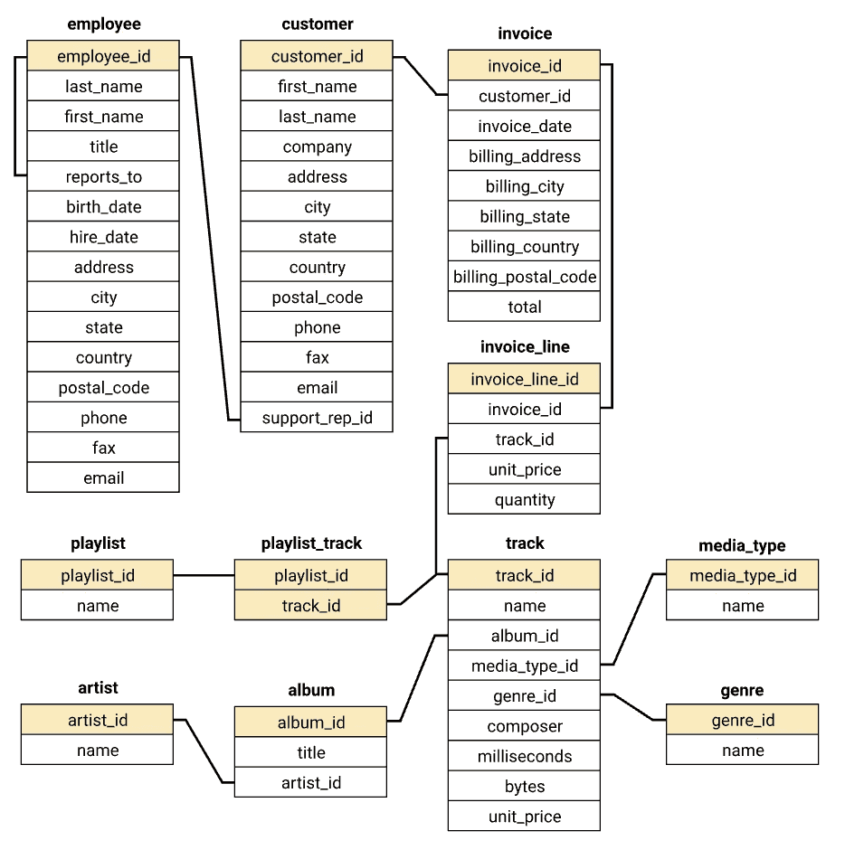
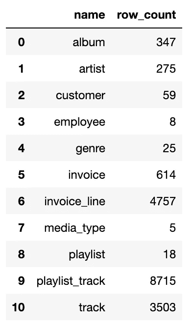

# 使用 SQL 和 Datapane 构建交互式 Python 仪表板

> 原文：<https://towardsdatascience.com/building-an-interactive-python-dashboard-using-sql-and-datapane-46bd92294fd3?source=collection_archive---------4----------------------->

## 使用开源工具构建商业智能应用原型

# 介绍

数据分析最重要的技能之一是与数据库交互。大多数组织将他们的业务关键数据存储在类似 Postgres 或 MySQL 的关系数据库中，你需要知道 T2 的结构化语言来访问或更新存储在那里的数据。

Stephen Dawson 在 [Unsplash](https://unsplash.com/s/photos/dashboard?utm_source=unsplash&utm_medium=referral&utm_content=creditCopyText) 上拍摄的照片

SQL 是一种令人难以置信的语言——它发明于 20 世纪 70 年代，大多数新的数据库项目(如 Redshift、Snowflake、CockroachDB)仍然选择它作为基础，因为它功能强大且相对简单(至少在开始时是这样)。虽然它擅长检索数据，但您通常需要像 Tableau 或 Looker 这样的企业商业智能平台来可视化结果。

在本文中，我将向您展示如何结合 SQL 和开源 Python 库来构建一个 web 上的交互式仪表盘——点击这里查看[实时版本](https://datapane.com/u/johnmicahreid/reports/sqlite-dashboard/)和 Github 上的[代码](https://github.com/johnmicahreid/datascienceexamples/blob/main/SQLite_dashboard.ipynb)。这是一项使用数据库快速构建应用程序原型的伟大技术。

# 数据集

我们将使用一个著名的开源数据集，名为 [Chinook](https://github.com/lerocha/chinook-database) ，它存储了一家小型音乐商店几年来的购买数据。这些数据作为一个 SQLite 数据库存储在一个文件中，所以我们可以直接从本地 Python 环境中查询它，而不需要访问凭证。

下面是显示数据库模式的快速表格:

图片由作者提供，灵感来自 [arjunchndr](https://github.com/arjunchndr/Analyzing-Chinook-Database-using-SQL-and-Python)

如果你来自熊猫，不熟悉数据库模式，这里有一些提示:

*   数据库被分割成单独的**表**，它们代表不同的逻辑对象。例如，所有客户都在客户数据库中。这与传统的熊猫数据框架不同，后者通常只有一张表。
*   每个表都有一组**字段、**定义表的属性，还有**行、**存储实际数据。这些就像 Excel 中的列和行一样。
*   表之间的关系由称为**外键的特殊字段表示。**例如，每首曲目都有一个 album_id，它链接到专辑表，这意味着每首曲目都是专辑的一部分。当我们查询数据库时，我们通常会根据外键将不同的表连接在一起。

# 连接到数据库

我们将从定义一些连接到数据库的帮助函数开始:

如您所见，我们将 SQL 查询写成字符串，然后在 Python 函数中执行它。像这样将两种不同的语言混合在一起有点尴尬，但是一旦你掌握了窍门，它会出奇地好！运行上面的代码会给出数据库中所有不同的表名以及每个表中的行数:

作者图片

# 构建仪表板

假设你刚开始在 Chinook 做数据科学家，你的老板想知道最畅销的曲目，这样他们就可以在网站上推广它们。要回答这个问题，我们需要编写如下查询:

我们首先选择希望在输出中看到的列。因为这些来自四个不同的表(track、album、artist、invoice_line)，所以我们需要根据外键关系连接这些表—检查模式，看看有什么可能。接下来，我们按曲目名称分组，按购买次数最多的顺序排序，只选择前 10 个结果。

运行查询给我们一个熊猫数据帧，然后我们将它包装在一个[数据表](https://docs.datapane.com/reports/blocks/tables-and-data#datatable)块中，并发布给[Datapane.com](http://datapane.com)。

这将生成一个交互式表格，用户可以对其进行过滤和排序。看起来吉米·亨德里克斯用十大曲目中的五首摇滚起来了！

# **更复杂的查询**

随着我们最近的成功，老板问了我们一个更复杂的问题——“谁是我们表现最好的销售员工，他们什么时候销售额最高？”

我们可以使用像 Plotly 这样的 Python 可视化库来构建更令人满意的交互式图表，而不是用表格来回答这个问题:

这个查询比前一个查询复杂得多:

*   我们使用 strftime 来截断时间戳，这样我们就可以按月分组。当我们绘制数据时，这使得数据看起来更好。
*   我们使用子查询(也称为公用表表达式)来计算中间表(customer_support_rep_sales)。然后，我们在最终查询中调用这个表。
*   有些操作既可以在 pandas 中完成，也可以在 SQL 中完成——例如，我们在 Pandas 中做了一个 groupby 来删除第二个图表中的“月”列。我更喜欢用 SQL 做最复杂的连接和分组，如果必要的话，只使用 Python 来格式化结果。

运行上面的代码会得到以下结果:

看起来月度表现相当不稳定，没有明显的季节性影响。简是销售业绩最好的人，领先史蒂夫约 20%。

# 完整仪表板

从现在开始，世界就是你的了。您可以编写超级复杂的 SQL 查询，并用任何 Python 库可视化它们。在仪表盘的完整版本中，我添加了一些额外的图表和可视化效果:

*   总客户、员工和销售曲目的汇总统计数据
*   按流派销售
*   按国家/地区列出的销售和客户
*   平均订单百分比差异与国家平均值
*   客户终身价值

你可以在 [Github](https://github.com/johnmicahreid/datascienceexamples) 上看到这个教程的完整代码。

# 最后

在本教程中，您已经看到了如何通过在 Python 中编写 SQL 语句、用 Plotly 绘制结果并与 Datapane 共享它们来构建交互式仪表板。

这是一个很好的方法，可以快速建立想法的原型，或者构建标准 BI 平台中没有的更复杂的可视化。