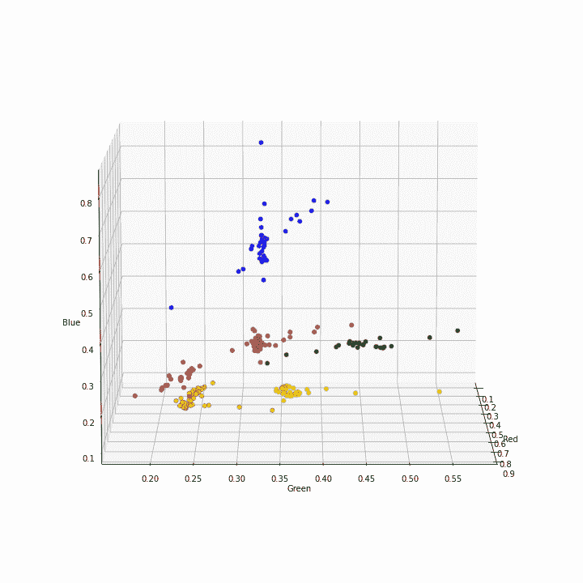
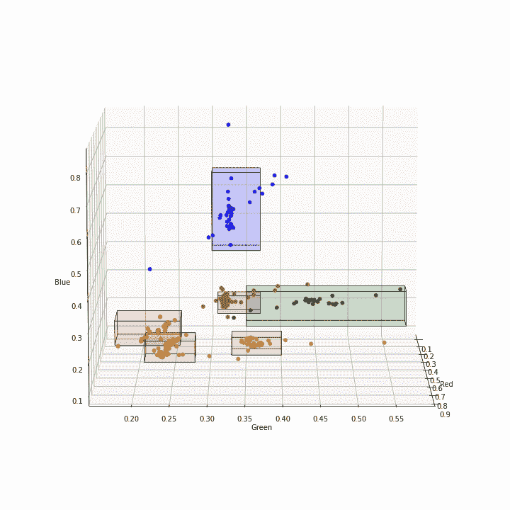
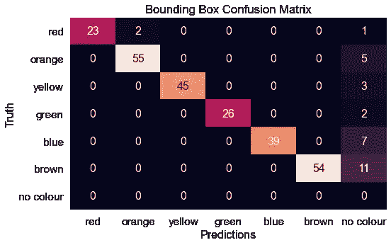
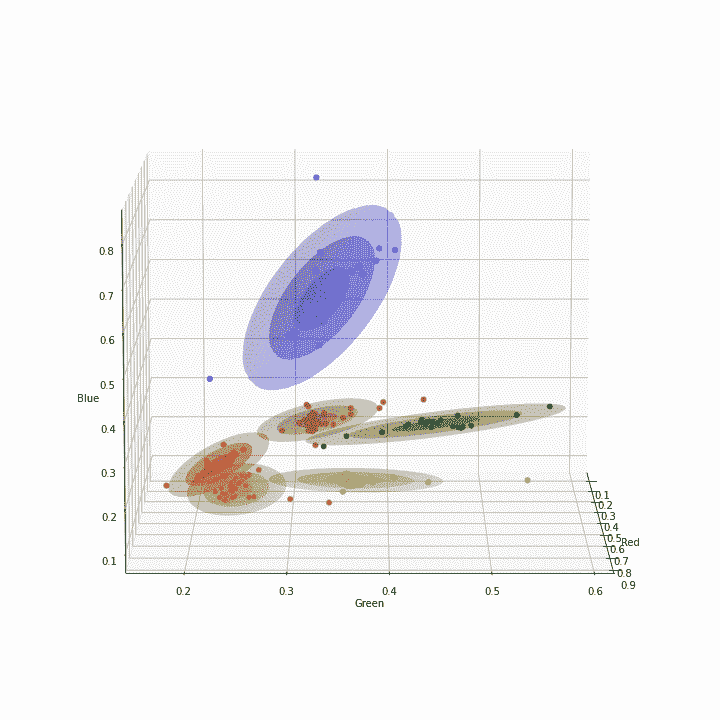
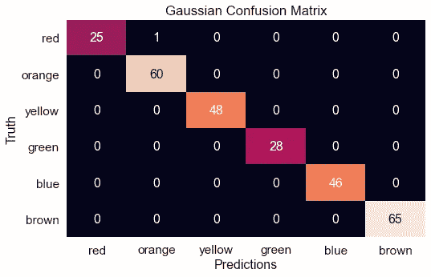

# 构建 M&M 颜色分类器

> 原文：<https://towardsdatascience.com/building-an-m-m-colour-classifier-19a78f28ee8a?source=collection_archive---------41----------------------->

我第三年的电子和电气工程项目之一是建造一台可以根据颜色对 M & Ms 进行分类的机器。最终版本可以每分钟分拣大约 47 颗糖果，并为我们的团队赢得了几瓶啤酒。

演示当天的色选机(视频由作者提供)

也许有一天我会写一篇文章详细介绍这个过程，但我今天想谈的是颜色分类；它最初是如何对甜食进行分类的，两年后，用我新发现的数据科学知识解决了这个问题。当我学习机器学习技术时，我一直将测试数据作为试验各种机器学习技术的试验场，所以这篇博客旨在记录我的学习过程。

M&M 彩色数据(图片由作者提供)

通过机器运行 M&Ms 收集数据，记下颜色传感器返回的红色、绿色和蓝色值，并记录糖果的颜色。确实是一个漫长而乏味的过程。分类过程完全是手动的；我检查了群集的位置，并设置了包围盒来分类落入其中的糖果。

使用边框分类(按作者分类的图像)

这对于一个电子项目来说已经足够了(也足够赢得啤酒了)，但是它伴随着一系列的问题。

首先，机器不知道如何处理异常值——它会摇晃糖果并重新扫描它们，如果不起作用，它会把它们扔进垃圾箱。也没有考虑分布的形状和方向。这成为一个问题，尤其是红色和橙色糖果，因为它们的边界框相交。如果一个糖果落在交叉区域，机器会摇晃并重新扫描，直到它落入专用的红色或橙色盒子中(红色盒子在本演示中获胜)。该机器还对糖果进行硬分类，这导致了许多红色/橙色混淆。让我们看看这种技术的混淆矩阵。

(图片由作者提供)

哦，看起来分类器甚至很难对很多糖果进行分类。也许我们可以用一种不同的技术来改进这一点。我们将通过直接估计六个高斯分布来解决这个问题。这很容易；我们只是计算每种颜色的均值和协方差矩阵。让我们来看看原始数据的分布情况。

模拟高斯分布(图片由作者提供)

我们可以通过获取给定糖果属于每个分布的可能性来评估该模型的表现。我们通过将其 RGB 值分成六个概率密度函数并根据最高似然性对其进行分类来做到这一点。让我们看看新的混淆矩阵。

(图片由作者提供)

好多了。由于每种甜味都位于每种高斯色的某个地方，因此它们都属于颜色类别之一。有了这个解决方案，我们在红色和橙色之间只有一个错误的分类！如果我们只想对超过一定置信度的糖果进行分类，也可以设置可能性阈值。

谢谢你给我读这个！我知道有潜在的过度拟合问题，因为我们的火车和测试集是相同的，每种颜色的糖果数量不统一，但这个问题似乎有点无关痛痒。虽然我确实计划使用这个 homeade 数据集来测试各种 ML 算法，但今天更多的是一个介绍，(并掌握平台)。

您可以在下面的 GitHub repo 中找到今天使用的所有代码:[https://github.com/LMurphy99/M-M-Colour-Sorter](https://github.com/LMurphy99/M-M-Colour-Sorter)