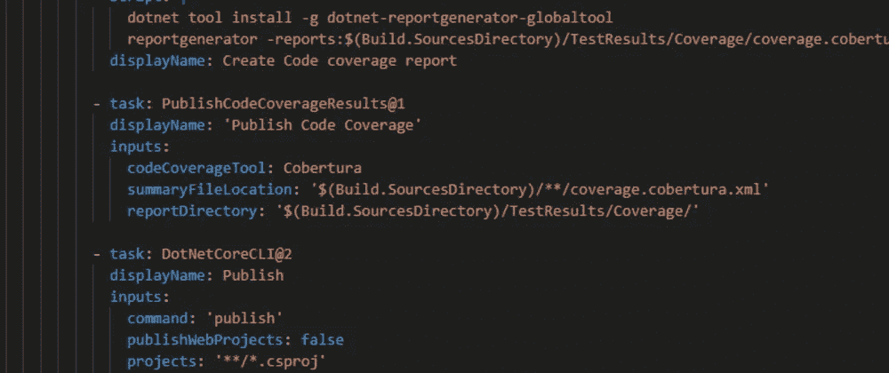
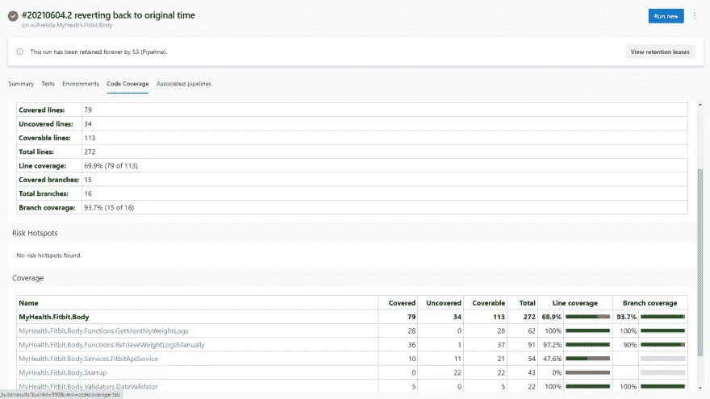
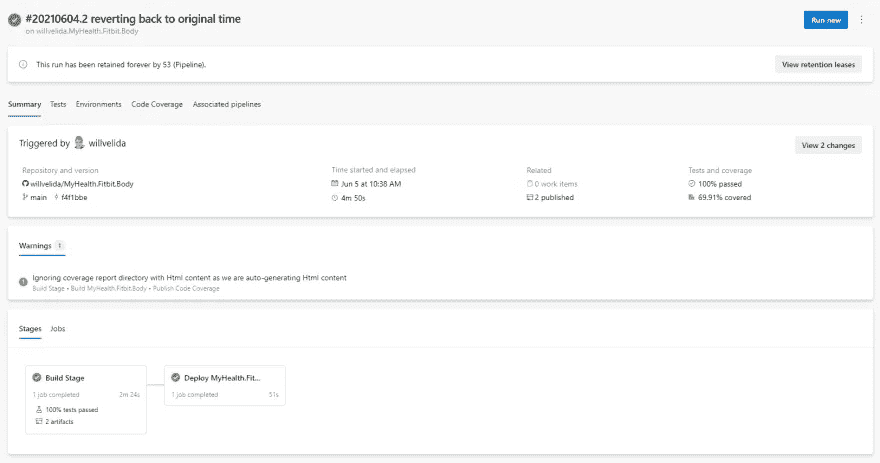

# 在 Azure DevOps 中使用多级管道构建和部署 C# Azure 函数

> 原文：<https://towardsdatascience.com/building-and-deploying-c-azure-functions-using-multi-stage-pipelines-in-azure-devops-993239e4d41c?source=collection_archive---------12----------------------->

## [实践教程](https://towardsdatascience.com/tagged/hands-on-tutorials)

## 使用 YAML 构建管道，我们可以在一个文件中定义整个构建和发布管道！



我们可以在一个 YAML 文件中定义我们的构建、测试和部署任务！

# 介绍

作为我个人发展的一部分，我创建了一个个人健康平台，它使用各种不同的微服务(使用 Azure 函数构建)，这些微服务从我的 Fitbit 帐户中提取数据，并将它们存储在 Azure Cosmos DB 数据库中。我还有其他的微服务，通过 Azure Service Bus 在不同的服务之间传递消息。

对于这个项目，我使用 Azure DevOps 来构建我的工件，运行我的单元测试，并将我的微服务部署到 Azure。DevOps 的伟大之处在于，我们可以在 YAML 管道中完成所有这些工作。

是的，我说 YAML。老实说，我不知道有什么大惊小怪的😂

在之前的一篇文章中，我谈到了我们如何使用 YAML 管道将 NuGet 包部署到 Azure 工件中的私有 feed。如果你还没看过那个帖子，可以看看下面！

[用 YAML 构建文件将 NuGet 包发布到一个私有 Azure 工件 feed 上](https://dev.to/willvelida/publishing-nuget-packages-to-a-private-azure-artifacts-feed-with-yaml-build-files-3bnb)

在本文中，我们将把注意力转向使用单个构建文件来构建和部署 C# Azure 函数。

# 我们将涵盖的内容

我们有相当多的内容要介绍，所以我将分解我的 YAML 文件，并按以下顺序讨论每个阶段:

*   触发构建👷‍♂️👷‍♀️
*   在管道中使用用户定义的变量👨‍🔬👩‍🔬
*   定义阶段💻
*   构建我们的项目🔨
*   运行我们的测试🧪
*   获得代码覆盖率🧾
*   生产构建工件🏠
*   使用密钥库中的秘密🔑
*   将我们的功能部署到 Azure ⚡
*   运行我们的构建管道🚀

# 触发构建👷‍♂️👷‍♀️

在我们的构建管道中，我们可以使用触发器来运行管道。我们可以使用不同类型的触发器，从当我们将代码推到一个定义的分支时触发构建，到基于 CRON 调度的[调度触发器。](https://docs.microsoft.com/en-us/azure/devops/pipelines/process/scheduled-triggers?tabs=yaml&view=azure-devops#branch-considerations-for-scheduled-triggers)

对于这个项目，我只是在每次推进到主分支时触发我的构建。为此，我在我的 YAML 文件中这样定义它:

```
trigger:
  - main
```

现在，如果我想正确地做到这一点，我们可以定义多个分支名称来触发构建，如下所示:

```
trigger:
  - feature/*
  - bugfix/*
```

这将在我们将代码推送到我们的功能或 bugfix 分支时触发构建。当我们在 DevOps 中提出 Pull 请求时，我们可以在 PR 上创建策略，只有在构建成功的情况下才有资格合并回我们的主分支。

这有助于我们增强信心，相信我们正在合并(和部署)的代码是高质量的，特别是如果我们将测试作为构建管道的一部分来运行的话。

要在您的分支策略上启用构建验证，请查看这个[文档](https://docs.microsoft.com/en-us/azure/devops/repos/git/branch-policies?view=azure-devops#build-validation)

# 在管道中使用用户定义的变量👨‍🔬👩‍🔬

我们可以在 YAML 文件中使用用户定义的变量，以便在整个管道中使用。这样做给了我们在管道的不同阶段和任务中重用公共值的好处，并且它允许我们使用版本控制来跟踪它们随时间的变化。

我们可以在 out 文件中用以下范围定义变量:

*   **在根层**，使它对我们管道中的所有工作都可用。
*   **在阶段级别**，使其可用于我们管道中的特定阶段。
*   **在作业级别**，使其可用于我们管道中的特定作业。

在我的例子中，我将在整个管道中重用这些变量，所以我在根级别定义它们。

```
variables:
  buildConfiguration: 'Release'
  vmImageName: 'vs2017-win2016'
  functionAppName: 'famyhealthfitbitbody'
  azureSubscription: '<azureSubscription-id-or-name>'
  workingDirectory: '$(System.DefaultWorkingDirectory)/MyHealth.Fitbit.Body'
  projectName: 'MyHealth.Fitbit.Body'
```

我们不仅仅局限于 YAML 管道中的用户定义变量！我们也可以使用系统和环境变量。要了解更多关于在 YAML 管道中定义变量的信息，请查看这篇[文章](https://docs.microsoft.com/en-us/azure/devops/pipelines/process/variables?view=azure-devops&tabs=yaml%2Cbatch)

# 定义阶段💻

在我们的 YAML 管道中，我们可以将我们的工作分成几个阶段。这些将我们的渠道分为逻辑…嗯，执行特定任务的阶段，例如“构建应用程序”、“部署到生产”。

在本例中，我只有一个阶段和部署阶段。即使我们没有定义，每个 YAML 管道都至少有一个阶段。正如我在文件中所做的那样，我们还可以根据前一个阶段是否成功来运行阶段，如下所示:

```
stages:
  - stage: Build
    displayName: Build Stage jobs:
      - job: Build
        displayName: Build MyHealth.Fitbit.Body
        pool:
          vmImage: $(vmImageName)
```

使用 YAML 管道，我们可以定义管道的多个阶段，并将其存储为代码。如果你想了解更多关于 YAML 管道中阶段的工作方式，请查阅[文档](https://docs.microsoft.com/en-us/azure/devops/pipelines/process/stages?view=azure-devops&tabs=yaml)。

# 构建我们的项目🔨

让我们把注意力转向我们的函数。首先，我想恢复和建立我的。csproj 文件。在我们 YAML 的管道里，我们可以唱歌。NET 核心任务来对我们的工件运行 dotnet 命令。为了构建我的项目，我将*恢复*并*构建*。

我正在使用 Azure 工件上托管的自定义 NuGet 提要，所以在恢复时我需要指向这个提要。

对于构建任务，我想构建一个发布包，所以在运行 *build* 命令时，我将传入 *buildConfiguration* 变量作为参数。

对于这两个命令，我将指向 all。我的存储库中的 csproj 文件。

```
steps:
- task: DotNetCoreCLI@2
  displayName: Restore
  inputs:
   command: 'restore'
   feedsToUse: 'select'
   vstsFeed: '<feed-id>'
   projects: '**/*.csproj'- task: DotNetCoreCLI@2
  displayName: Build
  inputs:
   command: 'build'
   projects: '**/*.csproj'
   arguments: --configuration $(buildConfiguration)
```

# 运行我们的测试🧪

除了我的函数代码，我还有一个单元测试项目。作为构建的一部分，我想运行我的单元测试，以确保我的更改没有破坏我们的任何测试，并且它们仍然通过。如果我的任何测试失败，我希望构建失败。

为了运行我们的测试，我们可以使用一个运行*测试*命令的. NET 核心任务，并将任务指向我们的单元测试。csproj 文件。

我还想用 Coverlet 收集代码覆盖率指标。床罩是。NET 工具，它允许我们获得行、分支和方法覆盖的单元测试覆盖。在我们的 arguments 参数中，我告诉我的任务运行 Coverlet 来获取代码覆盖率，然后将测试结果发布到我的构建代理上的*/TestResults/Coverage 文件夹中:

```
- task: DotNetCoreCLI@2
  displayName: Run Unit Tests
  inputs:
   command: 'test'
   projects: '**/*UnitTests/*.csproj'
   arguments: '--configuration $(buildConfiguration) /p:CollectCoverage=true /p:CoverletOutputFormat=cobertura /p:CoverletOutput=$(Build.SourcesDirectory)/TestResults/Coverage/'
   publishTestResults: true
```

# 获得代码覆盖率🧾

一旦我们生成了覆盖报告，我们就可以发布它来查看结果。我有两个任务要完成。

首先，我使用 bash 脚本任务将报告生成器安装到构建代理上。安装完成后，我将在代理上的 TestResults/Coverage 文件夹中创建 xml 报告。我们还可以指定想要生成的报告类型，但是对于本教程，我只是生成一个内嵌的 HTML 报告。

如果您想为此使用一个任务，而不是运行一个内联脚本，您可以尝试将下面的[任务](https://marketplace.visualstudio.com/items?itemName=Palmmedia.reportgenerator)安装到您的 DevOps 组织中。

一旦我们生成了报告，我还有第二个任务，发布代码覆盖报告。

```
- script: |
    dotnet tool install -g dotnet-reportgenerator-globaltool
    reportgenerator -reports:$(Build.SourcesDirectory)/TestResults/Coverage/coverage.cobertura.xml -targetdir:$(Build.SourcesDirectory)/CodeCoverage -reporttypes:HtmlInline_AzurePipelines;Cobertura
    displayName: Create Code coverage report- task: PublishCodeCoverageResults@1
  displayName: 'Publish Code Coverage'
  inputs:
    codeCoverageTool: Cobertura
    summaryFileLocation: '$(Build.SourcesDirectory)/**/coverage.cobertura.xml'
    reportDirectory: '$(Build.SourcesDirectory)/TestResults/Coverage/'
```

当我们的构建完成时，我们可以在 DevOps 中查看我们的代码覆盖率报告！它应该看起来像这样:



我们可以生成一个测试报告，为我们提供行、分支和方法级别的覆盖细节

# 生产构建工件🏠

我们已经构建了我们的项目，并且通过了测试！我们现在需要生产一个构建工件，我们将把它作为我们的功能来部署。

从发布开始，这里我们需要的是一个. NET 核心任务，它运行 *publish* 命令，将我们的项目发布为“发布”包，压缩它，然后将其发布到我们的构建代理上的工件暂存目录。

然后，我们使用一个[发布构建工件任务](https://docs.microsoft.com/en-us/azure/devops/pipelines/tasks/utility/publish-build-artifacts?view=azure-devops)将一个名为‘drop’的工件发布到我们的暂存目录中。

```
- task: DotNetCoreCLI@2
  displayName: Publish
  inputs:
    command: 'publish'
    publishWebProjects: false
    projects: '**/*.csproj'
    arguments: '--configuration $(buildConfiguration) --output $(build.artifactstagingdirectory)'
    zipAfterPublish: True- task: PublishBuildArtifacts@1
  displayName: 'Publish Artifact'
  inputs:
    PathtoPublish: '$(build.artifactstagingdirectory)'
```

在我们开始部署之前，简单回顾一下。在构建阶段，我们有:

*   建造了我们的。净项目
*   运行我们的单元测试以确保我们的构建是一个高质量的构建
*   生成并发布代码测试覆盖报告。
*   发布一个构建工件以部署到 Azure。

完成后，我们现在准备进入部署阶段！

# 展开我们的功能阶段

对于我们的部署阶段，我们需要在 YAML 文件中创建一个新的阶段。

在这种情况下，我已经向我们的 Stage YAML 块添加了一个*条件*和*依赖*属性。在 YAML 文件中，我说“部署”阶段**依赖于**我们的“构建”阶段，并且“部署”阶段将仅在“构建”阶段成功的条件下运行。

```
- stage: Deploy
    displayName: 'Deploy MyHealth.Fitbit.Body'
    dependsOn: Build
    condition: succeeded() jobs:
      - deployment: Deploy
        displayName: Deploy MyHealth.Fitbit.Body
        environment: Production
        pool:
          vmImage: $(vmImageName)
```

当我们在一个管道中使用多个阶段时，它们将按照我们在 YAML 文件中定义的顺序运行。我们可以使用 *dependsOn* 参数向我们的阶段添加依赖关系。

我们可以通过指定哪个阶段的条件来控制该阶段的运行。在我的例子中，我声明“部署”阶段只有在“构建”阶段成功运行的情况下才会运行。

要了解更多关于 YAML 管道条件的工作原理，请查阅以下[文档](https://docs.microsoft.com/en-us/azure/devops/pipelines/process/stages?view=azure-devops&tabs=yaml#conditions)。

# 使用密钥库中的秘密🔑

在我的函数中，我执行各种任务，比如向服务总线队列和主题发送消息，使用访问令牌调用 API 等。等等。

为了进行这些操作，我需要使用我存储在 Azure Key Vault 中的连接字符串和秘密。因为这些是秘密，我不想暴露它们，所以我需要在我的管道中使用 Azure Key Vault 任务。

为此，我可以使用 [Azure Key Vault 任务](https://docs.microsoft.com/en-us/azure/devops/pipelines/tasks/deploy/azure-key-vault?view=azure-devops)来下载我需要的秘密。

作为这项任务的先决条件，我需要创建一个链接到我的 Azure 订阅的 [Azure 资源管理器服务连接](https://docs.microsoft.com/en-us/azure/devops/pipelines/library/connect-to-azure?view=azure-devops)，并且我需要一个包含我的秘密的密钥库。

一旦我有了这个设置，我就可以在我的管道中使用下面的代码片段:

```
steps:
  - task: AzureKeyVault@1
    inputs:
      azureSubscription: '$(azureSubscription)'
      KeyVaultName: '<key-vault-name>'
      SecretsFilter: '*'
      RunAsPreJob: false
```

在这里，我们用我们的秘密定义包含我们的密钥库的订阅，并且我们在我们的密钥库中检索所有的秘密。我们可以过滤掉这些内容，使用逗号分隔的我们想要下载的秘密名称列表，但是现在我只是下载所有内容。

# 将我们的功能部署到 Azure ⚡

我们终于准备好部署我们的功能了！⚡

为此，我将使用一个 [Azure 应用服务部署任务](https://docs.microsoft.com/en-us/azure/devops/pipelines/tasks/deploy/azure-rm-web-app-deployment?view=azure-devops)

我们可以使用这个任务来部署各种不同的应用服务类型，但是在我的 YAML 代码片段中，我将指定 *functionApp* 作为我们的类型。

作为这项任务先决条件，您需要一个应用服务实例来部署您的代码。

我还将传递我们之前构建的包作为我们的*包*，使用 *$functionAppName* 变量作为我们函数的名称，然后为我们的应用程序设置传入键值。我可以传入我的函数需要的秘密，因为我们在密钥库任务中下载了它们。

```
- task: AzureRmWebAppDeployment@4
  displayName: 'Deploy Azure Function'
  inputs:
    azureSubscription: '$(azureSubscription)'
    appType: functionApp
    WebAppName: $(functionAppName)                   
    package: '$(Pipeline.Workspace)/drop/MyHealth.Fitbit.Body.zip'
    appSettings: '-FUNCTIONS_WORKER_RUNTIME "dotnet" -FUNCTIONS_EXTENSION_VERSION "~3" -KeyVaultName "<key-vault-name>" -AccessTokenName "<secret-name>" -ServiceBusConnectionString "$(<secret-value>)" -APPINSIGHTS_INSTRUMENTATIONKEY "<some-key>" -ExceptionQueue "myhealthexceptionqueue" -BodyTopic "myhealthbodytopic" -WEBSITE_TIME_ZONE "New Zealand Standard Time"'
    enableCustomDeployment: true
    RemoveAdditionalFilesFlag: true
```

# 我们完整的 YAML 档案

在我们结束之前，这里是我的完整的 YAML 建设管道:

```
trigger:
  - mainvariables:
  buildConfiguration: 'Release'
  vmImageName: 'vs2017-win2016'
  functionAppName: 'famyhealthfitbitbody'
  azureSubscription: '<azureSubscription-id-or-name>'
  workingDirectory: '$(System.DefaultWorkingDirectory)/MyHealth.Fitbit.Body'
  projectName: 'MyHealth.Fitbit.Body'stages:
  - stage: Build
    displayName: Build Stage jobs:
      - job: Build
        displayName: Build MyHealth.Fitbit.Body
        pool:
          vmImage: $(vmImageName) steps:
          - task: DotNetCoreCLI@2
            displayName: Restore
            inputs:
              command: 'restore'
              feedsToUse: 'select'
              vstsFeed: '<artifact-feed-id>'
              projects: '**/*.csproj' - task: DotNetCoreCLI@2
            displayName: Build
            inputs:
              command: 'build'
              projects: '**/*.csproj'
              arguments: --configuration $(buildConfiguration) - task: DotNetCoreCLI@2
            displayName: Run Unit Tests
            inputs:
              command: 'test'
              projects: '**/*UnitTests/*.csproj'
              arguments: '--configuration $(buildConfiguration) /p:CollectCoverage=true /p:CoverletOutputFormat=cobertura /p:CoverletOutput=$(Build.SourcesDirectory)/TestResults/Coverage/'
              publishTestResults: true - script: |
              dotnet tool install -g dotnet-reportgenerator-globaltool
              reportgenerator -reports:$(Build.SourcesDirectory)/TestResults/Coverage/coverage.cobertura.xml -targetdir:$(Build.SourcesDirectory)/CodeCoverage -reporttypes:HtmlInline_AzurePipelines;Cobertura
            displayName: Create Code coverage report - task: PublishCodeCoverageResults@1
            displayName: 'Publish Code Coverage'
            inputs:
              codeCoverageTool: Cobertura
              summaryFileLocation: '$(Build.SourcesDirectory)/**/coverage.cobertura.xml'
              reportDirectory: '$(Build.SourcesDirectory)/TestResults/Coverage/' - task: DotNetCoreCLI@2
            displayName: Publish
            inputs:
              command: 'publish'
              publishWebProjects: false
              projects: '**/*.csproj'
              arguments: '--configuration $(buildConfiguration) --output $(build.artifactstagingdirectory)'
              zipAfterPublish: True - task: PublishBuildArtifacts@1
            displayName: 'Publish Artifact'
            inputs:
              PathtoPublish: '$(build.artifactstagingdirectory)' - stage: Deploy
    displayName: 'Deploy MyHealth.Fitbit.Body'
    dependsOn: Build
    condition: succeeded() jobs:
      - deployment: Deploy
        displayName: Deploy MyHealth.Fitbit.Body
        environment: Production
        pool:
          vmImage: $(vmImageName) strategy:
          runOnce:
            deploy: steps:
                - task: AzureKeyVault@1
                  inputs:
                    azureSubscription: '$(azureSubscription)'
                    KeyVaultName: '<key-vault-name>'
                    SecretsFilter: '*'
                    RunAsPreJob: false - task: AzureRmWebAppDeployment@4
                  displayName: 'Deploy Azure Function'
                  inputs:
                    azureSubscription: '$(azureSubscription)'
                    appType: functionApp
                    WebAppName: $(functionAppName)                   
                    package: '$(Pipeline.Workspace)/drop/MyHealth.Fitbit.Body.zip'
                    appSettings: '-FUNCTIONS_WORKER_RUNTIME "dotnet" -FUNCTIONS_EXTENSION_VERSION "~3" -KeyVaultName "<key-vault-name>" -AccessTokenName "<secret-name>" -ServiceBusConnectionString "$(<secret-value>)" -APPINSIGHTS_INSTRUMENTATIONKEY "<some-key>" -ExceptionQueue "myhealthexceptionqueue" -BodyTopic "myhealthbodytopic" -WEBSITE_TIME_ZONE "New Zealand Standard Time"'
                    enableCustomDeployment: true
                    RemoveAdditionalFilesFlag: true
```

# 运行我们的构建管道🚀

我们已经在 YAML 成功地创建了一个构建管道，每次我们推进到我们的主分支时都会触发这个管道。我们可以在 Azure DevOps 中查看我们的构建状态，如下所示:



我们可以在 DevOps 中查看我们构建的摘要，如果需要，还可以运行特定的阶段。

正如您在图片底部看到的，我们可以看到管道中每个阶段的结果。如果一个特定的阶段失败了，我们可以用它来重新运行一个特定的阶段，而不是不得不将我们的代码再次推送到 *main* 。

# 包扎

多阶段构建管道非常适合在同一个文件中定义我们的构建和发布过程。通过使用源代码控制，我们可以跟踪构建过程随时间的变化。我们还可以做一些有用的事情，比如生成和发布代码覆盖率报告，从 key vault 下载秘密，以及在一个文件中部署应用程序！

希望这篇文章对你有用！一如既往，如果你有任何问题，欢迎在下面评论或在 [Twitter](https://twitter.com/willvelida) 上问我！

编码快乐！💻👨‍💻👩‍💻