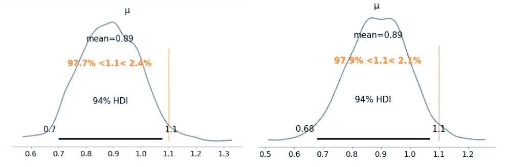
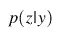
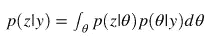
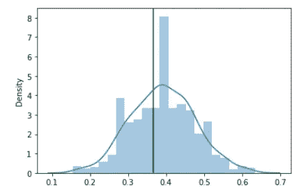
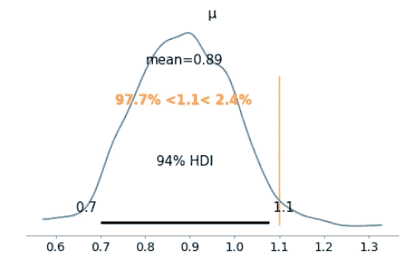
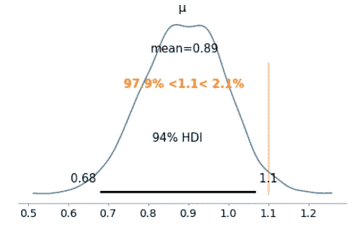

# 构建和评估您的贝叶斯统计模型

> 原文：<https://towardsdatascience.com/building-and-evaluating-your-bayesian-statistical-model-3ab703fc4ea8?source=collection_archive---------21----------------------->

## 第 2 部分，共 5 部分:关于如何执行贝叶斯预测并评估其性能的实践编程练习。

即使对于非数据科学家来说，贝叶斯统计这个术语也很流行。你可能在大学期间学过必修课，但没有意识到贝叶斯统计有多重要。事实上，贝叶斯统计不仅仅是一种特定的方法甚至是一类方法；这是一种完全不同的统计分析范式。



作者图片

# 为什么是贝叶斯统计？

贝叶斯统计为您提供了更新您对新数据证据的信念的工具，这是一个在许多现实世界场景中常见的概念，例如用于跟踪流行病、预测经济趋势或预测气候变化。它们也是许多更著名的统计模型的支柱，如高斯过程。

[](/introduction-to-gaussian-process-programming-in-plain-english-8dd7a94cb18d) [## 用简单的英语介绍高斯过程编程

towardsdatascience.com](/introduction-to-gaussian-process-programming-in-plain-english-8dd7a94cb18d) 

更重要的是，学习贝叶斯统计的原则对于作为数据科学家的您来说是一笔宝贵的财富，因为它为您提供了一个全新的视角来解决现实世界数据的动态来源的新问题。

**注意:**这是**的第二篇**文章，是涵盖贝叶斯统计编程主题的 5 篇系列文章中的第二篇。

1.  **的第一篇**帖子涵盖了贝叶斯统计的基本理论以及如何用 Python 实现一个简单的贝叶斯统计。

[](/bayesian-statistical-programming-an-introduction-4ca3e2ddae76) [## 贝叶斯统计程序设计:导论

towardsdatascience.com](/bayesian-statistical-programming-an-introduction-4ca3e2ddae76) 

2.*这个*将向你介绍贝叶斯推理以及如何执行基本的模型评估。

3.**第三**部分将涵盖一种特殊类型的贝叶斯算法，称为蒙特卡罗马尔可夫链(MCMC)。

[](/introduction-to-markov-chain-programming-8ddbe0ac1c84) [## 马尔可夫链编程导论

towardsdatascience.com](/introduction-to-markov-chain-programming-8ddbe0ac1c84) 

4.第四部分将基于之前的文章构建一个更复杂的贝叶斯模型。

5.**第五**部分将向您介绍贝叶斯模型检查和评估的高级概念。

# 目录:

1.  概述
2.  推理和预测
3.  模型评估
4.  敏感性分析

事不宜迟，让我们开始介绍贝叶斯统计编程帖子。

# 概述

在第一篇文章[这里](/bayesian-statistical-programming-an-introduction-4ca3e2ddae76)，我已经讨论了贝叶斯统计的基本原理，关键术语，以及如何使用 PyMC3 实现一个简单的模型。我们使用氡浓度(有毒气体)的例子来说明贝叶斯编程在现实世界中是如何工作的。

我们将从我们停止的地方让你跟上速度。所以，如果你想更详细地遵循这些步骤，请在继续下一步之前参考我的第一篇文章。

1.  安装依赖项(建议使用 conda)

```
conda install -c conda-forge pymc3
```

2.下载我们的数据

```
!wget "https://raw.githubusercontent.com/fonnesbeck/mcmc_pydata_london_2019/master/data/radon.csv"
```

3.得到感兴趣的列( *log_radon*

```
import pandas as pdradon = pd.read_csv('./radon.csv', index_col=0)
anoka_radon = radon.query('county=="ANOKA"').log_radon
```

4.建立一个简单的贝叶斯模型

```
from pymc3 import Model, Normal, Uniformwith Model() as radon_model:
    μ = Normal(’μ’, mu=0, sd=10)
    σ = Uniform(’σ’, 0, 10)
```

5.编译和训练模型

```
with radon_model:
    dist = Normal('dist', mu=μ, sd=σ, observed=anoka_radon)
```

6.从训练好的贝叶斯模型中抽取一些随机样本

```
from pymc3 import sample

with radon_model:
    samples = sample(1000, tune=1000, cores=2, random_seed=12)
```

既然你已经赶上了这些步骤，让我们继续这篇文章的主题:贝叶斯推理和评估

# 推理和预测

鉴于我们训练有素的贝叶斯模型，我们可以尝试作出预测或推断。假设我们有兴趣找出美国任何家庭暴露于对数氡浓度高于 1.1(即 p(对数氡> 1.1))。

我们可以执行一个**后验概率预测**。还记得我们之前帖子里的这个人吗？


后验分布

但是，我们不是从我们的可观测数据 *y* 中估计一个参数θ(读作:theta)，而是推断对数氡浓度( *z* ) 如下*。*



后验预测分布

而类似于贝叶斯公式，我们可以通过下面的公式求出给定所有观测值的 *z* 、 *y、*的概率。



后验预测分布公式

对于所有可能的θ值，后验预测公式将对给定θ 参数的 *z* 的概率乘以给定所有观测值的所有θ的概率 *y* 进行求和

使用 PyMC3，我们首先对后验分布进行 1000 次采样，以获得 1000 个 *z* (log-radon)值。

```
from pymc3 import sample_posterior_predictive

with radon_model:
    pp_samples = sample_posterior_predictive(samples, 1000)
```

然后，我们可以找到平均值来检索概率。

```
radon_thres = 1.1(pp_samples['dist'] > radon_thres).mean()
>>> 0.39105769230769233
```

> 阿诺卡的美国家庭氡对数浓度高于 1.1 的概率约为 39.11%。

# 模型评估

但是我们如何知道我们的贝叶斯模型是否有任何好处呢？

一种基本的评估方法是将我们的预测与可观测的数据进行比较。您可以从大量的统计检验中进行选择，如 t 检验或 f 检验，来比较两个“群体”之间的相似性。

对于我们目前的用例，让我们使用一个图形可视化来比较我们的预测与经验值之间的差异。

首先，让我们找到一组超过我们的对数氡浓度阈值 1.1 的样本:

```
import seaborn as sns
import matplotlib.pyplot as pltp_thresh = [(sample>1.1).mean() for sample in pp_samples['dist']]
```

然后我们用经验值绘制这些样本的分布。

```
ax = sns.distplot(p_thresh)
plt.vlines((anoka_radon>1.1).mean(), *ax.set_ylim(), color='g')
```



预测值与经验值的分布(图片由作者提供)

绿色垂直线说明了 ANOKA 一户家庭的对数氡暴露浓度高于 1.1 的平均经验概率，而直方图代表了来自训练贝叶斯模型的采样分布。

该图表明，我们最初的假设并不坏，但仍有改进的余地，以使分布收敛到真实的经验值。可以通过以下方式进行进一步微调:

1.  改变我们对参数分布的假设，
2.  为我们的贝叶斯模型尝试不同的初始值

# 先验灵敏度

在建立模型时，检查我们先前选择的先验的敏感性也很重要。

这可以通过构建相同的模型，但如下改变先验分布来实现。

```
from pymc3 import Flat, HalfCauchy, plot_posterior

with Model() as sensitivity_check:

    μ = Flat('μ')
    σ = HalfCauchy('σ', 5)

    dist = Normal('dist', mu=μ, sd=σ, observed=anoka_radon)

    sensitivity_samples = sample(1000, cores=2)
```

然后绘制分布图。

```
# Sensitivity evaluation distribution
plot_posterior(sensitivity_samples, var_names=['μ'], ref_val=1.1)
```



通过改变我们的初始先验的后验分布

并将它与原件进行比较。

```
# Original distribution
plot_posterior(samples, var_names=['μ'], ref_val=1.1)
```



初始后验分布(图片由作者提供)

比较这两个图，我们的先验似乎对变异不敏感(即相当稳健)，强调我们离实现目标又近了一步！剩下唯一要做的就是通过不断试验不同的先验或初始值来进一步调整我们的模型。

# 离别的思绪

我们已经讨论了如何进行推理和评估我们的贝叶斯模型。在下一篇文章中，我将介绍管理贝叶斯统计编程的底层过程，比如帮助我们执行采样的蒙特卡罗马尔可夫链(MCMC)算法。敬请期待！

***做订阅我的邮件简讯:***[*【https://tinyurl.com/2npw2fnz】*](https://tinyurl.com/2npw2fnz)****在这里我定期用通俗易懂的语言和漂亮的可视化总结 AI 研究论文。****