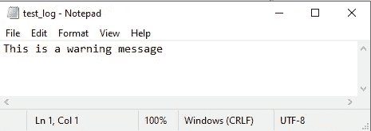
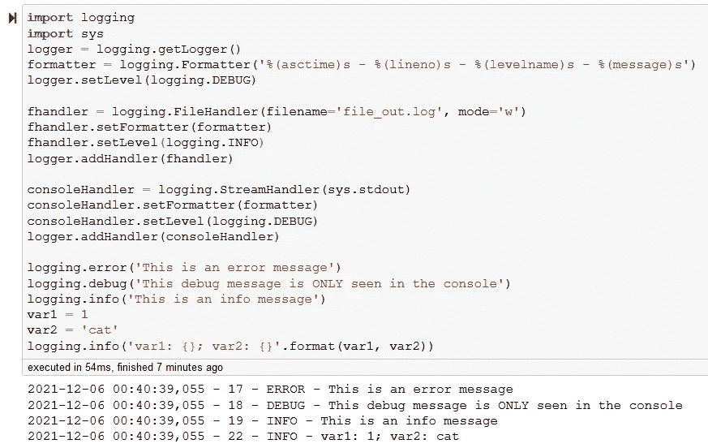
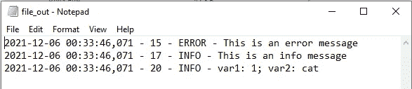

# 在 Jupyter 笔记本中构建和导出 Python 日志

> 原文：<https://towardsdatascience.com/building-and-exporting-python-logs-in-jupyter-notebooks-87b6d7a86c4?source=collection_archive---------5----------------------->

## 捕获和导出日志文件的操作指南


Radek Grzybowski 在 [Unsplash](https://unsplash.com?utm_source=medium&utm_medium=referral) 上的照片

日志记录是 Python 中监控代码健康状况的一项重要功能。在某种程度上，日志文件与调试器有很多相同的概念。我们可以使用日志在代码中放置面包屑，以帮助确定内部发生了什么。这在我们的脚本由于未知原因崩溃时特别有用——如果我们留下足够多的面包屑，我们可以跟踪代码所走的路径，并且我们可以将注意力集中在那里。通常，当我们第一次测试代码时，python 调试器是有用的，但是在某些时候，在我们测试了所有可能的输入情况之前，我们认为我们的代码是“工作的”。如果我们在后台使用日志记录，如果路上有什么东西坏了，我们会很清楚哪里出了问题。*特别是，如果我们正确使用日志记录，我们可以看到破坏我们“工作”代码的确切的独特情况。*

当其他人使用我们的代码时，日志变得更加重要。当一个脚本在另一个用户的机器上失败时，复制错误可能是一个挑战，但是日志可以引导我们沿着脚本在用户的系统上失败之前所遵循的路径前进。这在创建管理所有“边缘”情况的代码时特别有用(你认为为什么软件在安装时总是请求允许发送崩溃数据？！)

最后，日志还有另一个很棒的用途——作为代码开发周期的跟踪器。想象一下，在向其他用户发布的第一周内，您的 python 脚本生成了 200 个错误、500 个警告和各种其他日志标记。随着代码的细化和通过迭代变得更加健壮，我们可以看到不同问题的发生率随着时间的推移而降低。这让我们知道我们在开发周期中的位置，以及通过首先处理最常见的错误来集中我们未来的努力。让我们开始吧:

# Python 日志记录基础

从命令行运行脚本时登录 Python 已经有了很好的记录，但是在深入研究我们可以使用的技巧和工具之前，我们需要从基础开始。首先，当我们向日志记录器发送消息时，我们选择信息属于哪个类别。这些问题按照严重性从“未设置”到“严重”的递增顺序进行组织，如下所示。这个层次结构的强大之处在于，当我们输出日志数据时，我们可以选择报告哪个**级别**。在这种情况下，记录器将捕获该级别及更高级别的所有内容。例如，如果我们选择一个警告级别，那么记录器将捕获所有警告、错误和关键消息。关于何时使用每个级别的标准的完整文档可在[这里](https://docs.python.org/3/howto/logging.html#logging-basic-tutorial)找到。


作者照片—记录级别

要在 Python 中构建这一点，并将日志记录消息发送到控制台，看起来像这样:

```
import logging#create a logger
logger = logging.getLogger()# to control the reporting level
logger.setLevel(logging.WARNING)#send two messages to the logger
logging.info("This is an INFO message")
logging.warning("This is a WARNING message")
```

由于级别设置为`logging.WARNING`，我们将看不到`info`级别的消息。设置级别很有用，因为在第一次编码时，我们会在`DEBUG`和`INFO`中发送面包屑，以确保我们做得正确。然后，当我们认为不再需要面包屑时，我们可以将它们从日志中删除，并专注于警告、错误和关键的功能问题。这可以与调试器协同工作。

为了输出到一个实际的日志文件而不是命令行，我们需要使用`basicConfig()`来设置日志记录器，在这里我们也可以设置级别，就像这样:

```
import logging
logging.basicConfig(filename='my_first_log.log', level=logging.INFO)
```

**遗憾的是，这种方法在 Jupyter 笔记本上操作时行不通。**一点都不。问题在于，在启动时，Jupyter 笔记本启动一个已经启动日志记录的 IPython 会话。结果，`logging.basicConfig()`就不行了。

# 在 Jupyter 笔记本中登录

日志在 Jupyter 笔记本中也特别有用，因为调试器可能会有一些严重的[功能问题](https://stackoverflow.com/questions/46495269/debuggers-not-acting-properly-on-jupyter-notebooks)。通过使用 JupyterLab 中的增强调试器可以避免这些调试器问题，但是如果您受限于 Jupyter 笔记本，那么日志记录可以为您提供处理更广泛的调试任务所需的灵活性。

## 将日志保存到文件

要将日志消息导出到 Jupyter 中的外部日志文件，我们需要设置一个 FileHandler 并将其附加到日志记录器:

```
import logging
logger = logging.getLogger()
fhandler = logging.FileHandler(filename='test_log.log', mode='a')
logger.addHandler(fhandler)
logging.warning('This is a warning message')
```

请务必注意 FileHandler 设置中的模式选择:

*   **‘a’**—追加。所有新消息都被附加在日志文件的末尾
*   **w'** —写。每次运行 python 脚本时，日志文件都会被清除并重新开始

如果一切顺利，我们应该在 Jupyter 笔记本的同一目录下有一个新的“test_log.log”文件。



## 格式化输出

我们还可以改进和定制我们的日志输出，以包含比我们在日志消息中指定的文本更多的内容。通过使用`logging.Formatter()`,我们可以添加许多字段来帮助我们理解更多关于消息的信息，比如消息是什么时候生成的，是由代码中的哪一行生成的。以下是我最喜欢的一些，完整的列表[在这里](https://docs.python.org/3/library/logging.html):

*   `%(asctime)s` —条目的日期/时间
*   `%(levelname)s` —日志记录级别(因此您不必在错误中详细说明)
*   `%(name)s` —所用记录器的名称(如生成此消息的文件)
*   `%(lineno)s` —生成消息的行号
*   `%(message)s` —当然！消息本身！

为了将我们的格式附加到记录器，我们将它添加到文件处理程序，如下所示:

```
formatter = logging.Formatter('%(asctime)s - %(name)s - %(lineno)s - %(levelname)s - %(message)s')
fhandler.setFormatter(formatter)
```

## 将格式化输出导出到控制台

我们还可以添加另一个处理程序来在控制台中显示这种格式。这里，我们使用`sys.stdout`通过`StreamHandler()`访问控制台，并将其连接到记录器:

```
import sys
consoleHandler = logging.StreamHandler(sys.stdout)
consoleHandler.setFormatter(formatter)
logger.addHandler(consoleHandler)
```

更棒的是。我们也可以独立调节每个处理器输出的电平。例如，我们可以将我们的控制台设置为向下报告调试级别，如下所示:`consoleHandler.setLevel(logging.DEBUG)`

*重要提示* *—主记录器级别* ***必须等于或低于赋予处理者的*** *级别，否则不起作用，因为高级记录器级别设置了发言权。*

## 可变值

我们还可以向我们的日志记录器传递静态消息之外的信息。通常，如果我们的代码返回警告或错误，我们会想知道是什么用户值触发了事件。幸运的是，我们可以使用`.format()`简单地将变量值解析成我们的消息，就像普通字符串一样。

```
var1 = 1
var2 = 'cat'
logging.debug('var1: {}; var2: {}'.format(var1, var2))
```

## 把所有的放在一起

根据目前所学，我们可以在 Jupyter 笔记本中启动一个新的记录器，调整报告级别，调整格式，输出到文件，输出到控制台，并调整每个输出的级别。下面是它实际运行时的简单快照，控制台位于 DEBUG，导出文件位于 INFO:



登录 Jupyter 笔记本

下面是我们在 file_out.log 文件中看到的内容:



输出日志文件，仅显示信息及以上内容

虽然能够将日志导出到文件中很好，但有时我们想变得懒惰一点，不要切换到文本编辑器来读取我们的输出文件。要在 Jupyter 笔记本中查看日志文件，我们可以像这样读取并打印内容:

```
with open("file_out.log") as log:
    print(log.read())
```

# 提示和技巧:

因为当我们启动一个笔记本时，logger 是作为 IPython 的一部分自动设置的，所以某些配置与在控制台中运行的 Python 文件的某些功能相冲突。其中一个特别之处是使用了`getLogger(__name__)`功能。当我们的 python 脚本变得更加复杂时，我们通常会将一些函数分解成单独的脚本文件，这些文件稍后会作为单独的模块导入。我们可以将所有日志消息传递到一个公共日志文件，由`%(name)s`格式化程序告诉我们是哪个 python 脚本生成了消息。甚至有一个关于如何从[控制台](https://docs.python.org/3/howto/logging-cookbook.html)运行 python 来做这件事的教程。不幸的是，Jupyter 笔记本不能立即兼容这一功能。我还没有找到解决方案…但是现在我知道使用`__name__`将会阻止任何东西被打印到日志文件或者格式化的控制台处理程序中。

随着您对 python 日志的深入研究，您会发现我们甚至可以通过电子邮件导出日志文件。这是非常有利的——在我们的代码部署后，我们可以从远处监控它的健康状况。更好的是，添加`SMTPHandler`只需要几行代码。示例代码可以在[这里](https://www.python4networkengineers.com/posts/python-intermediate/log_to_console_file_and_smtp_with_logging_module/)找到。

此外，由于能够为每个处理程序设置级别，我们可以同时创建多个日志输出来报告不同的级别。例如，我们可能需要一个日志文件来捕获调试级别的每个事件，但是我们也可能需要一个经过过滤的日志文件来只报告警告及以上级别的事件——这为我们提供了一个简单的文件来监视主要问题，以及一个单独的日志文件来记录所有事件，以备我们深入研究时使用。

# 结论

日志为维护代码的质量和功能提供了一个很好的方法，尤其是当我们发布 python 脚本供他人使用时。当我们的代码意外运行时，它可以帮助标记，并留下痕迹来显示事情是如何以及为什么发生的。在开发过程中，预测我们的脚本将要接收的 ***每个*** 用例以及 ***每个*** 用户输入是非常具有挑战性的——日志记录为我们提供了一种不断迭代和提高代码健壮性的方法。

在 Jupyter 笔记本中实现日志时有一些不同，但是一旦你理解了修改，你就可以成功地生成真正有用的日志。感谢您的阅读，和往常一样，上面显示的所有代码都可以在我的 Github [这里](https://github.com/bamattis/Blog/tree/main/Logs)访问。