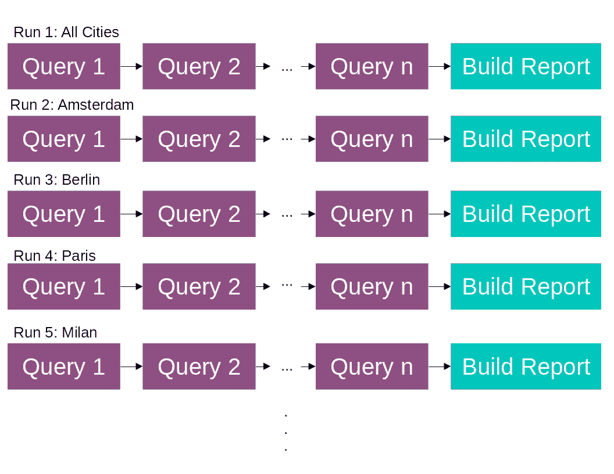
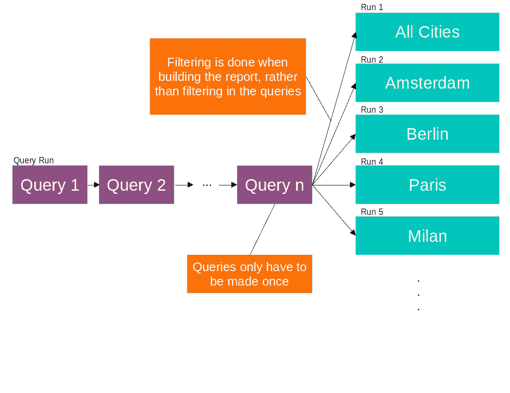
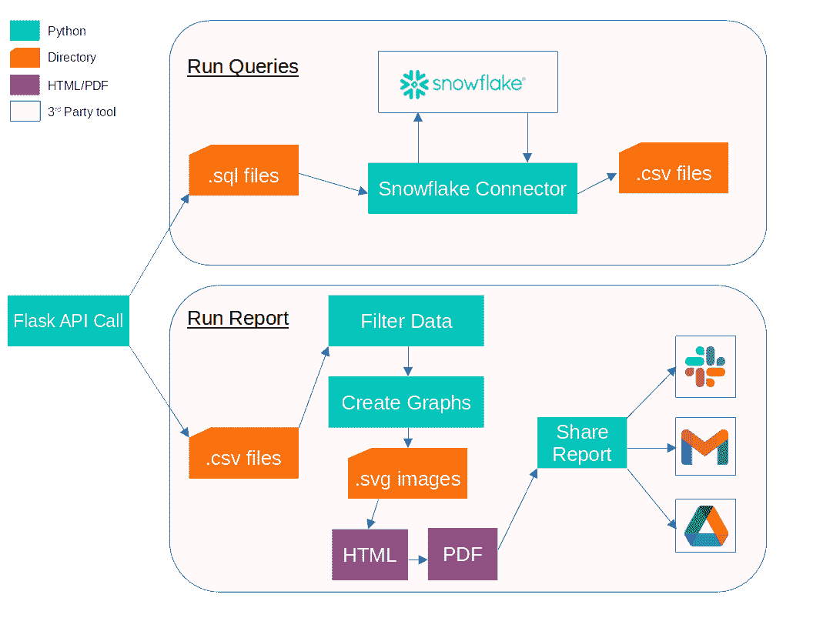

# 使用 Python 构建和共享大规模报表

> 原文：<https://towardsdatascience.com/building-and-sharing-reports-at-scale-with-python-49dfdf9fa133?source=collection_archive---------28----------------------->

📸—作者图片

## 我们如何构建我们的内部报告系统来大规模共享报告

报告对于任何足够大的数据驱动型公司的运营都至关重要，HousingAnywhere 也不例外。我们所有部门每天都在运行各种各样的报告，其中大多数都是使用[模式分析](https://mode.com/)运行的。虽然 Mode 是满足我们大部分报告需求的强大工具，但它(像许多 SaaS 产品一样)有我们内部无法克服的局限性。为了适应我们的快速增长，我们发现，如果我们想提高报告水平，我们需要一个更加灵活的额外工具。

**问题**

在 HousingAnywhere 进行报告的一个最重要的方面是共享单个城市级别的报告。作为一个专注于 3-12 个月住宿的住宿租赁平台，我们在欧洲多个城市提供服务，负责每个城市的团队需要能够了解该城市的具体情况。因此，我们有大量连续运行多次的报告，但每次都是针对不同的城市。在小范围内，这很好，但是每次都从头开始构建报告不是一个可扩展的解决方案。2021 年，我们的重点城市数量从 15 个增加到 32 个，增加了一倍多(T7)，这意味着我们现在有 32 个城市需要构建这些报告(我们的目标是在未来几年增加这个数字)。因此，我们的旧系统被证明效率太低，成本太高。

*在旧系统中，每次我们想要构建报告时，都必须运行所有 n 个查询。图片作者。*

在一个例子中，我们发现我们在雪花(我们的数据仓库)*上为一份报告*每月支付超过 50€；当我们在 2021 年初增加新的重点城市时，这一成本会进一步增加。仅一份报告每年在数据仓库上就要花费数百欧元？像这样的管理费用是不可能快速增长的。构建我们自己的系统也将使我们在需要安装和管理的任何包或集成上有充分的灵活性。

我们遇到的另一个问题涉及到对外共享我们的报告(例如，对我们的股东)。我们需要能够轻松地与组织外部的各方共享报告，如果报告系统不能处理这样的任务，这可能会很棘手。

**解决方案**

我们想要一个可以“缓存”数据的系统，这意味着我们可以运行一次查询，然后使用结果数据创建任意多的报告。这将允许我们建立大量的报告，但成本大大降低。我们只运行一次，而不是每个查询运行 32 次以上；将雪花的负荷减少到原来的一小部分。每当我们想要构建一个报告时，就会加载这些缓存数据，并可以根据一组给定的参数对其进行过滤。

新系统:所有查询只运行一次，然后在运行时过滤。数据仓库的负载显著降低。图片作者。

最终完成的报告可以以 PDF 格式共享到电子邮件地址、Slack 频道、Google Drive 文件夹或其他任何使用 Python 实现的地方。它还必须易于与我们当前的技术体系集成，因此将其实现为 API 是最有意义的:一个端点触发对报告的查询，一个端点触发报告本身的运行。这将使自动化调度过程变得容易，同时也使构建能够管理系统的 web UI 变得简单。它灵活高效，让我们在构建报告时有更多选择。

我们创建一个报告只需要几个文件:

*   一组查询。收集数据的 sql 文件
*   包含描述如何过滤数据的函数的 Python 文件
*   一个 Python 文件，包含用于绘制过滤数据的函数
*   存储报表布局的文本文件

必须指出的是，与使用 Mode 或 Tableau 等传统工具构建报告相比，这一过程的用户友好性较差。这增加了创建报告所需的时间，使得将该系统视为此类工具的替代品变得不合理。我们的目标是将它们串联使用，使用我们的内部系统来处理需要额外 TLC 的报告。

**实施**

新系统概述。作者图片

该系统本身由打包在 Docker 容器中的 Flask API 组成，该容器部署在 Google Kubernetes 引擎上。我们的大部分技术已经部署在 GCP，所以这是最简单的快速部署方法。

如果进行 API 调用来运行特定报告的查询，则每个。使用[雪花连接器](https://docs.snowflake.com/en/user-guide/python-connector.html)收集并运行与报告对应的 sql 文件。结果在本地保存为。csv 文件，可以在构建报告时引用。

示例代码展示了如何使用 Python 连接器查询雪花，并将每个结果保存为 CSV 格式

为了共享报告，API 调用包括报告的参数和目的地，例如“将*柏林*的*日报*发送到*# team-Berlin*Slack channel”。然后，系统使用这些参数构建报告，并将其发送给接收人。要构建报告本身，这个过程并不复杂。

数据过滤非常简单，由加载。csv 文件，并使用 Pandas 过滤它们。输入参数采用字典的形式，允许使用任意多的过滤器。过滤后的数据被保存到将用于图表的数据帧字典中

一个基本过滤函数的示例，根据 API 调用中给定的参数过滤数据。对这些函数中的每一个进行迭代，并在图表中使用生成的数据框

这些图形遵循类似的格式:一系列 Python 函数接受前面提到的字典，创建图形并将这些图形保存为。svg 图像。这为我们选择图形库(如 Plotly、Matplotlib、Altair)提供了很大的灵活性，因为我们可以使用任何允许我们将图形保存到图像的库。

一个基本图形函数的例子。graph_data 是使用过滤函数中的数据填充的。然后可以在 HTML 模板中链接这些图像

一旦这些图像被保存，它们可以在一个 HTML 文件中被链接。为了给每个图片添加特定的链接，我们使用 Jinja 用图片填充一个基本的 HTML 模板。为了获得正确的顺序，我们使用一个简单的“layout.txt”文件来记录报告的布局。在这里，我们可以添加图形名称、标题、分页符等。

一页报表的 layout.txt 示例。显示一个标题、三个图表和一个分页符

在本例中，我们有三个图形图像 *bookings_kpis.svg* 、 *bookings_bar.svg* 和 *bookings_forecast.svg* ，它们与部分标题一起添加，后面是分页符。这些被提取并解析，以允许 [Jinja](https://pypi.org/project/Jinja2/) 注入相应的 HTML。格式文件的每一行描述了最终 HTML 报告中的一个元素。HTML 文件完成后，使用 [PDFKit](https://pypi.org/project/pdfkit/) 将其转换为 PDF。

HTML 模板的简化版本

使用 Jinja 填充 HTML 模板的示例代码

从那里，我们可以发送 PDF 到 Slack，电子邮件，谷歌驱动器或任何必要的地方。这意味着我们还能够为外部电子邮件添加一个白名单，让我们有机会在住宅之外的任何地方指定电子邮件地址，以便与他们共享报告。

我们使用一个非常基本的定制气流操作器来安排我们的报告。我们在气流方面的工作已经在以前的文章中提到过，在那里我们详细介绍了我们使用 Selenium 的[网络抓取](/scraping-the-web-with-selenium-on-google-cloud-composer-airflow-7f74c211d1a1)或我们的 [CI/CD 设置](/testing-airflow-jobs-on-google-cloud-composer-using-pytest-9e0a1198b4cd)，这是一个我们经常使用的工具，因此简单的集成就可以将我们的报告系统和气流连接起来，这非常有帮助。它使我们能够以一种简洁的方式轻松安排和共享报告，而不必偏离我们当前的技术堆栈。

该项目的目标是授予数据团队扩展能力，同时继续为每个城市提供所需的支持。在 API 发布之前，我们努力在不花费大量成本的情况下，高效地构建 15 个重点城市的报告。自从我们部署了这个系统，我们就能够以很低的成本定期分享高质量的报告。我们可以继续为每个城市提供这样的报告，不管未来几年我们支持多少个城市。

感谢 [Julian Smidek](https://medium.com/@julian.smidek) 和 [Duc Anh Bui](https://medium.com/@bdanh96) 在整个项目和本文中给予的支持和建议。