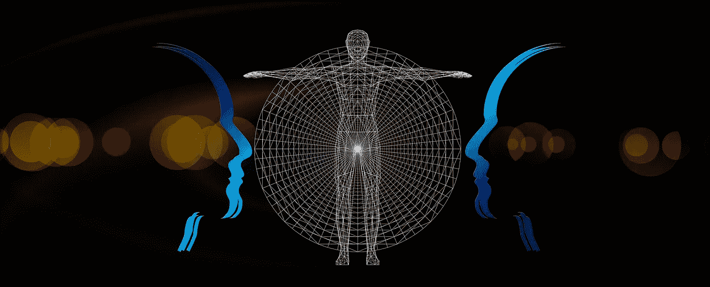
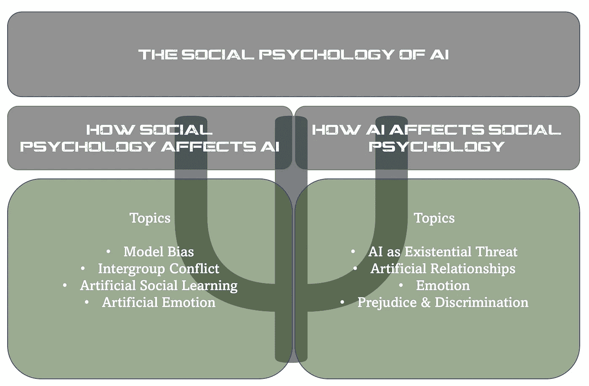

# 建筑偏执狂

> 原文：<https://towardsdatascience.com/building-bigots-81da1021f8eb?source=collection_archive---------24----------------------->

## 为什么人工智能需要社会心理学，以及它可能是什么样子

图片由[皮克斯拜](https://pixabay.com/?utm_source=link-attribution&utm_medium=referral&utm_campaign=image&utm_content=2706899)的 Gerd Altmann 提供

见过微软的朋友 Tay 吗？为了你好，我希望不会。

2016 年，微软在 Twitter [平台](https://en.wikipedia.org/wiki/Tay_(bot))发布了一款名为 Tay 的聊天机器人。Tay 代表“思考你”，旨在代表一名 19 岁的美国女孩，她将通过 Twitter 帖子与人类互动，学习如何与人类互动。

结果呢？一些用户教机器人使用种族主义和性指控的推文与其他人互动。换句话说，泰学会了成为一个偏执狂。

Tay 并不孤单。Tay 是一类被称为生成模型的模型的一部分，这些模型从学习到的输入中生成新的输出。基于各种现有互联网数据训练的生成模型显示，它们也学习偏见[和](https://medium.com/fair-bytes/how-biased-is-gpt-3-5b2b91f1177)。事实上，最近由 OpenAI 发布的大型语言模型 GPT-3 也被发现说了一些关于穆斯林的非常负面的事情。

使用互联网的生成模型并不是唯一有偏见的。事实上，越来越多的例子证明机器学习模型的输出是有偏差的。@Terence Shin 在这里[讲述了几个例子，展示了人工智能在医疗保健、犯罪和招聘实践中的偏见。](/real-life-examples-of-discriminating-artificial-intelligence-cae395a90070)

但是理解偏见如何渗入我们的数据科学实践只是硬币的一面。除此之外，AI 本身还能进一步偏向我们。事实上，我们看到信息攻击，人工智能利用人们自己的确认偏见来进一步传播阴谋论和错误信息。

这些机器学习成为偏执狂或进一步煽动我们内心的偏执狂的例子，如果它们只影响少数人，就不会有什么大不了的。但事实并非如此。吴恩达曾经[指出](https://www.gsb.stanford.edu/insights/andrew-ng-why-ai-new-electricity)人工智能是新的电力，我们目前正在见证它的无处不在。

这一切意味着，人工智能正在以越来越成问题的方式扩大我们人类的偏见。正是因为这些原因，我们需要激励新一代的数据科学家来解决这些偏见，并寻找克服它们的方法。

幸运的是，人们有偏见的想法并不新鲜。事实上，有一个完整的学术学科致力于人类偏见的研究，心理学。由 [WomeninAI](https://medium.com/womeninai/psychology-of-artificial-intelligence-ca0f0a9f3d7c) 撰写的一篇论文以支持心理学在理解人工智能潜在影响的全部广度中的作用开始了这场对话。

我想更进一步，更具体地说，社会心理学家花了几十年的时间来研究和理解人类偏见。有大量的理论帮助我们解释偏见是如何产生的，什么因素加剧了偏见，以及当偏见被应用时会有什么后果。

它不仅仅停留在理解人类的偏见上。

为此，我提出了人工智能的社会心理学，并探索潜在的主题，以弥合社会心理学理论与人工智能应用的现实。是时候打破偏执狂的建筑，建立比我们当前的轨迹更强大、更道德的机器。

# 为什么数据科学和人工智能需要社会心理学？

当大多数人想到社会心理学时，他们想到的是一个研究人们在社会情境中影响我们的方式的领域。但是社会心理学有一个更广泛的[定义](https://link.springer.com/referenceworkentry/10.1007%2F978-1-4020-8265-8_1047):

> 社会心理学是理解和解释个人的思想、感觉和行为如何受到他人的实际、想象或暗示的影响的科学尝试(奥尔波特，1954)

注意这个定义是如何包括他人想象的和隐含的存在的。有了这个定义，首先就很难考虑我们的心理学为什么不是天生的社会性。即使当我们发现自己孤独的时候，我们仍然会受到他人的影响。

但 AI 并不是我们经常说的字面意义上的“他者”。它没有生命，没有呼吸，没有感觉。那么，我们为什么要假设在处理人工智能时也适用类似的原则呢？

人们不仅会在他们不在的时候影响我们，“他们”也不需要成为人。更确切地说，我们有一种强烈的倾向，认为无生命的事物具有能动性。你们中有多少人因为加载应用程序花费太长时间而对着电脑大喊大叫？或者你用性别代词来描述你的车？将社会特征归因于无生命的物体是如此普遍，许多心理学家认为这是自然的[。](https://psycnet.apa.org/record/2003-09859-002)

这种趋势也有一个很好的解释。从进化的角度来看，对我们来说，假设灌木丛中的沙沙声是因为熊或其他具有威胁性的生物的存在，比假设这是风要安全得多。后者确保了我们的生存。

因为人工智能技术背后的整个要点是将类似人类的智能构建到应用程序和物理对象中，这些相同的技术甚至更有可能在做一些事情，让我们“愚弄”他们认为他们是活着的。因此，我们需要人工智能的社会心理学，因为人工智能正在以新的复杂的方式扩展我们的社会世界。

# AI 的一个社会心理学应该涵盖什么？

如果你仍然不相信，也许列出一些关于内容的想法将有助于进一步证明社会心理学如何有助于我们理解不断发展的人工智能技术。前面，我列出了围绕两个主题的一些初步想法。

第一个主题是更明显的主题，专注于解决我们的社会心理如何影响我们构建人工智能技术的方式的主题。这个主题特别解决了人类偏见的问题，以及这种偏见是如何被人工智能技术放大的。它还包括解决社会心理学理论如何告知我们如何着手在我们的人工智能中建立新的能力。

第二个主题不太明显，但鉴于人工智能越来越多地融入我们的日常生活，它仍然同样重要。这个主题聚焦于社会心理学中的核心话题，解决人工智能如何影响我们自己的思想、感觉和行为。换句话说，这不仅仅是因为我们没有理解人类的偏见是如何进入人工智能解决方案的，而是因为这些解决方案与其他人类互动，因此应该也会影响这些人。

作者图片

# 主题 1:我们的社会心理如何影响人工智能

## 主题 1:模型偏差

这篇文章的例子清楚地表明，我们的人工智能模型正在学习我们人类的偏见。社会心理学家被训练去理解像数据收集这样的人类活动是如何充满偏见的。简单地决定一个问题首先需要一个模型是人类偏见的一种形式。因此，理解这些偏差及其潜在来源需要数据科学领域的更多多样性。社会心理学家可以帮助数据科学家理解我们的人类倾向是如何使我们收集的数据产生偏差的，并且还可以找出克服这些偏差的策略。

模型偏差现在是数据科学行业的一个非常热门的话题，像麻省理工学院的 David Sontag 这样的计算机科学家的工作正在帮助我们理解如何用数学方法检测这种偏差。但这些方法无法解决数据收集过程中的基本偏见，因此也需要社会心理学理论来更全面地捕捉问题的严重性。

相关的社会心理学概念包括研究方法中的理解偏差、偏见和歧视理论以及多样性。

## 主题 2:群体间的冲突

建立有偏见的模型，当应用时，可以迅速影响数百万人，这通常是无意的。建立模型来做出故意伤害数百万人的决定，是对人类偏见更有意识的应用。制造人工智能来故意伤害也不是科幻小说，只要看看无人机在我们最近的一些冲突中的使用就知道了。

社会心理学家长期以来一直在研究群体间冲突，诸如现实冲突[理论](https://en.wikipedia.org/wiki/Realistic_conflict_theory)、社会主导[理论](https://en.wikipedia.org/wiki/Social_dominance_theory)和社会认同[理论](https://en.wikipedia.org/wiki/Social_identity_theory)等理论可以帮助我们理解设计人工智能来帮助管理社会群体互动的潜在影响。

## 主题 3:人工社会学习

超越人工智能趋势的当前状态，社会心理学家也可能能够为更多未来状态的人工智能发展做出贡献。我们已经知道，研究人员已经利用强化学习，基于经典和操作性条件反射的基本概念建立了模型。展望未来，数学的进步也许可以从社会学习理论中学习，如阿尔伯特·班杜拉、利维·维果斯基和卡罗尔·德韦克发展的理论。换句话说，当我们教机器通过观察向其他人或其他机器学习时，我们应该考虑什么？社会心理学可以帮助回答这个问题。

## 话题 4:人工情感

与社会学习类似，研究人员也对理解机器如何学习解释人类情感有相当大的兴趣。在基本意义上，自然语言处理领域的情感分析已经致力于开发这种能力。更复杂的媒介也正在被开发，以帮助解释视频信号和声音中的人类情感。

情绪的社会心理学帮助我们欣赏和理解规范、群体成员和文化在我们的情绪表达中扮演的重要角色。因此，社会心理学承诺更完整地看待开发理解人类情感的机器意味着什么。

# 主题 2:人工智能如何影响我们的社会心理

但影响人工智能如何发展的不仅仅是我们。AI 也可以影响我们如何发展。人工智能越来越多地出现在我们的生活中，使得这个较少研究的领域变得同样重要。社会心理学在帮助我们更好地理解这些影响方面有很多贡献。

## 主题 1:生存威胁

我所经历的人工智能对人类影响的最直接的方式之一，是作为一种生存威胁。我指的不是终结者*的*天网描绘的那种生存威胁，也不是像埃隆·马斯克[这样的有影响力的人对人工智能“可能”变成什么样子发表的可怕警告。不，我指的是更直接的生存威胁，即当人们看到人工智能自动让他们失业时，他们所经历的威胁。](https://www.washingtonpost.com/news/innovations/wp/2018/04/06/elon-musks-nightmarish-warning-ai-could-become-an-immortal-dictator-from-which-we-would-never-escape/)

这种威胁是真实的，尽管可能被夸大了一点，社会心理学家可能能够帮助确定如何管理这种威胁。例如，恐怖管理理论解释了人们在面临生计威胁时如何应对。因此，TMT 建议我们利用自尊和文化世界观来保护自己免受这种生存威胁。随着人工智能致力于让更多人自动完成那些有助于赋予他们生活意义的活动，我们应该期待新的世界观形成，甚至可能是对人类意义的新定义。

## 话题 2:人造关系

除了存在的威胁，更积极的是，人工智能还为人类引入了新的方式来建立关系，无论是通过增强现实还是直接与人工生命发展关系。例如，在电影*中，她的* Juaquin Phoenix 扮演一个与 AI 语音助手发展关系的男人。两人一起探索人类情感的边界，这可能是男人因为社交焦虑和不安全感而永远无法触及的。

社会心理学家理解关系，依恋理论、社会交换理论和相互依赖理论等理论都可以帮助我们理解如何、为什么以及是否应该使用人工智能来形成[关系](https://static1.squarespace.com/static/504114b1e4b0b97fe5a520af/t/58b9a5f015d5db4eae3f8e4c/1488561649567/2017_FinkelSimpsonEastwick_AnnuRevPsych.pdf)。

## 话题三:情感

与人际关系密切相关的是情绪的概念。正如理解情绪对于开发可以检测和理解人类情绪的人工智能模型很重要一样，理解人工智能如何塑造我们的情绪也很重要。回想一下泰伊和 GPT-3 关于弱势社会群体的人工智能反应。现在考虑一下，实际上有数十亿人代表这些社会群体，他们中的许多人无疑会读到这些实验及其结果。这些人如何看待这些实验，他们如何对结果进行归因，无疑会影响他们对自己的感觉。

## 主题 4:偏见与歧视

偏执的机器人不仅有可能伤害人们的感情，而且有可能进一步证明其他人对这些群体成员的偏见。社会心理学家可以帮助我们回答人工智能输出的感知合法性问题。

此外，随着人工智能的进步，我们作为人是否开始摆脱我们对它们的偏见，因为毕竟它们只是机器？自由表达偏见的后果，甚至是对无生命物体的偏见，可能会对我们彼此之间的关系产生深远的影响。

# 结论

总结一下，这篇文章是个开始。号召数据科学家和社会心理学家联合起来，共同努力，在不同领域分享知识。以一种对人工智能的未来负责并最终更加强大的方式，解决我们今天面临的一些最紧迫的伦理、社会、经济和环境挑战。

比如参与学习数据科学、职业发展或糟糕的商业决策？[加入我](https://www.facebook.com/groups/thinkdatascience)。