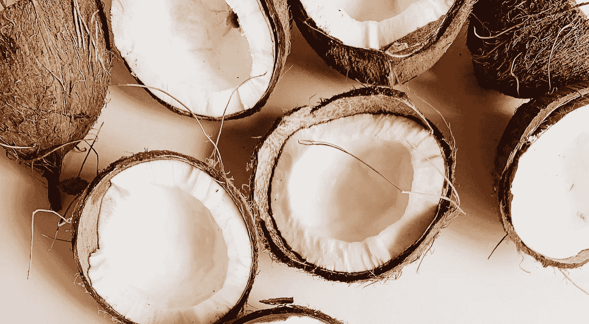
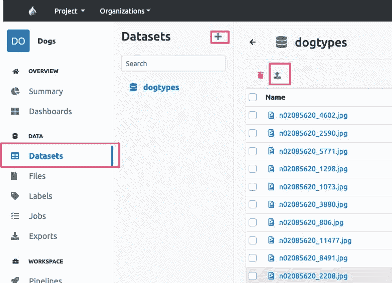
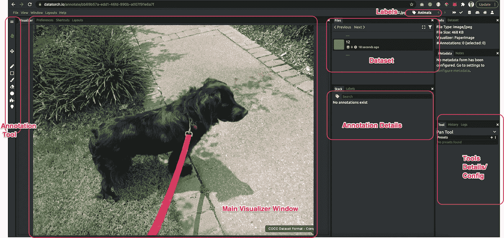
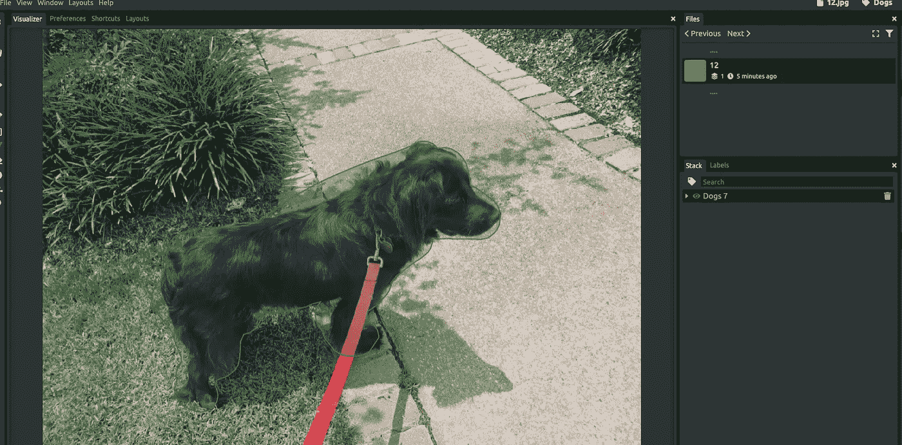
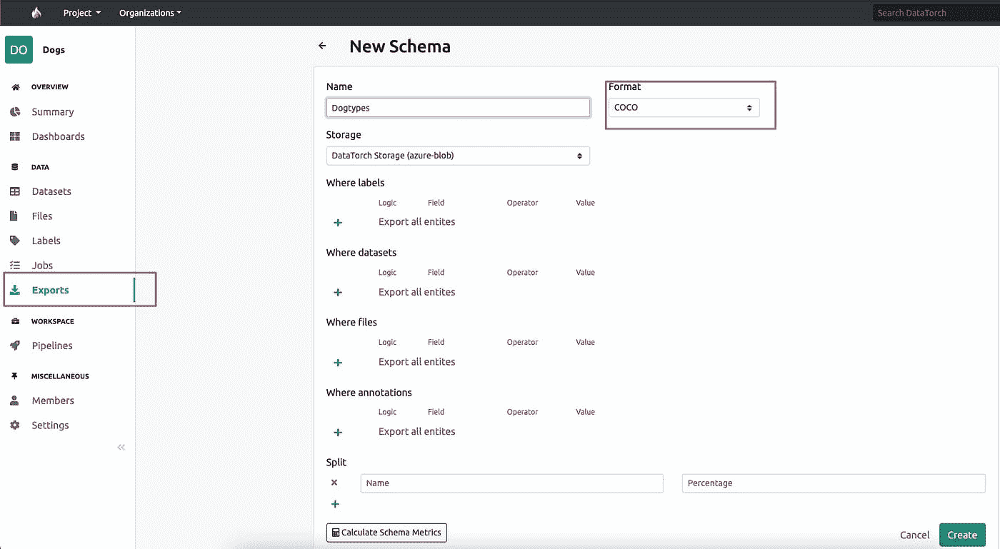

# 构建 Coco 格式的计算机视觉数据集

> 原文：<https://towardsdatascience.com/building-computer-vision-datasets-in-coco-format-56593d5e3520?source=collection_archive---------30----------------------->

## 构建自定义计算机视觉数据集的综合教程

照片由[抢笑](https://unsplash.com/@roblaughter?utm_source=unsplash&utm_medium=referral&utm_content=creditCopyText)上 [Unsplash](https://unsplash.com/s/photos/vision?utm_source=unsplash&utm_medium=referral&utm_content=creditCopyText)

计算机视觉是机器学习的最大学科之一，具有广泛的用途和巨大的潜力。它的目的是复制大脑令人难以置信的视觉能力。计算机视觉的算法并不神奇。它们需要信息来执行，它们的力量取决于你提供的信息。基于项目，有各种来源来获得适当的数据。

最著名的对象检测数据集是上下文数据集中的公共对象(COCO)。这通常用于评估计算机视觉算法的效率。COCO 数据集被标记，为训练受监督的计算机视觉系统提供信息，这些系统可以识别数据集的典型元素。当然，这些系统是完美无瑕的，因此 COCO 数据集作为计算机视觉研究的结果，作为评估系统随时间进展的基线。

在本文中，我们讨论了 Coco 文件格式，这是一种用于构建计算机视觉数据集、对象检测和图像检测方法的标准。

# 为什么神经网络对计算机视觉非常有效？

人工神经网络被认为是构成深度学习技术核心的 ML 的主要子类。它们的起源和架构与人类的大脑相同，它们像真正的神经元一样工作。

由于图片并不总是有标签，部分和元素的子标签必须被删除或巧妙地减少，神经网络对于计算机视觉来说是有效的。神经网络使用训练信息进行训练，并根据经验提高其效率。但是，一旦这些学习技术被精确调整，它们就成为计算机技术和人工智能中令人生畏的资源，让我们能够快速分类和组织数据。

与由有经验的科学家进行的传统分类相比，语音识别或图像识别中的活动可能只需要几分钟而不是几个小时。谷歌的技术是最著名的神经网络之一。

# 为什么仍然需要创建自定义数据集

迁移学习是一种特定的机器学习技术，其中为一项工作创建的模型被应用为不同任务的模型的基础。考虑到在这些问题上建立神经网络系统所需的巨大计算和时间资源基础，以及它们在类似问题上提供的专业知识的巨大飞跃，在机器学习中使用预训练系统作为自然语言数据处理的初步步骤是一种常见的策略。

我们可以使用迁移学习来处理这些情况，迁移学习使用以前从一个可比较的任务或主题中标记的数据。

*照片由*[*neon brand*](https://unsplash.com/@neonbrand?utm_source=unsplash&utm_medium=referral&utm_content=creditCopyText)*[*Unsplash*](https://unsplash.com/s/photos/learning?utm_source=unsplash&utm_medium=referral&utm_content=creditCopyText)*

# *Coco 文件格式是建立计算机视觉数据集的标准*

**

**照片由* [*艾琳·克雷登茨*](https://unsplash.com/@ikredenets?utm_source=unsplash&utm_medium=referral&utm_content=creditCopyText)*[*拍下*](https://unsplash.com/s/photos/coco?utm_source=unsplash&utm_medium=referral&utm_content=creditCopyText)**

**分析视觉环境是计算机视觉的一个主要目标；它包括检测有哪些项目，在 2D 和 3D 中定位它们，识别它们的属性，并描述它们的关系。因此，数据集可用于训练物品识别和分类方法。COCO 经常用于测试实时对象识别技术的效率。现代神经网络模块可以理解 COCO 数据集的结构。**

**当代人工智能驱动的替代方法不太善于在发现中创建完全精确的结果，这导致了一个事实，即 COCO 数据集是 CV 训练、测试、润色和精炼模型的重要参考点，以更快地扩展注释管道。**

**COCO 标准规定了在实际阶段如何将注释和图片元数据保存在光盘上。此外，COCO 数据集是迁移学习的补充，其中用于一个模型的材料被用于开始另一个模型。**

# **使用 [Datatorch](https://datatorch.io/) 构建计算机视觉数据集的教程**

**由 [Anuj Syal](https://www.youtube.com/channel/UCO8XsgcjqArk_mAd1VGBMfg?sub_confirmation=1) 建立 Coco 格式的计算机视觉数据集**

**Datatorch 是基于云的免费注释工具之一。这是一个基于网络的平台，你可以直接进入并快速开始注释数据集**

****步骤 0:发现数据****

**解决任何机器学习问题首先从数据开始。第一个问题是你想解决什么问题。那么接下来的问题就是我能从哪里得到这些数据。**

**在我的情况下(假设)，我想建立一个从照片中检测不同动物的 ML 模型。我正在寻找这些图片的来源[谷歌的开放图片](https://storage.googleapis.com/openimages/web/download.html)(一个数据集的庞然大物)。我只收集了狗的一个子集，并把它们与相应的**

****数据集许可** 注释由 Google LLC 根据 [CC BY 4.0](https://creativecommons.org/licenses/by/4.0/) 许可进行许可。这些图像被列为具有 2.0 许可证的 [CC。在知识共享署名(CC-BY)许可下，任何感兴趣的人都可以使用开放图像。](https://creativecommons.org/licenses/by/2.0/)**

****第一步:创建新项目****

**登录后，您将看到显示您的项目和组织的仪表板主屏幕。当您试图跨不同团队处理多个项目时，这将是一个好方法。现在在标题栏的右上角，点击`+`并创建一个新项目**

****

**来自作者的截图**

****第二步:车载数据****

**然后从左侧导航栏转到`Dataset`选项卡，单击`+`创建一个名为`dogtypes`的新数据集。之后，您可以轻松地删除图像**

****

**来自作者的截图**

**或者还有另一种选择，直接连接到云提供商存储(AWS、Google、Azure)**

****第三步:开始注释****

**如果您单击数据集中的任何图像，它将直接将您带到注释工具**

****

**图片来自作者**

*   ****注释工具**左侧有您可以在中间的**可视化工具窗口**上使用的注释工具**
*   ****数据集:**所有图像的列表，点击进行标注**
*   ****更改/创建标签:**点击以更改与标注相关的标签**
*   ****注释详情:**在图像中完成一些注释后，您将在此处看到详情**
*   ****工具详情/配置:**当您选择一个注释工具时，详情/配置出现在此。例如，如果您选择画笔工具，您可以在此处更改其大小**

**要开始注释，您可以从选项中选择一个注释工具，这也取决于您要构建的模型的类型。对于对象检测模型，像边界框或圆形工具这样的工具很好使用，否则对于分割模型，您可以使用画笔工具或基于人工智能的超像素工具来突出显示相关像素。例如，我只是用了一个简单的笔刷工具(增加了大小)来突出狗。**

****

**来自作者的截图**

**此外，最好通过尝试来发现注释，或者你可以在我的 youtube 频道上观看教程。**

****

**来自作者的截图**

*   ****第四步:将带注释的数据导出为 Coco 格式****

****

**来自作者的截图**

**完成注释后，您可以转到 exports 并以 COCO 格式导出此注释数据集。**

## **Coco 格式输出**

**注释活动的输出现在以 COCO 格式表示，它包含 5 个主要部分
-信息
-许可
-类别(标签)
-图像
-注释**

**有关详细信息，您可以在下面看到一个示例输出**

# **结论**

**如果你对物体检测没有经验，需要创建一个全新的数据集，COCO 格式是一个很好的选择，因为它结构简单，用途广泛。COCO 数据集结构已经被研究用于最常见的任务:对象识别和分割。像 [Datatorch](https://datatorch.io) 这样的工具有助于快速建立这些数据集。COCO 数据集是大规模数据集，适用于初级项目、生产环境和尖端研究。**

# **参考**

**数据集链接:[https://storage.googleapis.com/openimages/web/index.html](https://storage.googleapis.com/openimages/web/index.html)**

**数据集许可:注释由 Google LLC 根据 4.0 版许可协议 [CC 许可。这些图像被列为具有 2.0](https://creativecommons.org/licenses/by/4.0/) 许可证的 [CC。](https://creativecommons.org/licenses/by/2.0/)**

***原载于*[*https://anujsyal.com*](https://anujsyal.com/building-computer-vision-datasets-in-coco-format)*。***