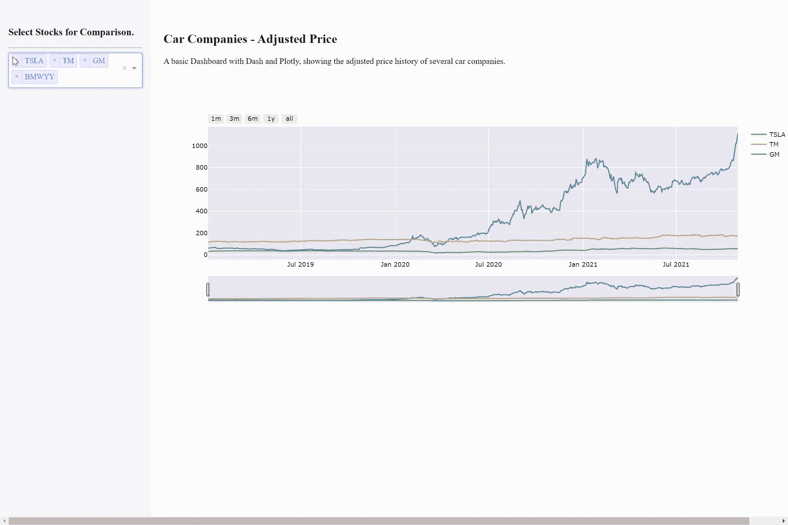
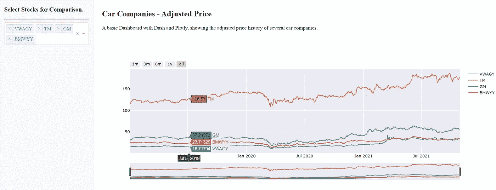

# 在 Dash 中构建仪表板

> 原文：<https://towardsdatascience.com/building-dashboards-in-dash-591a6223efd3?source=collection_archive---------9----------------------->

## 在 Dash 中创建仪表板，从您的分析中获得价值。

交互式 Dash 仪表板(作者提供的 GIF)

ashboards 是一种快速有效的可视化和监控数据的方式。有了 Plotly 和 Dash，用 Python 构建仪表板变得前所未有的简单。

本文将讨论为什么仪表板是有用的，并展示如何使用 Dash、Plotly 和 Python 生成基本的仪表板。可以使用 CSS 进一步定制布局。

本文中用于仪表板的数据是使用 Alpha Vantage API 收集的几家汽车公司调整后的公开股票价格。

可视化数据就是从信息中提取价值。然而，这个故事可能是隐藏的，不清楚的，或难以理解的大量数据。因此，分析师利用可视化和仪表板工具来查明数据的关键方面并揭示价值。

# **互动数据**

因为可视化是数据快照，分析师和数据科学家必须对他们选择显示的数据子集进行选择。这个问题在静态可视化中很突出，在静态可视化中，图形的尺寸是在设计阶段选择的，并且保持不变。

为了解决这个问题，可视化工具，如 Plotly，结合了动态可视化。例如，默认情况下，Plotly 允许用户浏览图表、放大/缩小以及添加/删除轨迹。这种灵活性增加了可视化的有效性，并增加了查看图表的人的参与度。

## **仪表盘**

每年，公司和组织都会受到越来越多的数据轰炸。然而，如果没有有效的方法来解析和提取决定性的见解，这些信息就相对没有意义。

目标是使用数据来驱动行动，这就是仪表板的用武之地。

约翰·施诺布里奇在 [Unsplash](https://unsplash.com?utm_source=medium&utm_medium=referral) 上拍摄的照片

仪表板充当收集的数据和决策者之间的渠道。仪表板旨在以易于理解的方式从数据中快速提供可操作的见解。

用户应该能够拉起一个仪表板，提出一个问题，并回答问题。
这种用户参与对传递信息至关重要，并确保用户恰当地吸收信息。

这就是破折号的用武之地。

因为 Dash 建立在 Plotly 之上，所以交互功能已经存在。此外，它与 Python、R 和 Scala 兼容，这使得它可用于许多不同的。

# **仪表板设计**

Dash 的设置是高度用户友好的。如果您已经有了使用 Plotly 的经验，您将能够轻松地构建 dash 应用程序。

任何 dash 应用程序的基本组件是布局、绘图和仪表板交互。

Dash 应用程序由几个不同的组件构建而成。然而，大多数功能来自 dash 核心组件(DCC)、html 组件和任何引导程序主题。

为仪表板开发过滤器时，第一步是为用户生成一个选项列表。然后，这些被传递给一个下拉组件。

这个仪表板的数据是五家最大汽车公司的股票数据。这个基本的仪表板允许用户选择哪些股票在主图中可见。

导入仪表板组件、加载数据和生成选项(由作者编写代码)

## 成分

布局基于 HTML 标签。如果您熟悉 HTML，dash 组件应该是标准的。每个 Dash 组件都基于一个 HTML 标签，但是具有专门为 Dash 设计的定制功能。

这意味着你可以从简单的开始，从你知道的开始。然后慢慢地将你的仪表板构建成越来越复杂的东西。

接下来是 dash 核心部件。其中包括一个接受绘图图形和其他绘图对象的图形组件。这些核心组件还包括一些小部件，比如用于这个仪表板的下拉菜单。

这些核心组件非常适合快速生产高质量的仪表板。一些流行的组件是滑块、清单或日期选择器。你可以在这里查看可用组件:[https://dash.plotly.com/dash-core-components](https://dash.plotly.com/dash-core-components)。

仪表板的设计布局(由作者编写代码)

## 复试

使用目标图表设计布局后，剩下的就是添加交互了。虽然这些图已经有了一些基本的交互级别，但 Dash 允许用户动态地更改仪表板中的数据，更新图表和一些导航功能。

**动态 Dash 应用的核心是回调函数。**

回调函数是在函数定义之前使用 Python decorators 定义的。
输入、输出和函数参数遵循严格的格式。

向 Dash 添加交互式回调(由作者编写代码)

输入通常来自 dash 核心组件，比如本例中的下拉选择器。第一个参数是指定数据源的元素的 id。第二个参数是组件的属性。

输出遵循与输入相同的格式，但是数据被发送到指定的仪表板部件。

根据指定的输入和输出，您创建的函数需要相同数量的输入参数和与预期输出类型相匹配的输出数据类型。

对于多个输入，函数参数对应于输入列表中的每个元素。

## 定制和 CSS

仪表板的基本功能设置好之后，剩下的就是添加一些定制了怎么办。

对于这个仪表板，我保留了主应用程序本身的样式。因此，将这些细节作为字典添加，然后添加到每个 Dash HTML 组件的样式属性中。

或者，您可以将资源文件夹和 CSS 文件添加到应用程序中。这个结构的定义和你对任何 CSS 网页的定义是一样的。匹配类和 id，并直接改变您的仪表板。

向仪表板添加样式(由作者编写代码)

## 部署

根据您的需求，Dash 应用程序的部署可能会有很大不同。例如，在本地服务器上托管仪表板只需要使用 Python 运行仪表板。但是，在本地网络中访问可能需要独特的网络规范。

如果本地主机不是你仪表板的目标，考虑一个服务，比如 Heroku。Heroku 的免费层是可用的。

使用“Python app.py”运行 Dash 应用程序(由作者编写代码)

仪表板——汽车公司，调整后的股票价格(图片由作者提供)

# **总结**

仪表板是监控业务目标、跟踪进度和分析数据的绝佳工具。

花费数小时开发一个完全交互式的仪表板的日子已经一去不复返了。相反，您可以通过 Dash 快速生成仪表板，为自己节省大量时间。

本文讨论了设置和运行 Dash 应用程序的几个方面。只需最少的努力，您就可以轻松创建您的仪表板。

*如果你有兴趣阅读关于新颖的数据科学工具和理解机器学习算法的文章，可以考虑在 medium 上关注我。我总是在我的文章中包含代码，您可以将其应用到您的工作中！*

*如果你对我的写作感兴趣，想直接支持我，请通过以下链接订阅。这个链接确保我会收到你的会员费的一部分。*

 [## 通过我的推荐链接加入 Medium-Zachary Warnes

### 阅读扎卡里·沃恩斯(以及媒体上成千上万的其他作家)的每一个故事。您的会员费直接支持…

zjwarnes.medium.com](https://zjwarnes.medium.com/membership)