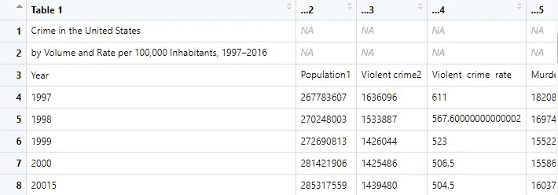
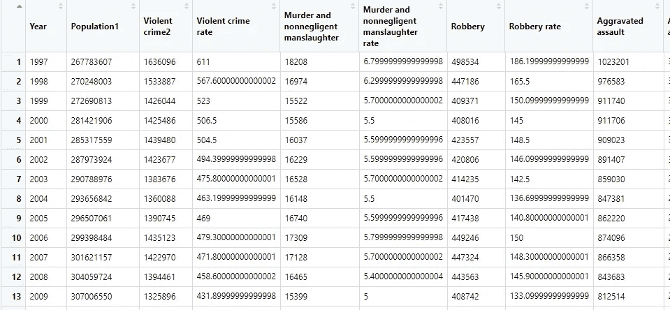

# 使用 R 构建数据管道

> 原文：<https://towardsdatascience.com/building-data-pipelines-using-r-d9883cbc15c6?source=collection_archive---------24----------------------->

## 一个如何使用数据管道方法在 R 中使用数据文件的例子


照片由[负空间](https://stocksnap.io/author/4440)发自 [StockSnap](https://stocksnap.io/)

如果你是一名数据分析师，你很有可能会遇到一个数据集，因为它的大小或复杂性而给你带来很多麻烦。如今，大多数数据分析师依赖于几种可视化和电子表格工具的组合，这些工具可以帮助他们理解周围的数据，但“分散文件的诅咒”仍然存在，尤其是在大公司。

但是，随着我们离开新千年的前二十年，我们目睹了新数据源创建的巨大增长——不仅数据分析师需要理解组织内部产生的数据(随着组织试图更加精通数据，产生和存储的数据量呈指数级增长)，而且有时他们还需要理解与公司无关的外部数据。这种多样性要求用新的方法来解决旧工具无法解决的新问题。

**当然，由于其民主化和可用性，Microsoft Excel 是分析数据的最佳工具之一，**但是一旦您传递了一定数量的行，您收集见解和理解原始数据的能力就会变得非常有限。用 Excel 分析大文件有两个主要问题:

*   行和列方面的限制([https://support . Microsoft . com/en-us/office/excel-specifications-and-limits-1672 b34d-7043-467 e-8e 27-269d 656771 C3](https://support.microsoft.com/en-us/office/excel-specifications-and-limits-1672b34d-7043-467e-8e27-269d656771c3))。
*   错误的环境(缓慢、崩溃等)对生产力的影响。)—如果你曾经因为 Excel 崩溃而丢失了部分分析，你应该知道我在说什么。是的，“啊哦，这是白色屏幕！”瞬间。

**这并不是说 Excel 是一个不好的工具(我真的认为它很棒)**，只是它不适合大文件——然而，大多数人，尤其是大公司的人，仍然依赖它来完成各种数据任务。数据可视化和自助服务商业智能工具已经在某种程度上解决了这个问题— **但是要获得这些工具，你需要过度依赖预算或政治。**

**幸运的是，开源工具的采用在过去十年中激增(特别是在 R 和 Python 大放异彩的数据分析领域)**因为，尽管有一个巨大的社区，它们有一个平滑的学习曲线，并且对大多数人来说都很容易获得。

能够在这些系统中编码可能使分析师能够提高他们的整体生产力和分析数据的能力——但是，有时当他们不能正确地将电子表格文件加载到 R 或 Python 中时，他们会感到沮丧，最终坚持使用电子表格软件。

> **在这篇文章中，我们将探索如何构建和思考准备电子表格文件以供分析的函数——流水线的流程与我在 Udemy**T5 上的 [**R 编程课程中教授的流程相同**](https://www.udemy.com/course/r-for-absolute-beginners/?referralCode=F839A741D06F0200F312)

# 数据集

我们将使用联邦调查局的犯罪数据集，它有一个大概的样子:


我们示例数据集的电子表格外观

**正如我们所看到的，我们有几个栏目传达了几乎相同的信息，如名义价值和利率。**如果我们试图将这些数据直接导入 R 中，我们可能会得到一些奇怪的东西，因为我们在列中有一些额外的信息(例如，引用)，因为任何工具都很难找到这个电子表格中的“真实数据”**(请记住，Excel 应该有这些信息，因为它是面向用户的工具)。**

例如，脚注可能会作为一行包含在您的数据中——这使得您的数据很难分析— **,但是您可以通过一些数据争论技巧来解决这些问题！**

# 将其导入 R

要将这个 Excel 文件加载到 R 中，我们将依靠 tidyverse 包的***readxl(***[https://readxl.tidyverse.org/](https://readxl.tidyverse.org/))*R 库:*

```
*library(readxl)
# Load the Data
crime_data <- read_xls("./data/FBI Crime Data.xls")*
```

*查看我们刚刚加载的文件头:*

**

*加载到 R 中的 excel 文件头*

*啊，看那个！我们的前两行可能是无用的，第三行包含我们的列名。我们也有一些年份的问题(看看 20015 年的第 8 行索引——这是因为上标 *5* 被读成了一个正常的数字)。*

*桌子的底部也不好看:*

**

*加载到 R 中的 excel 文件底部*

***我们在 excel 工作表中的一些描述和元数据最终被读取为行——这些元数据对于查看 Excel 文件的人来说很有用，但对于试图在数据分析工具上持续分析这些数据的人来说却不太有用。***

*这些是数据科学家和分析师每次想要分析新数据集(尤其是来自结构化程度较低的来源的数据集)时都会遇到的常见数据争论问题。*

*我们手头有些工作，所以让我们把它做完吧！*

# *从列名开始*

***这个很简单——我们的列名在第三行，所以我们可以使用 colnames 函数来设置它们:***

```
*colnames(crime_data) <- crime_data[3,]*
```

*我们的普通桌子是这样的:*

**

*带列的表格*

# *自动过滤*

***为了建立有趣和健壮的数据管道，我们必须想出系统的规则，能够传达我们将通过管道传递的可能文件的未来变化。***

*我们肯定可以通过使用向量对数据集中的第一列进行子集化来对年份进行子集化，并查看值 1997、1998… 2016(我们在该文件中拥有的最新年份)**但是如果有人给我们一个包含直到 2017 年的数据的文件呢？还是包含 1996 年的文件？***

***如果我们将我们的年份硬编码到管道中，我们将建立硬编码的规则——这些从来都不是一个好的选择，因为它们只适用于这个文件并且只适用于这个文件(或者具有完全相同结构的文件)。***

*对于一个包含 20 多年数据的新文件(我们表中可用的数据)，您的管道将无法过滤它们— **因此，通过查看下面的文件，您是否可以提出一些规则来对表进行子集化，而不管包含年度信息的行数是多少？***

**

***我们能想到的一个很好的规则是，只获取第一列中值可以转换为数字的行。这是一个很好的“数据管道规则”的例子，因为它可以防止将来的错误或信息丢失。***

*如果我们尝试将该数据集的第一列转换为数字类型，非数字的元素将作为 *NA 的*(不可用)返回—然后我们可以过滤掉那些 *NA 的*，有效地保留我们感兴趣的行— **我们将依赖 sapply 将我们的第一列转换为数字—我们将创建一个新列:***

```
*crime_data[‘converted_index’] = sapply(crime_data[,1], as.numeric)*
```

*我们新的 *converted_index* 列将具有如下外观:*

**

*注意当 R 不能将我们的列转换成数字时， *NA 的*是如何被强制引入的。*

***过滤掉这些行将得到下表—前 11 行和前 9 列的简短摘要:***

**

*我们如何过滤掉这些 NA？我们能够用下面的代码实现这个目标:*

```
*crime_data_filter = ( 
 crime_data[!is.na( 
  crime_data[,ncol(crime_data)] 
 ),]
)*
```

*使用此规则，我们选择数据帧中最后一列不是*NA—*—的每一行，因为我们的 *converted_index* 列是在管道中创建的，所以执行以下操作也是安全的(会产生相同的结果):*

```
*crime_data_filter = ( 
 crime_data[!is.na( 
  crime_data[,'converted_index'] 
 ),]
)*
```

*在这种情况下，对列 *converted_index* 进行硬编码不会有问题— **因为转换后的索引是在我们的管道内部创建的，并且创建该列的规则对于输入是灵活的，所以风险较小。***

# *更正年份列*

***我们仍然需要去掉像 20015** 这样奇怪的值——这是因为 R 将指向 excel 文件中引用的上标 *5* 读成了一个数字(在那个系统中这是有意义的)。*

***幸运的是，Year 列仍然是一个字符，所以我们能够直接应用 substring，并且只检索每年的前 4 个“字母”(它们是数字，但是由于数据的类型，R 将它们视为字符串):***

```
*crime_data_filter$Year = substr(crime_data_filter$Year, 1,4)*
```

*请注意我是如何重写 Year 列的，只使用每年的前 4 位数字——R 错误地认为是年份**的一部分的额外数字按照我们的要求被删除了。***

*我们能够得到以下数据帧:*

**

# *自动化列选择*

*正如我们所看到的，列传递相同的信息(rate 只是原始列除以一百万居民)，正如我们对行过滤所做的那样，我们也可以进行一些自动化的列过滤。**您能想出一个不依赖硬编码规则就能选择表中非费率列的规则吗？***

*让我们用以下命令来检查我们的列名:*

```
*names(crime_data_filter)*
```

*这是输出:*

**

*数据框的列名*

*仔细观察，名称中有 ***rate*** 的每一列都应该从我们的表中删除。我们可以依赖 grepl 函数，而不是硬编码列的名称或索引。使用:*

```
*grepl( “rate” , names(crime_data_filter))*
```

*该函数将返回一个包含 TRUE 和 FALSE 的向量—在列名包含“rate”的索引中为 TRUE，否则为 FALSE:*

**

*我们现在可以依靠这个向量来过滤掉数据框中的这些列——使用索引器。我们还将重写我们的原始对象:*

```
*crime_data_filter = crime_data_filter[,!grepl( “rate” , names(crime_data_filter))]*
```

# *将我们的数据转换成数字*

*我们快完成了！让我们看看我们的 crime_data_filter 结构:*

**

***我们的大多数列仍然是字符**(这个问题从流水线开始就一直存在，因为我们在 excel 中有空白单元格，使得 R 认为这是一个字符列)**即使我们在其中只看到数字！***

*让我们将这些列转换成数字— **我们不能将 as.numeric 直接应用于我们的对象(我们只能对向量、矩阵或数组这样做)—我们需要依靠我们的 apply 函数族！***

```
*sapply(crime_data_filter, as.numeric)*
```

*由于 sapply 返回一个列表，我们将把这个函数包装在 data.frame 函数上以获得一个数据帧。*

```
*pipeline_table <- data.frame(sapply(crime_data_filter, as.numeric))*
```

# *结论*

*现在我们有了一个真正干净的表，并且能够被分析——我们可以将我们所做的每一条指令封装在一个可以重用的函数中:*

*总之，了解如何构建数据管道是在依赖代码的系统中分析数据的一项基本任务——特别是在越来越多的专业人员使用 R 和 Python 访问数据的世界中，了解如何在读取数据文件时构建防错规则非常重要。*

> ***本讲座摘自我在 Udemy 平台** **上的** [**R 编程课程——该课程适合初学者和想学习 R 编程基础的人。该课程还包含 50 多个编码练习，使您能够在学习新概念的同时进行练习。**](https://www.udemy.com/course/r-for-absolute-beginners/?couponCode=LEARN_R)*