# 使用 PySimpleGUI 构建数据科学 GUI 应用程序

> 原文：<https://towardsdatascience.com/building-data-science-gui-apps-with-pysimplegui-179db54a9a15?source=collection_archive---------5----------------------->

## 如何遵循最短的学习曲线构建简单的数据科学 Windows/GUI 应用程序？


图片来源: [**Unsplash**](https://unsplash.com/photos/3SpZJdCW7gU)

# 为什么选择桌面/Windows 应用？

Jupyter 笔记本上的数据科学很棒。但是您想更进一步，将您的项目/模型部署在云服务器上。有许多优秀的解决方案——使用 Flask、Django 或 Streamlit 等库。

参见我关于使用 Streamlit 构建数据科学应用的文章。

[](/data-analytics-to-web-app-streamlit-made-easy-ed687266f0e8) [## 数据分析到 Web 应用程序:简化 it 变得简单

### 我们展示了使用 Streamlit Python 部署数据分析和进行交互式机器学习是多么容易…

towardsdatascience.com](/data-analytics-to-web-app-streamlit-made-easy-ed687266f0e8) 

虽然云部署的解决方案仍然是最受欢迎的选择，但您可能经常希望为您的数据科学和机器学习项目构建一个快速的 GUI 应用程序。举个例子，

*   用各种数据集测试 ML 模型。您可能只想将 CSV 文件拖放到模型上，并绘制 AUC/ROC 曲线。一个 GUI 应用程序会很好，不是吗？
*   绘制给定范围内的随机变量或统计分布，并使用 GUI 动态控制参数
*   通过 GUI 在数据集上快速运行一些数据争论/预处理任务(而不是编写一堆重复的代码)

在本文中，我们将展示如何遵循最小的学习曲线，用直观的 Python 代码构建这样一个 GUI。

# 什么是“PySimpleGUI”？

Python 生态系统中有一些非常流行的 GUI 框架，如 Tkinter、PyQt 等。但通常，它们有些臃肿，对于数据科学家来说很难学习，他们可能希望用最少的代码构建简单的应用程序，而不是专注于构建大型企业级 GUI 程序。

## 具有简单学习曲线的包装器

根据他们的网站，PySimpleGUI 是一个*“人类的 Python GUI 将 Tkinter、Qt、Remi、WxPython 转换成可移植的友好的 Python 接口”*。基本上，它将所有这些流行的、成熟的 GUI 框架打包到一个库中，学习和构建应用程序非常简单。

基本上，只要花一个下午的时间，并且对 Python 有一个基本的(不是高级的)熟悉，就可以使用这个库开始制作功能(和有用的)GUI 应用程序。您甚至不必编写一个单独的类定义来生成一个 GUI 应用程序！

通常，数据科学家并没有丰富的软件工程经验。通过学习和使用一种工具，他们可能会受益匪浅，这种工具使他们能够开发小型的、有针对性的 GUI 应用程序，用于探索数据、分析和试验 ML 模型等。

因此，我开始了下面的 repo，目的是用简短而集中的 Python 脚本来填充它，这些脚本在运行时将生成桌面应用程序。

[](https://github.com/tirthajyoti/DS-with-PySimpleGUI) [## tirthajyoti/DS-with-PySimpleGUI

### 数据科学图形用户界面程序与真棒 PySimpleGUI 包。根据他们的网站，“人类的 Python GUI 转变…

github.com](https://github.com/tirthajyoti/DS-with-PySimpleGUI) 

互联网上已经有一些关于 PySimpleGUI 的高质量教程。然而，在这个报告中，我特别关注使用这个强大的 GUI 构建工具创建与数据科学相关的简单演示程序(简单分析、统计建模、可视化和基本机器学习)。

> …它们有些臃肿，对于数据科学家来说很难学习，他们可能希望用最少的代码构建简单的应用程序，而不是专注于构建大型企业级 GUI 程序

## 惊人的优势

*   不需要回调函数
*   它利用 Python 构造来缩短代码量。例如，小部件是就地配置的，而不是相隔几行代码。
*   单一软件包依赖性—包装 Tkinter，不需要安装任何其他软件包。
*   同一个 GUI 程序可以在多个 GUI 平台(包括 web 浏览器)上执行，而不需要更改源代码(除了 import 语句)。
*   能够为多种操作系统平台——Windows、Linux、Raspberry Pi 和 Android (PyDroid3)创建 GUI，只需做很小的改动。

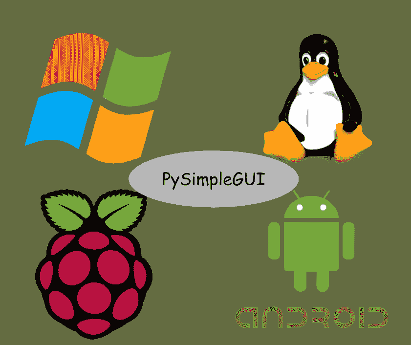

图片来源:作者根据免费图片创作的拼贴画

> 基本上，只要花一个下午的时间，并且对 Python 有一个基本的(不是高级的)熟悉，就可以使用这个库开始制作功能(和有用的)GUI 应用程序。

# 应用示例

安装库，

```
pip install pysimplegui
```

您还需要以下内容来运行本文中显示的示例，

*   Numpy
*   熊猫
*   Matplotlib
*   sci kit-学习
*   海生的

## (数据科学)“Hello World”

PySimpleGUI 中最简单的程序可以在一个小窗口上打印一个“ ***Hello World*** ”。但是，本着数据科学的精神，让我们让我们的介绍性程序变得更复杂、更有用，好吗？

下面是一个 [**脚本**](https://github.com/tirthajyoti/DS-with-PySimpleGUI/blob/main/GenRandom.py) 。姑且称之为‘gen random . py’吧。

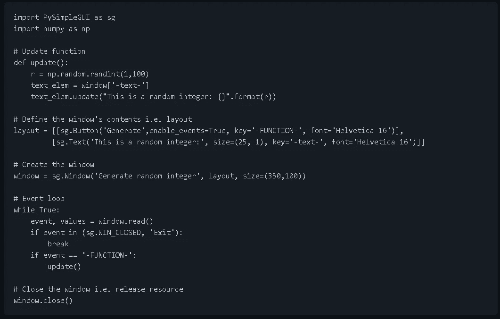

转到这个脚本所在的目录并运行，

```
python GenRandom.py
```

您将看到一个简单的窗口弹出，您可以点击一个按钮调用`update`函数(见上面的代码),次数不限，只要您想生成一个 1 到 99 之间的随机整数。注意这个无限循环动作的代码中的`while True`循环。

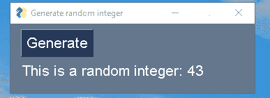

尽管这是一个非常简单的脚本，

*   布局(带有样式参数，例如`size`和`font`)和一个窗口
*   调用外部函数(事件)的按钮元素
*   该函数更新窗口对象的文本元素

我们基本上可以遵循相同的路径，并添加更多的布局、事件、逻辑和小部件层，以制作强大的数据科学应用程序。

## 其他小部件

这是另一个演示其他小部件的脚本。只需运行`python FontUpdate.py`命令，你会看到这个窗口弹出，你可以动态更新文本的字体。这是演示视频，

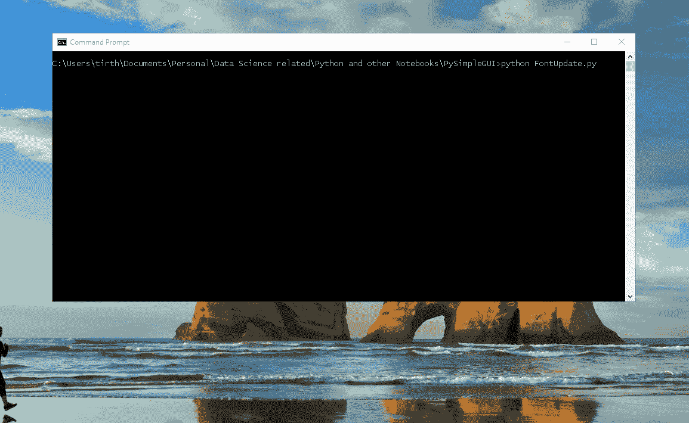

## 用方程求解器把它刻出来

运行`python QuadraticEquation.py`脚本命令，你会看到这个窗口弹出，在这里你可以输入一个二次方程的系数并得到解(即使根是复数！)

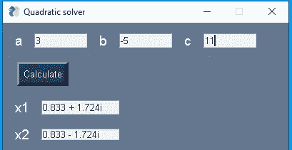

## 熊猫数据帧分析仪

在这个例子中，我们展示了创建一个与数据科学家广泛使用的对象(如熊猫数据框架)进行交互的 GUI 是多么容易。像往常一样，你通过启动 [**脚本**](https://github.com/tirthajyoti/DS-with-PySimpleGUI/blob/main/SimpleDataFrame.py) ，

```
python SimpleDataFrame.py
```

开始时，它会要求您提供一个数据集文件(CSV)。

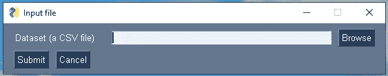

当你点击“浏览”按钮时，它将首先显示一个文件浏览器对话框。确保您从`data`目录下为这个演示选择了正确的数据集。

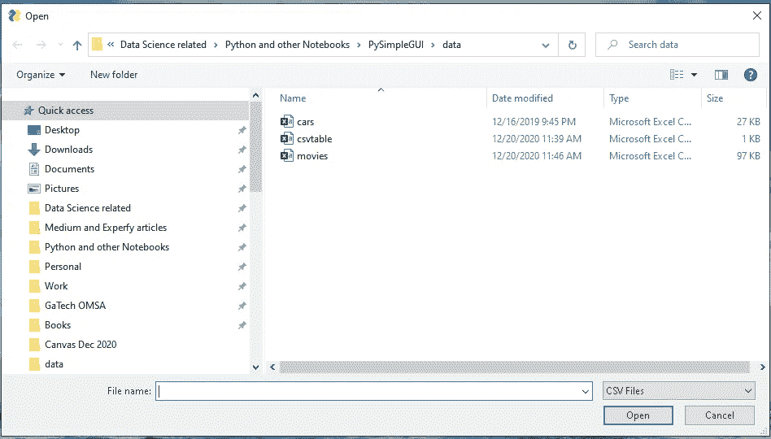

选择`cars.csv`后，您会看到弹出的其他提示。

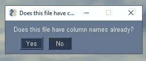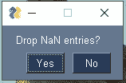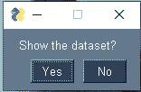

如果您在最后一个提示上单击“Yes ”,您将在新窗口中看到读取的数据集，

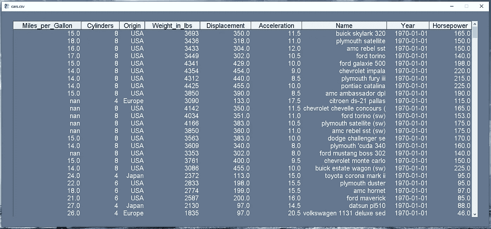

关闭该窗口后，一个新的弹出窗口将询问您是否想要查看关于该数据集的描述性统计数据。如果你点击“是”,你会看到这样的内容，

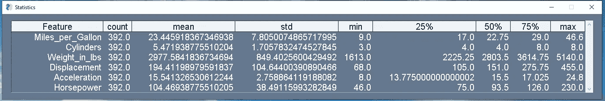

关闭该窗口后，另一个弹出窗口将询问您是否想查看样本图。如果你点击“是”,你会看到这样的内容，

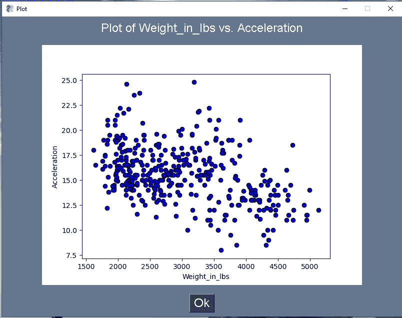

## 随机散点图生成器

这个应用程序是为了展示创造一个与用户互动的动态情节的能力。剧本在这里是[](https://github.com/tirthajyoti/DS-with-PySimpleGUI/blob/main/DrawRandom.py)**。当你运行它时，会弹出一个窗口，有一个简单的按钮，你可以想按多少次就按多少次，每次都会生成一个随机散点图。当然，它在后台使用 Numpy 和 Matplotlib。**

**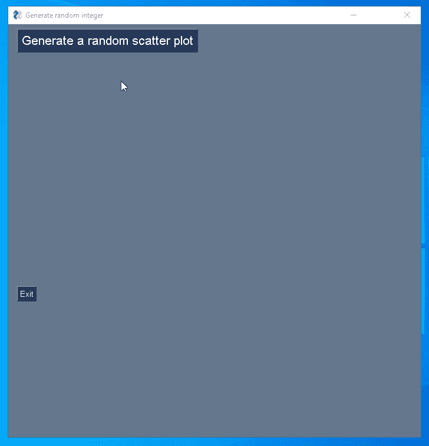**

## **曲线拟合应用程序**

**数据科学家和分析师总是在为一些数据拟合曲线或分析函数。创建一个简单的应用程序并使用 PySimpleGUI 进行演示是很容易的。**

**[**这里的**](https://github.com/tirthajyoti/DS-with-PySimpleGUI/blob/main/PolyFit.py) 是剧本。当您运行它时，将弹出一个窗口，其中包含用于生成和拟合二次多项式函数的按钮。此外，我们还放了一个小滑块来调整添加到数据中的高斯噪声水平。简而言之，这个例子向您展示了如何在一个轻量级 GUI 中集成数据拟合的基本特性。**

**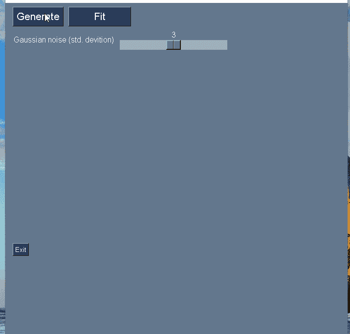**

## **Scikit-learn 模型拟合示例**

**最后，我们归结到一个真实的机器学习例子。我们展示了如何构建一个简单的应用程序，让您加载[皮马印第安人糖尿病](https://www.kaggle.com/uciml/pima-indians-diabetes-database)数据集，并在后台使用 Scikit-learn 将随机森林模型拟合到该数据。**

**剧本这里是 [**这里是**](https://github.com/tirthajyoti/DS-with-PySimpleGUI/blob/main/PimaPrediction.py) 。下图说明了这个 GUI 程序的运行。请注意，它涵盖了机器学习程序的标准流程。**

*   **加载数据集**
*   **用于删除 NaN 值和指示列是否有标题的选项**
*   **显示数据集**
*   **显示描述性统计数据**
*   **从加载数据集时自动填充的列表框中选择输出列**
*   **用于输出列的简单错误检查器**
*   **在后台运行机器学习分类算法，并在 GUI 上显示准确度**

**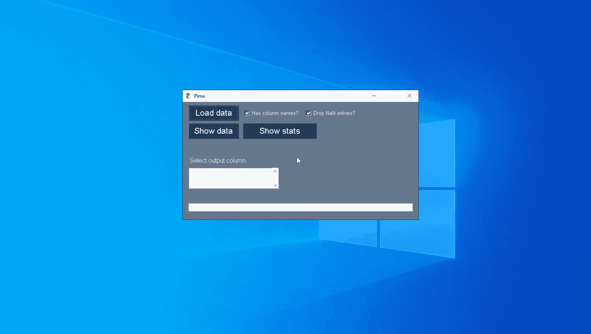**

# **摘要**

**我们描述了一个用于构建 GUI 程序的简单而强大的 Python 库，并讨论了它与更成熟的库相比的优势。许多优秀的教程都是关于用 Python 进行 GUI 编程的，但是在本文中，我们展示了与数据科学和数学编程相关的**示例**，这是传统教程中所没有的。**

**这是图书馆的官方食谱。**

**[](https://pysimplegui.readthedocs.io/en/latest/cookbook/) [## 食谱- PySimpleGUI

### 回到烹饪书上已经有一段时间了。因此，一些信息使用了较旧的…

pysimplegui.readthedocs.io](https://pysimplegui.readthedocs.io/en/latest/cookbook/) 

在本文中，我们展示了涵盖以下内容的示例

*   用于用户控制的各种类型的小部件
*   数据输入和输出—文件读取和绘图生成
*   传统的数据科学库，如 Numpy、Pandas、Matplotlib 和 Scikit-learn。

显然，我们可以在这些例子的基础上构建更多直观的数据科学 GUI 应用程序。我计划继续在我的 [**Github repo**](https://github.com/tirthajyoti/DS-with-PySimpleGUI) 中添加这样的例子，如果你喜欢，你可以叉或星。** 

***喜欢这篇文章吗？成为* [***中等会员***](https://medium.com/@tirthajyoti/membership) *继续* ***无限制学习*** *。如果您使用下面的链接，* ***，我会收到您的一部分会员费，而不会对您产生额外的费用*** *。***

**[](https://medium.com/@tirthajyoti/membership) [## 通过我的推荐链接加入 Medium—Tirthajyoti Sarkar

### 作为一个媒体会员，你的会员费的一部分会给你阅读的作家，你可以完全接触到每一个故事…

medium.com](https://medium.com/@tirthajyoti/membership)**