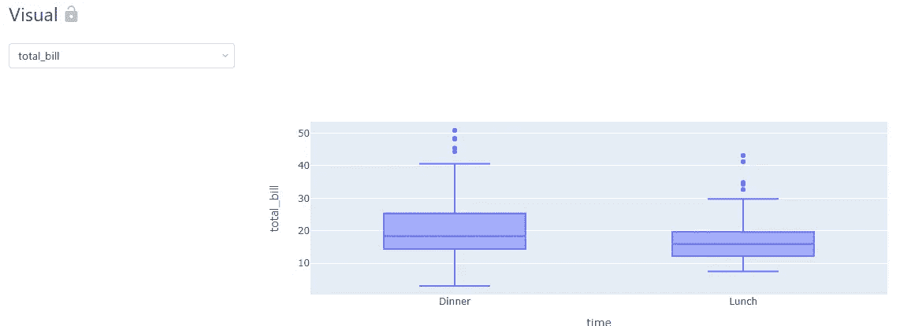
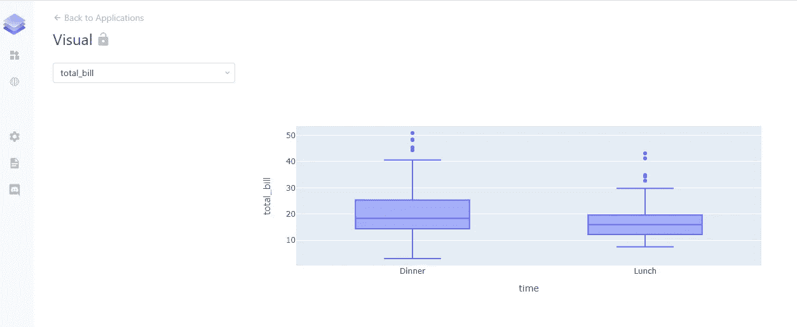

# 使用 Python 构建数据可视化 web 应用程序

> 原文：<https://towardsdatascience.com/building-data-visualization-webapps-using-python-769bc13fe12?source=collection_archive---------10----------------------->

## 使用 DStack 轻松创建交互式 web 应用程序



来源:作者

数据可视化是理解数据的一个重要方面。它揭示了数据点之间任何隐藏的模式或关联。有不同的 Python 库可用于可视化，但如果我们可以创建一个 web 应用程序来显示不同数据点的可视化，并包含不同的小部件，如下拉列表、复选框等，这不是很有趣吗？

类似地，创建机器学习模型并在 web 应用程序中使用它来生成预测可能是有用的，但通常有点困难。如果我们可以开发 ML 模型并轻松地在 web 应用程序中使用它们，这不是很好吗？

DStack 是一个开源 Python 库，用于构建 web 应用程序，不仅用于数据可视化，还用于机器学习实验。它允许我们用最少的代码创建 web 应用程序，并且易于使用。

在本文中，我们将探索 DStack 并创建一个用于数据可视化的基本应用程序，还将向您展示如何将机器学习模型推送到 DStack。

让我们开始吧…

# 安装所需的库

我们将从使用 pip 安装来安装 DStack 开始。下面给出的命令将使用 pip 安装 DStack。

```
pip install dstack
```

# 导入所需的库

在此步骤中，我们将导入加载数据集、创建数据可视化以及使用 DStack 为这些可视化创建 web 应用程序所需的所有库。

```
import dstack as ds
import plotly.express as px
import seaborn as sns
```

# 加载数据集和创建可视化

在创建可视化之前，我们需要创建一个应用程序的实例，我们将在该实例下编写所有代码。在这里，我们将编写用于加载数据、创建可视化并在 web 应用程序中呈现它们的代码。

```
app = ds.app() def get_data():
    df = sns.load_dataset('tips')
    return df visual = app.select(items=get_data().columns.tolist())def output_handler(self, visual):
    self.data = px.box(get_data(), x="time", y=visual.value()) 
app.output(handler=output_handler, depends=[visual])# deploy the application with the name "stocks" and print its URL 
url = app.deploy("visual")
print(url)
```

一旦我们运行这段代码，应用程序将在输出的 URL 上呈现。下面给出了应用程序主页。



网络应用(来源:作者)

在这个 web 应用程序中，我们可以清楚地看到我们在上面的代码中创建的盒状图，以及选择不同列来创建它们的盒状图的下拉列表。

继续尝试不同的数据集，创建不同的可视化效果，并让我知道您在回复部分的评论。

本文是与 [Piyush Ingale](https://medium.com/u/40808d551f5a?source=post_page-----769bc13fe12--------------------------------) 合作完成的。

# 在你走之前

***感谢*** *的阅读！如果你想与我取得联系，请随时通过 hmix13@gmail.com 联系我或我的* [***LinkedIn 个人资料***](http://www.linkedin.com/in/himanshusharmads) *。可以查看我的*[***Github***](https://github.com/hmix13)**简介针对不同的数据科学项目和包教程。还有，随意探索* [***我的简介***](https://medium.com/@hmix13) *，阅读我写过的与数据科学相关的不同文章。**