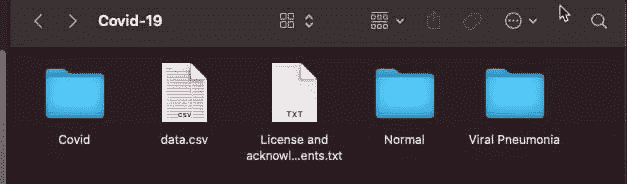
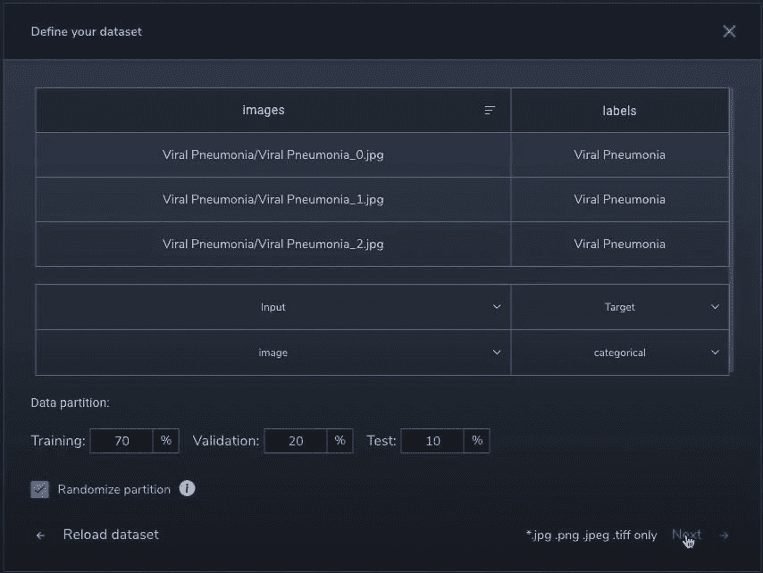
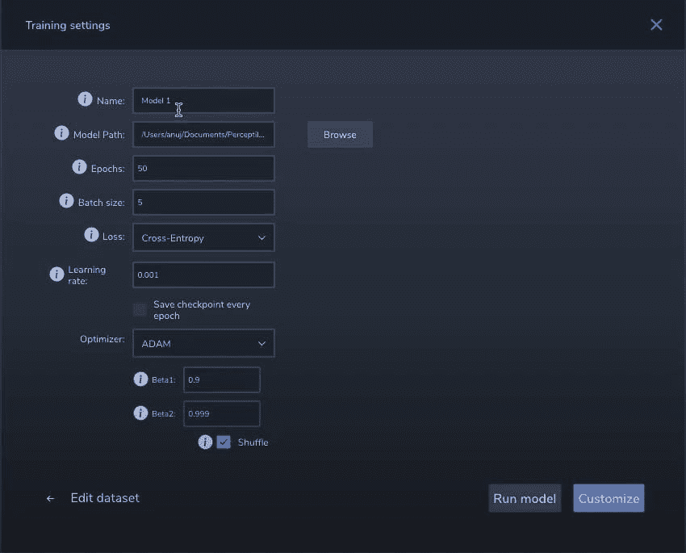
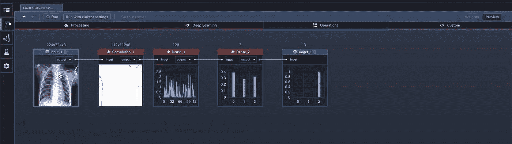
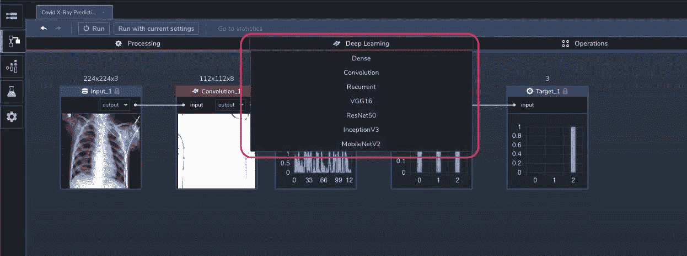
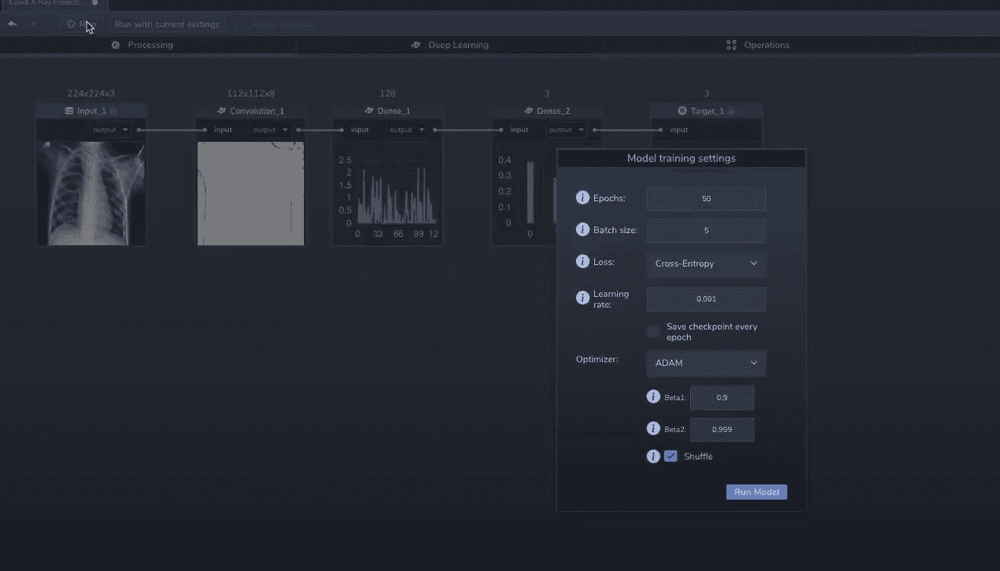
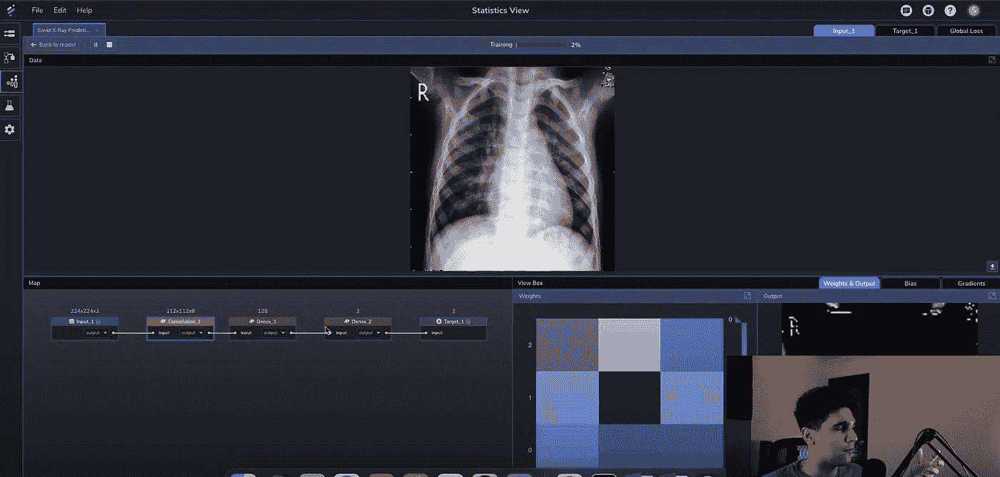
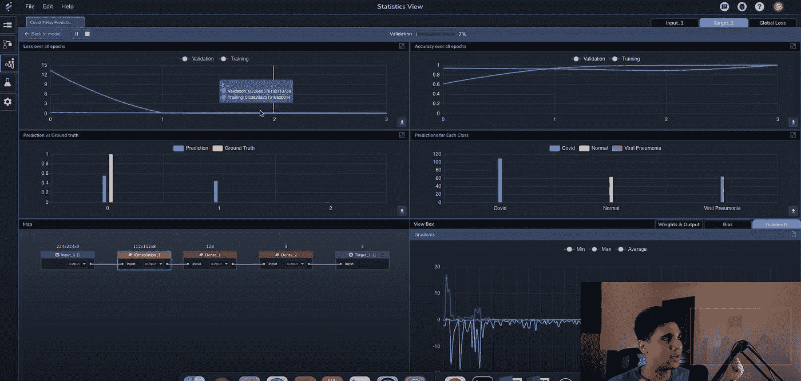
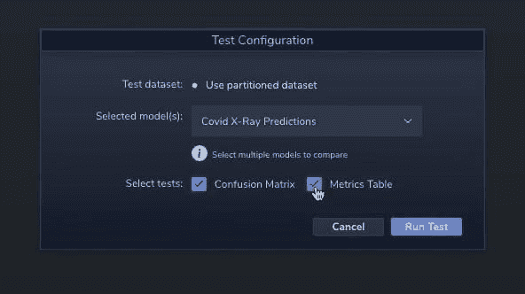
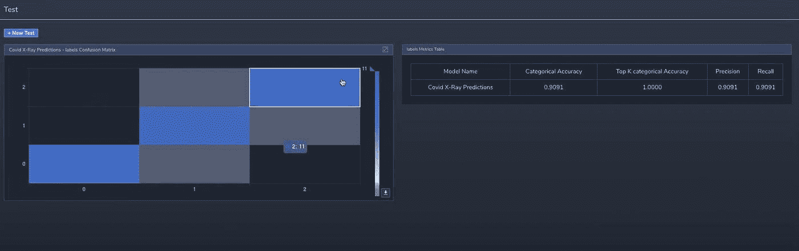

# 构建深度神经网络的简单方法|感知实验室

> 原文：<https://towardsdatascience.com/building-deep-neural-networks-the-easy-way-perceptilabs-bd065c9544c4?source=collection_archive---------30----------------------->

## 一种构建深度学习神经网络的可视化方法


马里乌斯·马萨拉尔在 [Unsplash](https://unsplash.com/s/photos/machine-learning?utm_source=unsplash&utm_medium=referral&utm_content=creditCopyText) 上的照片

PerceptiLabs 的视觉模拟模型提供了一个图形用户界面，用于创建、学习和评估设计，并允许进一步的编程修改。你可以得到快速的重复和更容易描述的改进的解决方案。

可感知的框架允许用户创建修改的模型配置，而不需要科学知识以及端到端模拟技术，这使得用户能够以完全清晰的方式感知和分析模型，从而提高意识并允许错误检测。

# 什么是感知实验室？

这实际上是 TensorFlow 的用户界面，具有先进的机器学习平台和图形建模过程，结合了编程的自由和拖放界面的便利，这将是 TensorFlow 之上的可视化设计。这可以使建模创建更简单、更快速，并且对更广泛的人群更有效。

它还包括各种学科的预建算法，可以由个人转移到工作场所，使他们能够在自己的数据集上修改和学习这些算法。税务欺诈识别、用于模式识别的对象分类以及其他应用都是该系统的使用应用。

# 感知实验室和机器学习

PerceptiLabs 成立的目标是让各种规模的企业更容易地进行机器学习建模。机器学习在我们的发展中可能有一个至关重要的方面，PerceptiLabs 现在正在努力让各种规模的企业在这个特定的行业中起步。

它分析当今可访问的不断增长的数据量，帮助企业识别信息的趋势，并根据这些趋势提供估计。每个企业都有一系列的应用，例如使用对象识别来预测哪些杂货店的库存越来越少，或者利用图片识别来识别拥挤的场地中的人。

用户可以通过 PerceptiLab 的可视化建模解决方案，轻松地为任何类型的业务创建机器学习算法。它使用户能够点击和拖动项目和连接元素，然后在软件立即编写程序之前配置变量。用户可以快速训练和微调他们的机器学习模型，并观察其性能。

# 感知实验室的工作流建模


*照片由* [*托比亚斯·卡尔松*](https://unsplash.com/@tobias_carl?utm_source=unsplash&utm_medium=referral&utm_content=creditCopyText) *上*[*Unsplash*](https://unsplash.com/s/photos/flow?utm_source=unsplash&utm_medium=referral&utm_content=creditCopyText)

预制元素封装 TensorFlow 数据，并将其简化为可见的组件，同时仍然支持定制的代码更新。这个图形界面使您能够将这些元素移动到描述系统设计的结构中。这种用户界面使得实现额外的功能变得简单，例如一键编码和厚分层。

当您更改 PerceptiLabs 中的设计时，每个元素还会提供关于它如何转换数据集的图形信息。这种即时概览减少了在查看结果之前执行整个模拟的要求，使您可以更快地进行更改。

每当你将 PerceptiLabs 与任何其他平台进行比较时，你会发现图片可视化和信息分类要容易得多。您还可以观察每个元素如何改变信息，以及这些改变如何促成最终的分类。

在建模期间，PerceptiLabs 检索并利用可访问数据集的初始部分，并在您实施调整时重新运行系统，您将立即看到您的修改如何影响您的结果。这个有用的工具允许您检查结果，而不必对整个样本执行算法。

# 在感知实验室上建立你的第一个深度学习模型

## 如果你对更全面的视频教程感兴趣，可以看看下面我的 youtube 视频

用简单的方法建造 DNN

**第一步:在本地** Open 终端上安装并运行 Perceptilabs，使用 pip 在本地安装并运行该工具(确保拥有 python 版本< 3.9

```
pip install perceptilabs 
perceptilabs
```

安装完成后，该工具在 localhost:8080 上启动并运行

**第二步:理解数据集**我使用的是 Perceptilabs 中提供的默认样本数据集`X-Ray scans of patients`。数据集具有带 3 个标签的 x 射线扫描- `Normal`、`Viral Pneumonia`、`Covid`



作者截图

要在 Perceptilabs 中导入这个数据集，你需要正确的格式，它在`data.csv`文件中，包含带有相应标签的文件路径

**步骤 3:转到模型中心(左边第一个选项卡)，点击创建模型并导入数据集** `**data.csv**`



作者截图

选择 URL 作为输入要素，选择标签作为目标保持数据分区为默认[70%训练，20%验证，10%测试]

选择训练设置



作者截图

提供`Model Name`、`Epochs`、`Batch Size`、`Loss Function`、`Learning Rate`等详细信息，点击定制，进入建模窗口

在建模窗口中，您将看到神经网络的所有层都按照建模工具的推断进行布局，看起来应该类似于下面的屏幕截图



默认情况下，它包含一个连接到输入图像的卷积图层和两个使用 softmax 将其转换为最终标签输出的密集图层

**第四步:使用工具和多层**你可以添加更多的深度学习组件作为建模工具的一部分，或者你可以轻松地为另一层编写一个定制的 Keras 函数



作者截图

构建任何深度学习模型都需要大量的迭代，因此可视化方法非常方便，我们可以即插即用并查看迭代结果

**步骤 5:开始训练并查看实时统计数据(统计数据视图)**单击顶栏上的“使用当前设置运行”开始训练模型，按照前面的讨论传入模型设置，对于分类用例，交叉熵损失函数更有意义。



作者截图

开始建模后，您将被重定向到统计视图，以查看模型在接受训练时的实时统计数据，您应该能够看到正在接受训练的数据集的每一行的权重输出、损失和准确性。所有这些分析都可以一层一层地进行



作者截图

您还应该能够看到精确度随着纪元在全球范围内的推移而提高



作者截图

**步骤 6:在测试数据集上运行验证**转到测试视图并运行测试，以获得模型度量和标签的混淆矩阵



作者截图

完成后，您应该能够看到您使用这些测试指标(如`Model Accuracy`、`Precision`、`Recall`)构建的模型的质量



作者截图

# 为什么像感知实验室这样的东西有意义？

数据分析师可以使用这种技术来更有效地执行机器学习技术，并很好地理解它们。

**帮助您获取实时信息**

每个建模元素数据的实时度量和详细摘要都是可用的。您可以简单地跟踪和分析变量的行为，实时排除故障，并确定您的系统可以改进的地方。

**帮助您在 GitHub 上分享它们**

PerceptiLabs 允许您维护许多模拟，评估它们，并快速有效地与您的团队交流发现。将数据导出为 TensorFlow 框架。

**帮你克服兼容性问题**

当一家公司的研究人员创建模型并将其投入运行时，他们必须都使用同一个模型。否则，就会出现问题。根据一些专家的说法，如果公司里的每个人都使用 PerceptiLabs 的技术，这个问题就可以避免。**帮你导出模型**

Perceptilabs 允许您检查和解释程序如何运行和执行，以及为什么会产生特定的结果。您也可以在同意后将数据导出为训练 TensorFlow 版本。

**使用感知器的优势**

这个工具提供了广泛的好处。有些是；

*   快速建模—包括简单的拖放式用户界面，有助于简化系统设计的创建和分析。
*   可见性——它可以用来开始理解你的策略是如何执行的，以便对其进行解释。
*   多功能性—作为一个基于 TensorFlow 的图形 API，这允许程序员使用 TensorFlow 的低级接口，同时也允许他们使用其他 Python 库。

# 结论

如果企业要接受机器学习，开发算法的程序必须简化。PerceptiLabs 提供图形化机器学习建模解决方案，帮助企业实施计算机学习。它不仅能让你快速开发计算机学习网络，还能给你一个模型如何运行的图形表示，并能让你彼此交换信息。

*最初发表于*[*https://anujsyal.com*](https://anujsyal.com/building-deep-neural-networks-the-easy-way-or-perceptilabs)*。*