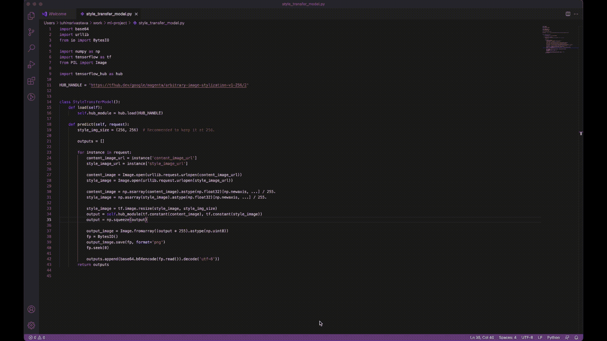
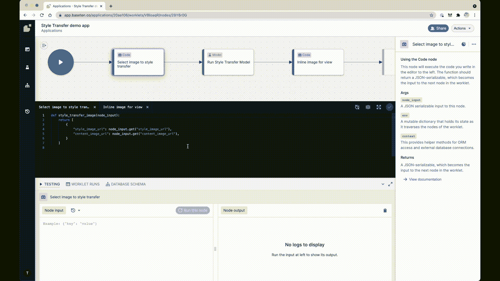
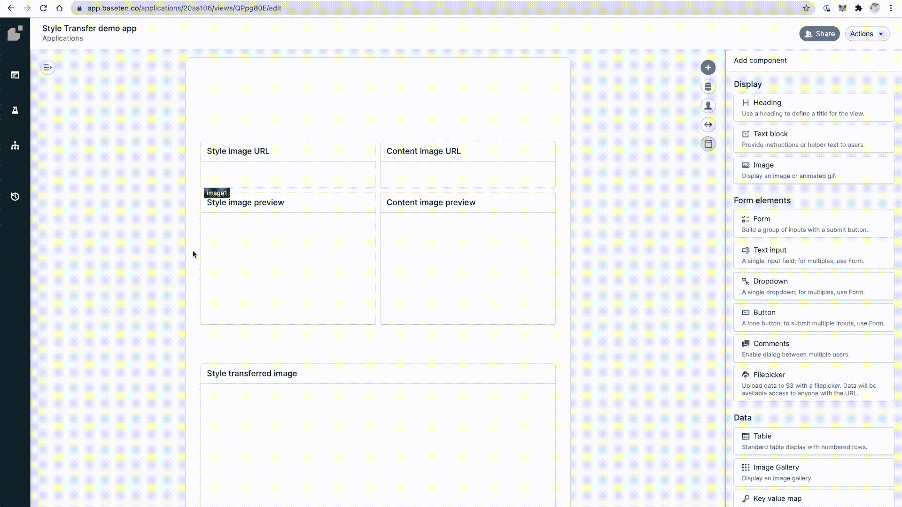

# 将机器学习模型产品化

> 原文：<https://towardsdatascience.com/building-end-to-end-machine-learning-powered-applications-673ea9e9c6d3?source=collection_archive---------10----------------------->

## 如何构建基于机器学习的端到端应用

构建利用机器学习的端到端应用程序需要大量的工程工作——处理 Flask 应用程序以服务于模型；设置复杂的基础设施(如 Docker 和 Kubernetes)以进行适当的扩展；一个完全独立的产品工程工作流，用于集成到现有系统中；和前端开发来构建新的界面。

大多数机器学习从业者要么必须学习这些技能，要么依赖他们的工程合作伙伴的帮助。因此，用机器学习从零到一地解决真正的问题是极其昂贵的；解决这一系列问题的工具是不存在的，或者充其量是粗糙的。

# 将机器学习产品化很难

将现有模型产品化的步骤| Image credit: BaseTen

通常，将现有模型产品化有三个不同但相互关联的步骤:

1.  为模特服务
2.  编写应用程序的业务逻辑，并在 API 背后为其服务
3.  构建与上述 API 交互的用户界面

如今，前两步需要开发运维与后端工程技能的结合(例如，“Dockerizing”代码、在需要时运行 Kubernetes 集群、建立 web 服务……)。最后一步——构建一个最终用户可以实际交互的界面——需要前端工程技能。必要技能的范围意味着反馈回路几乎不可能建立，并且将机器学习应用到可用产品中需要太多时间。

# 简化流程

我们的团队作为数据科学家和工程师亲身经历了这种痛苦；所以，我们建造了 [BaseTen](https://www.baseten.co) 。

BaseTen 是一个应用构建器，允许用户部署机器学习模型，服务 API，构建前端 UI，而不必担心基础设施，部署或学习反应。

在本帖中，我们将通过一个常见的用例来介绍 BaseTen 的主要构建模块:

> 作为一名数据科学家，我经常想把我的模型从笔记本电脑中拿出来，交给其他利益相关者或朋友，这样他们就可以用动态输入来玩模型了。这一点很重要，因为如果没有用不同的输入来查询模型以查看输出如何变化的第一手经验，就很难衡量模型是如何工作的。

为了这个演示的目的，我们将使用众所周知的神经风格转移模型，我们将最终得到一个可以与外部观众共享的可用应用程序。

## **1。部署模型**

如上所述，第一步是部署模型。BaseTen 允许通过从命令行工具(使用 pip 安装)调用`baseten.deploy`来部署 scikit-learn、Tensorflow 和 PyTorch 模型。如果模型更加定制，可以上传一个定制模型，只需要一个`load`和`predict`方法([这里有一个例子](https://gist.github.com/tuhins/636ac4b79d7f00cb744c4529245b4070))。或者，可以从模型动物园部署预先训练的模型。

在下面的例子中，我们部署了来自 TensorFlow Hub 的深度学习模型，该模型以另一幅图像的风格组成一幅图像。

BaseTen 客户端支持单行模型部署。|图片来源:BaseTen

一旦模型被部署，转到模型管理页面来查看关于模型的可编辑元数据，它的部署状态，版本，以及如何从其他服务调用它。

## **2。用预处理和后处理代码包装模型，并在一个 API 后面提供它**

通常，服务模型需要的不仅仅是将其称为 API。例如，可能有预处理和/或后处理步骤，或者可能需要在模型被调用后执行业务逻辑。

要做到这一点，用户可以用 BaseTen 编写 Python 代码，它将被包装在一个 API 中提供服务——无需担心 Kubernetes、Docker 和 Flask。Python 环境可以完全定制(例如安装 pip 包)，并且包括 Postgres 数据存储。

所有这些都被包装在一个*工作包*中，在 BaseTen 中描述为一个由不同类型的节点*组成的推理图。* Worklets 允许用户根据应用程序的业务逻辑和整体工作流程进行思考。在创建了一个 worklet 之后，可以通过一个自动生成的 API 端点、一个 cron 作业或者通过将它连接到一个流数据源来调用它。

使用“工作件”为模型提供丰富的 API

在第一个 worklet 示例中，我们添加了预处理代码来从请求中提取模型输入，称为模型，然后将模型输出转换成我们期望的格式。在这种情况下，请求包含要传输的样式和将由模型修改的图像的源。后处理步骤只是将一些元数据添加到模型生成的图像中。

## **3。构建 UI(当你不是前端工程师时)**

当我们自己训练机器学习模型时，我们经常希望构建有状态的用户界面，或者利用我们的模型，或者根据我们的模型的输出进行操作。在 BaseTen 中，这些被称为*视图*。

使用 BaseTen 中的拖放 UI，很容易添加和排列组件来构建视图，包括文本输入、文件选择器、表单、表格、PDF 查看器和数据可视化。BaseTen 还包括许多实用程序，可以轻松地收集和显示数据，对用户输入做出反应，并调用内部和外部 API。视图可以相互链接以构建多页面应用程序。与基于笔记本的应用构建器不同，用户状态是一个一级概念。这意味着 BaseTen 可以为复杂的人在回路应用提供动力。最后，视图可以公开共享或嵌入，并在需要时支持基于角色的访问控制。

在下面这个简单的例子中，我们构建了一个视图来与上面构建的部署模型和 API 进行交互。最终用户可以提供样式和内容图像的 URL，查看预览，单击按钮，并查看结果图像，将第一个图像的样式与第二个图像的内容相结合。

在 BaseTen 视图中运行风格转换模型| Image credit: BaseTen

虽然这个用例非常简单，但是在不到五分钟的时间里，我们就能够为样式转换模型部署一个活动的 API，并创建一个用户界面来测试这个模型。使用相同的构建模块，早期用户已经为用户建立了交互式工具，以提供对模型预测的反馈，内置学习的数据标签应用程序，以及人在回路中的决策流程。

## **用你自己的模型开始建造**

数据科学家和机器学习工程师应该能够以真实产品的形式表达他们模型的力量，同时避免部署问题和不得不将 API 和接口拼凑在一起。

我们很高兴向早期用户开放对 [BaseTen](https://www.baseten.co) 的免费访问，以帮助塑造我们的产品路线图。我们希望从您那里得到的只是您的反馈。我们迫不及待地想看看你会做什么。