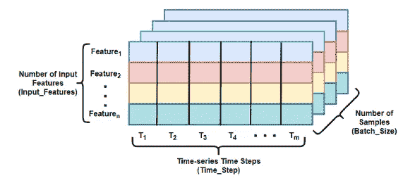
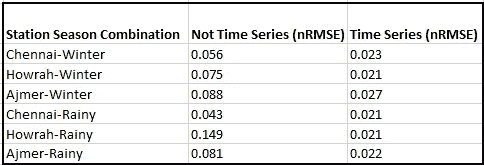

# 建立基于 LSTM 的太阳能预测模型

> 原文：<https://towardsdatascience.com/building-lstm-based-model-for-solar-energy-forecasting-8010052f0f5a?source=collection_archive---------16----------------------->

## 处理 LSTM 的一些设计问题

图片来源:[https://unsplash.com/photos/mG8sgwkMhCY](https://unsplash.com/photos/mG8sgwkMhCY)

太阳能是清洁和可再生能源替代来源的最重要组成部分之一。太阳能发电的预测对于下游应用和与传统电网的整合至关重要。不是测量太阳能电池的光电输出，而是经常估计从太阳接收的辐射作为太阳能发电的替代。用于测量的量称为总水平辐照度(GHI ),它包括直接辐射和散射辐射。

预测的方法可以大致分为以下几种

图 1:预测模型的类型 a)基于方法 b)基于预测窗口 c)基于变量数量。(图片来源:作者)

不同的模型是物理模型(NWP)、统计模型(ARIMA、GARCH)、机器学习模型(随机森林、Boosting)和基于深度学习的模型(RNN、LSTM、GRU)。基于预测窗口，如果少于 30 分钟，则是非常短期的预测，如果多于 30 分钟，则是短期的预测。短期预测现在更适合印度的情况。如果你想开始了解 LSTM，你应该浏览阅读量最大的[博客](https://colah.github.io/posts/2015-08-Understanding-LSTMs/)。

而我们希望基于理解复杂和非线性模式的能力来使用 LSTM。我们浏览了很多博客和论文，有一些事情我们不确定。我们计划系统地检查它们。这些数据来自 2016 年，分别与 Chennai、Howrah 和 Ajmer 的三个太阳能发电站有关。对于每个站点，我们从两个季节获取数据，即雨季(由于云层覆盖，最不稳定)和冬季(最不稳定)。还需要指出的是，我们分别讨论了“湿热”和“干热”气候带。对于每个问题，都进行了实验并分析了结果。如下图所示，LSTM 类型用三维形状对数据进行建模。

图 2a:LSTM 型模型的输入数据形状。(图片来源:作者)

**数字输入特性:**这简单地告诉我们，有多少变量用于预测。除了使用过去的 GHI 值，我们还可以使用其他气象变量，如温度、湿度等。

**时间步数:**这通常被称为输入窗口大小，即我们用于预测的序列的过去值的数量。例如，如果我们打算预测上午 10:00 的值，我们可以考虑上午 09:55、09:50、09:45、09:40 以及 09: 35 和 09: 30 的值。在这种情况下，窗口大小为 6。

**批量:**我们知道，对于所有的 ML/DL 模型，我们都试图使用梯度下降法找到模型的最佳参数。我们还知道，与其在整个训练数据上寻找梯度，不如在较小的批次上寻找梯度通常更有效。批处理大小参数负责处理这个问题。

还有一个输出窗口大小的概念，它基于我们是只对下一个观察感兴趣还是对几个后续观察感兴趣。这显示在下图中。如果只有一个观察，我们将有一个单一的输出节点，否则超过一个输出节点。

图 2b:具有输出窗口的 LSTM 网络

> D **设计问题 1:LSTM 的好处之一似乎是不需要时间序列相关的预处理，如去除趋势和季节性，然而研究界似乎正在应用预处理。所以我们想研究是否需要预处理。**

实验装置很简单。我们通过应用 a)无预处理和 b)有预处理(去除季节性，数据中没有趋势)来比较性能。结果如下图所示。

图 3:用原始数据和预处理数据比较模型(图片来源:作者)

很明显，LSTM 在原始时间序列上的训练给出了更好的结果。性能是根据标准化 RMSE 和解释方差得分来衡量的，它们是时间序列预测任务的标准度量。

> **设计问题 2:许多从业者似乎也在非时间序列设置中使用 LSTM，也就是说，他们使用感兴趣变量的先前值，但将它们视为不同的自变量。有意义吗？**

实验装置简单而琐碎。在设置 1 中，数据形状为(72，1，30)，30 个特征，窗口大小为 1。在设置 2 中，数据形状取为(72，30，1)，一个特征，窗口大小为 30。

图 4:基于非时间序列和时间序列设置的模型比较(图片来源:作者)

看到相当多的博客和研究论文将时间步长作为独立的特征，我们真的很困惑，幸运的是，结果显示时间序列设置的结果要好得多。

> D **设计问题 3:一个普遍的直觉是，当我们增加节点或层时，性能应该总是增加的。但是随之而来的是训练时间以及对训练数据的需求的增加。问题是这种直觉有多真实，在哪里停止？**

这里，我们使用了一个非常简单的想法。如果给他们更难的问题，任何学习者都需要学得更多。根据同样的类比，如果数据更难处理，任何网络都将需要更大的容量(在层、节点等方面)。一个明显的后续问题是，我们如何衡量这一点？我们认为输入数据显示的可变性越大，预测就越困难。因此，我们首先测量每个站点的 GHI 的可变性，然后针对不同数量的节点进行训练和评估。结果如下所示。

图 5:我们应该继续增加网络的复杂性吗

对于变化率在 50 左右或小于 50 的站点-季节组合，我们需要尽可能多的节点，当变化率超过这个范围时，我们需要大约 100 个节点来达到最佳预测。下图是上表的复制。

图 6:节点数量和性能

**结论**:

LSTM 可以是一个很好的太阳预测模型，建议使用原始时间序列，它们应该被视为时间序列数据，而不是将每个时间步长视为一个单独的属性。更多的节点不一定意味着最好的性能，更复杂的场景将需要更复杂的结构，并且对于简单和复杂的场景，在一定数量的节点之后，学习饱和(可能过度适应)

**致谢**:

这是 Sourav Malakar 作为加尔各答大学数据科学实验室(由 A . k . choudh URY IT 学院和统计系设立)的博士学者的工作成果。与 Amlan Chakrabarti 教授和 Bhaswati Ganguli 教授的多轮讨论帮助很大。我们也感谢国家风能研究所(NIWE)的领域知识，最后但并非最不重要的是 LISA(https://sites.google.com/site/lisa2020network/about[跨学科统计分析实验室](https://sites.google.com/site/lisa2020network/about))项目，该项目实际上使团队更具凝聚力。rested 的读者可以在这里阅读发表在 Springer Nature Applied Science[上的完整文章。](https://link.springer.com/article/10.1007/s42452-021-04421-x)