# 使用 KNIME 中的树集成学习器构建用于领导决策的机器学习模型

> 原文：<https://towardsdatascience.com/building-machine-learning-model-for-lead-decision-using-tree-ensemble-learner-in-knime-1217bb17ffcc?source=collection_archive---------25----------------------->

## 为 KNIME 平台中的销售线索决策构建基于分类的预测模型的实用指南

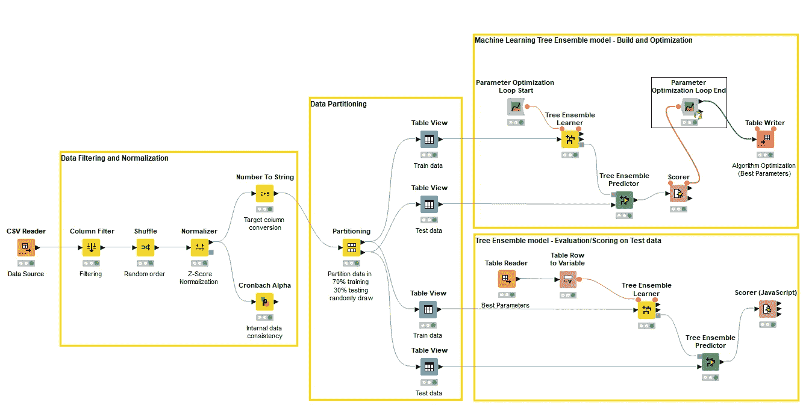

作者图片

有机会在**线索生成领域**利用**机器学习算法**，我遇到了设计和实现各种**线索评分和线索决策预测模型**的可能性。之前，在讨论将基于 Python 的 Scikit-learn 模型集成到微软。NET 生态系统，我还介绍了这种线索评分解决方案的概念、潜力和好处。在参考文章的“进一步应用”一节中，我还提到了使用基于分类的算法开发**销售线索决策集成模块。假设集成方法遵循已经描述的步骤，在本文中，我将**更多地关注由 [KNIME 平台](https://www.knime.com/)支持的 lead decision 模型设计**。因此，我将强调构建系统**的**方法，包括导入、标准化、准备和应用数据以训练、测试、评估和优化决策模型的核心节点。**

**注意:本文中介绍的解决方案设计仅用于演示目的——简化到强调核心基础和构建模块的程度，但它也完全适用于在真实测试或生产部署系统中构建和导出基于预测决策的模型。*

***注意:我不打算详细介绍树集成机器学习算法的本质或工作方式，以及与其配置参数相关的实际意义和各种可能性。深入了解每个配置属性的过程和详细说明是不同的综合性主题，需要特别注意和描述。更多信息可以在文章中提到的参考文献和文档中找到，也可以在官方图书馆的文档中找到。*

# 什么是领导决策？

**Lead Decision** 遵循我在上一篇文章中定义的几乎相同的定义结构。唯一的区别只是向公司的销售线索数据库分配具体决策的技术，以指导营销和销售团队向最终客户转化。这种差异直接源于处理模型输出的技术方法，直接分配决策(不包括相关概率的计算)。虽然这看起来像是一个更一般化的方案，但它被认为是一个全面而有益的调整战略和**提高营销和销售团队绩效和效率的过程**。

# 导入数据

正如在构建线索评分原型的参考文章中提到的，我还使用了 Kaggle 上公开的相同的[数据集。考虑到初始数据概述、探索性数据分析(EDA)的过程和数据预处理超出了本文的范围，我将**直接介绍经过处理的数据结构概述，并将其导入到 KNIME 平台**。在这方面，我使用了](https://www.kaggle.com/amritachatterjee09/lead-scoring-dataset)[Jupyter Notebook environment](https://jupyter.org/)和 [NumPy](https://numpy.org/) 和 [pandas](https://pandas.pydata.org/) 等数据分析和辩论库的优势，其次是 [Matplotlib](https://matplotlib.org/) 和 [seaborn](https://seaborn.pydata.org/) 等统计数据可视化库的支持。

生成的数据集维度、属性及其在本地系统路径上的存储过程如下所示(数据文件以逗号分隔值格式保存)。

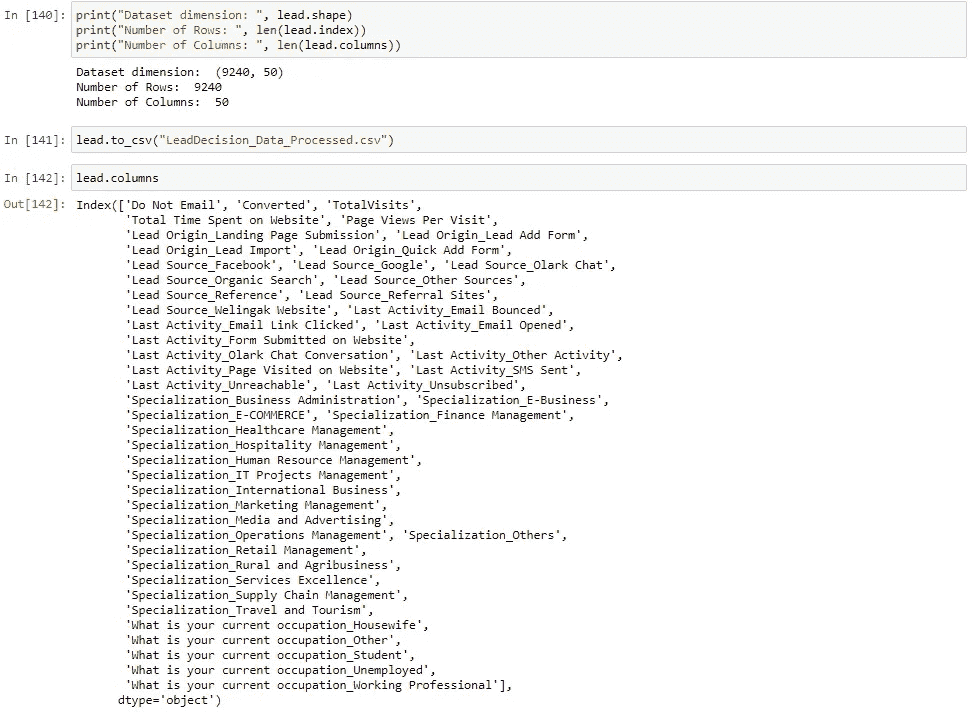

作者图片

在这个场景中，我不会考虑应用额外的特性工程和维度缩减，而是将所有特性(作为数据分析和处理的结果而检索到的)直接导入到 KNIME 平台中。

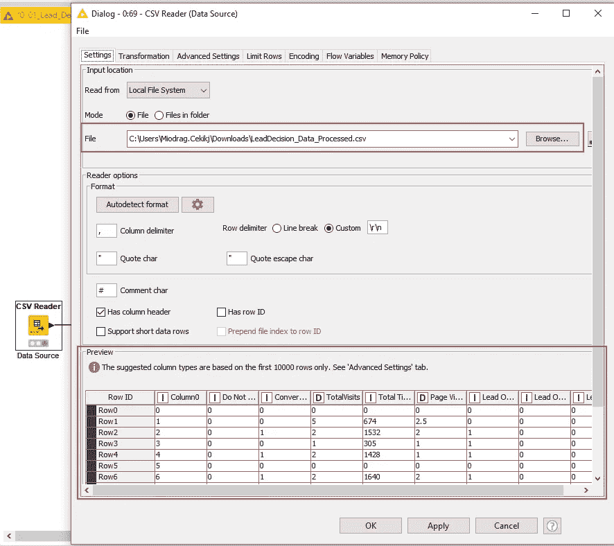

作者图片

# 数据过滤和标准化

考虑到数据最初是在 Jupyter Notebook workspace 中探索和处理的，我将继续解释过滤和标准化数据模块的**设计，如下图所示。**

作者图片

我使用用于手动配置的[列过滤器](https://hub.knime.com/knime/extensions/org.knime.features.base/latest/org.knime.base.node.preproc.filter.column.DataColumnSpecFilterNodeFactory)设置数据过滤，它提供了删除一个额外的自动生成的存储记录的增量 id 值的列的功能。该节点还可以用于数据预处理过程中更高级的过滤场景，支持通配符和类型选择过滤模式。

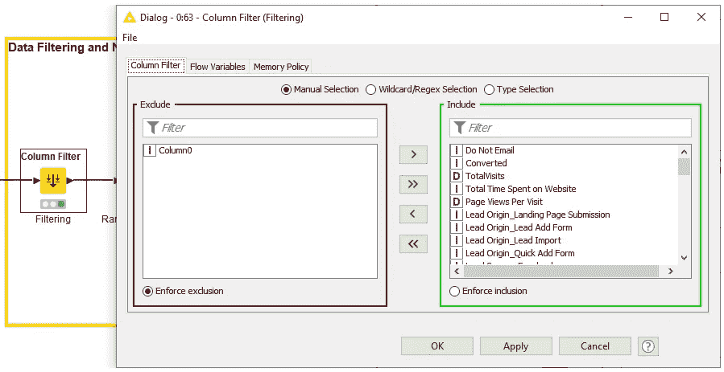

作者图片

在数据过滤过程之后，我添加了标准的[混洗节点操作器](https://hub.knime.com/knime/extensions/org.knime.features.base/latest/org.knime.base.node.preproc.shuffle.ShuffleNodeFactory)，用于实现随机记录顺序(应用默认配置)。随后结合[规格化器节点](https://hub.knime.com/knime/extensions/org.knime.features.base/latest/org.knime.base.node.preproc.normalize3.Normalizer3NodeFactory)，用于基于**高斯(0，1)分布**使用 [Z 分数线性规格化](https://www.statisticshowto.com/probability-and-statistics/z-score/)规格化数字特征(在本例中为**‘总访问量’**，**‘网站总花费时间’**，**‘每次访问的页面浏览量’**)。

作者图片

更进一步，我还将标准化数据的输出连接到 [Cronbach Alpha 节点](https://hub.knime.com/knime/extensions/org.knime.features.stats/latest/org.knime.base.node.stats.correlation.cronbach.CronbachNodeFactory)中，用于比较各个列的方差和所有列之和的方差。一般来说，它代表一个[可靠性系数，分别作为内部一致性和特征相关性](https://en.wikipedia.org/wiki/Cronbach%27s_alpha)的度量。系数的解释超出了本文的范围。

我将使用字符串节点的[编号来结束此模块，以便将目标属性**‘已转换’**类型转换为字符串(以下模块需要该格式来准备数据和构建机器学习模型)。](https://hub.knime.com/knime/extensions/org.knime.features.base/latest/org.knime.base.node.preproc.colconvert.numbertostring2.NumberToString2NodeFactory)

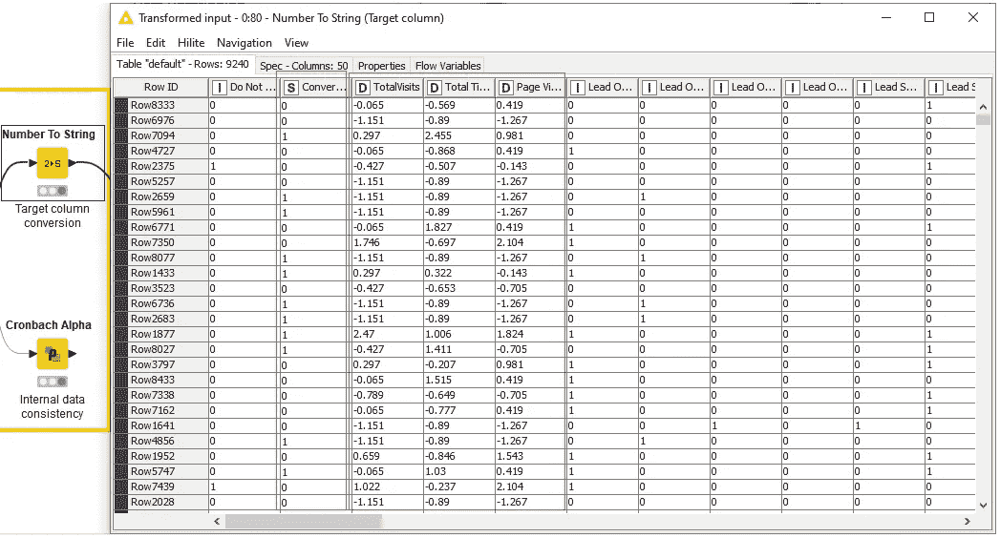

作者图片

# 数据划分

该模块代表实际建模程序之前的阶段。因此，我使用[分割节点](https://hub.knime.com/knime/extensions/org.knime.features.base/latest/org.knime.base.node.preproc.partition.PartitionNodeFactory)和两对[表格视图节点](https://hub.knime.com/knime/extensions/org.knime.features.js.views/latest/org.knime.js.base.node.viz.pagedTable.PagedTableViewNodeFactory)来**将数据分割成训练和测试子集**——这是继续使用**监督机器学习方法**的先决条件。

作者图片

我想提一下，我决定相对分割数据集，将 70%的数据分配给**作为训练数据，30%作为测试数据**，并配置它使用明确指定的随机种子随机抽取。这个过程有助于在多个不同的流执行中保持执行结果的一致性。在这种情况下，它可以确保数据集总是被完全相同地划分。插入表视图只是为了将数据传输到后面的模块，并改进流结构和可读性。

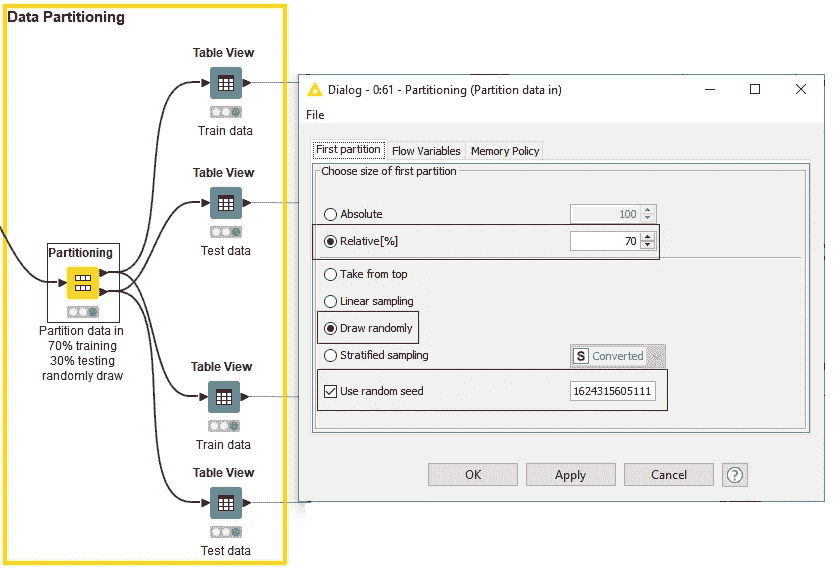

作者图片

# 模型建立和优化

通常，我决定使用[树集成学习器](https://hub.knime.com/knime/extensions/org.knime.features.ensembles/latest/org.knime.base.node.mine.treeensemble2.node.learner.classification.TreeEnsembleClassificationLearnerNodeFactory2)和[树集成预测器](https://hub.knime.com/knime/extensions/org.knime.features.ensembles/latest/org.knime.base.node.mine.treeensemble2.node.predictor.classification.TreeEnsembleClassificationPredictorNodeFactory2)节点来实现监督机器学习模型。根据简介中引用的文章，**构建线索决策系统意味着实施机器学习算法进行分类，而不是基于线索评分和逻辑回归的解决方案**。由于我也提到了**随机森林分类器**，我想强调的是，系综树学习器代表了一个决策树系综(就像随机森林变量的情况一样)。KNIME 中还有[随机森林学习器](https://hub.knime.com/knime/extensions/org.knime.features.ensembles/latest/org.knime.base.node.mine.treeensemble2.node.randomforest.learner.classification.RandomForestClassificationLearnerNodeFactory2)和[随机森林预测器](https://hub.knime.com/knime/extensions/org.knime.features.ensembles/latest/org.knime.base.node.mine.treeensemble2.node.randomforest.predictor.classification.RandomForestClassificationPredictorNodeFactory2)节点。尽管如此，我还是选择了系综树实现，因为结果解释过程中需要丰富的配置可能性和简化的属性统计——结果解释(特性重要性)超出了本文的范围。树集合节点被提供**超参数优化/调整**的[参数优化循环开始](https://hub.knime.com/knime/extensions/org.knime.features.optimization/latest/org.knime.optimization.internal.node.parameter.loopstart.LoopStartParOptNodeFactory)和[参数优化循环结束](https://hub.knime.com/knime/extensions/org.knime.features.optimization/latest/org.knime.optimization.internal.node.parameter.loopend.LoopEndParOptNodeFactory)节点所包围——执行过程如下图所示。

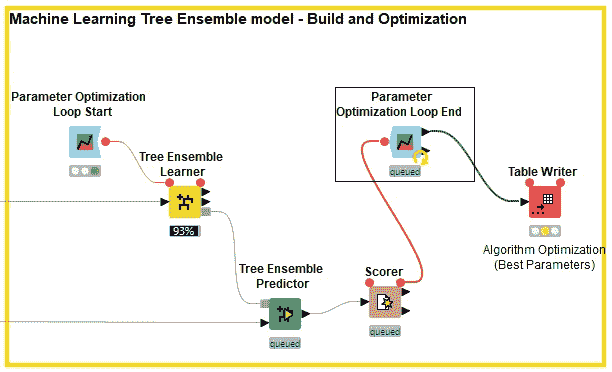

作者图片

参数优化循环开始节点基于先前提供的配置开始参数优化循环。在这方面，它利用了 KNIME 中的流变量的概念，确保每个参数值将作为特定的流变量传递。我使用标准设置方法将**‘模型数量’**、**、【最大级别】**和**、【最小节点大小】**配置为树集成算法参数。利用值区间和步长，该循环提供了不同分类模型的构建和评估。

作者图片

同时，参数优化循环结束节点从流变量收集目标函数值，并将控制转移回相应的循环周期。它还提供了**最佳参数输出端口**，我从这里检索最佳参数组合，以获得最大化的配置精度。

作者图片

应通过使用[计分器节点](https://hub.knime.com/knime/extensions/org.knime.features.base/latest/org.knime.base.node.mine.scorer.accuracy.AccuracyScorer2NodeFactory)来支持这种设计方法，以在先前定义的测试数据集上提供循环结果模型预测。因此，为了实现这个流程，我将系综树预测器节点(默认配置)与评分机制连接起来，并将其包裹在优化循环周围。

不过，值得一提的是树集合学习者节点配置。在**属性选择区**中，需要配置的一切都是目标列属性，即“已转换”的数据集特性。

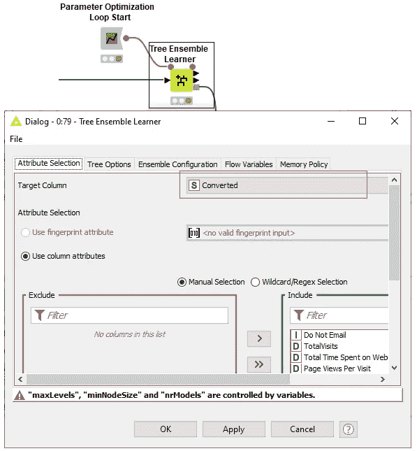

作者图片

更进一步，在**树选项区域**中，我将信息增益比率配置为算法分割标准，用于根据属性拥有的熵来标准化属性的信息增益。

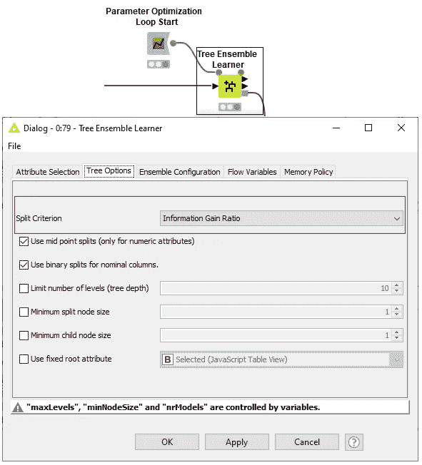

作者图片

在配置窗口的底部可以看到，明确提到**【max levels】****【minNodeSize】****【NR models】**由变量控制。这些是作为循环过程结果的输入流变量，我之前解释过了。因此，在这种情况下，每个创建的模型都将经历不同的配置参数——参数调整。考虑到需要显式的流变量匹配，我在**流变量屏幕**中映射了具体的名称。

作者图片

另一方面，我通过查看**集合配置**将数据采样设置为随机模式。我配置了 sample(平方根)属性采样，并使用了每个树节点的不同属性集。如前所述，我还分配了一个特定的静态随机种子值。

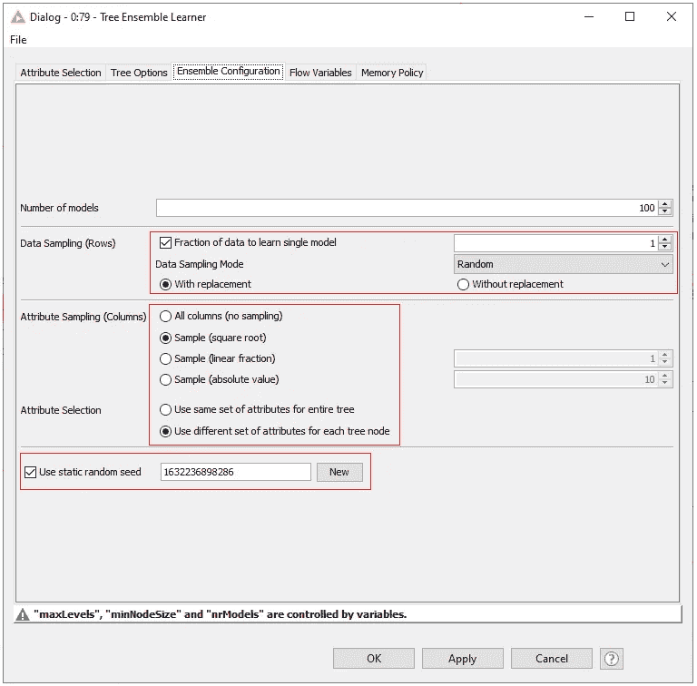

作者图片

参数优化回路末端节点提供两个输出端口，**最佳参数**和**所有参数**。我使用所有参数概述来分析基于不同参数组合的销售线索决策分类的性能。这被认为是初步理解模型如何工作的良好实践，以及如何进一步优化它的指标，这些技术超出了本文的范围。

作者图片

在本模块的最后，我使用了[表写入器节点](https://hub.knime.com/knime/extensions/org.knime.features.base/latest/org.knime.base.node.io.filehandling.table.writer.TableWriterNodeFactory)来保存本地系统路径上存储的表中的最佳参数记录。

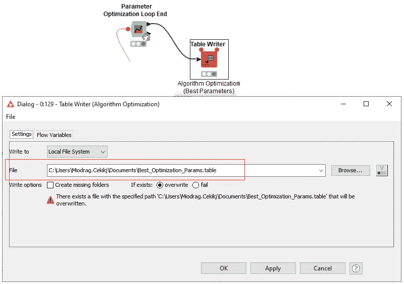

作者图片

作者图片

# 领导决策模型提取

最后的模块表示使用单独的树集成学习器和预测器节点的优化的机器学习分类器提取。我在这里使用的技术是前一个模块的后续，在那里我存储了从算法优化过程中检索到的最佳参数。通常，我使用[表读取器节点](https://hub.knime.com/knime/extensions/org.knime.features.base/latest/org.knime.base.node.io.filehandling.table.reader.KnimeTableReaderNodeFactory)从先前定义的系统位置读取表，并利用[表行到变量节点](https://hub.knime.com/knime/extensions/org.knime.features.base/latest/org.knime.base.node.flowvariable.tablerowtovariable3.TableToVariable3NodeFactory)的优势将表记录转换为变量格式。因此，变量转换配置，过滤精度值参数，如下图所示。

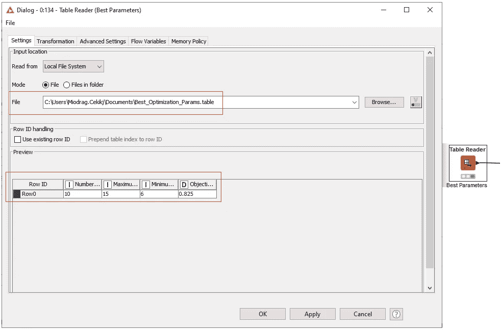

作者图片

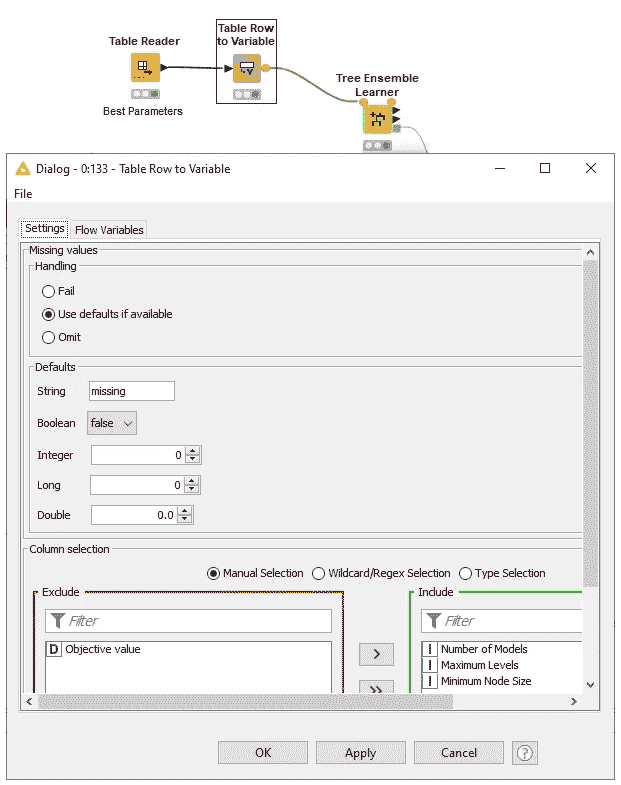

作者图片

按照流变量输入的相同方法，我在树集成学习器上将变量参数配置为树集成算法参数。我必须在这里强调的是**在提取最佳性能领导决策模型**时，来自构建和优化的训练数据集应该是相同的。这同样适用于测试数据。这是使用在前一模块中解释的特定**随机种子值**实现的。此外，在树集成学习器的集成配置中配置的静态随机种子也应该在建立和优化以及提取最终模型的模块中被识别。

最后，我插入了一个[计分器节点(JavaScript)](https://hub.knime.com/knime/extensions/org.knime.features.js.views.labs/latest/org.knime.js.base.node.scorer.ScorerNodeFactory) ，用于分析提取的线索决策模型的性能。在这种情况下，我选择了支持 Java 脚本视图的 scorer 来生成更具洞察力和交互性的摘要。测试数据预测，包括**混淆矩阵、类别和总体统计**在下面的截图中显示。

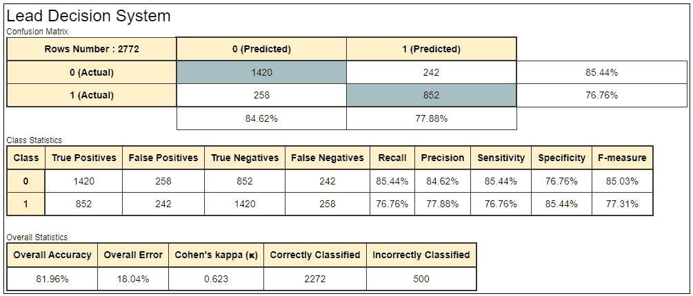

作者图片

因此，**类 0** 代表**【未转换】** **导联**，而**类 1** 代表**【已转换】导联**。该列也可以在数据处理过程中作为分类列对齐，这样就可以进行分类描述，而不是处理整数(转换成字符串)。

**注:根据对提取的销售线索决策模型的评估检索结果摘要。额外优化、结果解释和生成特征重要性的过程不属于本主题。但是，考虑到所需的场景目标和达到的 80%以上的总体准确性，这种模型构建结果是令人满意和可接受的。*

# 最后的话

在本文中，我介绍了使用 KNIME 平台开发完整的销售线索决策系统的**逐步设计过程。在这种情况下，我讨论了在建立工作基础设施方面实现的核心节点的使用，以便为先前分析和处理的数据提供主要决策。这种方法是最广泛的系统化方法的一部分**处理和解释营销和销售数据，以建立更具洞察力和实用性的销售线索挖掘流程**。**

这个解决方案完全是使用 KNIME 设计和开发的，KNIME 是一个开源的数据分析、报告和集成平台，为机器学习提供了一组不同的组件。这是一个令人兴奋的环境，能够建立机器学习模型，同时以非常直观的视觉方式呈现它。除此之外，我认为它是一个快速建模的优秀平台，特别是在有尝试和分析多种不同机器学习算法的特定需求的情况下。同时，没有编码背景的研究人员或专业人员可以非常容易地使用它。它有一个非常简单的界面和集成的文档，用于构建不同的机器学习管道、流程和模型。

— — — — — — — — — — — —

感谢您花时间阅读本文。我相信它很有见地，给了你灵感。

欢迎分享你的想法，我会很感激你的建议和观点。

*最初发表于*[*【https://www.linkedin.com】*](https://www.linkedin.com/pulse/building-machine-learning-model-lead-decision-using-tree-cekikj)*。*