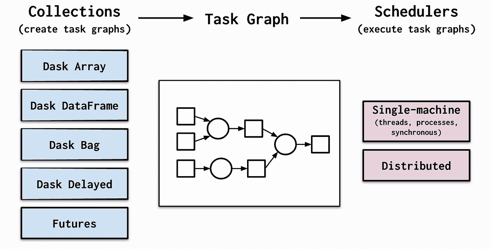
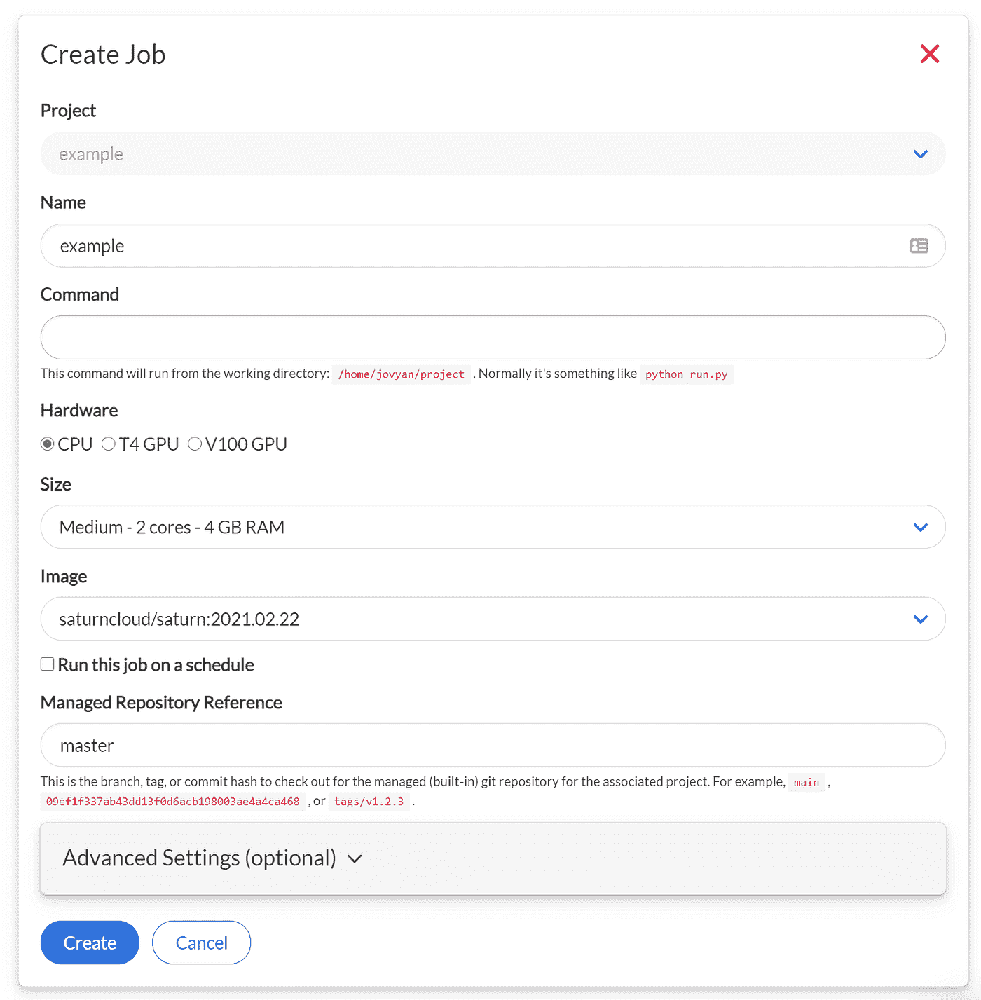

# 使用雪花和 Dask 构建机器学习管道

> 原文：<https://towardsdatascience.com/building-machine-learning-pipelines-using-snowflake-and-dask-10ae5e7fff0f?source=collection_archive---------9----------------------->


弗雷德里克·菲利克斯在 [Unsplash](https://unsplash.com/s/photos/saturn?utm_source=unsplash&utm_medium=referral&utm_content=creditCopyText) 上的照片

## [理解大数据](https://towardsdatascience.com/tagged/making-sense-of-big-data)

# 介绍

最近，作为一名数据科学家，我一直在努力寻找更好的方法来改善我的工作流程。我倾向于在工作中花费大量时间建模和构建 ETL。这意味着我越来越需要依赖工具来可靠、高效地处理大型数据集。我很快意识到，用熊猫来操纵这些数据集并不总是一个好方法，这促使我寻找其他替代方法。

在这篇文章中，我想分享我最近探索的一些工具，并向你展示我如何使用它们，以及它们如何帮助我提高工作流程的效率。我将特别谈到的两个是雪花和 Dask。两个非常不同的工具，但是可以很好地互补，尤其是作为 ML 生命周期的一部分。我希望在读完这篇文章后，你能很好地理解什么是雪花和 Dask，如何有效地使用它们，并且能够使用你自己的用例。

更具体地说，我想向您展示如何使用雪花和 Python 构建 ETL 管道，为机器学习任务生成训练数据。然后，我想介绍 Dask 和 [Saturn Cloud](https://www.saturncloud.io/s/?utm_source=daniel-foley) ，并向您展示如何利用云中的并行处理来真正加快 ML 培训过程，从而提高您作为数据科学家的工作效率。

# 用雪花和 Python 构建 ETL

在我们开始编码之前，我最好简单解释一下雪花是什么。这是我最近在我的团队决定开始使用它时问的问题。在高层次上，它是云中的数据仓库。玩了一会儿后，我意识到它有多强大。我认为对我来说，最有用的功能之一是你可以使用的虚拟仓库。虚拟仓库让您可以访问相同的数据，但完全独立于其他虚拟仓库，因此计算资源不会在团队之间共享。事实证明这非常有用，因为它消除了其他用户全天执行查询所导致的任何潜在性能问题。这减少了等待查询运行时的挫败感和时间浪费。

由于我们将使用雪花，我将简要概述如何设置它，并开始自己试验。我们需要做到以下几点:

*   *获得雪花账户设置*
*   *把我们的数据变成雪花*
*   *使用 SQL 和雪花 UI 编写并测试我们的查询*
*   *编写一个 Python 类，它可以执行我们的查询来生成我们的最终数据集用于建模*

建立一个账户就像在他们的网站上注册免费试用一样简单。一旦你完成了，你可以在这里下载 snowsql CLI。这将使向雪花添加数据变得简单。按照这些步骤，我们可以尝试使用我们的凭证和命令行连接到雪花。

```
snowsql -a <account_name> -u <user_name>
```

登录雪花 UI 可以在网址中找到自己的账户名。它看起来应该是这样的:xxxxx.europe-west2.gcp。好了，让我们进入下一步，将我们的数据放入雪花中。这里我们需要遵循几个步骤，即:

*   *创建我们的虚拟仓库*
*   *创建数据库*
*   *定义并创建我们的表格*
*   *为我们的 CSV 文件创建暂存表*
*   *将数据复制到我们的表格中*

幸运的是，这并不太难，我们完全可以使用 snowsql CLI 来完成。对于这个项目，我将使用一个比我想要的更小的数据集，但不幸的是，我不能使用我公司的任何数据，而且很难在网上找到合适的大型数据集。不过，我确实从 Dunnhumby 找到了一些交易数据，这些数据可以在 [Kaggle](https://www.kaggle.com/frtgnn/dunnhumby-the-complete-journey) 上免费获得。只是为了好玩，我使用这些数据创建了一个更大的合成数据集来测试 Dask 与 sklearn 相比处理挑战的能力。

首先，我们需要在雪花 UI 中使用以下命令建立一个虚拟仓库和一个数据库。

**创建** **或** **用**
warehouse _ size = " X-SMALL "
auto _ suspend = 180
auto _ resume = true
initially _ suspended = true；

**创建** **或** **替换** **数据库**dunhumby；

我们的数据由 6 个 CSV 组成，我们将把它们转换成 6 个表。我不会花太多时间浏览数据集，因为这篇文章更多的是关于使用雪花和 Dask，而不是解释数据。

下面是我们可以用来创建表格的命令。您需要预先知道的是您将使用什么列和数据类型。

```
**create** **or** **replace** **table** campaign_desc ( 
description **string**, 
campaign number,
start_day number,
end_day number );**create** **or** **replace** **table** campaign_table ( 
description **string**, 
Household_key number, 
campaign number );**create** **or** **replace** **table** coupon ( 
COUPON_UPC number, 
product_id number, 
campaign number );**create** **or** **replace** **table** coupon_redempt ( 
household_key number, 
**day** number, 
coupon_upc number, 
campaign number );**create** **or** **replace** **table** transactions ( 
household_key number, 
BASKET_ID number, 
**day** number, 
product_id number, 
quantity number, 
sales_value number, 
store_id number, 
retail_disc decimal, 
trans_time number, 
week_no number, 
coupon_disc decimal, 
coupon_match_disc decimal );**create** **or** **replace** **table** demographic_data ( 
age_dec **string**, 
marital_status_code **string**, 
income_desc **string**, 
homeowner_desc **string**, 
hh_comp_desc **string**, 
household_size_desc string, 
kid_category_desc **string**, 
Household_key number);
```

现在我们已经创建了表，我们可以开始考虑如何将数据放入其中。为此，我们需要存放 CSV 文件。这基本上只是一个中间步骤，因此雪花可以直接将文件从我们的阶段加载到我们的表中。我们可以使用 **PUT** 命令将本地文件放到我们的 stage 中，然后使用 **COPY INTO** 命令来指示雪花将这些数据放在哪里。

```
use database dunnhumby;**create** **or** **replace** stage dunnhumby_stage;PUT file://campaigns_table.csv @dunnhumby.public.dunnhumby_stage;PUT file://campaigns_desc.csv @dunnhumby.public.dunnhumby_stage;PUT file://coupon.csv @dunnhumby.public.dunnhumby_stage;PUT file://coupon_d=redempt.csv @dunnhumby.public.dunnhumby_stage; 
PUT file://transaction_data.csv @dunnhumby.public.dunnhumby_stage; 
PUT file://demographics.csv @dunnhumby.public.dunnhumby_stage;
```

作为快速检查，您可以运行此命令来检查临时区域中有什么。

```
ls @dunnhumby.public.dunnhumby_stage;
```

现在我们只需要使用下面的查询将数据复制到我们的表中。您可以在登录 Snowflake 后，在 Snowflake UI 或命令行中执行这些操作。

```
copy into campaign_table 
from @dunnhumby.public.dunnhumby_stage/campaigns_table.csv.gz 
file_format = ( type = csv
skip_header=1 
error_on_column_count_mismatch = false 
field_optionally_enclosed_by=’”’);copy into campaign_desc 
from @dunnhumby.public.dunnhumby_stage/campaign_desc.csv.gz 
file_format = ( type = csv
skip_header=1 
error_on_column_count_mismatch = false 
field_optionally_enclosed_by=’”’);copy into coupon 
from @dunnhumby.public.dunnhumby_stage/coupon.csv.gz 
file_format = ( type = csv
skip_header=1 
error_on_column_count_mismatch = false 
field_optionally_enclosed_by=’”’);copy into coupon_redempt 
from @dunnhumby.public.dunnhumby_stage/coupon_redempt.csv.gz 
file_format = ( type = csv
skip_header=1 
error_on_column_count_mismatch = false 
field_optionally_enclosed_by=’”’);copy into transactions 
from @dunnhumby.public.dunnhumby_stage/transaction_data.csv.gz 
file_format = ( type = csv
skip_header=1 
error_on_column_count_mismatch = false 
field_optionally_enclosed_by=’”’);copy into demographic_data 
from @dunnhumby.public.dunnhumby_stage/demographics.csv.gz 
file_format = ( type = csv skip_header=1 
error_on_column_count_mismatch = false 
field_optionally_enclosed_by=’”’);
```

好极了，如果运气好的话，我们第一次尝试就有数据了。哦，要是有那么简单就好了，整个过程我试了几次才弄对(小心拼写错误)。希望你能跟上这一步，做好准备。我们离有趣的东西越来越近了，但是上面的步骤是这个过程中至关重要的一部分，所以要确保你理解了每一个步骤。

# 用 SQL 编写我们的管道

在下一步中，我们将编写查询来生成我们的目标和功能，然后最终生成一个训练数据集。创建用于建模的数据集的一种方法是将这些数据读入内存，然后使用 pandas 创建新要素并将所有数据框连接在一起。这是你在 Kaggle 和其他在线教程中看到的典型方法。这样做的问题是效率不是很高，尤其是当您处理任何合理大小的数据集时。出于这个原因，将繁重的工作外包给 Snowflake 是一个更好的主意，它可以非常好地处理大量数据集，并可能为您节省大量时间。在这里，我不会花太多时间深入研究我们数据集的细节，因为它对我要展示的内容并不重要。不过，一般来说，在开始建模之前，您会希望花大量的时间来探索和理解您的数据。这些查询的目标是对数据进行预处理，并创建一些简单的特征，我们稍后可以在我们的模型中使用它们。

## 目标定义

显然，监督机器学习的一个重要组成部分是定义一个合适的预测目标。对于我们的用例，我们将通过计算用户是否在截止周之后的两周内再次访问来预测流失。2 周的选择是相当随意的，将取决于我们试图解决的具体问题，但让我们假设它对这个项目来说是好的。一般来说，你需要仔细分析你的客户，以了解访问间隔的分布情况，从而得出一个合适的客户流失定义。

这里的主要思想是，对于每个表，我们希望每个 household_key 有一行包含我们的每个特性的值。

## 活动特征

## 交易特征

下面我们根据总体统计数据创建一些简单的指标，如平均值、最大值和标准差。

## 人口特征

这个数据集有很多缺失数据，所以我决定在这里使用插补。有大量的技术可以处理缺失数据，从丢弃缺失数据到先进的插补方法。在这里，我让自己的生活变得简单，并用模式替换了缺失的值。我一般不推荐采用这种方法，因为理解为什么数据丢失对于决定如何处理它非常重要，但是对于这个例子来说，我将继续采用简单的方法。我们首先计算每个特征的模式，然后使用 coalesce 在数据丢失时用模式替换每一行。

## 培训用数据

最后，我们通过将我们的主表连接在一起为我们的训练数据构建一个查询，最终得到一个包含我们的目标、我们的活动、交易和人口统计特征的表，我们可以用它来构建一个模型。

作为一个简短的旁白，对于那些有兴趣了解更多关于雪花的特征和细微差别的人，我推荐以下这本书: [**雪花食谱**](https://www.amazon.co.uk/gp/product/1800560613/ref=as_li_tl?ie=UTF8&camp=1634&creative=6738&creativeASIN=1800560613&linkCode=as2&tag=mediumdanny05-21&linkId=b016babb9c48e7f068b4a6bfa70c403c) 。我开始读这本书，它充满了关于如何使用雪花的真正有用的信息，并且比我在这里做的更详细。

# 用于 ETL 的 Python 代码

我们需要这个 ETL 的最后一部分是编写一个脚本来执行它。现在，只有当您计划定期运行这样的 ETL 时，才真正需要这样做，但这是一个很好的实践，并且在需要时运行 ETL 会容易得多。

让我们简单讨论一下 EtlTraining 类的主要组件。我们班有一个输入，就是截止周。这是由于我们的数据集中定义数据的方式，但通常情况下，这将是一种日期格式，对应于我们希望选择的生成训练数据的截止日期。

我们初始化了一个查询列表，这样我们就可以轻松地遍历并执行它们。我们还创建了一个字典，其中包含我们传递给雪花连接的参数。这里我们使用我们在土星云中设置的环境变量。这里的是如何做到这一点的指南。连接到雪花并不太难，我们需要做的就是使用雪花连接器并传入我们的凭证字典。我们在雪花连接方法中实现了这一点，并将该连接作为属性返回。

为了使这些查询更容易运行，我将每个查询作为 python 字符串变量保存在 ml_query_pipeline.py 文件中。execute_etl 方法完全按照它在 tin 上所说的去做。我们遍历每个查询，格式化它，执行它，最后关闭雪花连接。

要运行这个 ETL，我们只需在终端中输入下面的命令。(其中 ml_pipeline 是上面脚本的名称。)

```
python -m ml_pipeline -w 102 -j ‘train’
```

简单地说，您可能希望定期运行这样的 ETL。例如，如果您想要进行每日预测，那么您需要每天生成一个这样的数据集，并传递到您的模型中，这样您就可以确定哪些客户可能会流失。我不会在这里详细讨论这个，但是在我的工作中，我们使用气流来编排我们的 ETL，所以如果你感兴趣，我建议你去看看。事实上，我最近买了一本名为《使用 Apache Airflow 的[数据管道](https://www.amazon.co.uk/gp/product/1617296902/ref=as_li_tl?ie=UTF8&camp=1634&creative=6738&creativeASIN=1617296902&linkCode=as2&tag=mediumdanny05-21&linkId=1ad3a1bf79e65482860570c3a484a73c)的书，我认为这本书很棒，它给出了一些关于如何使用 Airflow 的可靠例子和建议。

# Dask 和建模

现在我们已经建立了数据管道，我们可以开始考虑建模了。我写这篇文章的另一个主要目的是强调在 ML 开发过程中使用 Dask 的优势，并向你们展示它的易用性。

对于项目的这一部分，我还使用了 [Saturn Cloud](https://www.saturncloud.io/s/?utm_source=daniel-foley) ，这是我最近遇到的一个非常好的工具，它允许我们在云中的计算机集群上利用 Dask 的能力。对我来说，使用 Saturn 的主要优势是，分享您的工作非常容易，在您需要时扩展您的计算非常简单，并且它有一个免费的层选项。一般来说，模型开发对于 Dask 来说是一个非常好的用例，因为我们通常想要训练一堆不同的模型，看看什么最有效。我们做得越快越好，因为我们有更多的时间关注模型开发的其他重要方面。与雪花类似，你只需要在这里注册，你就可以非常快速地建立一个 Jupyter 实验室的实例，并开始自己进行实验。

现在，我意识到在这一点上我提到过几次 Dask，但从未真正解释过它是什么。所以让我花一点时间给你一个非常高层次的概述 Dask 和为什么我认为它是可怕的。非常简单，Dask 是一个 python 库，它利用并行计算来允许您在非常大的数据集上处理和执行操作。最好的部分是，如果你已经熟悉 Python，那么 Dask 应该非常简单，因为语法非常相似。

下图突出显示了 Dask 的主要组件。



来源: [Dask 文件](https://docs.dask.org/en/latest/)

集合允许我们创建一个可以在多台计算机上执行的任务图。其中一些数据结构可能听起来很熟悉，比如数组和数据框，它们与 python 中的数据结构相似，但有一些重要的区别。例如，您可以将 Dask 数据帧想象为一组 pandas 数据帧，它们的构建方式允许我们并行执行操作。

从集合开始，我们有了调度器。一旦我们创建了任务图，调度程序就会为我们处理剩下的工作。它管理工作流，并将这些任务发送到单台机器或分布到整个集群。希望这能让你对 Dask 的工作原理有一个简单的了解。要了解更多信息，我建议查看一下[文档](https://docs.dask.org/en/latest/)或者这本[书](https://www.amazon.co.uk/gp/product/1617295604/ref=as_li_tl?ie=UTF8&camp=1634&creative=6738&creativeASIN=1617295604&linkCode=as2&tag=mediumdanny05-21&linkId=fbcbf83b35fe6ce3c909ba9ece7001af)。两者都是深入探讨这个主题的很好的资源。

# 用于建模的 Python 代码

建模时，我倾向于先尝试少量的算法。这通常会给我一个好主意，什么可能适合我的具体问题。这些模型是逻辑回归、随机森林和梯度推进。根据我的经验，当处理表格数据时，这些算法通常会给你很好的结果。下面我们用这三个模型建立一个 sklearn 模型管道。我们在这里使用的确切模型并不重要，因为管道应该适用于任何 sklearn 分类模型，这只是我的偏好。

事不宜迟，让我们深入研究代码。幸运的是，我们将大部分预处理外包给了雪花，因此我们不必在这里过多地摆弄我们的训练数据，但我们将使用 sklearn 管道添加一些额外的步骤。

下面的第一段代码展示了使用 sklearn 时的管道。请注意，我们的数据集是一个普通的旧 pandas 数据帧，我们的预处理步骤都是使用 sklearn 方法执行的。这里没有什么特别不寻常的事情。我们从雪花 ETL 生成的表中读入数据，并将其传递给 sklearn 管道。通常的建模步骤在这里适用。我们将数据集分为训练和测试，并做一些预处理，即使用中位数估算缺失值，缩放数据并一次性编码我们的分类数据。我是 sklearn 管道的忠实粉丝，现在每当我开发模型时，基本上都使用它们，它们确实有助于代码简洁明了。

这个管道在大约有 200 万行的数据集上表现如何？在没有任何超参数调整的情况下运行这个模型大约需要 34 分钟。哎哟，有点慢。你可以想象，如果我们想要进行任何类型的超参数调整，这将需要多长时间。好吧，不太理想，但让我们看看 Dask 是如何应对挑战的。

# Dask ML Python 代码

我们的目标是看看我们是否能打败上面的 sklearn 管道，剧透一下，我们肯定能。Dask 很酷的一点是，当你已经熟悉 python 时，入门的门槛相当低。我们可以在 Dask 中建立并运行这条管道，只需做一些更改。

你可能会注意到的第一个变化是我们有了一些不同的进口。这条管道与前一条管道的主要区别之一是，我们将使用 Dask 数据框架而不是 pandas 数据框架来训练我们的模型。你可以把 Dask 数据帧想象成一堆熊猫数据帧，我们可以同时对每个数据帧进行计算。这是 Dask 并行性的核心，也是减少该管道培训时间的原因。

注意我们使用 ***@dask.delayed*** 作为我们的***load _ training _ data***函数的装饰器。这指示 Dask 为我们并行这个功能。

我们还将从 Dask 导入一些预处理和管道方法，最重要的是，我们将需要导入 SaturnCluster，这将允许我们创建一个用于训练模型的集群。这段代码的另一个关键区别是，在我们的训练测试分割之后，我们使用了 ***dask.persist*** 。在这之前，由于 Dask 的懒惰计算，我们的函数实际上没有被计算过。一旦我们使用了 persist 方法，我们就告诉 Dask 将我们的数据发送给 workers，并执行到目前为止我们已经创建的任务，并将这些对象留在集群上。

最后，我们使用延迟方法训练我们的模型。同样，这使我们能够以一种懒惰的方式创建我们的管道。在我们到达以下代码之前，管道不会被执行:

```
fit_pipelines = dask.compute(*pipelines_)
```

这一次，我们只花了大约 10 分钟就在完全相同的数据集上运行了这条管道。这是 3.4 倍的加速，不算太差。现在，如果我们想的话，我们可以通过在土星上按一下按钮来扩大我们的计算资源，从而进一步加快速度。

# 部署我们的管道

我之前提到过，你可能希望使用类似气流这样的东西，定期运行这样的管道。碰巧的是，如果你不想为气流设置一切的最初麻烦，土星云提供了一个简单的替代工作。作业允许我们打包代码，并定期或根据需要运行它。您只需转到一个现有项目，然后单击 create a job。一旦我们这样做了，它应该看起来如下:



来源:[土星](https://saturncloud.io/docs/using-saturn-cloud/jobs_and_deployments/)

从这里开始，我们需要做的就是确保我们上面的 python 文件在图像中的目录中，并且我们可以输入上面的 python 命令

```
python -m ml_pipeline -w 102 -j 'train'
```

如果愿意，我们还可以使用 cron 语法设置一个时间表，每天运行 ETL。对于那些感兴趣的人来说，这里有一个[教程](https://saturncloud.io/docs/using-saturn-cloud/jobs_and_deployments/)，可以深入到所有的细节。

# 结论和要点

好了，我们现在已经到了项目的尾声。显然，我已经忽略了 ML 开发周期中的一些关键部分，例如超参数调整和部署我们的模型，但也许我会留待以后再说。我觉得你应该试试达斯克吗？我绝不是专家，但就我目前所见，它确实非常有用，作为一名数据科学家，我非常兴奋能够对它进行更多的实验，并找到更多的机会将其融入我的日常工作中。希望您发现这很有用，并且您也可以看到雪花和 Dask 的一些优点，并且您将开始自己尝试它们。

# 资源

*   [带有阿帕奇气流的数据管道](https://www.amazon.co.uk/gp/product/1617296902/ref=as_li_tl?ie=UTF8&camp=1634&creative=6738&creativeASIN=1617296902&linkCode=as2&tag=mediumdanny05-21&linkId=1ad3a1bf79e65482860570c3a484a73c)
*   [雪花食谱](https://www.amazon.co.uk/gp/product/1800560613/ref=as_li_tl?ie=UTF8&camp=1634&creative=6738&creativeASIN=1800560613&linkCode=as2&tag=mediumdanny05-21&linkId=b016babb9c48e7f068b4a6bfa70c403c)
*   [使用 Python 和 Dask 实现大规模数据科学](https://www.amazon.co.uk/gp/product/1617295604/ref=as_li_tl?ie=UTF8&camp=1634&creative=6738&creativeASIN=1617295604&linkCode=as2&tag=mediumdanny05-21&linkId=fbcbf83b35fe6ce3c909ba9ece7001af)
*   [Coursera:数据科学的 SQL](https://click.linksynergy.com/deeplink?id=z2stMJEP3T4&mid=40328&murl=https%3A%2F%2Fwww.coursera.org%2Fspecializations%2Flearn-sql-basics-data-science%23courses)

# 我的其他一些帖子你可能会感兴趣

[](/lets-build-a-streaming-data-pipeline-e873d671fc57) [## 让我们建立一个流数据管道

### 用于实时数据管道的 Apache Beam 和数据流

towardsdatascience.com](/lets-build-a-streaming-data-pipeline-e873d671fc57) [](/gaussian-mixture-modelling-gmm-833c88587c7f) [## 高斯混合模型(GMM)

### 使用无监督学习理解文本数据

towardsdatascience.com](/gaussian-mixture-modelling-gmm-833c88587c7f) [](/a-bayesian-approach-to-time-series-forecasting-d97dd4168cb7) [## 时间序列预测的贝叶斯方法

### 今天，我们将从头开始在 R 中实现贝叶斯线性回归，并使用它来预测美国的 GDP 增长…

towardsdatascience.com](/a-bayesian-approach-to-time-series-forecasting-d97dd4168cb7) 

*注意:这篇文章中的一些链接是附属链接。*