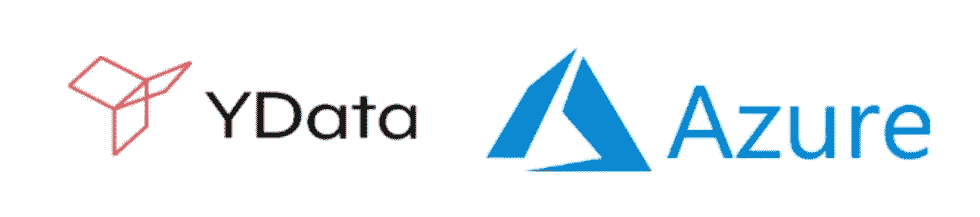
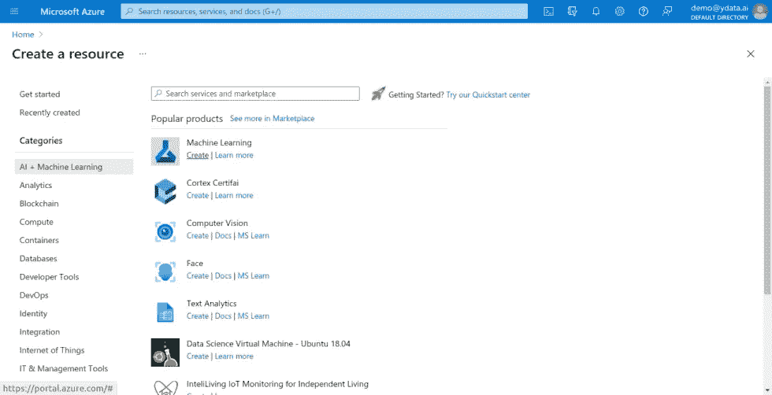
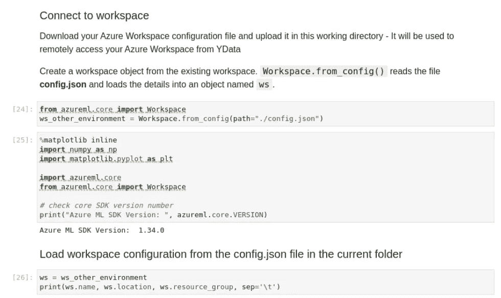
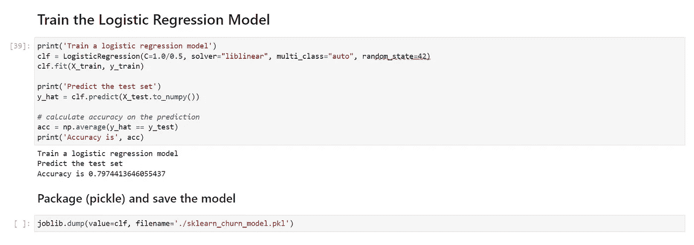
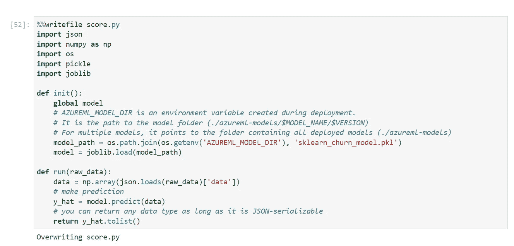
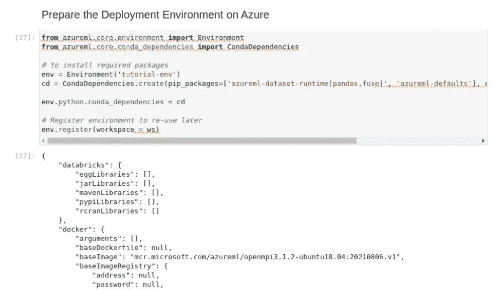
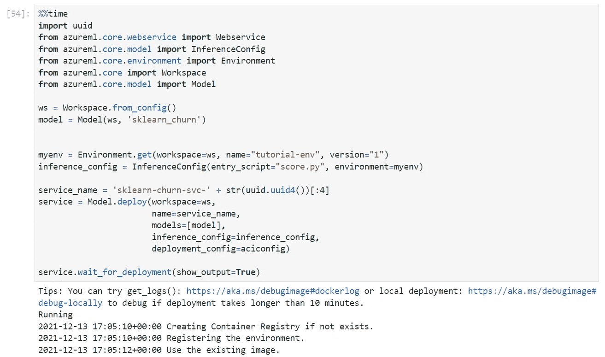
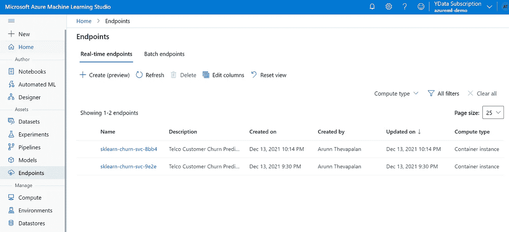
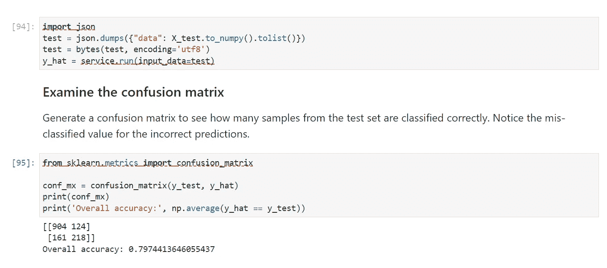
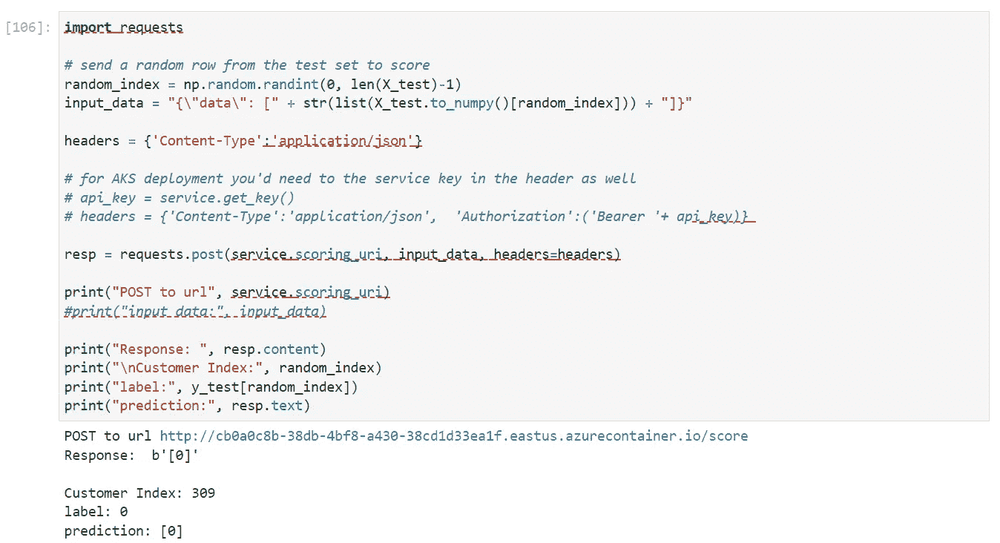

# 从数据质量开发平台构建机器学习工作流

> 原文：<https://towardsdatascience.com/building-machine-learning-workflows-from-the-development-platform-for-data-quality-3eed4476b9a2?source=collection_archive---------17----------------------->

## 直接从 YData 开发平台集成 AzureML Studio 的指南

照片由记者拍摄于 [Freepik](http://www.freepik.com)

数据在开发机器学习管道中具有很高的风险，采用一种获得高质量数据的方法至关重要。有意义的数据不仅稀缺且嘈杂，而且获取成本高昂。

像吴恩达这样的专家认为，机器学习目前达到的[门槛只能通过提高数据的质量和数量来突破](https://www.youtube.com/watch?v=06-AZXmwHjo)。

随着机器学习变得越来越普遍，人工智能公司显然面临新的挑战，对此，以模型为中心的方法可能没有所有的解决方案。我们 YData 提倡以数据为中心的[方法](/from-model-centric-to-data-centric-4beb8ef50475)——因为一切都始于数据，也止于数据。

[YData 是首个提高数据质量的数据开发平台。](https://ydata.ai/)它提供的工具不仅可以理解数据质量及其对 ML 模型的影响，还可以提供更高质量的数据准备。我们相信互操作性是优化业务体验的关键——正是出于这一目的，我们将 YData 设计为与许多其他 MLOps 平台高度集成。

微软 [Azure](https://azure.microsoft.com/en-in/services/machine-learning/) 是一个广泛用于各种部署的服务平台，包括在 MLOps 中——它具有成本效益，易于使用，并为任何新手开始部署提供了出色的文档。

我们很高兴分享 YData 和 Azure 之间的新集成！

作者创造的形象

本文将深入探讨我们如何集成这两个强大的机器学习平台，以提高用于训练 ML 模型的数据质量，并使它们能够在部署后提供有价值的见解。

# 为什么要集成 YData 和 Azure？

我们理解构建最佳性能模型的重要性。我们也意识到高质量的数据对构建这一平台至关重要。许多人忘记的是，在商业环境中，构建解决方案所花费的时间也同样重要。

虽然公司关注数据质量和训练有素的模型，但为数据科学团队提供易于使用的开发平台也至关重要。结合 YData 和 Azure 将提高数据科学团队的生产力，改善 ML 模型提供的价值，并为在生产环境中轻松部署可扩展的解决方案铺平道路。

以下是使用 [YData 作为开发平台](https://ydata.ai/)的一些优势:

*   [YData Labs](https://www.notion.so/ydataai/Labs-114c54b02b7345f4b639a8fddecc956d) 不是你本地机器上的 Jupyter 笔记本。YData Labs 运行在 Kubernetes 集群之上，可以在您需要扩展时进行扩展，无需您的干预，如果不需要计算资源，还可以缩小规模。
*   能够以分布式方式[连接来自 AWS、Azure、GCP 等数据源的数据源](https://www.notion.so/ydataai/Data-Sources-065eea289ac74c718a5b7b92ca1c0043)，确保高吞吐量。
*   [合成数据生成器](https://www.notion.so/ydataai/Synthesizers-143daea6c14b4f77a896b23d011f1537)和能够[复制真实世界数据的模型，](https://pub.towardsai.net/how-to-generate-synthetic-data-4ae4ff156344)通过设计确保相似的统计属性和隐私。
*   [数据质量评估](/how-can-i-measure-data-quality-9d31acfeb969)报告确保您的数据符合您设定的高标准。
*   [集成](https://www.notion.so/ydataai/Integrations-4b9f236455cc417f9870f61b2c1aeac4)到流行的云提供商和 MLOps 平台

简而言之，YData 允许与 Azure(和其他流行的云平台)无缝集成，使公司能够快速、可扩展和良好监控地将其数据优化训练模型部署到生产中。

既然我们已经了解了为什么要进行集成的背景，我们将把重点放在您可以遵循的集成步骤上(剧透:这比您想象的要简单得多。)我们将使用[电信客户流失数据集](https://www.kaggle.com/blastchar/telco-customer-churn)，其中我们的目标是根据历史模式预测客户是否会在短期内流失。

我们鼓励您从我们的 GitHub 资源库中找到[这个相关的 Jupyter 笔记本](https://github.com/ydataai/academy/blob/master/9%20-%20integrations/azure-ml/azureml.ipynb),并继续关注。

# 设置 AzureML

AzureML 允许为您的部署提供“点击创建”工作区，这将在一个地方存储您的模型、服务端点和用于服务它们的计算实例。

在“类别”中选择人工智能和机器学习，然后单击“创建”获得“机器学习”

AzureML 工作区供应(所有剩余截图由作者提供)

我们使用您的 AzureML 工作区中的 config.json 文件从 YData 连接和操作它。

从 YData 的实验室连接到您的 AzureML 工作区

azureml python SDK 创建了一个 API，它调用函数来远程创建、操作和删除云工作区上的资源。

# 创建模型

我们选择实现逻辑回归，因为它没有对特征空间中类的分布做任何假设。它可以很容易地扩展到多个类别，如软搅棒、硬搅棒，具有类别预测的自然概率视图。

但是，您可以尝试其他算法，如 XGBoost 和 Random Forests，并检查模型性能。

# 部署为 Web 服务

AzureML 部署遵循任何容器化部署的标准流程:

*   定义环境
*   配置依赖关系
*   插入代码并部署

评分脚本将模型加载到容器中，也作为要预测的数据样本的加载点。

在 ACI (Azure 容器实例)内部执行预测的代码

部署环境配置是在容器中安装所需的 python 包。

容器——预装了 python 包和要运行的“score.py”代码——现在将在 Azure 上部署和运行。

Azure 容器实例很容易在控制台上部署和监控。

微软 Azure 机器学习工作室端点。

一旦端点被部署并运行，我们就使用测试数据对其进行测试。

# 根据测试数据进行预测

这个想法是将测试数据集输入到模型中以获得预测。

这里，我们将数据作为 pandas dataframe 发送到 ACI 中托管的 web 服务。然后，我们使用 SDK 的“运行”API 来调用服务。您还可以使用任何 HTTP 工具(如 curl)进行原始调用。

# 通过 HTTP 请求进行预测

您还可以发送原始 HTTP 请求来测试 web 服务。一个样本代码，其中随机选择一个客户，并预测他们是否会流失。

因此，在部署时，您的模型可以通过发送 HTTP 请求来发送预测。当您的模型集成到需要实时预测的用户友好的 web/移动应用程序中时，这是一个常见的应用程序。

# 可能性是无限的

数据科学和人工智能超越了任何特定的工具或技术。作为数据科学家，我们应该学会如何利用最好的工具来实现各种目的。学习适应更新的工具并组合它们以充分利用它们是建立高效和多产的数据科学团队的必备技能。

因此，本文展示了如何利用 YData 平台和 Microsoft Azure。

我们从创建 AzureML studio 开始，使用 YData 的数据源连接器加载数据，构建模型，直接从 YData 的实验室设置 azure 环境，部署和服务于实时预测——我们已经完成了所有工作。

虽然这看起来很难理解——但这是再简单不过的了。请参考我们资料库中的[本 Jupyter 笔记本](https://github.com/ydataai/academy/blob/master/9%20-%20integrations/azure-ml/azureml.ipynb)了解更多技术细节和代码。通过这种集成，您可以同时拥有 Azure 和 YData 平台的优势。

你知道我们有一个[友好的 slack 社区](https://slack.ydata.ai/)吗？我们的开发人员在那里帮助你从你的人工智能项目中获得最大的利益，并获得你的宝贵反馈。加入我们吧！