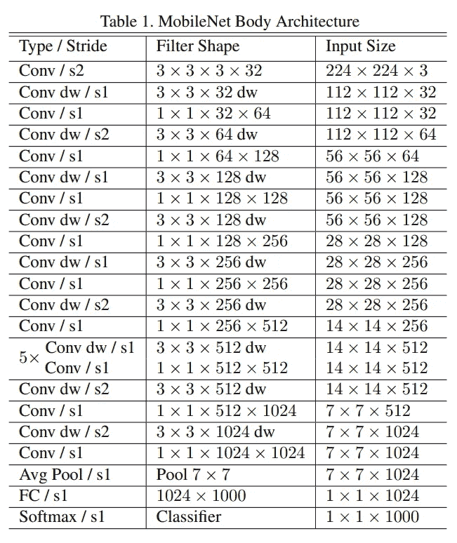
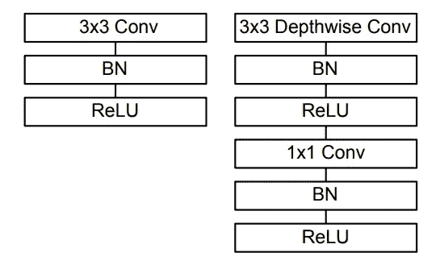
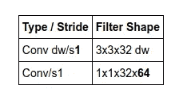
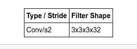
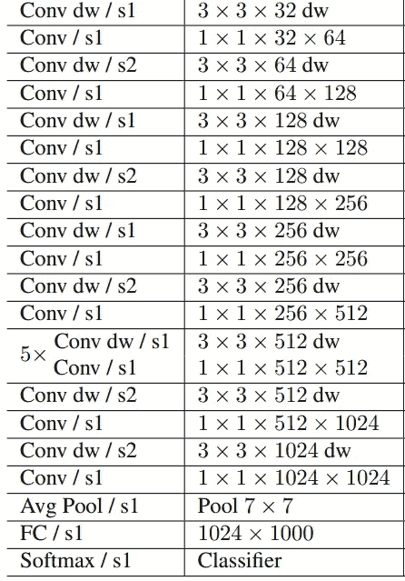
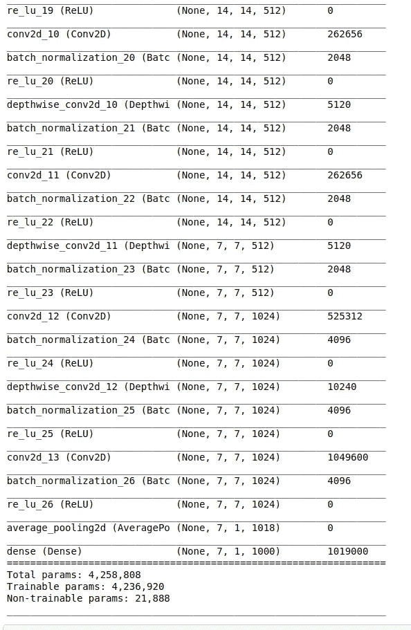
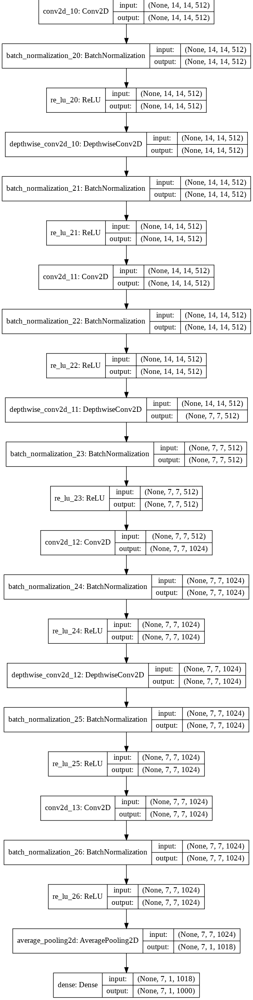

# 使用 TensorFlow 从头构建 MobileNet

> 原文：<https://towardsdatascience.com/building-mobilenet-from-scratch-using-tensorflow-ad009c5dd42c?source=collection_archive---------11----------------------->

## 在 TensorFlow 中从头开始创建 MobileNet 架构


图一。(来源:安德里亚·德·森蒂斯峰在 [Unsplash](https://unsplash.com/s/photos/ai?utm_source=unsplash&utm_medium=referral&utm_content=creditCopyText) 上拍摄的照片)

之前我已经讨论了 MobileNet 的架构和它最重要的层“ ***深度方向可分离卷积*** ”,在故事中— [理解深度方向可分离卷积和 MobileNet 的效率](/understanding-depthwise-separable-convolutions-and-the-efficiency-of-mobilenets-6de3d6b62503)。

接下来，我们将看到如何使用 TensorFlow 从头开始实现这个架构。

## 实施:



图二。MobileNet 架构(来源:图片来自原论文)

图 2 显示了我们将用代码实现的 MobileNet 架构。网络从 Vonv、BatchNorm、ReLU 块开始，然后是多个 MobileNet 块。它最终以一个平均池和一个完全连接的层结束，具有一个 Softmax 激活。

我们看到这个架构有这样的模式——conv dw/S1，然后是 Conv/s1，等等。这里的 dw 是深度层的步数，后面是 Conv 层的步数。这两行是 MobileNet 块。

“过滤器形状”列给出了内核大小和要使用的过滤器数量的详细信息。该列的最后一个数字给出了过滤器的数量。我们看到过滤器数量逐渐从 32 增加到 64，从 64 增加到 128，从 128 增加到 256，等等。

最后一列显示了随着我们深入网络，图像的大小是如何变化的。输入尺寸选择为 224*224 像素，具有 3 个通道，输出层分类 1000 个类。



图 3。普通 CNN 架构(左)与 MobileNet 架构(右)之间的差异(来源:图片来自原始论文)

构建网络时需要记住的几件事:

1.  所有层之后是批量归一化和 ReLU 非线性。
2.  与具有 Conv2D 层的普通 CNN 模型不同，MobileNet 具有深度方向的 Conv 层，如图 3 所示。要更好地理解这一层，请参考— [深度方向卷积块](/understanding-depthwise-separable-convolutions-and-the-efficiency-of-mobilenets-6de3d6b62503)。

## 工作流程:

1.  从 TensorFlow 库中导入所有必需的图层
2.  为 MobileNet 块编写一个助手函数
3.  构建模型的主干
4.  使用辅助函数来构建模型的主要部分

**导入图层**

```
**import tensorflow as tf**#import all necessary layers**from tensorflow.keras.layers import Input, DepthwiseConv2D
from tensorflow.keras.layers import Conv2D, BatchNormalization
from tensorflow.keras.layers import ReLU, AvgPool2D, Flatten, Dense****from tensorflow.keras import Model**
```

Keras 已经内置了一个 DepthwiseConv 层，所以我们不需要从头开始创建它。

**MobileNet 模块**



图 4。MobileNet 块的表示(来源:图片来自原始论文)

为了创建 MobileNet 块的函数，我们需要以下步骤:

1.  函数的输入:

*a .一个张量(x)*

*b .卷积层的滤波器数量(滤波器)*

*c .深度方向卷积层的步距(步距)*

2.运行(图 3 —右侧图像):

*a .应用具有步长的 3×3 去 hwise 卷积层，之后是批量归一化层和 ReLU 激活*

*b .应用带有滤波器的 1x1 卷积层，之后是批量归一化层和 ReLU 激活*

3.返回张量(输出)

这 3 个步骤在下面的代码块中实现。

```
# MobileNet block**def mobilnet_block (x, filters, strides):

    x = DepthwiseConv2D(kernel_size = 3, strides = strides, padding = 'same')(x)
    x = BatchNormalization()(x)
    x = ReLU()(x)

    x = Conv2D(filters = filters, kernel_size = 1, strides = 1)(x)
    x = BatchNormalization()(x)
    x = ReLU()(x)

    return x**
```

**建立模型的主干**

如图 2 所示，第一层是 Conv/s2，过滤器形状为 3x3x3x32。



图 5。模型的主干(来源:图片来自原论文)

```
#stem of the model**input = Input(shape = (224,224,3))****x = Conv2D(filters = 32, kernel_size = 3, strides = 2, padding = 'same')(input)
x = BatchNormalization()(x)
x = ReLU()(x)**
```

**模型的主要部分**



图 6。模型的主体部分(来源:图片来自原论文)

```
# main part of the model**x = mobilnet_block(x, filters = 64, strides = 1)
x = mobilnet_block(x, filters = 128, strides = 2)
x = mobilnet_block(x, filters = 128, strides = 1)
x = mobilnet_block(x, filters = 256, strides = 2)
x = mobilnet_block(x, filters = 256, strides = 1)
x = mobilnet_block(x, filters = 512, strides = 2)****for _ in range (5):
     x = mobilnet_block(x, filters = 512, strides = 1)****x = mobilnet_block(x, filters = 1024, strides = 2)
x = mobilnet_block(x, filters = 1024, strides = 1)****x = AvgPool2D (pool_size = 7, strides = 1, data_format='channels_first')(x)
output = Dense (units = 1000, activation = 'softmax')(x)****model = Model(inputs=input, outputs=output)
model.summary()**
```



图 7。模型摘要的片段

**绘制模型**

```
#plot the model**tf.keras.utils.plot_model(model, to_file='model.png', show_shapes=True, show_dtype=False,show_layer_names=True, rankdir='TB', expand_nested=False, dpi=96)**
```



图 8:模型图的一个片段

## 使用 TensorFlow 的整个 MobileNet 模型实现:

```
**import tensorflow as tf**#import all necessary layers**from tensorflow.keras.layers import Input, DepthwiseConv2D
from tensorflow.keras.layers import Conv2D, BatchNormalization
from tensorflow.keras.layers import ReLU, AvgPool2D, Flatten, Dense****from tensorflow.keras import Model**# MobileNet block**def mobilnet_block (x, filters, strides):

    x = DepthwiseConv2D(kernel_size = 3, strides = strides, padding = 'same')(x)
    x = BatchNormalization()(x)
    x = ReLU()(x)

    x = Conv2D(filters = filters, kernel_size = 1, strides = 1)(x)
    x = BatchNormalization()(x)
    x = ReLU()(x)

    return x**#stem of the model**input = Input(shape = (224,224,3))****x = Conv2D(filters = 32, kernel_size = 3, strides = 2, padding = 'same')(input)
x = BatchNormalization()(x)
x = ReLU()(x)**# main part of the model**x = mobilnet_block(x, filters = 64, strides = 1)
x = mobilnet_block(x, filters = 128, strides = 2)
x = mobilnet_block(x, filters = 128, strides = 1)
x = mobilnet_block(x, filters = 256, strides = 2)
x = mobilnet_block(x, filters = 256, strides = 1)
x = mobilnet_block(x, filters = 512, strides = 2)****for _ in range (5):
     x = mobilnet_block(x, filters = 512, strides = 1)****x = mobilnet_block(x, filters = 1024, strides = 2)
x = mobilnet_block(x, filters = 1024, strides = 1)****x = AvgPool2D (pool_size = 7, strides = 1, data_format='channels_first')(x)
output = Dense (units = 1000, activation = 'softmax')(x)****model = Model(inputs=input, outputs=output)
model.summary()**#plot the model**tf.keras.utils.plot_model(model, to_file='model.png', show_shapes=True, show_dtype=False,show_layer_names=True, rankdir='TB', expand_nested=False, dpi=96)** 
```

## 结论

MobileNet 是最小的深度神经网络之一，快速高效，可以在没有高端 GPU 的设备上运行。当使用 Keras(tensor flow 上)这样的框架时，这些网络的实现非常简单。

## 相关文章

要了解如何使用 TensorFlow 实现其他著名的 CNN 架构，请访问以下链接-

1.  [异常](/xception-from-scratch-using-tensorflow-even-better-than-inception-940fb231ced9)
2.  ResNet
3.  [VGG](/creating-vgg-from-scratch-using-tensorflow-a998a5640155)
4.  [DenseNet](/creating-densenet-121-with-tensorflow-edbc08a956d8)

# 参考资料:

Howard，A.G .，Zhu，m .，Chen，b .，Kalenichenko，d .，Wang，w .，Weyand，t .，Andreetto，m .，& Adam，H. (2017)。MobileNets:用于移动视觉应用的高效卷积神经网络。 *ArXiv，abs/1704.04861* 。