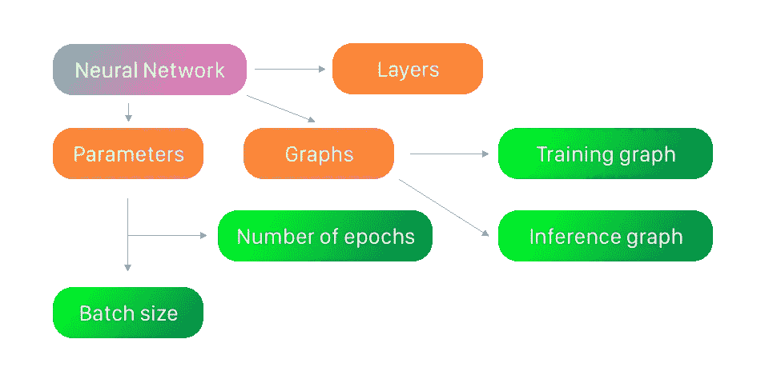
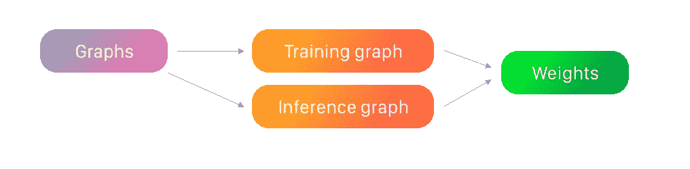

# 使用金属着色器在 Swift 中构建神经网络

> 原文：<https://towardsdatascience.com/building-neural-network-in-swift-using-metal-shaders-aa1fd75d715b?source=collection_archive---------12----------------------->

## 使用金属性能着色器框架构建神经网络

克里希纳·潘迪在 [Unsplash](https://unsplash.com?utm_source=medium&utm_medium=referral) 上拍摄的照片

# 介绍

在[上一篇文章](/neural-networks-on-swift-ba181dcdfde5)中，我从零开始实现了神经网络框架。它支持 CPU 多线程，但不支持 GPU 计算。在这篇文章中，我将实现类似的框架，但使用*金属性能着色器*。 [WWDC19 session 614](https://developer.apple.com/wwdc19/614) 启发我写这篇文章。

> Metal 性能着色器框架包含一组高度优化的计算和图形着色器，旨在轻松高效地集成到您的 Metal 应用程序中。这些数据并行原语经过专门调整，以利用每个 GPU 系列的独特硬件特征来确保最佳性能。

*金属性能着色器*提供了高度灵活的神经网络编程。

# 神经网络数据模型

数据模型。图片由 Yauheni Stsefankou 提供。

我们的神经网络模型由模型的层、图和参数组成。

神经网络的参数。图片由 Yauheni Stsefankou 提供。

参数是批量大小和每次训练的时期数。

神经网络图。图片由 Yauheni Stsefankou 提供。

在我们的模型中有两个图:训练图和推理图。两者重量相同。

我们的神经网络框架将有很多层，如密集，下降，平坦，卷积 2D，汇集最大值和平均值，Sigmoid 和 ReLU 激活。

为了方便起见，你可以在[我的 GitHub 库](https://github.com/stefjen07/ShadersNeuralNetwork)中找到所有代码。

# 不可训练层

这些层的实现非常简单，因为它们没有权重。他们在不改变策略的情况下不断转换输入。

基本图层类为空，因为所有图层没有共同点。

池层有填充和池模式、过滤器大小和步幅。

漏失层非常简单，它只有一个保持输入值的概率。

展平图层也很简单。我们必须提供展平宽度(输入尺寸)。

激活层不需要存储任何数据，所以它们会像基本层类一样为空。

只剩下两个未实现的层:密集和卷积 2D。对于它们，我们需要实现数据源类。它包括神经元的权重、偏差和层参数。

# 卷积和密集图层的数据源

我们必须在特定的金属向量中存储重量、偏差及其速度和动量。此外，我们在这些向量和优化器的参数上保留指针。

MPSCNNConvolutionDataSource 协议正在强制我们实现一些功能。

第一个函数返回权重的数据类型。我们将保持权重值为 32 位浮点数。

第二个函数返回卷积描述符，它是在类初始化时用给定的参数创建的。

这些函数返回指向带有层权重和偏差的向量的指针。

该方法加载权重和偏差。

这两个函数是插头，因为它们对于我们的任务是不必要的。

而这是`ConvDataSource`类中的最后一个函数。它返回数据源的标签。

卷积和密集层的权重使用公共卷积参数初始化，例如内核大小、输入通道和滤波器的数量、步幅和学习速率。

这里最基本的东西是优化器和卷积描述符。它们存储我们的层的主要参数，并在用它们训练时更新权重。

在初始化权重和偏差向量之前，我们必须计算它们的长度并为它们创建描述符。

现在，当我们有了描述符，我们可以初始化重量，速度和动量的向量。

然后，我们对偏差向量做同样的处理。

我们使用内核的 glorot 初始化。这意味着我们在-limit 到 limit 的范围内随机生成内核权重，其中 limit 是 sqrt(6/(inputFeatureChannels+outputFeatureChannels))

内核生成后，我们初始化权重和偏差状态和命令缓冲区，所有的初始化都将在这里执行。

然后，我们运行命令完成，并等待它完成。

# 卷积和密集层

密集层就大不一样了，不需要填充。

# 图形生成

为了从层中创建图形，我们需要实现函数。

图形是在将节点修补到其他节点时创建的。我们需要存储最后一个节点的结果图像作为新节点的源。

在 switch-case 语句中，我们将为层创建节点。每个节点在初始化时都需要源。

卷积节点需要权重的数据源和填充策略。

激活函数不需要任何参数。

展平图层需要平面输入大小(您可以通过运行 getOutputSize 方法而无需展平和下一个图层来获得)。该层将输入转换为 1x1 矩阵，其通道数等于平面输入大小。

脱落节点仅包含在训练图中。它需要保值的概率。

密集层结构类似于卷积层，但不需要填充策略。

最后一种情况是默认的，所以如果当前图层不是图层类的子类，那么我们就不会在图中包含任何节点。

我们的神经网络框架将仅支持神经网络模型末端的 softmax 激活函数。我们将 softmax 的损失节点添加到训练图中，并将 softmax 节点添加到推理图中。

# 神经网络模型初始化

在我们实现了为我们的模型创建节点的方法之后，我们可以实现我们的 NN 模型的初始化。

那么，我们需要什么来初始化模型呢？首先，我们需要`MTLDevice`。

> `MTLDevice`协议定义了 GPU 的接口。你可以向`MTLDevice`查询它为你的金属应用提供的独特功能，并使用`MTLDevice`发布你所有的金属命令。

我们需要的第二样东西是来自我们`MTLDevice`的`MTLCommandQueue`。

> 一个`MTLCommandQueue`对象将命令缓冲区的有序列表排队等待`[MTLDevice](https://developer.apple.com/documentation/metal/mtldevice)`执行。命令队列是线程安全的，允许多个未完成的命令缓冲区同时编码。

第三个是层数组，我们将在`createNodes()`函数中使用它来构建我们的图表。

最后两个参数是基本的模型参数:时期数和批量大小。

首先，我们将初始化的参数复制到模型的本地存储中。

为了得到最终节点，我们运行`createNodes()`方法。但是在方法运行之后，我们得到了没有丢失节点的节点(除了 softmax 丢失节点)。

为了创建训练图，我们需要添加损失节点并获得损失出口，因此我们运行`trainingGraph`方法。它返回图形的亏损退出点。在我们的例子中，它必须只包含一个止损点。

在得到损失退出点后，我们可以用它来创建训练图。

推理图初始化类似于训练图。这种初始化更容易，因为我们不必创建丢失节点。

创建推理图与创建训练图非常相似。

# 数据集实现

我们的数据集支持两种类型的数据:图像和字节。

数据集包括样本数组、图像大小参数(如果数据类型是图像)、类别标签(我们的神经网络模型应该是分类器)。

为了方便使用，数据示例复制了数据类型。此外，它将标签索引存储在数据集中的`classLabels`数组中。样本的主体取决于数据类型。如果数据类型是图像，那么样本存储`CGImage`及其`MTLTexture`。

在数据样本初始化之前，我们需要创建从 CGImage 到 MTLTexture 的 convert 方法。

我将 convert 方法实现为一个可计算的变量。

正因为如此，我不得不再次得到 default `MTLDevice`。金属编码中最常见的事情就是使用描述符。我们需要创建纹理描述符。我们纹理的像素格式是`r8Unorm`。这意味着这里只有红色通道(灰度),值表示为无符号的 8 位规范化整数。此外，我们将 CGImage 的宽度和高度复制到描述符中。我们的纹理区域的原点为零，大小等于 CGImage 的大小。

我们颜色空间使用每个分量 8 位，每个像素一个分量(红色通道)。另外，我们的颜色空间不使用 alpha 通道。

我们使用加速框架使图像符合我们的纹理格式。之后，我们使用图像来获取可以写入纹理的数据。

这种方法有助于我们更容易地创建数据样本。数据样本的初始化是定义类型，从实参中复制参数并获取纹理(如果类型是图像)。

但是我们不能用我们的数据样本来构建模型。所以，我们必须实现向`MPSImage`的转换。

`MPSImage`可以用纹理轻松初始化。当数据类型是字节时，我们用描述符创建平面`MPSImage`，并向其中写入字节。

好的。我们实现了数据样本类。现在我们必须实现数据集初始化。

用字节初始化数据集非常简单。我们所要做的就是为每个样本提供带有字节数组和标签的初始化器。

此外，我们将从包含图像的子文件夹的文件夹中编写初始化程序。要处理文件夹和文件，我们必须使用默认的`FileManager`。

然后，我们实现我们的文件结构。首先，我们在给定的文件夹中寻找子文件夹。每个子文件夹代表一个唯一的类。然后，我们在每个子文件夹中寻找文件。

之后，我们尝试从每个文件中读取图像。如果我们成功读取图像，那么我们可以使用`CGContext`将图像调整到格式。最后一件事是从图像中创建`DataSample`并将其添加到 samples 数组中。

对于这种情况，当我们只有一个数据集，并希望将其分为训练集和测试集时，我们必须编写一个适当的方法。它复制所有的公共参数，如类标签数组、图像大小和数据类型。

之后，它使用`Dictionary`按类划分样本。

然后，它使用给定的测试集百分比划分样本的所有类别。

# 培养

我们的训练过程分为几个时期。在开始新的纪元之前，我们必须等到前一个纪元完成。我们在训练之前和每个时期之后评估我们的模型。

在每一个时期，我们都把所有的样本分批送去训练。

但是在实现`trainIteration`方法之前，我们必须实现从数据集获取训练批次。

获取训练批次并不难，因为我们实现了从样本中获取`MPSImage`。Batch 是这些图像的数组。我们还必须用标签改变损失状态批次。

丢失数据是 float 类型的数组，其中除了正确的变量之外，所有变量都等于 0。

得到训练批次后，我们必须将其编码为`MTLCommandBuffer`。

在训练迭代中，我们得到训练批次及其期望值。使用双缓冲信号量导致永久的 100% GPU 负载。

我们必须将完整的处理程序添加到命令缓冲区中。训练迭代结束后，统计训练损失并输出到终端。我们使用`fflush`来替换先前的迭代状态。

为了得到训练损失，我们将一个批次中的所有损失相加，然后除以批次大小。

最后，我们用命令缓冲区同步批处理，启动缓冲区中的命令并返回它。

# 估价

在评估时，我们计算正确答案并除以测试集中的样本数。然后，我们从数据源重新加载推理图，因为在训练过程中权重只在训练图中改变，而不在推理图中改变。

评估也将有双缓冲信号量。

批量备考甚至比在培训中还要容易。我们只需要一组数据样本。

然后我们将使用`predict`方法，因为我们需要实现它。它返回一个标签预测数组。我们将预期与预测进行比较，并评估模型。

为了预测，我们必须准备数据样本。我们将它们转换成 MPSImages 并编码到命令缓冲区。

将推理批次编码到命令缓冲区非常类似于将训练批次编码。唯一的区别是，我们对推理图进行批量编码，而不是训练。

当 GPU 上的操作完成后，我们可以检查批处理中每个项目的输出。

然后，我们读取批处理中每一项的输出，并通过最大值的索引追加一组答案。这就是分类器的工作方式。

# 例子

我尝试了使用 ETL 数据集的平假名分类和使用 MNIST 的数字分类。经过 10 分钟的训练，平假名分类器的准确率达到 75%，数字分类器的准确率达到 98%。

# 结论

这个神经网络框架比我们之前做的版本快多了。然而，我们的实现只支持分类器。如果你真的对用金属性能着色器构建其他神经网络模型感兴趣，我们的框架很灵活，你也可以修改它。保存模型是一件很平常的事情，这就是为什么我在这篇文章中没有考虑它。你可以在[我的 GitHub 库](https://github.com/stefjen07/ShadersNeuralNetwork)中找到保存有模型的源代码。

感谢阅读。如果你有任何建议或者你在这篇文章中发现了错误，请在评论中留下你的反馈。我已经准备好改善我的读者的体验。