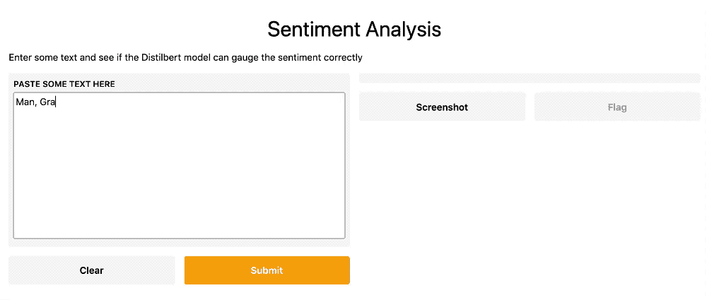
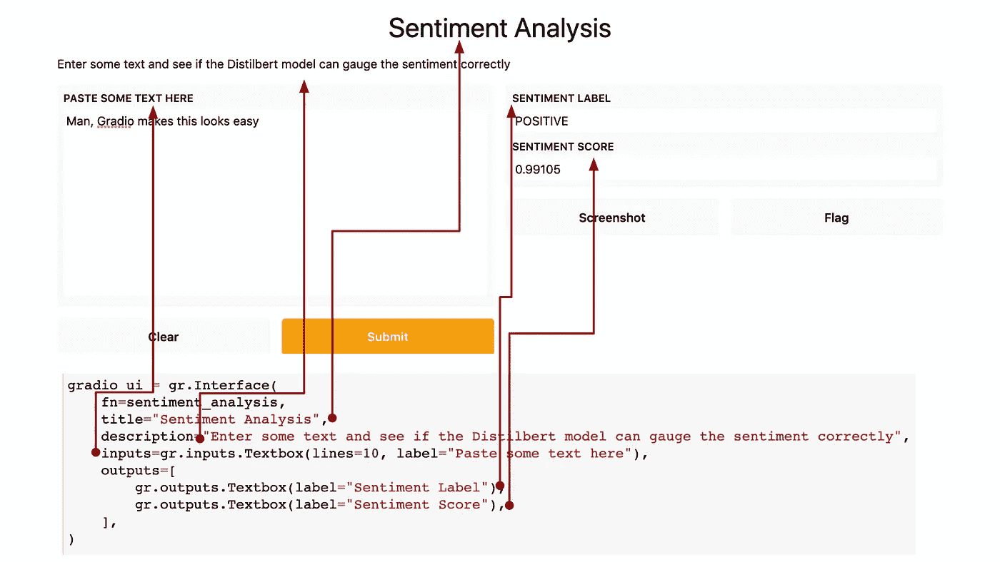
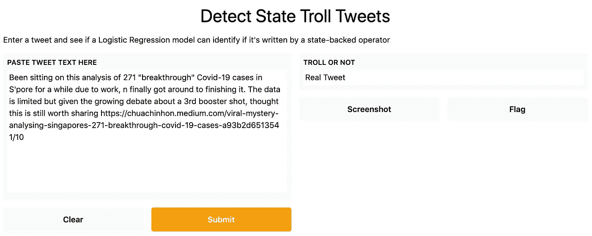
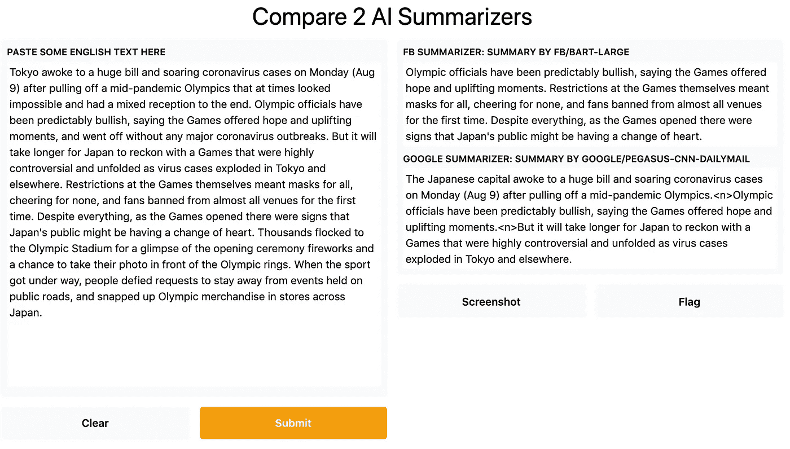
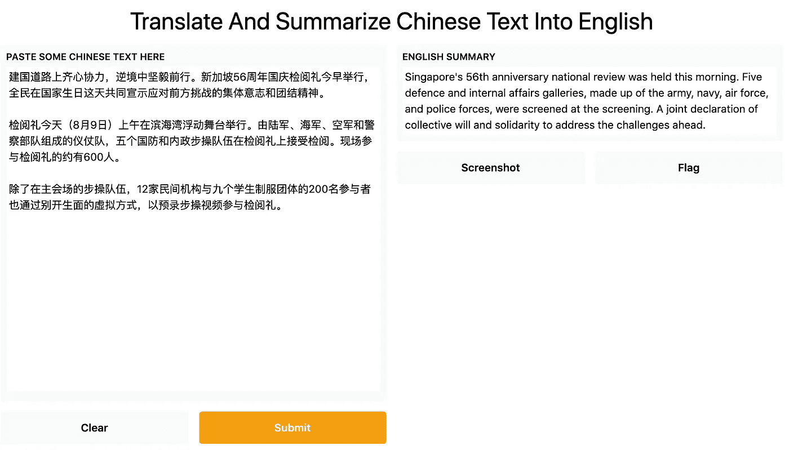
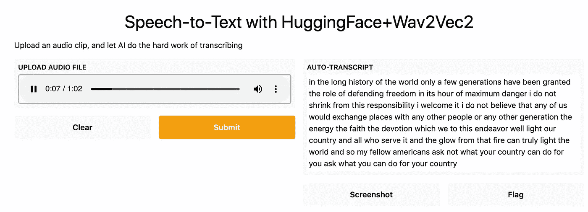
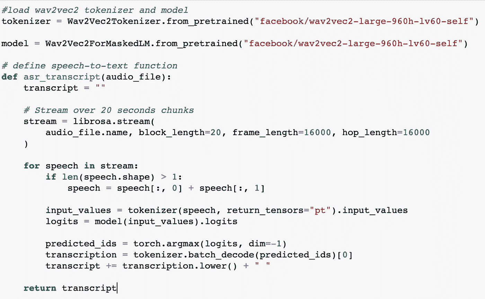
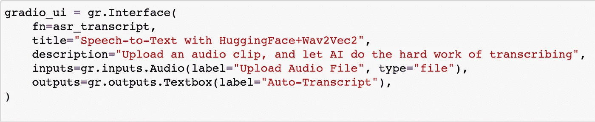

# 使用 Gradio 和拥抱面部变形金刚构建 NLP Web 应用程序

> 原文：<https://towardsdatascience.com/building-nlp-web-apps-with-gradio-and-hugging-face-transformers-59ce8ab4a319?source=collection_archive---------17----------------------->

## 向同事和客户展示你的 NLP/ML 解决方案时，web 应用是必不可少的。但是构建和部署一个有时会是一场噩梦。输入 Gradio。

蔡钦汉的情绪分析网络应用的 Gif。

Web 应用程序设计和部署可以说是数据科学家和分析师最容易忽视的技能之一。然而，如果你需要向同事或客户展示你的 NLP 或机器学习解决方案，这些技能是必不可少的。

虽然一个好的演示会有很长的路要走，但没有什么比拥有一个原型更好的了，在这个原型中，非技术用户可以自己测试提议的解决方案。如果你最近几年尝试过部署一个 ML web 应用，你就会知道大多数托管服务对于那些前端开发经验有限的人来说并不容易。

相比之下，Gradio 是一个相对较新的库，它使 ML 和 NLP web 应用程序的创建和共享变得轻而易举。只需几行代码，您就可以将您的模型放在许多标准模板中，这样就不必创建单独的 HTML 模板，也不必考虑 UI、按钮的颜色和大小等问题。

可以肯定的是，Gradio 模板非常简约。但是坦率地说，在测试和开发的早期阶段，这就是你所需要的全部，那时的目标仅仅是快速测试和快速迭代。Gradio 的[与抱抱脸的](https://gradio.app/blog/using-huggingface-models) *变形金刚*库和模型中枢的紧密集成使其成为一个更加强大的工具。

当然，Gradio 不是唯一可以用来快速开发 web 应用程序的库。 [Streamlit](https://streamlit.io/) 和 [Plotly](https://plotly.com/) 是这一领域的另外两个著名名字，各有所长。但是我要说 Gradio 是迄今为止最用户友好的，并且是早期 NLP/ML 解决方案开发的游戏改变者。

通过几个 Jupyter 笔记本，我将分享我如何使用 Gradio 构建独立的和“链式链接”的 NLP 应用程序的例子，这些应用程序结合了不同的功能和 transformer 模型。

# 回购、文件和项目范围

我为这个项目准备的 [repo 包含了运行本文中的例子所需的所有文件:](https://github.com/chuachinhon/gradio_nlp) [5 个 Jupyter 笔记本](https://github.com/chuachinhon/gradio_nlp/tree/main/notebooks)、 [2 个音频文件](https://github.com/chuachinhon/gradio_nlp/tree/main/data)和一个腌制的[逻辑回归模型](https://github.com/chuachinhon/gradio_nlp/tree/main/models)(演示 Gradio 在 transformer 模型之外的用法)。

这里的演示更适合新手，以及那些处于 NLP/ML 项目早期探索阶段的人。Gradio 提供了托管和私有部署的选项，但是这已经超出了本文的范围。

除了定义 NLP/ML 模型的输入和输出之外，只需几行代码就可以启动并运行 Gradio 应用程序。如果你使用拥抱脸的公共[推理 API](https://huggingface.co/inference-api) ，这个过程就更简单了。但我不会在我的例子中采用这种方法，因为我发现 Hugging Face 的公共/免费推理 API 相对较慢，如果你试图一次加载太多 transformer 模型，你的应用程序可能会崩溃。

因此，我编写了在本地机器上运行的演示程序。要公开分享 app，只需要在 Gradio 界面更改一个参数即可。

# 1.独立的情绪分析应用

让我们从一个最简单的例子开始——使用 Hugging Face 的[管道 API](https://huggingface.co/transformers/main_classes/pipelines.html) 构建一个用于情感分析的 [web 应用。情感分析管道中的默认蒸馏模型返回两个值—一个标签(正或负)和一个分数(浮点)。](https://github.com/chuachinhon/gradio_nlp/blob/main/notebooks/1.0_gradio_sentiment.ipynb)

Gradio 消除了从零开始设计 web 应用程序的痛苦，并解决了如何正确标记两个输出的问题。下面的屏幕截图展示了如何通过在 Gradio 中更改一些参数来轻松调整应用程序的外观:

屏幕截图:蔡振汉

由于 Gradio 和 *transformers* 库之间的紧密集成，只需几分钟就可以调整 [notebook1.0](https://github.com/chuachinhon/gradio_nlp/blob/main/notebooks/1.0_gradio_sentiment.ipynb) 中的代码，将情感分析 web 应用程序转变为一个用于翻译、摘要或零镜头分类的应用程序。

# 2.独立的 TROLL TWEET 探测器应用程序

通过 Scikit-learn 等标准机器学习库，Gradio 可以很好地处理酸洗模型。在[笔记本 1 中。](https://github.com/chuachinhon/gradio_nlp/blob/main/notebooks/1.1_gradio_logreg.ipynb) 1，我加载了我在[之前的项目](https://github.com/chuachinhon/transformers_state_trolls_cch/blob/master/notebooks/3.0_compare_logreg_cch.ipynb)中为巨魔推文构建的逻辑回归分类器，Gradio 应用程序很快就启动并运行了:

屏幕截图:蔡振汉

Gradio 模板是准系统，毫无疑问。但这就是我在早期阶段所需要的，以查看模型是否如预期的那样工作，以及解决方案是否对非技术观众来说是清楚的。

# 3.“平行”中的梯度—比较两种汇总模型

最近，几乎不可能跟上各种 NLP 任务可用的新 transformer 模型的数量。例如，如果你正在做一个文本摘要项目，你如何展示拥抱脸的模型中枢上可用的 [248 个模型中哪一个更适合你的用例？或者，您如何证明您自己的微调模型比其他模型表现得更好？](https://huggingface.co/models?pipeline_tag=summarization)

Gradio 提供了一个简洁的解决方案，允许在同一个应用程序中“并行”加载 transformer 模型。这样，您可以直接比较一个输入的不同结果:

屏幕截图:蔡振汉

在 [notebook2.0](https://github.com/chuachinhon/gradio_nlp/blob/main/notebooks/2.0_gradio_parallel_summaries.ipynb) 中，我开发了一个快速网络应用程序来比较两种不同模型的摘要能力:FB 的 Bart 和 Google 的 Pegasus。这是一个直接比较多个模型的结果的好方法，而不必复制不同应用程序的结果，或者在两个模型之间来回切换屏幕。

这也是比较文本生成或翻译模型性能的一个很好的方法，在这种情况下，不同模型的结果会有很大的不同。Gradio 没有说明一次可以并行加载的模型的最大数量，所以根据需要应用一些常识性的限制。

# 4.“系列”中的 GRADIO 结合两种变压器模型进行翻译和总结

另一种利用大量变形金刚模型的方法是将它们“串联”起来，即在一个 Gradio 应用程序下连接不同功能的模型。

[Notebook3.0](https://github.com/chuachinhon/gradio_nlp/blob/main/notebooks/3.0_gradio_series.ipynb) 演示了如何构建一个翻译摘要器，它接收中文文本并生成英文翻译摘要:

屏幕截图:蔡振汉

正如上面的截屏图所示，最终结果并不令人印象深刻。这很好地提醒了约束在这些 NLP/ML 项目中的重要性——仅仅因为一些东西在技术上可行并不意味着结果会有任何好处。

虽然链接不同功能的多个 transformer 模型的能力是一个非常受欢迎的能力，但要找到一个有效的组合并交付良好的结果还需要付出相当多的努力。

# 5.具有音频输入和文本输出的语音到文本“混合媒体”应用程序

我的最后一个例子，在 [notebook4.0](https://github.com/chuachinhon/gradio_nlp/blob/main/notebooks/4.0_gradio_audio_text.ipynb) 中，演示了一种使用[humping Face 对脸书的 Wav2Vec2 模型](https://huggingface.co/models?search=wav2vec2)的实现来构建简单的语音到文本网络应用的快速方法。

使用最新版本的 Gradio，您可以轻松配置混合媒体应用程序，这些应用程序采用一种特定的输入格式，例如音频或视频，并以另一种格式输出，例如文本或数字。为了简化演示，我选择了一款语音转文本应用，它可以接收音频剪辑并返回文本文本:

屏幕截图:蔡振汉

一个新人使用 Flask 和 HTML 模板创建一个类似的语音到文本的应用程序可能需要几个小时，如果不是几天的话，更不用说在正确部署到托管提供商的过程中还要经历额外的考验。

对于 Gradio，这个特殊示例的挑战主要在于定义一个函数来处理较长的音频文件，而不会出现会导致本地计算机崩溃的内存不足问题:

创建应用程序界面实际上只需要一行代码:

我已经在 repo 中包含了两个音频文件，你可以尝试一下语音转文本应用程序——美国总统约翰·肯尼迪在 1961 年的著名就职演说，以及青年诗人阿曼达·戈尔曼在 2021 年美国总统乔·拜登就职典礼上的诗。

# 结束注释

坦率地说，数据专业人员高效工作所需的技能越来越多，这是非常荒谬的。很少有人(如果有的话)会有时间学习与数据相关的编码和分析技能，以及前端开发。

像 Gradio 这样的库有助于将所需技能“压缩”成更易于管理的东西，让数据科学家和分析师不必为了一个简单的演示而花费数小时摆弄 Flask 和 HTML。

从长远来看，我认为这有助于促进机器学习的更大透明度和问责制，因为数据专业人员不再有任何借口说他们不能快速构建应用程序来让其他人尝试提议的解决方案。

随着越来越多的人开始在早期阶段测试此类应用，希望深埋在特定解决方案的训练数据和设计中的偏见和道德问题将更容易被发现。

和往常一样，如果你在这篇文章或我之前的文章中发现了错误，请联系我:

*   推特:[蔡锦鸿](https://medium.com/u/b3d8090c0aee?source=post_page-----aad7f2e1d0a0----------------------)
*   领英:【www.linkedin.com/in/chuachinhon 