# 使用 PyTorch 为时间序列构建 RNN、LSTM 和 GRU

> 原文：<https://towardsdatascience.com/building-rnn-lstm-and-gru-for-time-series-using-pytorch-a46e5b094e7b?source=collection_archive---------1----------------------->

照片由[恩库鲁列科乔纳斯](https://unsplash.com/@nkululekojonas)拍摄。

## 用新的工具包重新审视十年之久的问题

从历史上看，时间序列预测一直由线性和集成方法主导，因为在特征工程的支持下，它们在各种问题上得到很好的理解和高度有效。部分由于这个原因，深度学习在某种程度上被忽视了；换句话说，与图像识别、语音识别和 NLP 等其他领域相比，它对时间序列预测的影响较小。

随着 80 年代[递归神经网络(RNN)](https://www.nature.com/articles/323533a0) 的出现，随后是更复杂的 RNN 结构，即 1997 年的[长短期记忆(LSTM)](https://direct.mit.edu/neco/article/9/8/1735/6109/Long-Short-Term-Memory) ，以及最近 2014 年的[门控递归单元(GRU)](https://arxiv.org/abs/1412.3555) ，深度学习技术使得能够通过有限的特征工程来学习顺序输入和输出之间的复杂关系。简而言之，这些 RNN 技术和类似的技术在以以前不实用的方式分析大规模时间序列方面具有巨大的潜力。

在这篇文章中，我想给你介绍一些 RNN 结构，如 RNN、LSTM 和 GRU，并帮助你开始建立时间序列预测的深度学习模型。虽然这不是本文的重点，但我将提供一些广泛应用于时间序列预测的特征工程技术，比如一次性编码、滞后和周期性时间特征。我将使用 [Scikit-learn](https://scikit-learn.org/stable/) 、 [Pandas](https://pandas.pydata.org/) 和 [PyTorch](https://pytorch.org/) ，这是一个主要由脸书人工智能研究实验室开发的开源机器学习库。虽然前两者长期以来一直是数据科学家和机器学习实践者的最爱，但 PyTorch 相对较新，但越来越受欢迎。然而，由于它的新近性，我从一开始就很难找到相关的信息和代码样本，对于已经存在一段时间的框架来说，比如说 [TensorFlow](https://www.tensorflow.org/) ，这通常要容易一些。所以，我决定把我想早点知道的事情整理一下。少说多做:我们从哪里开始？

# 数据在哪里？

嗯，我想我们需要一些时间序列数据作为开始。无论是支付交易还是股票交易数据，时间序列数据无处不在。一个这样的公共数据集是 [PJM 的每小时能源消耗](https://www.kaggle.com/robikscube/hourly-energy-consumption)数据，这是一个从美国不同地区收集的 10 多年每小时观测数据的单变量时间序列数据集。我将使用 PJM 东部地区的数据，该数据最初包含 2001 年至 2018 年的每小时能耗数据，但链接中提供的任何数据集都应该可用。

鉴于有大量关于数据可视化的博客，我将把探索性数据分析(EDA)部分写得很短。对于感兴趣的人，我可以推荐使用 Plotly 来创建交互式图形。以下方法将绘制一个简单的交互式图形，该图形允许您交互式地处理数据集。

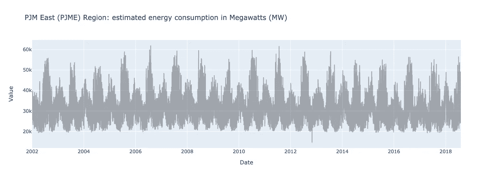

2012 年至 2018 年 PJME 地区的估计能耗(MW)

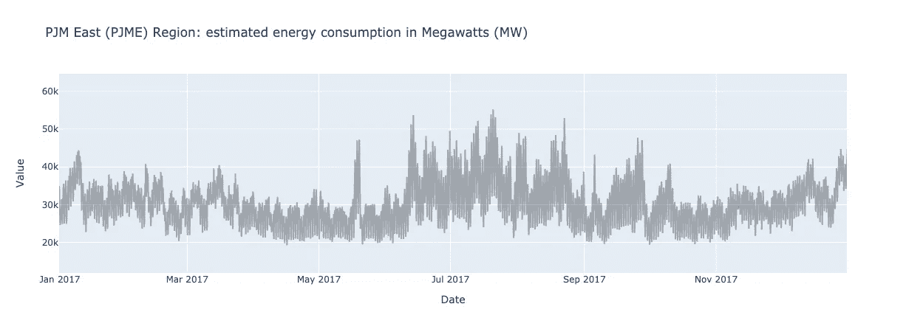

预计 2017 年 PJME 地区的能源消耗(MW)

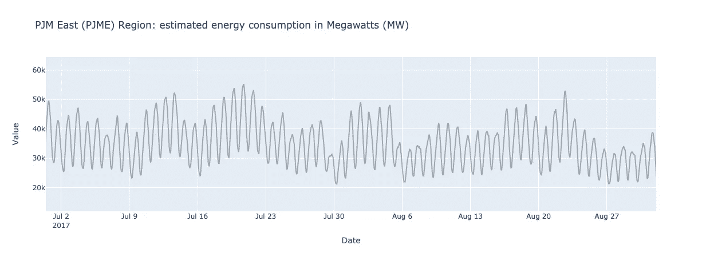

2017 年 7 月至 2017 年 9 月 PJME 地区的估计能耗(MW)

下一步是生成要素列，将单变量数据集转换为多变量数据集。如果你愿意，我们将把这个时间序列转换成一个监督学习问题。在某些数据集中，每小时的温度、湿度或降雨量等要素都很容易获得。然而，在我们的数据集中，没有额外的信息可以帮助我们预测给定的能耗。因此，创建这样的预测器，即特征列，就落到了我们的肩上。

我将向您展示两种生成要素的流行方法:将滞后观测值作为要素传递，以及根据日期时间索引创建日期时间要素。这两种方法各有优缺点，根据手头的任务，每种方法可能更有用。

# 使用滞后观测值作为特征

让我们从使用时间步长作为特征开始。换句话说，我们试图从先前的 *n* 个观察值 *Xt，X+1，…，*和 *X(t+n-1)中预测下一个值 *X(t+n)，*。然后，我们需要做的只是用前面的观察创建 *n* 列。幸运的是，Pandas 提供了方法 *shift()* 来移动列中的值。因此，我们可以编写一个 for 循环，通过将一列中的值移动 *n* 次并删除前 *n* 列来创建这样的滞后观察值。滞后是一个简单但很好的起点，尤其是如果您在开始时没有很多功能可以使用的话。*

在将输入特征(即滞后观测值)的数量设置为 100 后，我们得到以下具有 101 列的数据帧，一列用于实际值，其余用于每行的前 100 个观测值。

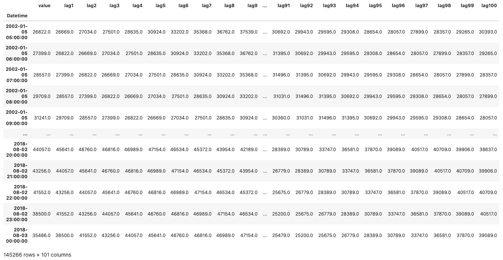

# 从时间戳生成要素

尽管它的名字，特征工程通常是艺术多于科学。尽管如此，一些经验法则可以指导数据科学家之类的人。在这一节中，我的目标不是在这里介绍所有这些实践，而是演示其中的一些实践，让您自己进行试验。实际上，特征工程在很大程度上依赖于您正在工作的领域，可能需要为手头的任务创建一组不同的特征。

有了单变量时间序列数据集，生成日期和时间特征似乎是合乎逻辑的。由于我们已经将其索引转换为 Pandas 的 [DatetimeIndex](https://pandas.pydata.org/docs/reference/api/pandas.DatetimeIndex.html) 类型，即一系列 DateTime 对象，因此我们可以轻松地从索引值创建新的特性，如一天中的小时、一个月中的天、一个月、一周中的天以及一年中的星期，如下所示。

尽管将日期和时间功能无任何接触地传递给模型在实践中可能行得通，但是模型很难了解这些功能之间的相互依赖关系。对我们人类来说，很容易看到小时、天、周和月遵循某种循环模式。虽然说 12 月之后是 1 月对我们来说是微不足道的，但理解一年中第一个月的算法出现在 12 月之后可能并不明显。就此而言，人们可以很容易地举出更多的例子。这使得良好的特征工程对于构建深度学习模型至关重要，对于传统的机器学习模型更是如此。

## 一键编码

对日期时间特性进行编码的一种方法是将它们视为分类变量，并为每个唯一值添加一个新的二进制变量，这就是众所周知的一次性编码。假设您对 month 列应用了 one-hot 编码，范围从 1 到 12。在这种情况下，创建了 12 个新的月份列，比如[Jan，Feb，… Dec]，其中只有一个列的值为 1，而其余的都为零。例如，二月的一些日期时间值应该将这些编码列的第二列设为 1，如 *[0，1，… 0]* 。

使用 Pandas 的 get_dummies 方法，我们可以从给定的数据集中快速创建一个热编码列。

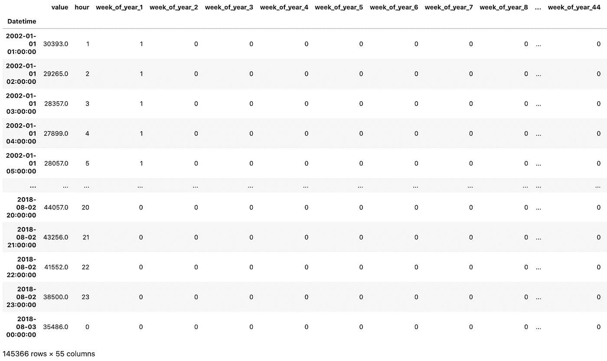

或者，您可能希望使用 Scikit-learn 的 OneHotEncoder 通过 ColumnTransformer 类对数据帧中的列进行编码。与 Pandas 方式不同，ColumnTranformer 在被调用以适应数据帧时输出一个 Numpy 数组。

尽管对分类特征编码非常有用，但一键编码并不能完全捕获日期时间特征中的循环模式。如果您愿意，它只是创建分类桶，并让模型从这些看似独立的特征中学习。例如，类似地对星期几进行编码，会丢失星期一比星期三更接近星期二的信息。

对于一些用例来说，这可能并不太重要。事实上，通过足够的数据、训练时间和模型复杂性，模型可以独立地学习这些特征之间的关系。但是还有另一种方法。

## 生成循环时间特征

与我们迄今为止处理的所有数据一样，一些数据具有内在的周期性。无论是几小时、几天、几周还是几个月，它们都遵循着周期性的循环。同样，这对我们来说是微不足道的，但对机器学习模型来说就不那么重要了。我们如何告诉算法 23 小时和 0 小时像 1 小时和 2 小时一样接近？

要点是创建两个新的循环特性，计算给定日期时间特性(比如一天中的某个小时)的正弦和余弦变换。模型不再使用小时的原始值，而是使用正弦变换，保持其周期性。要了解它是如何工作的以及为什么工作，请随意参考皮埃尔-路易或大卫的博客文章，这篇文章更详细地解释了这个概念。

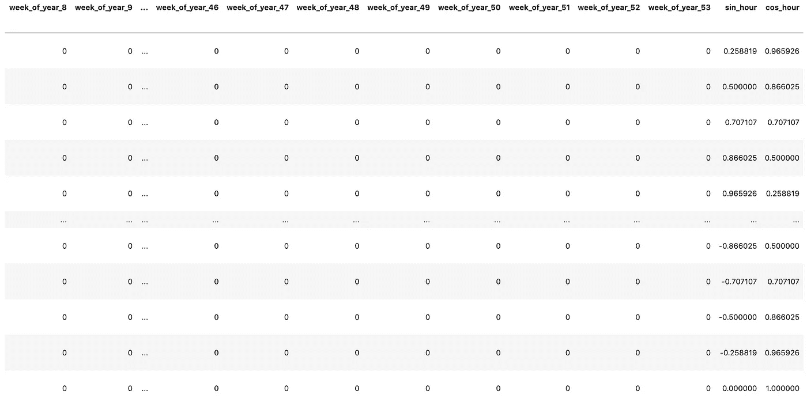

一个很好的思考练习可能是思考如何在基于决策树的模型(随机森林、梯度增强树和 XGBoost)中将一个时间要素分成两个时间要素。这些特征一次根据一个特征形成它们的分裂，这意味着它将不能同时使用两次特征，例如正弦和余弦变换。通常，这些模型足够健壮来处理这样的分裂，但是它确实值得思考。

## 其他功能呢？

考虑到我们现在正在处理能源消耗数据，有人可能会问，一年中的假期是否会影响能源消耗模式。的确，很有可能。对于这样的二进制变量，即 0 或 1，我们可以生成具有二进制值的额外列来表示给定日期是否实际上是假日。至少可以说，记住所有的假日或者手动定义它们是一项单调乏味的任务。幸运的是，一个名为[假期](https://pypi.org/project/holidays/)的套餐实现了它的承诺。

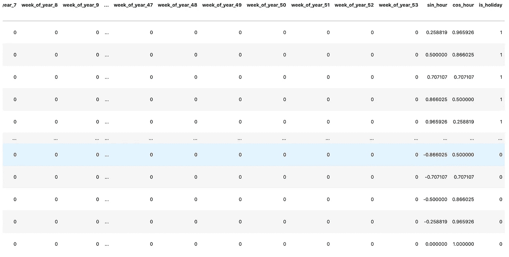

在特征工程中，可能性似乎是无限的，当然也有实验和创造的空间。好消息是已经有相当多的软件包为我们完成了这项工作，比如用于历史天气数据的 [*meteostat*](https://github.com/meteostat/meteostat-python) 或者用于股票市场数据的 [*yfinance*](https://github.com/ranaroussi/yfinance) 。不好的一点是，在没有实际尝试的情况下，对于哪些附加特性可以提高模型性能，通常没有明确的答案。

仅仅是一个想法，人们也可以尝试包括天气数据，例如温度、湿度、降水、风、雨、雪等等，以了解天气如何影响给定小时、天、周和月的能量消耗。

## 将数据分为训练集、验证集和测试集

在创建了特征列(无论是延时观测还是日期/时间特征)之后，我们将数据集分成三个不同的数据集:训练集、验证集和测试集。因为我们处理的是与时间相关的数据，所以保持时间序列的完整性是至关重要的，如果你愿意的话，也可以说是不混乱的。通过将参数 *shuffle* 设置为 *false，*避免在分成组时进行洗牌，您可以很容易地做到这一点。

对于神经网络，缩放数据集中的值是一种强烈推荐的做法，对于其他机器学习技术也是如此。它通过使模型更容易更新权重来加速学习。您可以通过使用 Scikit-learn 的 Scaler、MinMaxScaler、RobustScaler、Standard Scaler 等工具轻松实现这一点。关于每个缩放器效果的更多信息，请参考[官方文档](https://scikit-learn.org/stable/auto_examples/preprocessing/plot_all_scaling.html)。

如果您正在寻找一种快速切换缩放器的方法，这里有一个很酷的技巧。让自己适应切换器功能；我们以后可能还会用到它。

## 将数据集加载到数据加载器中

将数据标准化后，通常就万事大吉了。这次没那么快。在花了相当多的时间使用 PyTorch 并浏览了互联网上其他人的代码后，我注意到大多数人最终都在为小批量训练做矩阵运算，即使用 NumPy 将数据分割成更小的批量。你可能认为 NumPy 就是干这个的；我明白了。但是还有一种更优雅的 PyTorch 方式，在我看来，这种方式得到的关注肯定要少得多。

PyTorch 的 DataLoader 类，一个可在 Dataset 上迭代的 Python，加载数据并将它们分成批，供您进行小批训练。DataLoader 构造函数最重要的参数是 dataset，它指示要从中加载数据的 Dataset 对象。主要有两种类型的数据集:地图样式的数据集和可迭代样式的数据集。

我将在本教程中使用后者，但也可以在官方文档中查看它们。也可以根据自己的需求编写自己的数据集或数据加载器类，但这肯定超出了本文的范围，因为内置的构造函数已经足够了。但是这里有一个链接指向[关于这个话题的官方教程](https://pytorch.org/tutorials/beginner/data_loading_tutorial.html)。

现在，我将使用名为 TensorDataset 的类，一个包装张量的数据集类。由于 Scikit-learn 的 scalers 输出 NumPy 数组，所以我需要将它们转换成 Torch 张量，以便加载到 TensorDatasets 中。在为每个数据集创建张量数据集之后，我将使用它们来创建我的数据加载器。

您可能会注意到一个批量为 1 的额外数据加载器，并想知道我们到底为什么需要它。简而言之，它不是必须拥有的，而是必须拥有的。像小批量训练一样，您也可以进行小批量测试来评估模型的性能，由于张量运算，这可能会快得多。但是，这样做将会丢弃无法组成批处理的最后时间步骤，从而导致丢失这些数据点。这不太可能导致误差指标的显著变化，除非您的批量很大。

从美学的角度来看，如果有人对预测未来感兴趣，丢弃最后的时间步骤可能会导致从测试集到预测值的不连续。至于训练和验证数据加载器，这种影响是可以容忍的，因为批处理在训练中提供了显著的性能改进，并且这种减少的时间步骤不太明显。

# 建立循环神经网络(RNN)

如果我试图在这里用几句话解释他们如何工作的本质，我不认为我能公正地对待 rnn。幸运的是，对于那些正在寻找起点的人来说，有几篇关于这些网络的写得很好的文章，安德烈·卡帕西的[循环神经网络的不合理的有效性](http://karpathy.github.io/2015/05/21/rnn-effectiveness/)，克里斯·奥拉的[理解 LSTM 网络](https://colah.github.io/posts/2015-08-Understanding-LSTMs/)，以及[迈克尔·皮的《LSTM 和 GRU 的图解指南:一步一步的解释](/illustrated-guide-to-lstms-and-gru-s-a-step-by-step-explanation-44e9eb85bf21)是我想到的几篇。

如果你看过电影《记忆碎片》——顺便说一句，这绝对是一部很棒的电影——你可能已经知道在记忆丧失的情况下做预测有多难了。当你的记忆每隔几分钟就被重置时，你很容易就无法说出发生了什么，你要去哪里，或者为什么——更不用说追踪杀害你妻子的凶手了。这同样适用于处理序列数据，无论是单词还是零售数据。一般来说，拥有前面的数据点有助于你理解模式，建立一个完整的画面，并做出更好的预测。

然而，传统的神经网络做不到这一点，每次给它们一个任务，它们就从零开始，很像伦纳德，你看。RNN 解决了这个缺点。为了使总体简单化，他们通过将信息从网络的一个步骤循环到下一个步骤，允许信息在网络中持续存在。这使得它们成为解决涉及序列数据的各种问题的强有力候选，例如语音识别、语言翻译或时间序列预测，我们稍后将会看到。

## 香草 RNN

通过扩展 PyTorch 的 [nn。模块](https://pytorch.org/docs/stable/generated/torch.nn.Module.html)，所有神经网络模块的基类，我们如下定义我们的 RNN 模块。我们的 RNN 模块将有一个或多个由全连接层连接的 RNN 层，以将 RNN 输出转换为所需的输出形状。我们还需要将正向传播函数定义为一个类方法，称为 *forward()* 。这个方法按顺序执行，传递输入和零初始化的隐藏状态。尽管如此，PyTorch 会自动创建并计算反向传播函数 *backward()* 。

不过，香草 RNN 有一个缺点。简单的 RNNs 可以将以前的信息连接到当前的信息，其中相关的过去信息和当前信息之间的时间间隔很小。随着这一差距的扩大，rnn 学习长期依赖性的能力越来越弱。这就是 LSTM 寻求帮助的地方。

## 长短期记忆(LSTM)

长短期记忆，简称 LSTM，是一种特殊类型的循环网络，能够学习长期依赖性，在各种各样的任务中往往比标准版本好得多。可以说是服用类固醇的 RNNs。

标准版本的主要区别在于，除了隐藏状态之外，LSTMs 还有单元状态，它就像一条传送带，将相关信息从前面的步骤传送到后面的步骤。在这个过程中，新信息通过输入和遗忘门被添加到细胞状态或从细胞状态中删除，这两个神经网络确定哪些信息是相关的。

从实现的角度来看，您真的不必为这些细节费心。您只需要在您的 *forward()* 方法中添加一个单元格状态。

## 门控循环单元(GRU)

门控循环单元(GRU)是一个稍微精简的变体，它提供了相当的性能和相当快的计算速度。与 LSTMs 一样，它们也能捕捉长期依赖关系，但它们是通过使用没有任何单元状态的复位和更新门来实现的。

更新门决定需要保留多少过去的信息，而重置门决定要忘记多少过去的信息。gru 比 LSTMs 执行更少的张量运算，通常速度更快，需要的内存更少。正如你在下面看到的，它的模型级几乎和 RNN 的一模一样。

类似于我们对定标器使用的技巧，我们也可以轻松地在我们刚刚创建的这些模型之间切换。

现在，似乎我们已经做好了训练 RNN 模特的一切准备。但是我们从哪里开始呢？

# 训练模型

让我们从创建用于训练模型的主要框架开始。可能有很多方法可以做到这一点，其中之一是使用一个帮助器，或者包装器，保存训练、验证和评估方法的类。首先，我们需要一个模型类、一个计算损失的损失函数和一个更新网络权重的优化器。

如果你熟悉神经网络，你已经知道训练它们是一个相当重复的过程，在向前推进和向后推进之间来回循环。我发现用一个抽象层次，一个训练步骤函数或包装器来组合这些重复的步骤是很有用的。

在定义了一个合适的训练步骤后，我们现在可以开始编写训练循环，在每个时期都会调用这个步骤函数。在训练的每个时期，有两个阶段:训练和验证。在每一个训练步骤之后，网络的权值被调整一点以最小化损失函数。然后，验证步骤将评估模型的当前状态，以查看在最近一次更新之后是否有任何改进。

我将使用小批量训练，这是一种每次只使用一部分数据的训练技术。给定足够大的批量，模型可以通过仅学习数据样本来更有效地学习和更新其权重。这通常需要将每个批次张量重新整形为正确的输入维度，以便网络可以将其用作输入。为了获得张量运算的计算优势，我之前定义了我们的 RNN 模型来处理 3D 输入张量，除非你还没有注意到。因此，您可以将每一批看作数据包，就像仓库中的盒子，具有*批大小、序列长度和 input_dim 的维度。*

每个阶段也有两个 for 循环，其中模型被逐批训练和验证。重要的是在训练期间激活*训练()*模式，在验证期间激活*评估()*模式。虽然 *train()* 模式允许更新网络的权重，但是 *eval()* 模式向模型发出信号，表示不需要计算梯度。因此，权重会根据操作进行更新或保持不变。

现在，我们终于可以训练我们的模型了。然而，如果不使用单独的测试集(即保留集)来评估这些模型，就不可能知道该模型与我们正在构建的其他模型相比表现如何。与 *train()* 方法中的验证循环非常相似，我们将定义一个测试方法来评估我们的模型，如下所示。

在训练期间，损失函数输出通常是模型是学习、过拟合还是欠拟合的良好指标。为此，我们将使用以下方法绘制简单的损失数字。

## 培养

到目前为止，我们已经准备好了数据集，定义了模型类和包装类。我们需要把它们放在一起。您可以在下面的代码片段中找到一些定义的超参数，我鼓励您随意使用它们。下面的代码将使用我们之前定义的模块构建一个 LSTM 模型。您还可以通过将函数 *get_model* 的输入从*lstm*快速更改为您选择的模型来构建 RNN 或 GRU 模型。事不宜迟，让我们开始训练我们的模型。

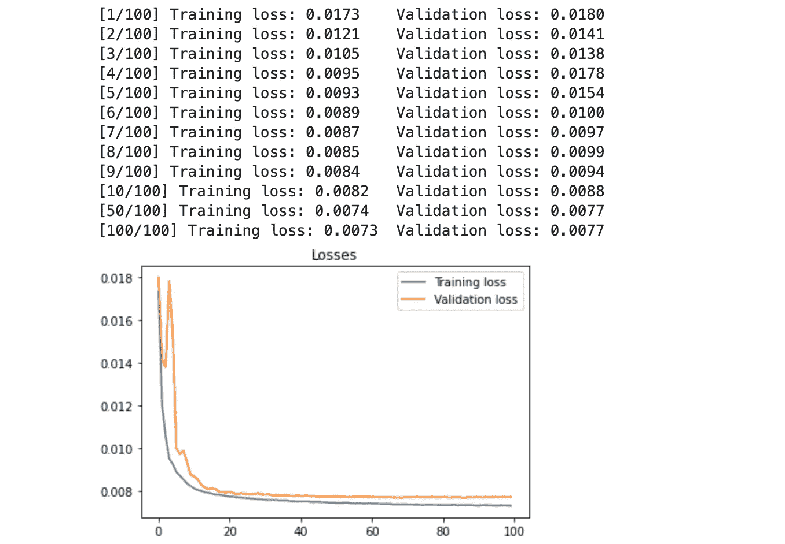

您可能还记得，我们用标准化的输入来训练我们的网络；因此，模型的所有预测也会被缩放。此外，在我们的评估方法中使用批处理后，我们所有的预测现在都是批处理的。为了计算误差指标并绘制这些预测，我们需要首先将这些多维张量简化为一维向量，即展平，然后应用 *inverse_transform()* 获得预测的真实值。

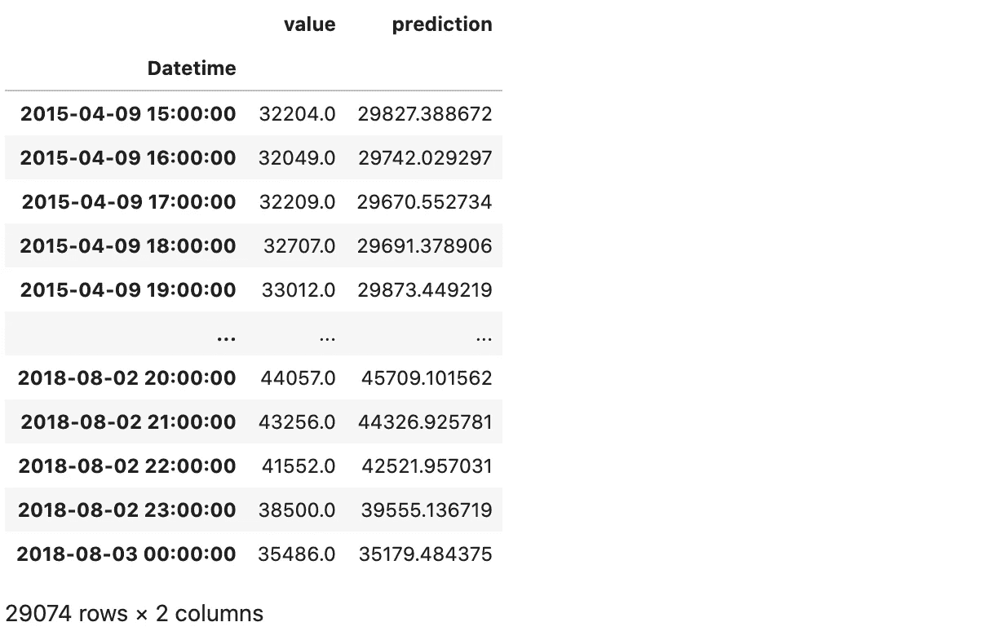

在拉平和缩小数值后，我们现在可以计算误差指标，如平均绝对误差(MAE)、均方误差(MSE)和均方根误差(RMSE)。

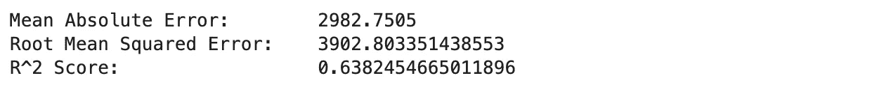

0.64 的 R2 分数……不算好，也不算糟糕。正如您在下一节中看到的，还有改进的空间，您可以通过设计更好的功能和尝试不同的超参数来实现。我把这个挑战留给你。

## 生成基线预测

拥有某种基线模型有助于我们比较我们的模型在预测中的实际表现。对于这个任务，我选择了好的老式线性回归，它足以生成一个合理的基线，但也足够简单，可以快速完成。

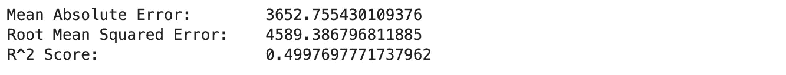

## 可视化预测

最后但并非最不重要的一点是，可视化结果有助于您更好地了解模型的性能，并添加可能会改进模型的功能。我将再次使用 Plotly，但请随意使用您更喜欢的软件包。

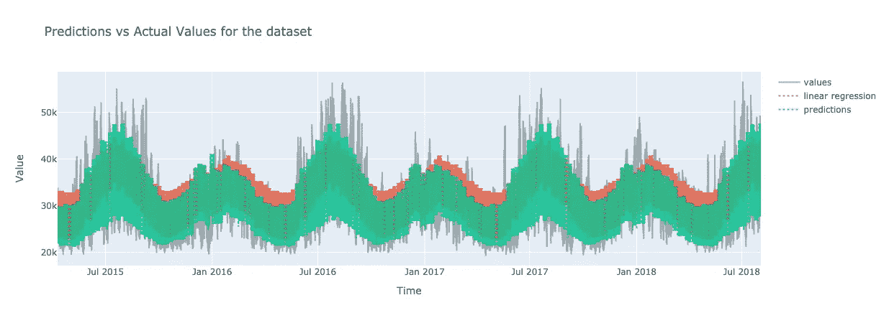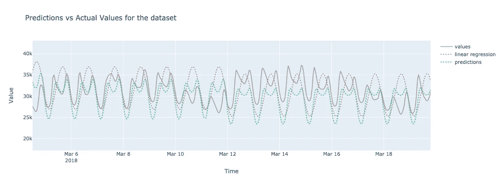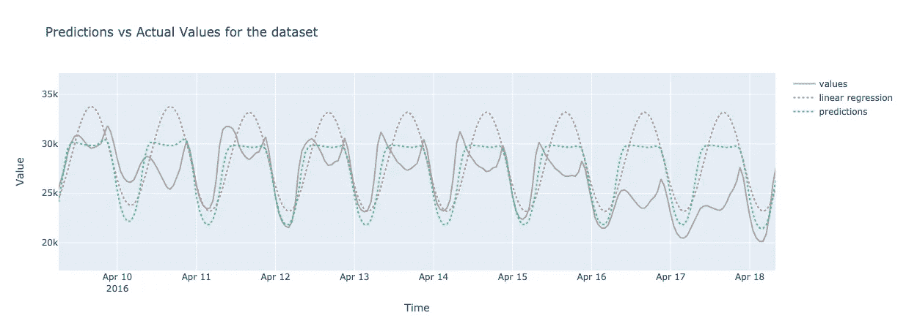

## 最后的话

我想说这就是全部，但肯定还会有更多。深度学习是机器学习中最有成果的研究领域之一。对顺序深度学习模型的研究正在增长，并且在未来可能会保持增长。你可以把这篇文章看作是探索这些技术为时间序列预测提供什么的第一步。对于那些喜欢这篇文章并对使用这些算法预测未来价值感兴趣的人，我最近发表了另一篇关于这个主题的文章。

这里有一个[链接](https://colab.research.google.com/drive/1enI68fTdPI2w5KKv6jyL0Lcq9Zg3BbLx?usp=sharing)到这篇文章的 Google Colab 笔记本，如果你想看看完整的笔记本并玩玩它。如果有不合理的地方或者你不同意，请联系我或者在评论中告诉我。这也适用于你可能有的各种反馈。

我还想写几个主题，比如使用时滞和日期时间特征预测未来的时间步长，正则化技术，其中一些我们已经在本文中使用过，以及更高级的时间序列深度学习架构。这样的例子不胜枚举。让我们希望我的动机不辜负这样的雄心壮志。

但是，现在，这是一个总结。