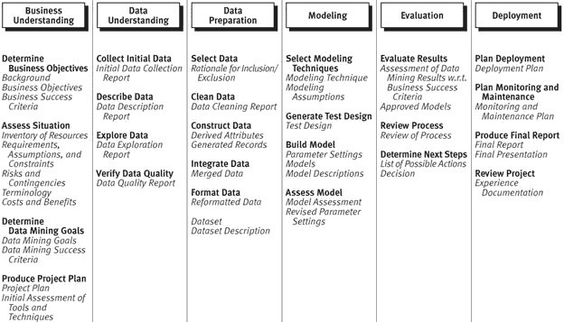
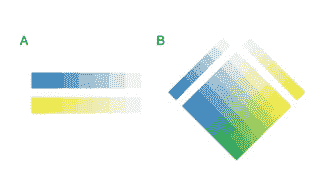
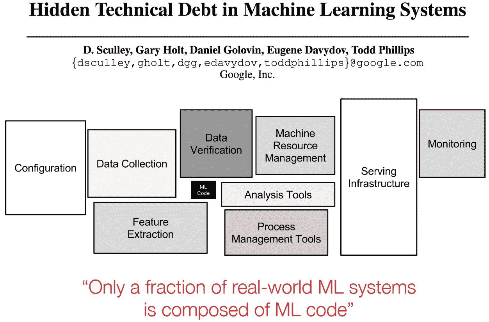
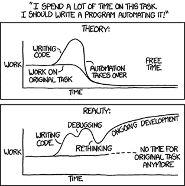

# 机器学习沙堡

> 原文：<https://towardsdatascience.com/building-sandcastles-ab466403afa8?source=collection_archive---------47----------------------->

## 思考为什么我们需要一个主导的设计，而不是另一个建立机器学习平台的创业公司

在 [Unsplash](https://unsplash.com/s/photos/sandcastles?utm_source=unsplash&utm_medium=referral&utm_content=creditCopyText) 上由[考特尼·霍尔](https://unsplash.com/@courthallphoto?utm_source=unsplash&utm_medium=referral&utm_content=creditCopyText)拍摄的照片

在大多数组织机器学习(ML)代表了任务和工具的不同组合，数据工程师负责数据管道，数据科学家负责数据分析、模型训练、验证和测试，硬件工程师负责计算配置，软件工程师负责部署。任务和工具如此分离导致了机器学习项目的高总体失败率，并限制了 ML 项目吞吐量的质量和数量。

这导致了 ML 平台的发展。当我提到 ML 平台时，我指的是用于数据和模型开发、跨多台机器扩展实验、跟踪和版本控制模型、部署模型以及监控性能的一体化产品。

这些一体化平台的前景仍然不发达，虽然这可能听起来对那些有工程和创业愿望的人有吸引力，但需要谨慎。

*备注:* [*Gartner:数据科学和机器学习(ML)平台*](https://www.gartner.com/reviews/market/data-science-machine-learning-platforms)

# **从数据科学的角度看流程**

数据挖掘的跨行业标准流程 CRISP-DM 是开放标准流程模型的一个例子，它描述了许多常见的数据科学任务，这些任务如今通常构成 ML 生命周期的一部分。

CRISP-DM 参考模型的一般任务(粗体)和输出(斜体)。[来源](https://the-modeling-agency.com/crisp-dm.pdf)

现在，拥有 ML 能力的组织让一个人拥有整个生命周期变得越来越普遍。除了其他事情之外，这个人监督人员方面，建立和管理一个有凝聚力的团队，以及过程方面，确保整个生命周期中任务的集成和执行。

不同的音调象征着个人或团队可能执行的不同任务。a .将不同类型的任务分开，专家可以处理比一个人更多的情况；数字相加。显示的是两个专家可以做一个专家两倍的工作。例如，如果每个人可以做 10，000 个任务，他们一起可以做 20，000 个。b .团队可以处理更多不同的情况，因为数量会成倍增加。对于两人团队来说，这将是 10，000 x 10，000 = 100，000，000。[来源](http://necsi.edu/research/overview/why-teams)

*备注:* [*ML 工程最佳实践*](https://developers.google.com/machine-learning/guides/rules-of-ml)

# 把 ML 当成工程问题是个问题

虽然将 ML 作为一个工程问题来对待可能很诱人，但是那些确实忽视了对过程至关重要并且不是工程师的广大用户。例如，主题专家经常提供从数据标记和特征工程到模型评估的各种输入。主题专家有必要有效地参与到这个过程中，同时记住许多人并不精通编程。对于这些用户来说，设想一个低代码环境是合理的。为了支持这些低代码用户，需要有抽象层，每一层都定义良好。对于大多数主题专家来说，最高级别的抽象——用户界面(UI)驱动的 ML——还没有实现，但是暂时想象一下，我们在市场上出现了许多为这些用户提供 UI 驱动能力的 ML 平台。毫无疑问，每个平台的运作方式都不同。几乎每个人都知道如何操作微软 Office，因为它是主导设计——在市场上占主导地位的设计，远远超过类似的产品。以微软 Office 为例，无论你是在家、在办公室还是在学术机构，都是同样的设计。没有主导的设计，就没有跨组织、领域和工具的一致和简化的用户体验。

# **快速迭代，其中 ML 代码只是一小部分**

像通用软件系统这样的 ML 平台需要是可靠的、可扩展的和可维护的，此外还要具有适应性，因为它们是从数据中学习的系统——这些数据可能会频繁地改变，从而需要快速的开发和部署周期。此外，目前 ML 通常是一个固有的经验过程，其成功部分与实验产量成比例，需要快速迭代。然而，与传统系统不同，在传统系统中编程是最难的部分，在 ML 中编程只是全部工作的一小部分，并且处理从所有不同组件引入的技术债务是对吞吐量的重大限制。

机器学习系统中隐藏的技术债务。[来源](https://dawn.cs.stanford.edu/assets/dawn-overview.pdf)

*备注:*
[*深度学习系统中真实故障的分类*](https://dl.acm.org/doi/10.1145/3377811.3380395)

# **框架和 API**

部署在野外的 ML 可以类似于模型和算法的九头蛇。部署可以包括[主成分分析](https://notsquirrel.com/pca/)、[梯度增强](https://www.youtube.com/watch?v=ErDgauqnTHk)和[神经网络](https://www.youtube.com/watch?v=aircAruvnKk)的集合。就 ML 平台而言，支持框架和库的决定受到深度学习的严重影响，尽管仅支持深度学习是完全不够的。

支持主要的深度学习框架和库，如 [PyTorch](https://pytorch.org) 和 [TensorFlow](https://www.tensorflow.org) ，将 [API 的](https://en.wikipedia.org/wiki/API)带入画面。考虑到没有总体标准或主导设计的恶劣环境，有太多开发和维护成本高昂的 API。API 需要开源，以确保架构保持开放，组织不会被迫使用专有技术栈。此外，需要开发和访问作为单一接口的数据编排规则和 API，以支持跨分布式环境的部署 ML(参见 ModelOps)。这表明需要一个更加通用的平台，减少多样化。

# **重新思考建筑**

我们需要重新思考支持 ML 的生态系统的设计，特别是在数据方面——这就是现在所说的“以数据为中心”的 ML 方法。

是追求面向数据的架构(DOA)还是微服务架构是需要在这方面进行的重要讨论。DOA 方法本质上是一种基于流的体系结构，它使业务逻辑元素之间的数据流动更加明确和可访问，从而简化了数据发现、收集和标记等任务。然而，微服务架构由于其可扩展性而非常普遍。

*备注:* [*现代面向数据编程*](http://inverseprobability.com/talks/notes/modern-data-oriented-programming.html)[*米兰:面向数据编程的一次进化*](https://tborchertblog.wordpress.com/2020/02/13/28/)[*面向数据架构*](https://blog.eyas.sh/2020/03/data-oriented-architecture/)

# 开源作为一种标准

虽然没有针对 ML 平台的主流设计，但是开源已经成为标准方法。这有很多原因，在初创公司的情况下，组织经常需要这样做，以便在初创公司失败的情况下，他们可以访问源代码。追求开源也意味着初创公司现在要与现有的开源工具竞争，必须确定一个可行的商业模式，其中包括专有和开源功能的某种混合。对于一家初创公司来说，这绝非易事。例如，如果你是一个像谷歌这样的大型组织，你可以从业务的盈利部分引导资金来支持 TensorFlow 上的开源工作，以创建一个具有网络效应良性循环的生态系统——使用该框架的人越多，了解它的人越多，反过来又会带来更多的用户——从而形成一个大型的可持续生态系统，其中有机会将谷歌云平台等专有工具和服务货币化。据传，谷歌的 TensorFlow 团队有近 1000 人。

就 ML 平台而言，我还没有看到很多机会 1)围绕特定工具建立一个大型开源用户社区，以及 2)从其他来源获得收入的机会，这些机会可以为建立这样一个社区提供长期资金。

*备注:* [*Linux 基础 AI 与数据*](https://lfaidata.foundation/projects/)[*ml flow*](https://mlflow.org)[*H2O*](https://www.h2o.ai/products/h2o/)

# 关注一个狭窄的用例

许多初创公司现在正试图开发服务于特定领域的 ML 平台，这将初创公司局限于较小的市场和用户群。我的论点是，任何 ML 平台必须对用例不可知，因为核心底层技术不是特定于领域的。由于基础技术的应用将不会局限于单个领域，人们将会发现，建立一个持久的护城河来防止其他人(因为他们服务于更大的市场而拥有更大的基础)侵犯狭窄的用例的能力是不够的。

*注释:* [*告别“发现药物的沃森”*](https://blogs.sciencemag.org/pipeline/archives/2019/04/18/farewell-to-watson-for-drug-discovery)

# 关注工作流程中的一小步

一个 ML 工具(我称之为“工具”,因为它不是一个一体化的产品)只支持 ML 生命周期的一部分，比如模型训练和评估，不可避免地需要一个组织将多个工具缝合在一起。由于 ML 堆栈中的产品在不断发展，并且没有通用的接口行业标准，开发和维护跨 ML 工作流的必要集成的成本是不小的。除了所有令人头疼的集成问题之外，用户必须熟悉使用多种工具和用户界面所带来的问题也阻碍了它的采用。

对于一个大型技术组织来说，ML 是产品和服务的核心组成部分，在缺乏主导设计的情况下，将工具缝合在一起以创建 ML 平台是当前的方法。这些组织(与大多数不同)拥有必要的技能、专业知识、经验和资源来投入这项工作。这样的组织通常将重点放在互操作性上，以构建跨越整个工作流的集成解决方案，对于他们来说，平台只处理组织所支持的产品和服务的用例就足够了。

*备注:* [*遇见米开朗基罗:优步的机器学习平台*](https://eng.uber.com/michelangelo-machine-learning-platform/)[*用 Twitter 上的工作流制作 ML*](https://blog.twitter.com/engineering/en_us/topics/insights/2018/ml-workflows.html)[*TFX:一个基于 TensorFlow 的量产级机器学习平台*](https://research.google.com/pubs/pub46484.html?WT.mc_id=tfdevsummit-twitter-pabailey)[*引入 FBLearner Flow:脸书的 AI 骨干*](https://engineering.fb.com/2016/05/09/core-data/introducing-fblearner-flow-facebook-s-ai-backbone/)

# 紧密耦合的组件

ML 开发和部署环境在组织间是异构的，与上游和下游软件组件耦合过紧的 ML 平台将限制其可移植性。类似地，如果 ML 平台与特定的硬件加速器过于紧密地耦合，那么它本身就会受限于对该硬件的采用。在这种情况下，初创公司需要小心谨慎，以确保它不是在为其市场的未来押注于采用特定的硬件或软件。一个 ML 平台需要在尽可能多的环境中工作，并且在尽可能多的硬件配置上工作，这给我们带来了模型操作和领域特定的架构。

# **进入 ModelOps**

为了避免与生产中隐藏的技术债务相关的问题的出现，模型操作( [ModelOps](https://en.wikipedia.org/wiki/ModelOps) )关注用于在现实世界生产中测试、部署、管理和监控 ML 模型的最佳实践和工具。ModelOps 尤其适用于管理跨组织运行的底层异构软件和基础设施堆栈环境中的模型演变和数据变更。

随着组织转向云，主要的云提供商现在正在寻求将 ModelOps 与组织基础设施的其余部分相集成，这推动了对跨各种 ML 工具和服务的开放集成的重新关注。然而，主要云提供商的这种方法说起来容易做起来难，因为大多数人已经花了几年时间围绕他们的产品和服务建立专有墙。在这些平台真正开放之前，这些产品是否会成为 ML 平台的主流设计是有疑问的。

# 输入特定领域的架构

特定领域架构(DSA)通常称为加速器，是一类为特定领域定制的处理器。这种以硬件为中心的方法是由性能和效率增益驱动的，因为它们是根据应用的需求定制的。DSA 的例子包括[张量处理单元](https://en.wikipedia.org/wiki/Tensor_Processing_Unit) (TPU 的)，以及[图形处理单元](https://en.wikipedia.org/wiki/Graphics_processing_unit) (GPU 的)。DSA 使用领域特定语言(DSL)来利用内存访问、并行性并改善应用程序到领域特定处理器的映射。DSL 是一个挑战，虽然是为特定的架构设计的，但是软件需要可移植到不同的环境。

DSA 的硬件/软件协同设计的垂直集成也支持开放式体系结构，因为这增加了用户数量并提高了安全性。

像 [Python](https://www.python.org) 这样的编程语言在 ML 环境下会发生什么，这个问题仍然悬而未决。构建一门语言是一项堆积如山的工作，以 ML 的发展速度来看，这需要的时间太长了。看看现有的，最好的选择似乎是朱莉娅或斯威夫特。目前，Swift 在 ML 生态系统中的存在不多，主要用于 iOS 应用程序，但近年来，苹果和谷歌都在朝着类似的方向发展，谷歌方面有 [S4TF](https://www.tensorflow.org/swift/guide/overview) —用于 TensorFlow 的 Swift。

*注意:* [*Graphcore 杨树*](https://www.graphcore.ai/products/poplar)[*大脑*](https://cerebras.net/product/#software)[*机器学习系统都陷入了墨守成规*](https://dl.acm.org/doi/pdf/10.1145/3317550.3321441)[*手电筒:快速灵活的机器学习在 C++中*](https://ai.facebook.com/blog/flashlight-fast-and-flexible-machine-learning-in-c-plus-plus/)

# 不了解要求

ML 平台缺乏主导设计导致许多人对最终需求理解不足——ML 平台的构建者经常不知道他们不知道什么。这导致 1)组织严重低估了任务的范围和复杂性，以及 2)决策是在可疑的基础上做出的(并且是合理的)。初创公司认为，只要有几个工程师，他们就能让一些东西运转起来。行业中的非软件技术公司认为这可以归结为是构建还是购买。在外部资助机构的帮助和支持下，学术机构自欺欺人地认为开发一个人工智能平台是他们研究工作的一部分，是对资源的一种很好的利用。

除了无知、政治和封地建设，建造偏见的一个主要因素来自人们对自己作品的喜爱——尽管它可能很糟糕，但建造它的人赋予它更多的价值。现实是，大多数公司都严重缺乏资源来实现卓越的执行力，以对抗像 [Palantir](https://www.palantir.com) 、 [C3.ai](https://c3.ai) 、 [Databricks](https://databricks.com/) 等已经有了几年的跑道并为此投入了大量资源的公司，这些公司可能无法成功成为盈利的独立企业。

自动化。[来源](https://xkcd.com/1319)

对于大多数组织来说，ML 的价值在于应用，而不在于构建和维护 ML 平台，这似乎是显而易见的，然而缺乏主导设计和对需求的理解导致许多人做出糟糕的购买决策。最终，这为创业公司提供了一个围绕特定组织需求提供专业服务的机会，然而，与那些构建工具和平台相比，这一领域的创业活动和牵引力要少得多。

# 结论

最终，市场将解决关于 ML 平台的任何主导设计的争论。这一过程的一部分将是金融状况的演变。处于 4000 年最低点的利率误导了资本，促进了投机，并延续了不可持续企业的非自然生命。当资本最终被重新定价时，ML 市场中许多大小厂商的消亡，以及行业最终成熟的顶点将导致整合的机会，并鼓励某种主导设计的发展。

在此期间，ML 平台的提供商和用户应该更战略性地考虑所提出的问题，以实现持久的价值创造解决方案。

*附加资源:* [*即将到来的 ML 系统浪潮*](https://hazyresearch.stanford.edu/mlsys-seminar)[*斯坦福 MLSys 研讨会系列*](https://mlsys.stanford.edu)[*全栈深度学习*](https://fullstackdeeplearning.com)[*芯片虎眼*](https://huyenchip.com/)