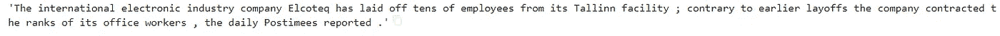

# 使用 spaCy 3.0 转换器构建情感分类器

> 原文：<https://towardsdatascience.com/building-sentiment-classifier-using-spacy-3-0-transformers-c744bfc767b?source=collection_archive---------9----------------------->

## 使用 spaCy 3.0 构建文本分类模型


图片来自 [Pixabay](https://pixabay.com/?utm_source=link-attribution&utm_medium=referral&utm_campaign=image&utm_content=1006031) 的[卡洛琳·许梅尔斯](https://pixabay.com/users/chummels-698386/?utm_source=link-attribution&utm_medium=referral&utm_campaign=image&utm_content=1006031)

我使用 spaCy 已经有一段时间了，因为它在生产中易于使用，而且 API 简洁、用户友好。该库由 Matthew Honnibal 和 Ines Montani 开发，他们是 Explosion.ai 公司的创始人。他们在 2021 年 2 月 1 日发布了 spaCy 3.0 版本，并添加了最先进的基于变压器的管道。此外，3.0 版还提供了新的配置系统和培训工作流程。在本文中，我展示了使用 spaCy version 3.0 和 Transformer 模型，用很少的几行代码构建一个情感分类器是多么简单。

我从 [Kaggle](https://www.kaggle.com/ankurzing/sentiment-analysis-for-financial-news) 获取了财经新闻数据集，构建了一个情感分类器，并使用了 Google Colab。

## 装置

```
*# Installing Spacy library*

!pip install spacy==3.1.1
!pip install spacy-transformers
```

接下来，下载预先训练好的 transformer 模型。这里，模型是使用 BERT-base 架构的 Roberta-base。更多详情，请查看[此处](https://spacy.io/models/en)。

```
*# Downloading the spaCy Transformer model "en_core_web_trf"*
!python -m spacy download en_core_web_trf
```

## 导入必要的库

```
*# Importing libraries*

import pandas as pd
from datetime import datetime
import spacy
import spacy_transformers

*# Storing docs in binary format*
from spacy.tokens import DocBin
```

读取数据集

```
*# Reading the dataset*
df = pd.read_csv("Data1.csv", encoding='latin-1')
df.head()
```


这个数据集是关于金融新闻及其相应的情绪。数据有三个标签，正面，负面，中性。让我们读一些随机文本

```
df[‘Text’][2]
```



上述文字被归类为“负面”。让我们读一篇正面的课文

```
df['Text'][3]
```


以上文字归类为“正面”。

检查数据集的形状

```
df.shape
```


该数据有 4846 个观察值。由于训练时间的原因，我在本文中选择了一个小数据集。

## 分割数据集

将数据集拆分为 80:20 比例的训练和测试

```
*#Splitting the dataset into train and test*train = df.sample(frac = 0.8, random_state = 25)
test = df.drop(train.index)
```

检查形状

```
*# Checking the shape*

print(train.shape, test.shape)
```

输出


将变压器模型加载到空间管道

```
**import** **spacy**
nlp=spacy.load("en_core_web_trf") 
```

## 训练数据集

在 3.0 版中，我们需要创建二进制格式的训练数据集来训练模型。第一步是创建元组，元组是带有情感的文本对。为训练和测试数据集创建元组。

```
#Creating tuplestrain['tuples'] = train.apply(**lambda** row (row['Text'],row['Sentiment']), axis=1)train = train['tuples'].tolist()test['tuples'] = test.apply(**lambda** row: (row['Text'],row['Sentiment']), axis=1)
test = test['tuples'].tolist()train[0]
```


第二步是在 transformer 模型`(en_core_web_trf)`的帮助下，使用名为`nlp`的空间管道为训练和测试数据集中的每个元组创建一个空间文档。每个元组只不过是文本和它的情感。

```
# User function for converting the train and test dataset into spaCy document**def** document(data):
#Creating empty list called "text" text = []
  **for** doc, label **in** nlp.pipe(data, as_tuples = **True**):
    **if** (label=='positive'):
      doc.cats['positive'] = 1
      doc.cats['negative'] = 0
      doc.cats['neutral']  = 0
    **elif** (label=='negative'):
      doc.cats['positive'] = 0
      doc.cats['negative'] = 1
      doc.cats['neutral']  = 0
    **else**:
      doc.cats['positive'] = 0
      doc.cats['negative'] = 0
      doc.cats['neutral']  = 1
#Adding the doc into the list 'text'
      text.append(doc)
  **return**(text)
```

创建了上面这个名为`document`的用户自定义函数。在这里，处理文本并添加到空间文档，并为每个情感添加类别。如果文本具有正面情感，那么它被分配为‘1’，并且对于中性和负面都是相同的。然后每个`doc`被添加到名为`text`的列表中。最后的`text`是文本的内部空间表示。

## 将训练和测试数据集转换为二进制格式

将`train`数据集传递给`document`函数，并保存为`train_docs`对象。然后使用`DocBin` spaCy 函数将文本转换成二进制对象，并将训练数据集二进制对象保存为`train.spacy`

```
*# Calculate the time for converting into binary document for train dataset*

start_time = datetime.now()

*#passing the train dataset into function 'document'*
train_docs = document(train)

*#Creating binary document using DocBin function in spaCy*
doc_bin = DocBin(docs = train_docs)

*#Saving the binary document as train.spacy*
doc_bin.to_disk("train.spacy")
end_time = datetime.now()

*#Printing the time duration for train dataset*
print('Duration: **{}**'.format(end_time - start_time))
```


在 Google Colab 中将训练数据集转换为二进制对象花费了将近 7 分钟。

我们必须对测试数据集做同样的事情。将`test`数据集传递给`document`函数，并将其保存为`test_docs`对象。然后使用`DocBin` spaCy 函数将文本转换成二进制对象，并将测试数据集二进制对象保存为`test.spacy`

```
*# Calculate the time for converting into binary document for test dataset*

start_time = datetime.now()

*#passing the test dataset into function 'document'*
test_docs = document(test)
doc_bin = DocBin(docs = test_docs)
doc_bin.to_disk("valid.spacy")
end_time = datetime.now()

*#Printing the time duration for test dataset*
print('Duration: **{}**'.format(end_time - start_time))
```


在 Google Colab 中将测试数据集转换成二进制对象需要 1.40 分钟。现在，我们已经按照所需的空间格式将数据输入到二进制对象中。

## 训练模型

下一步，训练模型。在 3.0 版本中，spaCy 提供了一个命令行界面来执行培训。为此，我们需要从这个[站点](https://spacy.io/usage/training#quickstart)下载基本配置文件。在下载之前，我们需要选择组件下的`textcat`,因为这是一个分类问题。我选择了硬件`GPU`，就像我使用 google colab 和选择`accuracy`一样。


作者图片

我们可以在记事本中打开基本配置文件，并需要为配置文件的`train = “train.spacy"`和`dev = "test.spacy".`截图指定路径，如下所示


作者图片

下一步是使用基本配置，并使用下面的代码将其转换为我们分类的完整配置。以下代码可从 spaCy [网站](https://spacy.io/usage/training#quickstart)获得。完整的配置文件将作为`config.cfg`保存在您的路径文件夹中

```
*#Converting base configuration into full config file*

!python -m spacy init fill-config ./base_config.cfg ./config.cfg
```

配置文件具有用于训练分类的所有模型参数。我在本文中使用了默认参数并训练了分类。现在，我们需要使用下面的代码来训练我们的模型。同样，代码也可以在 spaCy [网站](https://spacy.io/usage/training#quickstart)上找到。我通过添加`--gpu-id 0`启用了 GPU，模型输出保存在一个名为`output_updated.`的文件夹中

```
#Calculating the time for training the model
start_time = datetime.now()# To train the model. Enabled GPU and storing the model output in folder called output_updated
!python -m spacy train config.cfg --verbose  --gpu-id 0 --output ./output_updated

end_time = datetime.now()#Printing the time taken for training the model
print('Duration: **{}**'.format(end_time - start_time))
```

## 输出


在 GPU 下的 Google Colab 中训练模型花了 37 分钟。上面的输出显示了每个训练步骤的损失和准确性。我可以看到这个模型的精确度是 0.85。训练后，模型被保存在`output_updated/model-last.`文件夹中

## 测试模型

现在我们的模型准备好了。让我们用一些随机文本进行测试

```
text = “Australia’s largest airline temporarily lays off 2,500 employees”*# Loading the best model from output_updated folder*
nlp = spacy.load("output_updated/model-best")
demo = nlp(text)
print(demo.cats)
```

## 输出


负分很高，它被正确地归类为阴性。让我们试着用一些正面的文字

```
text1 = “Apple earnings: Huge iPhone 12 sales beat analyst expectations”
demo = nlp(text1) 
print(demo.cats)
```

## 输出


是的，文本的情绪是积极的，因为积极的分数很高。型号分类正确。

本文的目的是演示如何使用 spaCy transformers 3.0 进行文本分类。我们可以更改配置文件中的参数来提高模型性能。

你可以在我的 [GitHub repo 中找到完整的代码和数据。](https://github.com/sdhilip200/Sentiment-Classifier-using-spaCy-3.0-Transformers)

你可能也喜欢我以前的文章[*spaCy 自然语言处理——步骤和例子*](https://pub.towardsai.net/natural-language-processing-with-spacy-steps-and-examples-155618e84103)

感谢阅读。