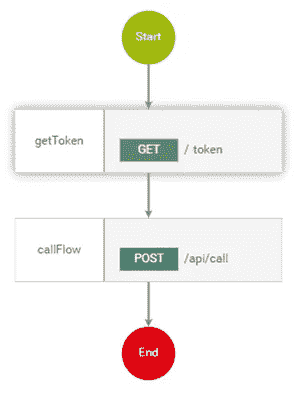
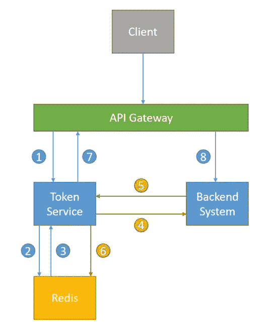
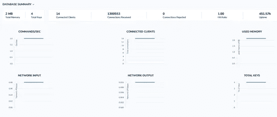
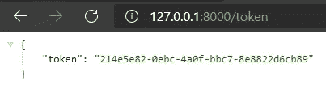
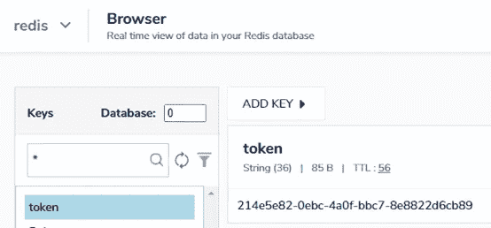
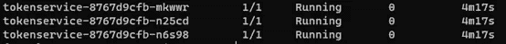
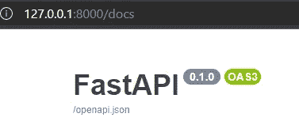
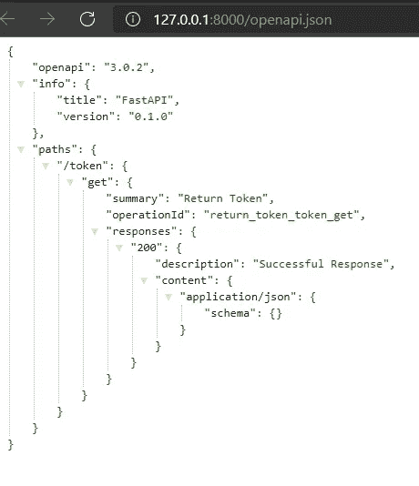
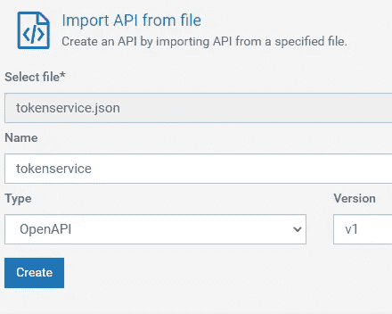
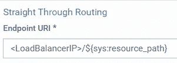

# 构建小型服务，部署在 Kubernetes 上，并与 API Gateway 集成

> 原文：<https://towardsdatascience.com/building-small-services-deploying-on-kubernetes-and-integrating-with-api-gateway-4909db4e5282?source=collection_archive---------11----------------------->

## 用 Python 和 Redis 抽象后端 API 认证


亚历杭德罗·埃斯卡米拉在 [Unsplash](https://unsplash.com?utm_source=medium&utm_medium=referral) 上的照片

最近，我正致力于后端系统与 API 网关的集成。后端系统有自己的 API，但没有身份验证。或者我应该说，它有认证，但只适用于单个用户。也就是说，所有客户端将使用相同的用户名和密码来获取后端系统提供的令牌，并使用该令牌向后端发送 API 请求。这当然不理想，所有的 API 用户都使用同一个帐户。应该考虑到后端系统根本没有认证。

为了应对这种情况，我们希望将后端与 API 网关集成在一起，并将身份验证卸载到 API 网关。特别是，所有 API 用户都将拥有由 API 网关提供的自己的帐户和 API 密钥。当他们向 API 网关发送 API 请求时，API 网关用这个帐户向后端系统发送请求。因此认证功能是在 API 网关上执行的。

我们需要解决两个主要问题。

第一个是**如何对 API 用户隐藏后端系统的令牌获取过程。**我们不希望 API 用户知道任何关于后端系统认证的事情。所有的认证(使用 API 密钥或 OAuth 或任何其他认证方法)都应该由 API 网关来处理。API 用户仅使用 API 网关进行身份验证。

第二个是**我们如何存储后端**返回的令牌，并让 API 网关在令牌过期之前为将来的请求使用相同的令牌。我们不希望 API 网关每次收到新请求时都从后端系统生成新令牌，因为这可能会增加服务器负载。

API 网关为所有客户端提供单一入口点。它有一个名为 Mashups 的功能，可以组织和编排多个 API，并将它们作为单个 API 公开。当客户端发送一个 API 请求时，API 网关首先从我们新构建的令牌服务中获取一个令牌，捕获返回的令牌，然后使用该令牌调用后端 API。下图说明了流程。



新 API 请求的基本流程(图片由作者提供)

# 服务工作流程

我们新建的令牌服务工作流程如下:

1.  当一个新的请求到来时，API gateway 调用令牌服务
2.  令牌服务检查 Redis 是否包含有效令牌
3.  如果 Redis 有令牌值，它返回
4.  如果没有，令牌服务将向后端系统发送令牌请求
5.  后端系统返回一个新生成的带有到期日期的令牌
6.  令牌服务设置一个密钥来保存具有相关超时值的令牌值
7.  令牌服务返回令牌(从 Redis 或后端系统)
8.  API 网关将带有收到的令牌的原始请求发送到原始后端 API 端点



我们新建的令牌服务工作流程(图片由作者提供)

# 设置 Redis 和 RedisInsight

为了继续上面的工作流程，我们在 Kubernetes 上安装并设置了一个 Redis 数据库。为了监控 Redis，我们使用了 RedisInsight。在 Kubernetes 上设置 Redis 最简单的方法是通过 Bitnami 的图表:

```
helm repo add bitnami [https://charts.bitnami.com/bitnami](https://charts.bitnami.com/bitnami)
helm install my-release bitnami/redis
```

所有 pod 运行后，您可以通过集群中以下 DNS 名称上的端口 6379 访问 Redis:

```
my-release-redis-master.default.svc.cluster.local for read/write operations
my-release-redis-slave.default.svc.cluster.local for read-only operations
```

要访问 Kubernetes 集群外部的 Redis，需要将 helm chart 值中的主服务器的服务类型设置为 LoadBalancer:

```
master:
  service:
    type: LoadBalancer
```

通过`kubectl get svc -n redis`，可以获得 Redis 的外部访问 IP。回应会是这样的:

```
# kubectl get svc -n redisNAME TYPE CLUSTER-IP EXTERNAL-IP PORT(S) AGE
redis-headless ClusterIP None <none> 6379/TCP 187d
redis-master LoadBalancer 10.233.50.103 172.16.100.223 6379:31808/TCP 187d
redis-slave ClusterIP 10.233.23.109 <none> 6379/TCP 187d
```

<https://redislabs.com/redis-enterprise/redis-insight/>  

要使用 GUI 监控和管理 Redis，可以在 macOS、Linux 或 Windows 上安装 RedisInsight。安装后可以通过 [http://localhost:8001/](http://localhost:8001/) 访问 UI。连接到 Redis 实例后，您应该会看到以下页面:



RedisInsight 的 GUI 视图(图片由作者提供)

其中，您可以监控您的 Redis 状态，通过 CLI 通信 Redis，最重要的是，您可以在浏览器中检查您的令牌。

# 将 Python 客户端连接到 Redis

  

有一个很好的 Python 包叫做 redis-py。它提供了从 python 代码到 Redis 实例的接口。以下代码片段将我们的 Python 应用程序连接到 Redis:

```
import redis
import sys
import osdef redis_connect() -> redis.client.Redis:
    REDIS_HOST = os.getenv("REDIS_HOST")
    REDIS_PW = os.getenv("REDIS_PW") try:
        client = redis.Redis(
            host=REDIS_HOST,
            port=6379,
            password=REDIS_PW,
            db=0,
            socket_timeout=5,
        )
        ping = client.ping()
        if ping is True:
            return client
    except redis.AuthenticationError:
        print(“AuthenticationError”)
        sys.exit(1)
```

注意，我通过 OS 环境提供了 Redis 的主机和密码，稍后当我们的服务部署在 Kubernetes 上时，将由 ConfigMap 提供。我把上面的代码片段放在了`redis_client.py`中，这样我就可以在其他文件中导入`redis_connect`函数。

# 从后端 API 获取令牌

下面的函数从后端系统获取令牌。

```
import requestsdef get_token_from_api() -> str:
    """Token from backend API.""" with requests.Session() as session:
        base_url = os.getenv("BASE_URL")
        api_key = os.getenv("API_KEY") url = f"{base_url}/token session.headers.update({"backend-APIKey": api_key}) response = session.get(url)
        token = response.json()["token"] return token
```

`base_url`是后端 API 的基本 URL，`url`添加了获取令牌的端点。我们还需要在头中提供后端系统用来认证的 API 密钥。后端系统将返回一个有效的令牌。

如果你没有这样的后台系统，但你仍然想跟进，我建议你把网址改为[http://www.httpbin.org/uuid](http://www.httpbin.org/uuid)。它将返回一个 UUID，你可以把它当作一个令牌。而且你还需要把对应的行改成`response.json()[“uuid”]`才能得到结果。

# 从 Redis 数据库中检索和设置令牌

通过下面简单的逻辑函数，我们可以检查令牌是否存在，如果存在，就从 Redis 中检索令牌。如果它不存在，我们从前面的函数中获取令牌，并将令牌设置为 Redis，超时值略小于原始到期日期。超时后，令牌将在 Redis 中自动删除，这将触发我们的服务直接从后端系统获取令牌。

```
def return_token():
    if client.exists("token"):
        token = client.get("token")
    else:
        token = get_token_from_api()
        result = client.setex(
            "token",
            timedelta(minutes=30),
            value=token
            )
        print(result) return { "token": token }
```

# 作为 API 公开

我们的令牌服务的所有构件都已经准备好了，下一步是将它们公开为一个 API。我用 FastAPI 来构建 API。顾名思义，就是**快！**就性能而言，还有**快！**就编码时间而言，和**一样快！**在学习时间方面。

<https://fastapi.tiangolo.com/>  

```
from fastapi import FastAPIapp = FastAPI()@app.get("/token")
def return_token():
…
```

正如我们在上面看到的，你只需要用 app.get (HTTP 方法)包装你的函数，你就已经有了一个可用的 API 端点。

# 把所有的放在一起

```
import requests
from datetime import timedelta
from fastapi import FastAPI
from redis_client import redis_connectclient = redis_connect()app = FastAPI()def get_token_from_api() -> str:
    """Token from backend API.""" with requests.Session() as session:
        base_url = os.getenv("BASE_URL")
        api_key = os.getenv("API_KEY") url = f"{base_url}/token session.headers.update({"backend-APIKey": api_key}) response = session.get(url)
        token = response.json()["token"] return token @app.get("/token")
def return_token():
    if client.exists("token"):
        token = client.get("token")
    else:
        token = get_token_from_api()
        result = client.setex(
            "token",
            timedelta(minutes=30),
            value=token
            )
        print(result)return { "token": token }
```

我们完了！让我们在 localhost 中试试我们的应用程序吧！

FastAPI 的安装很容易，用`pip install fastapi`安装 FastAPI 本身，然后用`pip install uvicorn`安装 ASGI 服务器。之后，使用`uvicorn main:app –reload`运行服务器

```
INFO: Uvicorn running on [http://127.0.0.1:8000](http://127.0.0.1:8000) (Press CTRL+C to quit)
INFO: Started reloader process [28720]
INFO: Started server process [28722]
INFO: Waiting for application startup.
INFO: Application startup complete.
```

我们去参观的时候 127.0.0.1:8000/token。嘿，我们拿到代币了！



服务传回令牌(作者图片)

转到 RedisInsight，在浏览器页面中，我们还应该看到您的令牌在那里。



令牌存储在 Redis(作者图片)中

好吧！我们的应用程序完成了。我们接下来要做的是在 Kubernetes 上部署服务。首先，我们需要建立自己的码头工人形象。在您的 docker 文件中，使用基本映像和要求

```
FROM tiangolo/uvicorn-gunicorn-fastapi:python3.7COPY ./app /appRUN pip install -r requirements.txt
```

目录结构应该如下所示:

```
.
├── Dockerfile
├── app
│   ├── main.py
│   ├── redis_client.py
│   └── requirements.txt
```

使用`docker build –t tokenservice ./`建立自己的形象，然后推送到 Docker Hub 或者自己的私人注册处。如果您将您的图像推送到 Docker Hub，您应该使用`docker login`登录您的 Docker Hub 帐户，然后使用`docker tag tokenservice <yourdockerhubaccount>/<yourrepository>:tokenservice`标记您的图像。最后你用`docker push <yourdockerhubaccount>/<yourrepository>:tokenservice`推送你的图片。

# 在 Kubernetes 部署

接下来，我们需要准备我们的 Kubernetes YAML 文件，以便将我们的服务部署到 Kubernetes。我们将为这个服务的环境变量部署一个部署、一个服务和一个配置映射。

## 配置图

将所有环境变量(Redis 主机和密码、后端 URL 和 API-Key)放在。env 文件，并使用以下命令创建一个配置映射:`kubectl create configmap tokenservice-env-file --from-env-file=.env`

## 部署

之后，我们使用以下 YAML 文件配置 pod 以使用配置映射:

```
apiVersion: apps/v1
kind: Deployment
metadata:
  name: tokenservice
  labels:
    app: tokenservice
spec:
  replicas: 3
  selector:
    matchLabels:
      app: tokenservice
  template:
    metadata:
      labels:
        app: tokenservice
    spec:
      containers:
      - name: tokenservice
        image: <yourdockerhubaccount>/<yourrepository>:tokenservice
        ports:
        - containerPort: 80
        envFrom:
        - configMapRef:
          name: tokenservice-env
```

您可以根据需要设置任意数量的副本。点击此链接了解更多信息:

<https://kubernetes.io/docs/tasks/configure-pod-container/configure-pod-configmap/>  

过一会儿，您会看到所有的 pod(在本例中是 3 个)都在运行。



令牌服务的 pod 正在运行！(图片由作者提供)

## 服务

下一步是使用 Kubernetes 服务公开我们的应用程序。我们将使用 LoadBalancer 公开我们的应用程序。记住将您的选择器与您在部署中指定的标签相匹配。

```
apiVersion: v1
kind: Service
metadata:
  name: tokenservice
spec:
  selector:
    app: tokenservice
  ports:
    - protocol: TCP
      port: 80
  type: LoadBalancer
```

# 与 API 网关集成

根据您使用的 API 网关的不同，API 网关上的 API 创建可能会有所不同，但一般过程几乎是相同的。我们可以使用 swagger 文件导入我们的 API，或者从头开始创建它。

好消息是，FastAPI 已经为我们生成了 OpenAPI 文件。去[http://127 . 0 . 0 . 1:8000/docs](http://127.0.0.1:8000/docs)可以找到 openapi.json 链接。



你可以在 127.0.0.1:8000/docs 中查看你的 API 规范(图片由作者提供)



FastAPI 已经生成了 OpenAPI 规范。(图片由作者提供)

虽然它只是一个简单的 OpenAPI 文件，没有太多关于 API 的描述和信息，但它足以让我们将它导入 API 网关并公开我们的服务。在 webMethods API Gateway 中，我们可以通过导入 OpenAPI 文件来轻松创建我们的 API。



从文件导入 API(图片由作者提供)

我们只需要将端点 URI 更改为上一步中获得的负载平衡器 IP。



更改为将端点 URI 路由到我们服务的负载平衡器 IP(图片由作者提供)

然后，我们可以使用 Mashups 创建一个新的 API 来实现我们在开始时看到的流程。也就是先从*令牌服务*获取令牌，然后调用原来的 API。在下图中， *getToken* 流程从我们刚刚创建的 *tokenservice* API 获取令牌，然后将响应有效负载传递给下一步 *callFlow* ，这是原始的后端服务。


我们新 API 的混搭流(图片由作者提供)

正如您在上面的图片中看到的，我们将得到的令牌添加到第二个调用的头部，并透明地传递来自最终用户的所有有效负载。

最后，我们用 Python 和 Redis 实现了抽象后端 API 认证的服务。

# 结论

在本文中，我演示了构建一个与后端系统一起工作的小服务、将其部署在 Kubernetes 上，以及将该服务与 API 网关集成以便其他人可以轻松地向后端系统发送 HTTP 请求的设计流程。这个项目涉及广泛的技术堆栈，我真的很喜欢这个开发过程。希望我能与你分享更多的开发经验。

如果你想知道更多关于我们在 Kubernetes 上能做什么，请查看这篇文章。在那篇文章中，我展示了如何在本地 Kubernetes 集群上部署 Apache Airflow。

</setting-up-data-pipelines-using-apache-airflow-on-kubernetes-4506baea3ce0> 