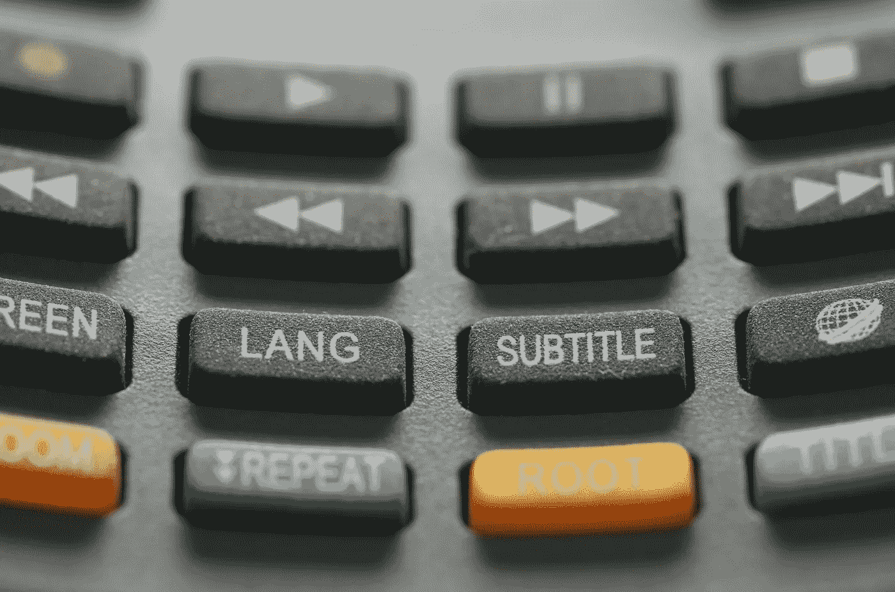
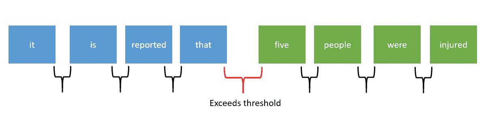

# 从语音到文本的单词时间戳构建字幕文本

> 原文：<https://towardsdatascience.com/building-subtitle-text-from-speech-to-texts-word-timestamps-27a133e2a89e?source=collection_archive---------14----------------------->

## 一个适用于所有语言的简单技巧



照片由[伊莫·威格曼](https://unsplash.com/@macroman?utm_source=unsplash&utm_medium=referral&utm_content=creditCopyText)在 [Unsplash](https://unsplash.com/s/photos/subtitle?utm_source=unsplash&utm_medium=referral&utm_content=creditCopyText) 上拍摄

语音到文本功能最近发展势头强劲，因为它为用户提供了全新的用户体验。它被市场上的公司广泛采用，尤其是在客户服务行业。事实上，像谷歌和微软这样的大公司提供了他们自己的语音转文本 API 作为他们技术的一部分。

供您参考，大多数高级语音到文本 API 都带有单词级时间戳。

## 谷歌的语音转文本 API

例如，当运行[谷歌的语音转文本 API](https://cloud.google.com/speech-to-text/docs/async-time-offsets) 时，您会得到以下输出:

```
[
    {
        "startTime": "1.400s",
        "endTime": "1.800s",
        "word": "okay"
    },
    {
        "startTime": "1.800s",
        "endTime": "2.300s",
        "word": "so"
    },
    ...
]
```

## Azure 的语音转文本 API

另一方面，微软有自己的 [Azure 的语音转文本服务](https://docs.microsoft.com/en-us/azure/cognitive-services/speech-service/get-started-speech-to-text?tabs=windowsinstall&pivots=programming-language-python)，它返回以下结果:

```
[
    {
        "Duration": 5500000,
        "Offset": 7800000,
        "Word": "seven"
    },
    {
        "Duration": 2700000,
        "Offset": 13400000,
        "Word": "three"
    },
    ...
]
```

这两个 API 表面上看起来都很有前途，但如果你打算使用输出来构建字幕，那就有一个大问题，那就是将它们组合成不太短也不太长的句子。如果最终文本是英文，您仍然可以根据某些标点符号进行后处理和拆分，例如:

```
[',', '.', '!', '?']
```

在 Azure 的情况下，这是不可能的，因为单词级时间戳中的文本是基于词法的(没有大写和标点)。此外，转录后的显示文本处于听写模式，这不同于单词级时间戳中的文本。例如，显示文本:

```
007 James Bond
```

将具有以下单词级时间戳:

```
[
    {
        "Duration": 2700000,
        "Offset": 35600000,
        "Word": "double"
    },
    {
        "Duration": 700000,
        "Offset": 38400000,
        "Word": "oh"
    },
    {
        "Duration": 4900000,
        "Offset": 39200000,
        "Word": "seven"
    },
    {
         "Duration": 3900000,
         "Offset": 44400000,
         "Word": "james"
    },
    {
         "Duration": 3300000,
         "Offset": 48400000,
         "Word": "bond"
    }
]
```

因此，您没有办法基于数组映射结果，因为长度和文本在某些地方是不同的。在撰写本文时，[开发人员已经澄清在单词级时间戳](https://github.com/Azure-Samples/cognitive-services-speech-sdk/issues/894)中不支持听写和标点符号模式。

如果你打算支持多种语言，事情会复杂得多。这主要是因为每种语言都有自己的标点符号，某些语言不能用空格来标记。

## 使用时间戳将单词拆分成句子

经过几轮实验，我找到了一个简单的窍门，把输出的单词拆分成句子。这种方法对大多数语言来说都很有效，因为它不依赖于输出文本。要点是浏览整个列表，并计算它们之间的空白间隙的长度。如果长度超过给定的阈值，则将其视为断句。

请看下图作为参考:



作者图片

在这种情况下，你会以两句话结束:

*   据报道
*   五人受伤

除了与语言无关之外，您还可以根据自己的偏好微调阈值，以便获得最佳的分割效果。

让我们继续下一部分，开始写一些代码。

# 履行

本教程将使用 Azure 语音转文本的输出作为后处理的参考。此外，为了简单起见，代码将以 Python 呈现。话虽如此，你可以很容易地将其转换成其他编程语言，因为不涉及任何外部包。

## 初始化

在工作目录中创建一个新的 Python 文件，并使用以下变量对其进行初始化:

## 将纳秒转换为秒

到现在为止，你应该已经注意到`Offset`和`Duration`都是以纳秒为单位的。让我们创建一个函数，将输入的纳秒转换为两位小数的秒:

```
def get_seconds(nanoseconds):
    return round(nanoseconds / 10000000, 2)
```

## 把单词组成句子

我们将需要一个功能来连接成一个句子的话。为了支持多种语言，您可以设置一个条件语句来确定输入语言，并使用适当的分隔符连接单词。例如:

```
def join_words(words, lang):
    if lang == 'ja-JP' or lang == 'th-TH':
        return ''.join(words) return ' '.join(words)
```

在这种情况下，泰语和日语没有空格，而其他语言由空格分隔。根据自己的喜好做相应的修改。

## 检查差异

下一步是实现后处理功能。在此之前，让我们根据列表的长度遍历列表，并计算每个单词之间的间隔长度的差异。

循环将从 0 开始，到列表总长度减 1 结束。这主要是因为差异的计算如下:

```
Offset of next word - (Offset + Duration of current word)
```

您应该在控制台上看到以下输出(没有箭头标记):

```
0.01
0.01
0.01
0.01
0.01
0.01
0.01
0.01
0.01
0.01
0.25  <--
0.01
0.01
0.01
0.01
0.01
0.01
0.01
0.01
0.01
0.41  <--
0.01
0.01
0.01
0.01
0.01
0.01
0.01
0.01
0.01
0.01
```

## 造句

有两个持续时间超过给定阈值 0.1 的实例。注释掉`print`语句，并将循环修改如下:

代码的工作方式如下:

*   计算差异
*   如果令牌为空，则设置`start`,表示句子开始
*   如果差异超过阈值，则构建句子，将信息作为字典添加到`timestamp`变量中，清除`tokens`并将`start`设置为下一个`Offset`
*   如果到了倒数第二个字，加入最后一个字并退出循环

请注意，上面的实现使用`Offset + Duration`作为`end`时间。根据自己的喜好做相应的修改。

可能有这样的情况，它只返回列表中的一个条目。在这种情况下，循环将退出并返回一个空列表。您可以通过添加如下条件检查语句来轻松处理这一问题:

```
if len(data) == 1:
    timestamp.append({'segment': data[0]['Word'], 'start': get_seconds(data[0]['Offset']), 'end': get_seconds(data[0]['Offset'] + data[0]['Duration'])})
else:
    # the rest of the code (loop)
    ...
```

你可以在下面的[要点](https://gist.github.com/wfng92/fb24cf9b1bf957f751dda971c6502ab0)找到完整的代码:

## 测试和输出

按如下方式运行它:

```
python script.py
```

您应该得到以下输出:

```
[{'segment': 'average household income is up ten percent from four years ago', 'start': 5.11, 'end': 8.52}, {'segment': 'and our customers are spending twenty percent more per transaction', 'start': 8.77, 'end': 12.12}, {'segment': 'nearly everyone surveyed is employed in a professional or managerial occupation', 'start': 12.53, 'end': 16.8}]
```

您可以使用输出列表来构建自己的字幕文件，无论是 SRT 还是 VTT 格式。例如，转换后的 SRT 文件应该如下所示:

```
1
00:00:05,110 --> 00:00:08,520
average household income is up ten percent from four years ago2
00:00:08,770 --> 00:00:12,120
and our customers are spending twenty percent more per transaction3
00:00:12,530 --> 00:00:16,800
nearly everyone surveyed is employed in a professional or managerial occupation
```

对于 VTT，输出应该如下所示:

```
WEBVTT00:00:05.110 --> 00:00:08.520
average household income is up ten percent from four years ago00:00:08.770 --> 00:00:12.120
and our customers are spending twenty percent more per transaction00:00:12.530 --> 00:00:16.800
nearly everyone surveyed is employed in a professional or managerial occupation
```

# 结论

让我们回顾一下你今天所学的内容。

本文首先简要解释了语音到文本，以及开发人员在使用语音到文本 API 输出的单词级时间戳时面临的问题。

然后，它提出了一个独立于语言的工作解决方案，即根据每个单词之间的空白进行拆分。

它继续解释了使用 Azure 的语音转文本 API 作为参考输出的实现全过程。最后，您应该会看到一个字典列表，可以用来创建相应的 SRT 或 VTT 格式的字幕文件。

感谢你阅读这篇文章。请随意查看我的其他文章。祝你有美好的一天！

# 参考

1.  [谷歌语音转文本——获取单词时间戳](https://cloud.google.com/speech-to-text/docs/async-time-offsets)
2.  [Azure 文档—语音转文本快速入门](https://docs.microsoft.com/en-us/azure/cognitive-services/speech-service/get-started-speech-to-text?tabs=windowsinstall&pivots=programming-language-python)