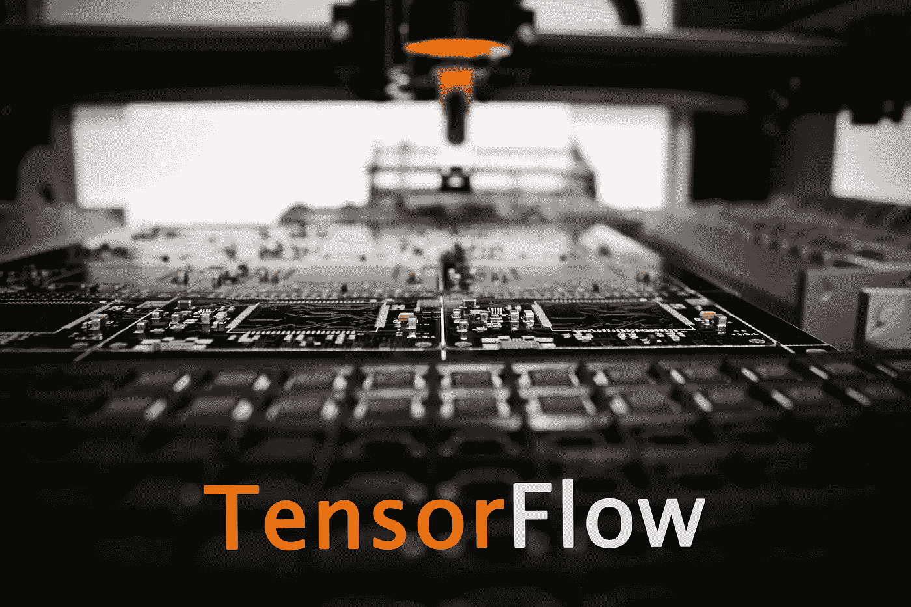
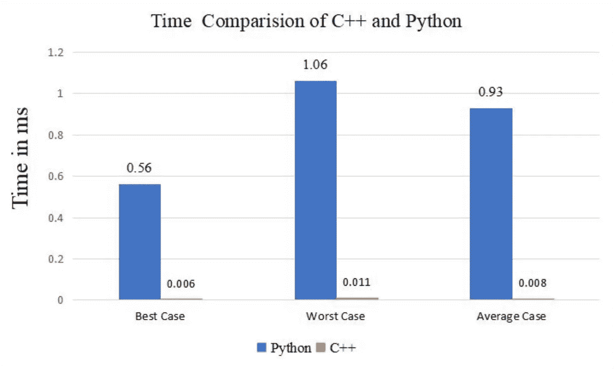
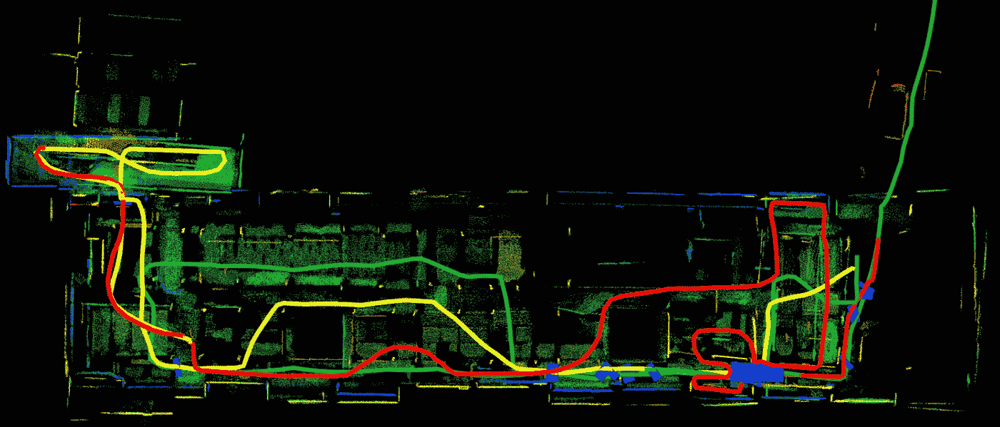

# 从机器人应用程序的源代码构建 Tensorflow 1.x C++ API

> 原文：<https://towardsdatascience.com/building-tensorflow-1-x-c-api-from-source-8f22592f183f?source=collection_archive---------24----------------------->

## 为您的模型构建更加通用的部署



由[路易·里德](https://unsplash.com/@_louisreed)在 [Unsplash](https://unsplash.com/?utm_source=medium&utm_medium=referral) 上修改的图像。

W 当谈到机器学习时，Tensorflow 是一个无处不在的工具，它简化了你的整个工作流程，允许任何人在短短几分钟内建立和训练一个基本模型。主要是为了集成到 Python 中而开发的，它将复杂的函数和操作与 Python 提供的便利性结合在一起。

然而，我们都知道便利是以牺牲性能为代价的。像 C++或 Java 这样的静态类型语言在编译时检查变量类型是否不变，这样就省去了任何运行时检查。另一方面，Python 是一种动态类型语言，这意味着您可以在运行时更改变量和方法。这引入了运行时检查来最小化任何错误，这就是为什么大多数熟悉静态类型语言的人经常抱怨 Python 很慢。



C++和 Python 用排序算法的时间比较[1]。

事实上，由于大量的变量和函数构成了一个相当大的机器学习模型，Python 的迟缓对训练和推理都是有害的。虽然这种速度上的差异对于一般用途来说很难察觉，但在某些使用情况下却很重要，比如机器人的协同同步定位和地图绘制(CSLAM)。

简而言之，CSLAM 旨在利用一组机器人有效地探索未知环境，同时确定它们在任何时间点的精确位置，并以地图的形式生成它们环境的准确描述。点击阅读更多关于 CSLAM [的内容。](https://arxiv.org/abs/2102.03228)



CSLAM 的可视化[2]。

对于执行 CSLAM 的机器人来说，它们需要经历一系列阶段，其中包括利用深度学习模型进行特征检测和位置识别。这有助于他们更好地了解周围环境，并对自己的准确位置更有信心。由于机器人不断移动和收集数据，因此 CSLAM 的实时运行至关重要，以免进度受到阻碍。因此，广泛使用的机器人操作系统(ROS)代码通常用 C++编写，以提高性能。因此，它还将提高使用 Tensorflow C++ API 对深度学习模型进行推理的速度。

顶尖研究人员开发的最先进的深度学习模型倾向于使用更老的 Tensorflow 1.x，而不是更健壮的 2.x ( *讽刺，我知道*)。从源代码安装 2.x 非常简单，但是 1.x 几乎没有任何说明，有些链接是断开的。因此，我打算通过编写一个单步脚本来解决这些问题。

# 先决条件

该脚本假设默认发行版为 Ubuntu 18.04，依赖版本(如 GCC)取决于您使用的发行版。根据您的操作系统随意修改脚本。

CUDA 也是强烈推荐的(但不是必须的)。安装最新版本的说明可以在[这里](https://docs.nvidia.com/cuda/cuda-installation-guide-linux/index.html)找到。

第一步是安装运行未来命令所需的库:

```
sudo apt-get update
sudo apt-get install -y build-essential curl git cmake unzip autoconf autogen automake libtool mlocate zlib1g-dev gcc-7 g++-7 wget
sudo apt-get install -y python python3 python3-numpy python3-dev python3-pip python3-wheel
sudo apt-get install -y python3.6 python3.6-dev
sudo updatedb# Set GCC-7 as default
sudo update-alternatives --install /usr/bin/gcc gcc /usr/bin/gcc-7 100
sudo update-alternatives --install /usr/bin/g++ g++ /usr/bin/g++-7 100
```

# 从源构建张量流

我们使用一个构建工具 Bazel 来安装 Tensorflow。该脚本基于 Tensorflow 的单一版本，具体来说是 Tensorflow 1.14.0。如果您打算安装任何其他版本，请注意 Bazel 的版本也需要更新。要获得 Tensorflow 版本及其依赖项的完整列表，请查看此[链接](https://www.tensorflow.org/install/source#tested_build_configurations)。

以下脚本检查 Bazel 的现有版本，并更新到指定版本:

```
*###--- BAZEL 0.24.1 ---###* BAZEL_VER=`bazel version | grep "Build label" | awk '{print $3}'`
if [[ $BAZEL_VER != "0.24.1" ]]; then
    if [ ! -f bazel-0.24.1-installer-linux-x86_64.sh ]; then
        wget [https://github.com/bazelbuild/bazel/releases/download/0.24.1/bazel-0.24.1-installer-linux-x86_64.sh](https://github.com/bazelbuild/bazel/releases/download/0.24.1/bazel-0.24.1-installer-linux-x86_64.sh)
    fichmod u+x bazel-0.24.1-installer-linux-x86_64.sh
    ./bazel-0.24.1-installer-linux-x86_64.sh
fibazel version
```

接下来是克隆 Tensorflow GitHub repo:

```
*###--- TF 1.14.0 ---###* if [ ! -d tensorflow ]; then
    git clone [https://github.com/tensorflow/tensorflow.git](https://github.com/tensorflow/tensorflow.git)
ficd tensorflow
git checkout v1.14.0
```

如果您尝试运行构建脚本，您很可能会遇到一系列错误，其中之一就是无法下载 Eigen。这是因为原始构建脚本中的镜像链接被破坏了，所以我们需要找到一个替代镜像。

```
echo "Replacing broken Eigen URLs..."find . -type f -exec sed -i 's/http.*bitbucket.org\/eigen\/eigen\/get/https:\/\/storage.googleapis.com\/mirror.tensorflow.org\/bitbucket.org\/eigen\/eigen\/get/g' {} \;EIGEN_COUNT=`grep -nr "https://storage.googleapis.com/mirror.tensorflow.org/bitbucket.org/eigen/eigen/get/" | wc -l`if [ $EIGEN_COUNT -ne 6 ]; then
    echo "Eigen URLs not updated!"
    echo "Please manually replace all occurrences of"
    echo "http.*bitbucket.org/eigen/eigen/get"
    echo "with"
    echo "https://storage.googleapis.com/mirror.tensorflow.org/bitbucket.org/eigen/eigen/get"
    exit 1
fi
```

然后，我们可以通过运行脚本下载 Tensorflow 所需的外部库:

```
chmod u+x tensorflow/contrib/makefile/download_dependencies.sh
./tensorflow/contrib/makefile/download_dependencies.sh
```

最后一个预处理步骤是将 Protobuf 头文件安装到您的`/usr/local/`目录中:

```
*###--- PROTOBUF 3.7.1 ---###* cd tensorflow/contrib/makefile/downloads/protobufgit submodule update --init --recursive
./autogen.sh
./configure
make -j$(nproc)
make check -j$(nproc)sudo make install
sudo ldconfig
```

终于可以开始编译 Tensorflow 了！在主 Tensorflow 目录中，运行以下命令:

```
# Configures dependencies versions and what is going to be built
# Customise to your own needs
./configurebazel build --config=opt //tensorflow:libtensorflow_cc.so //tensorflow:install_headers
```

这个步骤可能需要一个小时，这取决于您的 CPU 可以运行多少个线程，所以喝杯咖啡或去散散步，让您从所有的脚本中清醒过来！

# 安装顶盖

如果构建没有任何错误的完成，这意味着你已经成功了！剩下要做的就是将相关的头文件安装到您的`/usr/local/`目录中，这样无论您的项目在哪里，您都可以调用它们:

```
sudo mkdir /usr/local/tensorflow
sudo cp -r bazel-genfiles/tensorflow/include/ /usr/local/tensorflow/
sudo cp -r /usr/local/include/google/ /usr/local/tensorflow/include/
sudo mkdir /usr/local/tensorflow/lib
sudo cp -r bazel-bin/tensorflow/* /usr/local/tensorflow/lib
```

# 测试

如果您想仔细检查是否可以包含没有任何问题的标题，请尝试在 Tensorflow 中运行 Hello World 等效程序:

Tensorflow 中的 Hello World

完整的脚本可以在[这里](https://github.com/cwlroda/random-scripts/blob/master/tf_cpp_install.sh)找到。您所需要做的就是运行这个脚本，它将执行所有上述步骤，甚至执行一些自动配置。如果您确实发现了任何错误，请提交问题或请求，并让我知道！

如果你想分享任何想法或观点，请在下面留下评论，或者[在 LinkedIn](https://www.linkedin.com/in/weilooncheng/) 上给我留言。

## 参考

[1] F. Zehra，M. Javed，D. Khan，M. Pasha，[c++和 Python 在内存和时间方面的比较分析](https://www.preprints.org/manuscript/202012.0516/v1) (2020)，Preprints 2020，2020 12 05 16(doi:10.20944/Preprints 202012.0516 . v1)。

[2] R. Dubé，A. Gawel，H. Sommer，J. Nieto，R. Siegwart，C. Cadena，[一种用于 3D 激光雷达的在线多机器人 SLAM 系统](https://n.ethz.ch/~cesarc/files/IROS2017_rdube.pdf) (2017)，IEEE/RSJ 智能机器人与系统国际会议(IROS)。