# 最大间隔分类器是优化问题的解决方案

> 原文：<https://towardsdatascience.com/building-the-optimization-problem-of-maximum-margin-classifiers-8da3d2c87369?source=collection_archive---------30----------------------->

# 背景

人们可以从优化和概率两个角度来看待机器学习问题。这并不令人费解。例如，任何线性回归问题的解决方案通常被认为是通过一组数据点的最佳拟合线。但是你也可以将线上的单个点确定为解释变量的期望值。前者是一个优化视图，而后者展示了一个概率图。最大间隔分类器是支持向量机的基础，也是优化问题的解决方案。在这篇文章中，我们讨论如何。(关于回归的详细概率观点，请查看我的另一篇文章-[https://towardsdatascience . com/why-we-use-the-least-square-method-in-regression-analysis-b 7873 e 03 b 253](/why-we-use-the-least-square-method-in-regression-analysis-b7873e03b253))

# 1)建立优化问题

我们从一个基本的分类问题开始，逐渐进入一些复杂的问题。考虑下图，一个提供的训练数据的图表。数据点被分成两类——蓝色和粉红色。他们之间有一个明显的，可辨别的分离，一片荒芜的领土，两边各有一点。

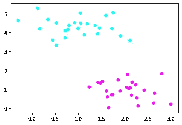

用 python 创建

两个组之间的特定线有助于分类。根据它们所处的位置，测试数据点将被分类为蓝色或粉红色。我们的工作是挖掘这条线，一个线性分类器。让我们看看怎么做。(在本文中，我交替使用直线、线性分类器和分类器)

## 1.1)入门-分类器、区域和边界

在我们继续之前，有一些事情需要解决。首先，分类器必须使得来自训练数据的相似色点必须位于同一侧。第二，许多行都在争夺分类器的位置。在下图中，黑线就是其中的几条。在这些线周围还有一片被遗弃的灰色阴影。这是任何训练观察的禁区，对每个参赛者来说都是独一无二的。姑且称之为量词的 ***领地*** 。

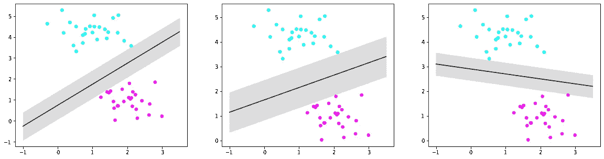

灰色的废弃区域(用 python 创建)

现在，根据上面的图像，您如何定义一个区域的范围？利用界限。在每一侧找到与竞争分类器最近的点。通过这些点平行于分类器绘制的线称为边界。根据对训练观察施加的约束，所有相似的彩色点位于它们各自的 ***边界*** 的同一侧。

## 1.2)分配空白区域

任何分类器的功能都是在训练数据集上学习分类，然后准确地对测试数据点进行分类。他们如何做到这一点，更重要的是，我们如何找到最好的分类器？(注意:训练观察不是分类器领域的一部分。但是，这不适用于测试数据点。)

一个分类器将它的一部分区域分配给每个组。然后，他们对占据其各自区域的所有测试点拥有所有权。让分类器更接近特定的组会导致错误分类。例如，考虑下图。由于新的数据点(十字)更接近蓝色，它可能属于他们。然而，由于它与分类器的相对位置，它被涂成粉红色。为了避免这样的错误，我们必须确保分类器将*最大可能区域*赋予*到*每组。为什么

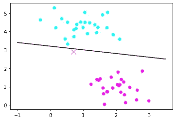

用 python 创建

将最大区域授予一个组意味着选择具有最大领域的分类器。该条件还要求两个群体获得相等的份额，并且分类器位于其领域的中间。为什么？如果没有，我们再次引入上面讨论的麻烦。

现在，为了找到分类器的方程，我们需要一个常数。

## 1.3)支持向量

(用 python 创建)

让我们重温一下 1.1 中定义的边界。我们讨论过它们通过一些特殊的点。这些被称为支持向量。根据边界线的斜率，每一边可能有多个支持向量。也就是说，任一边界都可以通过两个或更多的点。然而，这些点中的一个必须是每侧离分类器最近的点。为什么？否则，我们与训练观测值(1.1)的条件相矛盾

我们知道，对新点进行充分分类需要一个具有最大范围的分类器。它的大小是分类器和它的边界之间的垂直距离(D)的量度。如果你不明白为什么，请记住，边界决定了领土的范围。注意，也可以通过计算支持向量和预期分类器之间的垂直距离来获得 D。为什么因为所有的边界线都经过支持向量。

## 1.4)引入方程式

好吧，我对我们要设计的东西已经考虑得够多了。让我们从数学上来解读以上所有观点。假设一个方程用于形式为 ax+by+c=0 的分型线(2D 平面中的一条线的方程)。

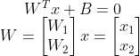

记住，边界线与分类器的距离相等，并与其平行。我们可以通过在后者的方程中加入一个常数项来把它们的方程连根拔起。本质上，在两个方向上移动一些 C 单位的线产生边界。(C 的符号不重要。数学会照顾到它)

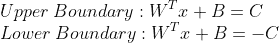

用 C 除所有三个方程，我们得到

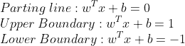

我们现在可以进行优化。如前所述，我们选择了离支持向量最大垂直距离的分类器，也称为 ***、边缘、*** 。根据坐标几何，计算如下:

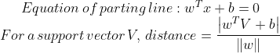

距离项的分子很容易计算。因为支持向量位于边界上，所以它必须等于 1。

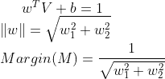

我们的优化问题现在需要约束。将分类器的方程视为函数 f。将任何蓝点传递给 f 都会产生大于或等于 1 的值。为什么？我们知道，f 在支持向量上的值为 1。因此，对于蓝色支持向量左侧的点，f 超过 1。该约束确保所有蓝点位于同一侧。类似地，对于粉色点，f 将小于或等于-1。

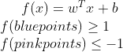

如果我们从数字上将蓝色归类为 1，将粉色归类为-1，并将 f 乘以它们的数字标识，我们得到:

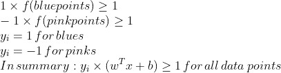

我们的优化问题本质上可以分解为:

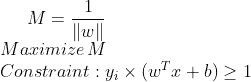

该解决方案产生了 ***最大边际分类器(MMC)*** 。

# 2)修改优化问题

## 2.1)引入并发症

示例问题对我们很友好。在大多数情况下，就像图中显示的那样，数据点不容易分离。让我们突出这些问题。

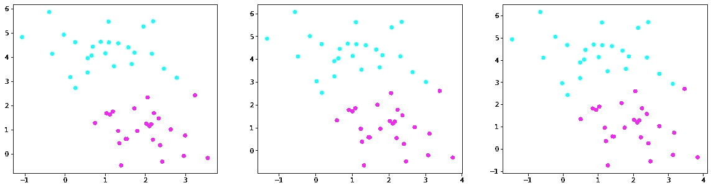

用 python 创建

在上述情况下，很少有不同颜色的数据点过于接近，无法进行令人满意的分类。在这种情况下，利润可能非常有限。由于它可以被认为是衡量模型可靠性的一个参数，较小的裕度可能会给出不准确的分类。在其他情况下，如下所示，向训练观察值添加单个点可能会显著修改原本适当的最大余量，从而使模型容易过度拟合。

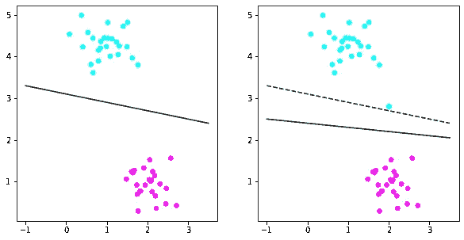

用 python 创建

解决的办法是错误地分类特定的点。这样做会降低训练数据的分类精度。然而，平均而言，该模型在测试数据上表现更好。这种情况下找到的分隔线称为 ***支持向量分类器(SVC)*** 。

## 2.2)查找 SVC

我们不需要从根本上构建 SVC。它的思想与 MMC 的思想相同，只是有一处修改，即对点的错误分类。因此，让我们从我们离开的地方继续优化的故事。再一次，搜索的是提供蓝色和粉红色之间的最佳可能分离的分类器。因此，它的假设方程和最大化参数(M)没有变化。然而，这些限制确实发生了变化。

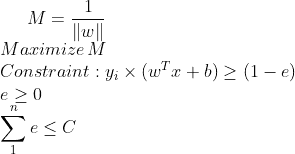

指导这些修改的逻辑是什么？由于分类错误，点可能会落在其边界的错误一侧。一个组甚至可能有几个位于分类器的错误一侧。因此，对于这样的点，函数 f 产生小于 1 的值。松弛变量说明了这一点。你可以把它们解释为每个数据点的错误分类的参数。因此，有三种可能性:

1.  e = 0；数据点位于页边距的右侧
2.  1<e>0；数据点位于边界和分类器之间。边界的错误一边</e>
3.  e > 1；数据点位于分类器的错误一侧

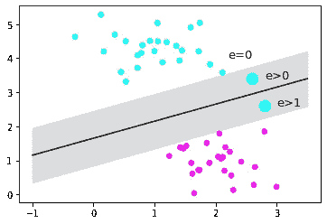

用 python 创建

c 是总误差的量度。因为它是所有误差的总和，所以它的值不能为负。你可能会认为这是一个拨号控制的错误分类。从 0 度开始转动刻度盘会增加错误分类。接下来的问题是如何给 C 赋予它最好的价值。像任何机器学习算法一样，没有具体的方法。你为不同的 C 值建立模型并交叉验证它们。

# **结论**

等等，我们就此结束？而不用解最优化方程？是的，这样做很累人，需要一些高级优化技术的知识。我可能会在另一篇文章中介绍它们。我在这里的目的是直观地解释 MMC 和 SVC。当数据点不是线性可分时，这些算法会失败。然后我们使用支持向量机(SVM)。它借用了所有讨论过的想法，但有一些引人注目的补充。

***参考文献:统计学习导论——丹妮拉·威滕***