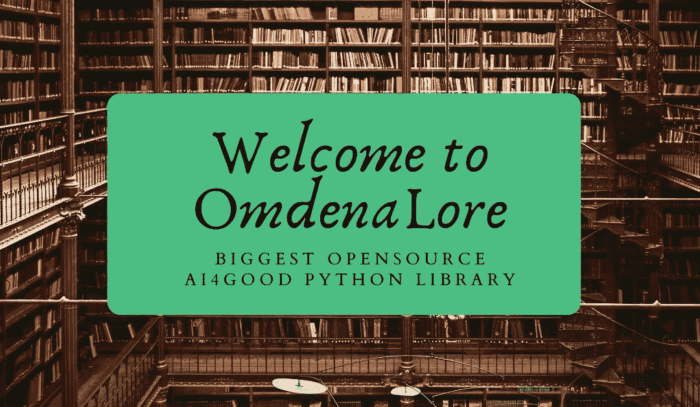
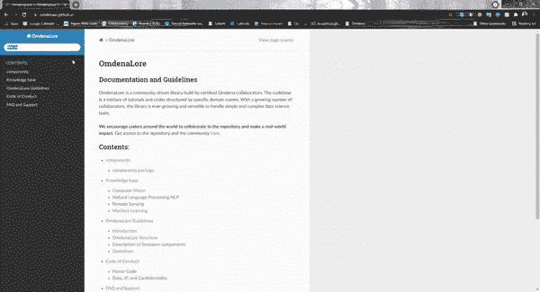
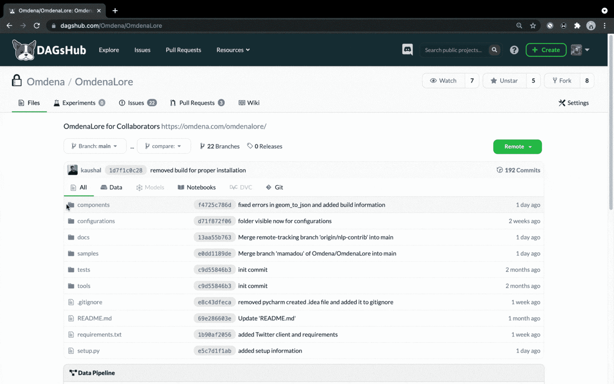
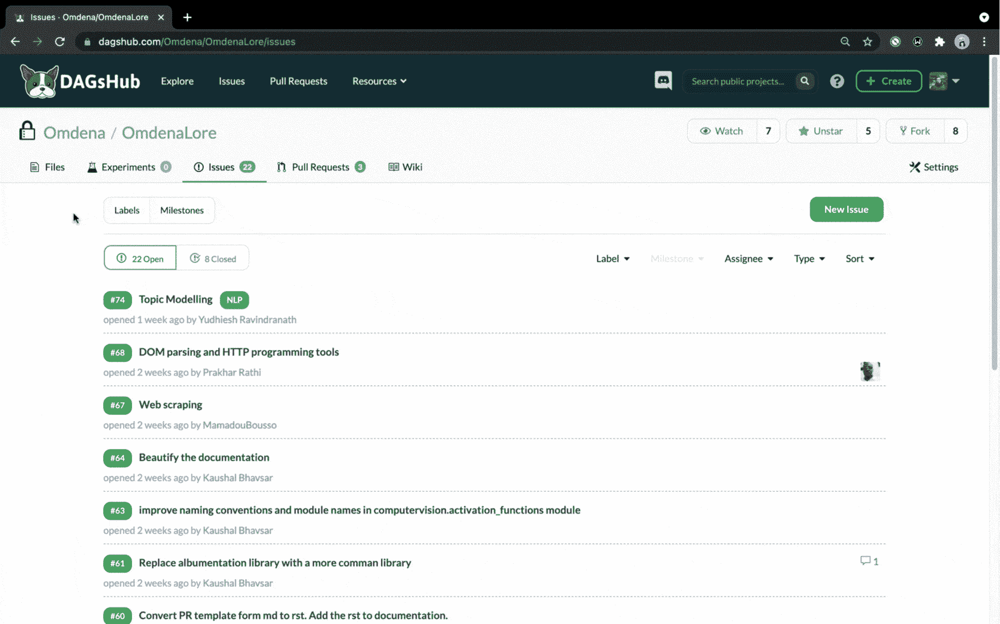
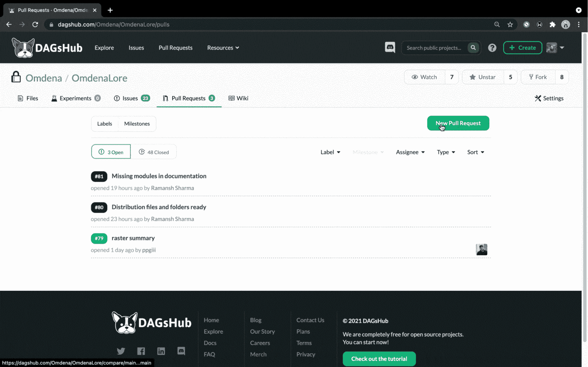

# 构建世界上最大的 AI4Good Python 库

> 原文：<https://towardsdatascience.com/building-the-worlds-largest-ai4good-python-library-ad0256c35271?source=collection_archive---------34----------------------->

## **由全球人工智能社区合作构建和维护**

*图片来自 Canva Pro，授权给 Omdena*

> 想象一下一个开源 Python 库，它允许您在几天之内构建一个可用于生产的端到端数据科学管道！此外，该库不仅是一个代码库，还是一个知识源，在开发的每个阶段都有帮助，同时解决一些世界上最具挑战性的问题。
> 
> 听起来是虚构的，对吧？但这正是 **OmdenaLore** 的含义。

# OmdenaLore 是由社区开发的

我们的任务是构建 OmdenaLore，这是一个开源的数据科学包，提供全面且随时可用的 Python 类和函数，以加速的方式解决几乎任何机器学习问题。我们希望这是一个一站式图书馆，主要侧重于帮助开发人员建立现实世界的解决方案。此外，这个 Python 库是由全球人工智能社区协作构建和维护的，因此使它的开发更具包容性和道德性。

让我们更深入地了解 OmdenaLore 所提供的内容！

# 如何使用这个 Python 库？

## 你可以访问图书馆[https://omdenaai.github.io/](https://omdenaai.github.io/guideline.html)

我们确保 OmdenaLore 易于所有人使用。一些主要特征是:

# 直观的文档

老实说，我们经常会花几个小时在谷歌上搜索解决方案来修复错误，而不是花足够的时间在文档上。我们理解文档有时不直观，可能感觉不完整。因此，我们设计了 OmdenaLore 文档，它类似于维基百科的结构，带有标准 Python 库的文档主题，让您有宾至如归的感觉。但是什么是真正新的呢？不仅仅是外观，文档是合作者提供的，所以你可以向面临同样挑战的合作者学习。使用 OmdenaLore 文档，您还可以访问 Omdena 的公开知识库。使用内置的搜索功能对您的兴趣进行分类，您将进入充满知识的领域。有了结构化的知识库和文章，这个资源列表可能会“解决”你所有的问题。

*在 OmdenaLore 文档中使用搜索—来源:Omdena*

# 结构化知识库

该存储库提供了来自合作者的代码库、文档和知识库的组合。OmdenaLore 遵循基于[机器学习](https://omdena.com/category/machine-learning/)和数据处理领域的结构化方法。浏览 components 文件夹，找到您感兴趣的代码库。感到失落？前往 samples 文件夹并运行笔记本，了解更多关于代码如何从加载数据到应用模型的工作原理。

> *当你成为奥姆德纳罗的一员时，我们会全程指导你的贡献。*

# 你如何能有所贡献？

## 当你通过[链接](https://omdena.com/omdenalore/)申请时，你将被允许访问知识库和我们的 slack 频道。

我们的贡献范围真的很广。本质上，只要不违反任何 IP，你可以贡献任何数据科学代码块。既然您有了推送访问权，那么您就可以克隆存储库并创建一个新的分支。此时，您还会发现我们的 Slack 小组与来自世界各地的其他变革者在一起，您可以在这里讨论和集思广益编码想法，并提出任何问题。OmdenaLore 并不一定要求深厚的专业知识，而是寻找那些希望做出贡献、成长和产生影响的积极的个人。

*OmdenaLore 代码组件—来源:Omdena*

# 我们独特的协作流程

# 问题部分

我们的 DAGsHub 存储库使用**问题**将添加更多功能的任务组合在一起。任何对某个问题感兴趣的贡献者都可以在他们的 Pull 请求中使用 Issue 链接。我们尽最大努力用编号的任务列表保持问题的简洁和离散。这鼓励了更细粒度的协作实践，因为每个提交的拉请求都添加了不同的新特性。

*在 OmdenaLore 上制造问题——资料来源:Omdena*

# 拉式请求

OmdenaLore 中的任何贡献都是通过 Pull 请求完成的。为了做出贡献，贡献者从 main 创建一个新的分支，在那里添加他们的更改，并发出一个 Pull 请求。我们的拉动式请求审查和合并速度非常快，平均时间为 2-3 小时。偶尔，我们会要求 PR 作者在合并 PR 之前做一些小的改动。有关贡献指南的更多信息，请参考[https://omdenaai.github.io/guideline.html](https://omdenaai.github.io/guideline.html)。

*OmdenaLore 中的拉取请求—来源:Omdena*

# 短距离赛跑

当你和别人一起做的时候，编码更有趣！每周，我们都试图在我们的 Discord 服务器上主持至少三次编码冲刺。短跑没有先决条件，任何希望参加的人都可以加入语音呼叫。在新贡献者的简短介绍后，每个人都开始编写他们想贡献的问题。问答贯穿于整个 sprint，有时甚至在不同的语音通道中进行，以不打扰人们编码(我们还会一起听有趣的音乐:)。

疑问或问题解决——除了编码冲刺之外，我们在 Omdena 社区中还有一个活跃的 slack 频道，在这里我们可以讨论代码、交换关于 OmdenaLore 新特性的建议并分享反馈。我们还有一个 Airtable 表格，可以通过它直接与我们分享反馈。

# 专家

当然，没有人能成为所有人的专家。根据我们正在进行的编码冲刺的主题([计算机视觉](https://omdena.com/solutions/computer-vision/)、[卫星图像](https://omdena.com/blog/ai-satellite-imagery/)、[自然语言处理](https://omdena.com/solutions/nlp/)等)。)，我们邀请我们的社区成员申请成为 sprint 的专家，以及 slack 频道中的一般主题的专家。这允许贡献者就他们试图贡献给存储库的代码提出他们的问题，以确保它对其他用户来说运行良好且可靠。

# 有助于在伦理上和包容性上建设人工智能的未来

OmdenaLore 不是 TensorFlow 和 PyTorch 等传统软件包的替代品。它用于构建与其他包相同的管道，但是时间跨度要短得多。此外，OmdenaLore 的目标是培育一个强大的开源社区，在这里可以不断添加新的功能和特性。我们希望全球所有数据科学家都能参与这项计划，无论他们是否希望成为贡献者。记住这一点，我们将很快在 PyPi 上发布 OmdenaLore，作为一个可安装的 Python 数据科学包。因为它是一个以项目为中心的 Python 库，所以您可以对 OmdenaLore 支持的多个实时项目产生影响。

## 通过[链接](https://omdena.com/omdenalore/)填写表格，开始投稿吧！

**欣赏 OmdenaLore 演示**

**OmdenaLore 和你一起，将成为好 Python 库最大的 AI！**

感谢所有贡献者:*马马杜·布索、安珠·麦西亚、西朱阿德·奥贡塔约、普雷西奥·加布里埃洛、普拉哈尔·拉蒂、戈塔米·乌达鲁、尤迪耶什·拉温德拉纳特、马克·西拉、克莱夫·费尔南德斯、塞缪尔·提阿非罗、威尔默·冈萨雷斯、马尼夫·塞加尔、赛·尼基莱什·雷迪和舒巴姆·甘地*。特别感谢 *Kaushal Bhavsar* 和 *Ramansh Sharma* 驾驶这辆车。

*(本文由 Kaushal Bhavsar 和 Ramansh Sharma 撰写，最初发表于*[*https://om dena . com/blog/worlds-largest-ai 4 good-python-library-omdenalore/*](https://omdena.com/blog/worlds-largest-ai4good-python-library-omdenalore/)*)*