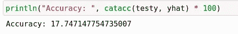

# 在 Julia 中构建您的第一个分类管道

> 原文：<https://towardsdatascience.com/building-your-first-classification-pipeline-in-julia-47e661c097d7?source=collection_archive---------31----------------------->

## 用 Julia 语言创建分类管道的快速概述


(src =[https://pixabay.com/images/id-1566044/](https://pixabay.com/images/id-1566044/)

# 介绍

C 分类是机器学习的一种形式，使用统计分析和概率论来预测类别集。这在机器学习领域是一项非常常见的任务，但 Julian 生态系统尚未对这一技术提供显著支持。虽然这并不是说在 Julia 编程语言中没有分类模型，但是您可能会很快发现它们非常稀少并且很难得到。再者，生态系统中的包彼此并不一致，更不用说 Julia 周围的其他语言的生态系统了。

当然，乍一看，有些人可能会将这些不一致归因于 Julia 所在的编程范例。像大多数其他现代编程语言一样，Julia 是多范型的，并具有许多通用编程概念，这使得该语言更易于使用。然而，我认为 Julia 已经构建了一个全新的范例，我(以及 Julia Computing)喜欢称之为多分派范例。

使用多分派范例，语法对于任何其他语言都是非常独特的，或者与另一种语言完全相同。例如，如果我们考虑 Python，它当然是统计学、机器学习和数据科学最流行的语言，我们可以通过使用构造函数和多重分派来模仿该语言在 Julia 中的能力。这正是我们今天将要使用的软件，车床，所做的事情，目的是让 Pythonic 的科学家们非常容易地开始学习 Julia 语言——而不必学习大量新的语法规则。如果您想了解更多关于车床的信息，您可以访问车床网站:

 [## 车床

### 车床使用更快的方法和简单的方法。使得包装快速、简单且轻便。许多工具和模型…

车床. ai](https://lathe.ai/) 

对于这个项目，我也有一个笔记本，您可以查看它，以便更好地掌握我将要查看的代码:

[](https://github.com/emmettgb/Emmetts-DS-NoteBooks/blob/master/Julia/Baltimore%20Crime%20Classification.ipynb) [## emmett GB/Emmetts-DS-笔记本电脑

### 各种项目的随机笔记本。通过创建帐户，为 emmettgb/Emmetts-DS 笔记本电脑的开发做出贡献…

github.com](https://github.com/emmettgb/Emmetts-DS-NoteBooks/blob/master/Julia/Baltimore%20Crime%20Classification.ipynb) 

# 数据

对于这个项目，我基本上决定选择我能找到的任何有类的数据。我并不太关心特性的统计意义，因为这意味着更多的是对车床软件包内部建模能力的演示，以及在 Julia 中使用数据的小教程。记住这一点，我们要做的第一件事就是用 CSV.jl 和 DataFrames.jl 包读入我们的数据。为了做到这一点，我们需要使用一个 sink 参数，就像这样:

```
using CSV
using DataFrames
using DataFrames; df = CSV.read("baltimore_crime.csv", DataFrame)
```

如果你想了解更多关于什么是 sink 参数，以及它是如何工作的，那么你可以查看我在这里写的关于它的概述:

[](/what-is-a-sink-argument-caf77dab6ac5) [## 什么是“下沉”论点？

### 关于在 Julia 编程语言中使用接收器参数的介绍。

towardsdatascience.com](/what-is-a-sink-argument-caf77dab6ac5) 

DataFrames.jl 的显示输出相当恐怖，这是我一直讨厌这个包的地方。实际上，我确实派生了这个包，并试图修改显示，但由于 DataFrames.jl 如此依赖于其他生态系统包，如 PrettyTables.jl，我们决定等待 PrettyTables.jl 的下一个版本发布会更有意义。这当然是有意义的，但是在一段时间内使用这个包会有负面影响。渐渐地，我放弃了我不想要的列，因为它们变得可见。我是通过使用 select！()方法和 Not()方法——这当然是从数据帧中删除列的一种非常谨慎的方法。：

```
df = select!(df, Not([:CrimeDate, :CrimeTime]))
```

这样做了一次后，我厌倦了，决定打印所有的名字，去掉我认为不合适的名字。这样做的一个很大的缺点是我看不到每一列的数据类型，甚至看不到特性是什么样子。你也可以做

```
show(df, allcols = true)
```

但是输出也很难辨认。

```
for name in names(df)
    println(name)
end
df = select!(df, Not([:Description, 
            Symbol("Inside/Outside"), :Weapon, :Post,
            Symbol("Location 1"), Symbol("Total Incidents")]))
```

现在我们有了所有不需要的列，我们可以从数据框架中删除缺失的列:

```
df = dropmissing(df)
```

因为在一个有 284，000 行的数据帧中只有大约 1，000 个缺失，所以我认为这比尝试填充这些值更有意义。然而，填充这些值的一个有趣的方法是使用 Lathe 的多数类基线遍历它们，例如:

```
using Lathe.models: ClassBaseline
model = ClassBaseline(Array(df[!, :CrimeCode]))
for val in df[!, CrimeCode]
    val = model.predict([val])[1]
end
```

接下来，我选择了以下内容作为我的功能和目标:

```
feature = :CrimeCode
target = :District
```

# 建模

例如，区列是表示区的数据，[东北、西、东南]。犯罪法典是某种专有系统，地方政府或联邦政府用来对不同类型的犯罪活动进行分类。接下来，我使用车床的火车测试分裂功能，以分裂我的数据:

```
using Lathe.preprocess: TrainTestSplit
train, test = TrainTestSplit(df)
```

然后，我相应地调用每个数据帧的列，以便将新数据放入一维数组。

```
trainX = train[!, feature]
trainy = train[!, target]
testX = test[!, feature]
testy = test[!, target]
```

我们需要做的最后一件事是找到某种方式来编码我们的数据。对于这个任务，我决定使用顺序编码器。这可以在车床的预处理模块中找到:

```
using Lathe.preprocess: OrdinalEncoder
encoder = OrdinalEncoder(trainX)
```

最后，我对编码器使用预测函数，以便将数据转换成普通的编码形式:

```
trainX_encoded = encoder.predict(trainX)
```

最后，我们将从车床导入并安装随机森林分类器。模型:

```
using Lathe.models: RandomForestClassifier
model = RandomForestClassifier(Array(trainX_encoded), Array(trainy))
```

请注意，我必须将数组类型转换为我的两个数组，这是因为 DataFrames.jl 从. 24 版本开始就在 PooledArrays 中存储数据，而 Lathe 的调度不是针对 AbstractArrays，而是只针对数组。如果你想学习更多关于 Julia 语言中类型抽象的知识，我有另外一篇文章你也可以阅读:

[](/overview-abstract-super-type-heirarchies-in-julia-26b7e64c9d10) [## 概述 Julia 中的抽象超类型层次结构

### Julia 的酷类型抽象介绍！

towardsdatascience.com](/overview-abstract-super-type-heirarchies-in-julia-26b7e64c9d10) 

接下来，我将 testX 转换成数组类型:

```
testX = Array(testX)
```

最后，我建造了我的管道。在 Lathe 中，我们可以使用 Julia 的基本加法运算符来实现这一点。可以用减法运算符删除步骤，我认为这是一种非常酷的语法。另一件很酷的事情是，我们甚至不需要导入管道类型来使用它！

```
pipe = encoder + model
```

我实际上写了一篇关于如何做到这一点的文章，如果你不熟悉 Julia，我肯定认为它不值得一读:

[](/extending-julias-operators-with-amazing-results-96c042369349) [## 用惊人的结果扩展 Julia 的算子

### 如何在 Julia 中加载和扩展方法，用一个真正激动人心的例子。

towardsdatascience.com](/extending-julias-operators-with-amazing-results-96c042369349) 

最后，我们可以在新管道上调用 predict()函数，该函数将对我们的值进行编码，然后将其传递给模型:

```
yhat = pipe.predict(testX)
```

最后，我们可以使用 Lathe.stats 中的 catacc()方法来评估精度:

```
using Lathe.stats: catacc
println("Accuracy: ", catacc(testy, yhat) * 100)
```



由作者制作的图像

> 这太残忍了。

# 结论

尽管这些特性之间缺乏统计意义，但很难否认 Lathe.jl 包中提供的很酷的语法和方法。我认为这些管道特别酷，我很高兴能继续深入研究它们。如果您对该模型与其他地方的实现相比如何感到好奇，您可以随时查看我对该模型和 SkLearn 之间的性能和准确性进行的比较，这无疑是很有启发性的:

[](/performance-testing-python-and-sklearn-with-julia-and-lathe-f5516fa497d7) [## 性能测试——Python 和 SkLearn 与 Julia 和 Lathe

### 在两个生态系统工具的最新版本上执行一些基本指标。

towardsdatascience.com](/performance-testing-python-and-sklearn-with-julia-and-lathe-f5516fa497d7) 

非常感谢您的阅读，我希望这篇文章对您有所帮助，让您在 Julia 中成为一名更好的程序员！