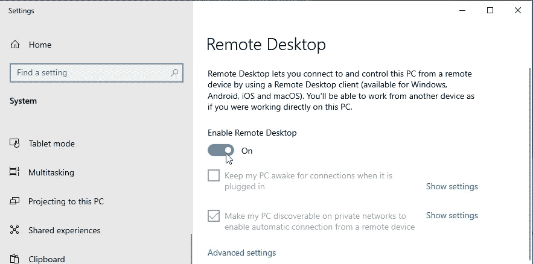

# 为深度学习构建自己的数据科学基础设施

> 原文：<https://towardsdatascience.com/building-your-own-data-science-infrastructure-for-deep-learning-99ba17407af2?source=collection_archive---------12----------------------->

## 入门|数据科学基础设施| KNIME 分析平台

## 构建自己的机器并安装 KNIME、Jupyter-Notebook 和 Tableau，为所有数据科学和深度学习任务做好充分准备

图 1:构建自己的机器(图片由作者提供)

# 自制或购买

你想开始学习数据科学，但缺乏适当的基础设施，或者你已经是一名专业人士，但在深度学习方面仍有知识差距？

那么你有两个选择 :
1。 ***从亚马逊、微软 Azure、谷歌云或类似的云提供商那里租用虚拟机*** 。

图 2:选择合适的云平台(图片由作者提供)。

***2。构建自己的物理机器*** 并安装合适的软件

图 3:我的数据科学“怪兽电脑”(图片由作者提供)。

我尝试了两种选择，但最终决定建造自己的钻机是更好的选择，原因如下:

1.  **节省成本**
    如果您需要一个具有强大显卡(GPU)、快速处理器(CPU)和大量内存的系统，那么从长远来看，构建一台机器实际上可以为您节省资金！根据云服务的不同，不同提供商的价格相差很大，但最终你可以用那个价格建造自己的机器并永久保存。而如果你需要 Windows 作为你的操作系统(OS)，你肯定会省钱。相信我:你最终会需要窗户的！
2.  **更多的能力和资源** 来自 [Bizon-Tech](https://bizon-tech.com/blog/building-best-deep-learning-computer-vs-aws-cloud-vs-bizon) 的一项研究表明，与基于网络的服务相比，使用 1 个 GPU 的预构建在 1 年内最多便宜 10 倍，使用 4 个 GPU 的最多便宜 21 倍。当谈到存储容量时，网络服务的价格会超过一定的规模。
3.  **你的机器还可以用于其他任务** 最后，你可以用你的电脑进行其他任务，比如电影剪辑或者 PC 游戏，并且永远保留它。

# 第 1 部分:选择正确的系统和软件

为了构建我们的系统，我们需要提前考虑几个问题。
其中一个关键点是选择合适的操作系统。
我们可以在 Windows 10 Pro、Linux 和 Mac OS X 之间进行选择。
但是哪个系统符合我们的所有要求呢？

让我们先列出我们的必要要求:

1.  **深度学习能力** 我们要计算深度学习模型。目前最好的选择仍然是使用[**NVIDIA**](https://www.nvidia.com/)GPU 来完成这个任务。两个最先进的深度学习框架 [**TensorFlow**](https://www.tensorflow.org/) 和 [**Keras**](https://keras.io/) 都需要 nvidia 显卡。苹果的 Mac OS X 已经停止支持 nvidia，即使有了 Hackintosh(一款用 PC 组件构建的定制 Mac ),也不再可能让 nvidia GPU 工作。
    在 Windows 和 Linux 系统上，nvidia GPU 工作正常，你也可以找到必要的驱动程序。
    - > ***结果:Windows 和 Linux 并列***
2.  **Jupyter-Notebook** 我们想用 Python 安装[**Jupyter-Notebook**](https://jupyter.org/)。Jupyter 是数据科学家的首选计算笔记本，我们绝对不想错过它。Anaconda 为所有操作系统提供了相应的简单安装，所以我们也已经安装了 Python。
    - > ***结果:Windows、Linux 和 Mac OS X 打成平手。***
3.  **正确的数据混合和 ETL 工具** 最好的数据混合和 ETL 工具在我看来是 [**KNIME**](https://www.knime.com/) 。关于这个 [**我已经在这里**](https://medium.com/low-code-for-advanced-data-science/the-best-tool-for-data-blending-is-on-my-opinion-knime-b4d6ebcacbe8) 写了一篇文章，在这里你可以读到原因。
    这里 有所有三个操作系统 [**的 KNIME 安装包。
    - > ***结果:Windows、Linux 和 Mac OS X 打成平手。*****](https://www.knime.com/software-overview)
4.  一个好的可视化工具
    你不会相信找到一个免费且提供所有你需要的功能的可视化工具有多难。
    [**画面公**](https://public.tableau.com/en-us/s/) 就是这里正确的选择。但是您需要知道一些变通方法，以便能够在生产模式下使用它。但无论如何这仍然是目前最好的选择。安装包仅适用于 Windows 和 Mac OS X.
    - > ***结果:Windows 和 Mac OS X 打成平手。***
5.  **用于存储的数据库** 为了简单起见，我们将从 [**SQLite**](https://www.sqlite.org/index.html) 作为数据库解决方案开始。它并不像 Oracle、MySQL 或 Teradata 那样是一个真正复杂的数据库，但你可以用它来使用大多数 SQL 命令，并且与 KNIME 结合使用效果很好。在我看来，SQLite 完全被低估了。所有三个操作系统都有安装包。
    (如果已经安装了 KNIME，不需要安装任何额外的 SQLite 包)
    - > ***结果:Windows、Linux、Mac OS X 并列。***
6.  来自其他笔记本电脑/平板电脑的远程桌面例如，我们希望能够从笔记本电脑或平板电脑远程登录我们的机器并在其上工作。我已经尝试了从 VNC 到 Teamviewer 的各种工具。但目前为止我用 [**Windows 远程桌面**](https://support.microsoft.com/en-us/windows/how-to-use-remote-desktop-5fe128d5-8fb1-7a23-3b8a-41e636865e8c) app 获得了最好的体验。
    通过平板电脑也能达到最佳效果，它总能提供合适的屏幕分辨率，让你感觉就像坐在电脑前一样。要在 Windows 上启用远程桌面，您必须从家庭版[升级到专业版](https://support.microsoft.com/en-us/windows/upgrade-windows-10-home-to-windows-10-pro-ef34d520-e73f-3198-c525-d1a218cc2818)
    - > ***结果:Windows***

那么，最终，哪个操作系统最能满足我们所有的需求呢？
也许你会感到惊讶，但获胜者是: **Windows 10 Pro** ！

# 第 2 部分:构建机器

现在我们必须制造我们的机器，我们必须选择正确的组件。PC 版本由以下组件组成:

*   中央处理器
*   母板
*   电脑机箱
*   随机存取存储
*   冷却
*   硬盘
*   图形处理器(图形卡)*
*   PSU(电源)

如果你正在处理千兆字节大小的数据，如果你需要进行大量的查询，我建议你购买一个好的 CPU。
CPU 主要用于深度学习中的数据加载。CPU 上的线程越多，意味着您可以并行加载更多数据，以提供给模型进行训练。
英特尔和 AMD 在市场上为最佳性能和价格展开了一场大战。但现在，我会选择 [**AMD Ryzenz**](https://www.amd.com/de/processors/ryzen) 的 CPU。他们每年都会发布价格相对低廉的多线程处理器。
对于我的 PC，我甚至从一个老游戏玩家那里买了一个二手的 [**AMD 锐龙 7 2700X**](https://www.amd.com/de/products/cpu/amd-ryzen-7-2700x) (3.70GHz)。它已经有几年的历史了，但是如果你够幸运的话，你可以通过像易贝这样的网上拍卖便宜地买到它。
要获得最佳的 CPU 多核(非单核)性能，请查看 [**Geekbench**](https://browser.geekbench.com/processor-benchmarks) 基准测试网站。

图 4: CPU 多核基准测试成绩(图片来自 [Geekbench](https://browser.geekbench.com/processor-benchmarks) )。

**主板** 确保主板与你的 CPU 和 RAM 兼容。把主板和 CPU 一起买在一个包装里总是一个不错的选择。选择主板时，确保它有足够的 PCIe 插槽来容纳你想要的 GPU 数量。这里的规则是一个 GPU 将占用 2 个 PCIe 插槽的空间。
另一点是外形因素。在这里，我肯定会选择经典的 ATX 主板，因为我们的目标不是构建小尺寸 PC，而是高性能数据科学解决方案。

**PC-Case
对于 PC-Case 我选择了[**Corsair Carbide Air 540**](https://www.corsair.com/eu/en/Categories/Products/Cases/Carbide-Series%E2%84%A2-Air-540-High-Airflow-ATX-Cube-Case/p/CC-9011030-WW)**。**它为所有部件提供了足够的空间，易于组装且通风良好。并时刻关注温度。如果你需要计算一个复杂的深度学习模型，机器的温度可能会随着时间的推移而急剧上升。**

RAM
获得正确的 RAM 规格背后有一整套科学。但最重要的一点还是 RAM 的数量(越多=越好)。
如果您正在处理大型数据集，如图像或日志数据，您的数据可以完全存储在内存中，这可以显著加快处理时间。
对于我的钻机，我去了 [**32 GB 内存的海盗船**](https://www.corsair.com/eu/en/Categories/Products/Memory/VENGEANCE-LPX/p/CMK32GX4M2B3200C16) 。

**冷却器** 坚固的冷却器对于保持系统低温非常重要。水冷装置具有高性能并降低了噪音。但并不总是如此。我过去尝试过不同的设置，不得不说，即使是一个好的 [**空气冷却器也可能很安静**](https://noctua.at/en/nh-u12s/video) 。最肯定的是，它通常占用更少的空间，也更容易安装。AMD 锐龙 CPU 的优势来了。它的升温速度比英特尔 CPU 慢。

**存储** 这同样适用于硬盘和 RAM。更多=更好。但不仅仅是！
如果你想优化数据加载速度，你需要更快的固态硬盘存储速度( **SSD** )。固态硬盘比标准硬盘更贵，但这不应成为购买标准。
我建议为操作系统和安装的软件安装一块固态硬盘(大小为 500 GB)，为数据安装一块固态硬盘(大小为 1 到 2 TB)。
我喜欢[三星](https://www.samsung.com/ch/memory-storage/all-memory-storage/?ssd)的 SSD。但是其他任何品牌也会这么做。

**GPU(显卡)** 实际上，即使只有强大的 CPU，也可以计算(一些)深度学习模型。但是你需要时间…很多时间！
GPU 在计算深度学习模型方面速度超快，因为与计算核心数量相对较少的 CPU 不同，GPU 拥有数百或数千个简单的核心，在矩阵乘法方面速度超快。
正如我之前所说的，我们应该大力支持 nvidia 显卡，因为所有当前最先进的框架(无论是 Keras、TensorFlow、PyTorch 还是任何其他库)都完全支持 nvidia 的 CUDA SDK，这是一个用于连接 GPU 的软件库。
另一个重点是张量核。张量核加速矩阵运算，这是深度学习的基础，并在单次运算中执行混合精度矩阵乘法和累加计算。

图 5:张量核心概述(nvidia 视频)。

张量核可以在 [**英伟达 RTX GPU**](https://www.nvidia.com/) 型号中找到。我选择了相对便宜的来自微星的[**Geforce RTX 2070 8G**](https://de.msi.com/Graphics-Card/GeForce-RTX-2070-GAMING-Z-8G)**。有了 RTX 2070 和 8 GB RAM，你可以训练大多数 SOTA(最先进的)深度学习模型，而仍然不必支付太多费用。
[另请参见 Lamba-Labs 网站上的所有 GPU 列表。](https://lambdalabs.com/blog/choosing-a-gpu-for-deep-learning/)**

****

**图 6:深度学习的平价 GPU。**

****PSU(电源)** 现在我们几乎拥有了所有的组件。现在的问题是:我们需要多少电力？
计算所需功率有不同的 [PSU 计算器](https://www.bequiet.com/en/psucalculator)。
对于我的系统，我需要一个 360 W 左右的 PSU。
为了将来有足够的功率，当我添加第二个显卡时，我选择了一个 750W 绰绰有余的 GX-750。**

****

**图 7:PSU 所需功率的计算(图片由 [bequiet](https://www.bequiet.com/en/psucalculator) 提供)。**

**这套系统总共花了我大约 1500 美元:**

****组件**:
CPU+主板+32GB RAM: $299
SSD1 带 500GB: $98
SSD2 带 1TB:$ 135
PC-Case:$ 138
GPU:$ 707**

**一年前，我尝试了一种最便宜但仍然非常划算的云服务，不得不为一台没有专用显卡的物理机支付一年 700 美元。**

> **对于您的定制系统，在构建装备时使用 [PC 零件拾取器](https://pcpartpicker.com/)。**

# **第 3 部分:软件的安装**

**组装好整个系统后，我们需要安装一个操作系统。我们已经选择了 Windows，因为它符合我们的需求。**

****Windows(安装)** 第一步是下载 Windows 和 [**创建一个安装介质**](https://www.microsoft.com/en-us/software-download/windows10%20) 。我们将把安装文件复制到 u 盘上。**

**图 8:创建 Windows 安装介质(微软视频)。**

****nvidia 和 CUDA-驱动程序(安装)** 要充分利用你的显卡，你需要合适的 [nvidia 驱动程序](https://www.nvidia.com/Download/index.aspx)。
除了正常的 GPU 驱动，还必须安装 [**Cuda 工具包**](https://developer.nvidia.com/cuda-10.0-download-archive) 。
下一步，我们将在 Keras 和 TensorFlow 集成中安装 KNIME。但更多的是后来。**

**图 9:在 Windows 上安装 CUDA(视频由 nvidia 提供)。**

****Jupyter-Notebook by Anaconda(安装)** 要安装 Jupyter-Notebook 和 Python 最简单的方法就是通过[安装 Anaconda](https://docs.anaconda.com/anaconda/install/windows/) 。安装完成后，您可以从相应的磁贴中启动 Jupyter-Notebook(见下图中的红色箭头)**

****

**图 10:从 Anaconda 启动 Jupyter-Notebook(图片由作者提供)。**

**现在，您可以在本地计算机的浏览器中从以下地址使用 Jupyter:[http://localhost:8888/tree](http://localhost:8888/tree)**

****

**图 11:浏览器上的 Jupyter-Notebook(图片由作者提供)。**

****KNIME 和深度学习集成(安装)** [KNIME](https://www.knime.com/) 是我们数据科学基础设施的核心，因为它将协调从数据混合到机器学习和深度学习到可视化准备的一切。**

**图 12:安装 KNIME(由 KNIME 制作的视频)。**

**除了 KNIME 我们还需要安装名为 [**KNIME 深度学习— Keras 集成**](https://docs.knime.com/2019-06/deep_learning_installation_guide/index.html#keras_python_installation) 的“深度学习扩展”。它提供了 Keras 库的基于 GUI 的无代码集成，同时使用 TensorFlow 作为其后端。**

**需要执行以下步骤:
-安装深度学习 KNIME 扩展(Keras 和 TensorFlow)
-创建 Conda 环境**

****深度学习 KNIME 扩展的安装**
您可以在 KNIME Analytics 平台中安装扩展，方法是从顶部菜单中单击“文件”，然后选择“安装 KNIME 扩展…”。这将打开图 13 所示的对话框。**

**要安装 Keras 和 TensorFlow 节点，需要选择:
- KNIME 深度学习- Keras 集成
- KNIME 深度学习- TensorFlow 集成**

****

**图 13:安装 KNIME 深度学习集成(图片由 KNIME 提供)。**

**现在，您的节点存储库中应该有了 Keras 和 TensorFlow 节点，如图 14 所示。**

****

**图 14:节点库中已安装的深度学习节点(图片由 KNIME 提供)。**

**KNIME Keras 集成和 KNIME TensorFlow 集成依赖于现有的 Python 安装，这需要安装某些 Python 依赖项。KNIME 深度学习集成使用 Anaconda 来管理 Python 环境。如果您还没有安装 Anaconda(见上文)，现在就安装它。**

****创建 Conda 环境**
接下来，我们需要创建一个安装了正确库的环境。要在 KNIME Analytics Platform 中这样做，从顶部菜单中选择 File - > Preferences。这将打开一个新的对话框，左边有一个列表。从对话框中选择 KNIME - > Python 深度学习。**

****

**图 15: KNIME Python 深度学习偏好页面(图片由作者提供)。**

**在此页面中，创建一些 Conda 环境，并为 Keras 或 TensorFlow 2 安装正确的包。目前，为 Keras 建立一个环境就足够了。要创建和设置新环境，请启用“使用特殊深度学习配置”，并将 Keras 设置为 Python 中用于深度学习的库。接下来，启用 Conda 并提供 Conda 安装目录的路径。此外，要为 Keras 创建新环境，请单击 Keras 框架中的“新环境…”按钮。**

****

**图 16:设置新 GPU 环境名称的对话框(图片由作者提供)。**

**既然我们已经安装了 GPU，我们应该创建一个新的 GPU 环境，以便从图形卡的所有功能中受益。
现在我们已经准备好处理深度学习模型了。**

**在我的下一篇文章中，我将向您详细介绍如何通过几次点击来创建深度学习模型。与此同时，我建议你看看这个关于 KNIME 无代码深度学习的很好的介绍视频。**

**图 17:KNIME 无代码深度学习介绍(KNIME 的视频)。**

**我也强烈推荐《无代码深度学习 》这本书，轻松介绍题目。**

****

**图 18:由 [Rosaria Silipo](https://rosaria-silipo.medium.com/) 和 [Kathrin Melcher](https://medium.com/@kathrin.melcher) 合著的《无代码深度学习》一书。**

****Tableau Public(安装)** 要获得 Tableau Public，你需要在这里注册一个免费的简介[。但这绝对是值得的，因为你可以在网上任何地方分享你的 Tableau 仪表盘。](https://public.tableau.com/en-us/s/download)**

****

**图 19:在 Tableau Public 注册(图片由 Tableau 提供)。**

**如果你不熟悉 Tableau，推荐你在这里过一遍这个教程[。
我在下面的视频和文章中描述了一个很好的例子，你可以用 KNIME & Jupyter & Tableau 的组合来做什么:](https://www.tableau.com/learn/get-started/creator)**

**[**数据科学以 KNIME、Jupyter、Tableau 使用新冠肺炎投影为例**](https://medium.com/low-code-for-advanced-data-science/data-science-with-knime-jupyter-and-tableau-using-covid-19-projections-as-an-example-dcb4a459ee3f)**

**图 20: [使用 KNIME、Jupyter 和 Tableau 的数据科学](https://medium.com/low-code-for-advanced-data-science/data-science-with-knime-jupyter-and-tableau-using-covid-19-projections-as-an-example-dcb4a459ee3f)(作者提供的视频)。**

**现在是最简单的部分:如果您已经安装了 KNIME，那么不需要再安装任何东西。您已经可以创建、读取和编写自己的 SQLite 数据库。
我将通过以下 KNIME 工作流程向您展示这一点:**

**1.我将虹膜数据的路径放在 **CSV 阅读器**节点中。2。然后我将 test.sqlite 数据库的位置写在 **SQLite 连接器**节点中。
3。使用 **DB Writer** 节点，我将 Iris 数据集写入 SQLite 数据库。
4。然后，我在 **DB 查询阅读器**节点中使用 SQL 查询 sepal.length 大于 5 的所有行。
5。最后，我用一个**交互表**节点输出结果。**

****

**图 21:用 KNIME 创建和查询一个 SQLite 数据库。**

**在下一篇文章中，我将向您展示 SQLite 与 KNIME 结合还能做些什么。**

****从其他笔记本电脑/平板电脑远程桌面** 要设置您的电脑启用远程连接，您必须升级到 Windows Pro，然后您才可以打开 [**启用远程桌面**](https://support.microsoft.com/en-us/windows/how-to-use-remote-desktop-5fe128d5-8fb1-7a23-3b8a-41e636865e8c) 。**

****

**图 22:在 Windows 10 Pro 上启用远程桌面(图片由作者提供)。**

**最后，在您的 **Windows、Android、iOS 或 Mac OS X** 设备 **:**
上打开远程桌面应用程序(可从微软商店、Google Play 和 Mac 应用程序商店免费获得)，并添加您想要连接的 PC 的名称。选择您添加的远程电脑名称，然后等待连接完成。**

**我现在甚至能够在我的智能手机上创建和编辑 KNIME 工作流(或多或少:-)。**

**图 24:口袋中的数据科学基础设施(图片由作者提供)。**

**现在你应该准备好进入数据科学，甚至开始构建深度学习模型。往前走，然后…**

**感谢阅读！ *欢迎在评论中分享你的想法或阅读技巧。***

**<https://medium.com/@deganza11/membership>  

*跟我上* [*中*](https://deganza11.medium.com/) *，*[*LinkedIn*](https://www.linkedin.com/in/dennis-ganzaroli-17785222/)*或*[*Twitter*](https://twitter.com/DennisGanzaroli) *跟我上脸书群* [***数据科学跟 yo dime***](https://www.facebook.com/Data-Science-with-Yodime-103661695297356)**