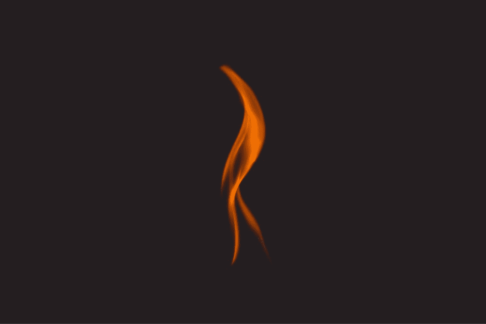
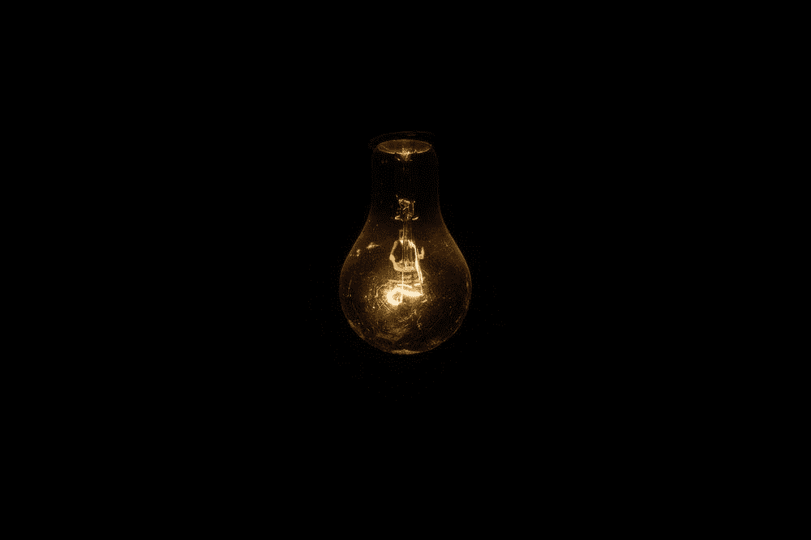
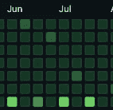

# 倦怠——进步的祸根

> 原文：<https://towardsdatascience.com/burnout-the-bane-of-progress-3ad7585afb08?source=collection_archive---------24----------------------->

## *作为一名人工智能开发人员、黑客和研究人员，我是如何陷入低谷的*

来自保罗·布莱在 [Unsplash](https://unsplash.com/photos/XOQJa4OC8P0)

> 无奈。恐慌。绝望

我描述倦怠的最佳尝试。对于程序员、开发人员和研究人员来说，精疲力尽是一种非常常见的经历，它可以完全停止生产力并破坏精神状态。如果已知来源，传统问题可以得到解决。作为程序员，我们都知道，如果我们理解为什么我们的代码会抛出错误，我们就可以快速修复它们。然而，在精疲力竭的情况下，即使你确切地知道你是如何到达那里的，恢复仍然是一项极具挑战性的任务。对我个人来说，我是一个以工作为导向的人，所以很难接受“没有生产力”(腾出空闲时间)。

> 作为一个超级科技迷，我的目标是成为一个永远不需要休息的机器人，但这对任何人来说都是不可行的**。**

**作为一名有抱负的研究人员、黑客和开发人员，我有过相当多的疲惫。我认识到研究是一个令人沮丧的过程；提出的方法不仅需要在理论上是一致的，而且结果必须证实这些方法。因此，如果结果不像预期的那样，罪魁祸首可能是错误的代码或概念上的错误表述，这使得回溯这些问题成为一条穿过混乱、交织的迷宫的道路。无论是讨厌的代码错误，还是整天编写机器学习脚本的单调工作(我指的是每天*14*小时，我都很快意识到为什么我会这么累。只是开发解决方案花了很长时间。**

**在这篇文章中，我想谈谈我在追求人工智能和计算机科学时最糟糕的时期，为什么会发生，以及我如何重塑我的工作方法来防止它们。希望你能从我的建议中吸取教训，防止你自己在 AI 和 CS 中耗尽精力。**

# **第一个**

**2020 年对我来说是重要的一年。在过去的两年里，我已经完全重塑了我的职业道德，以至于我可以比我的同龄人更快更有效地完成任务和任务。所以那年春天，特别是 4 月份，我决定超负荷安排我的日程，安排连续的周末黑客马拉松。第一个周末开始还不错，但结束后，我马上就精疲力尽了，在接下来的两天里，我被绑在床上，什么都不做。**

**接下来的周末，一切都崩溃了。大约 10 个小时后，我开始对*感到恐慌，我不知道为什么。在活动开始前的几天，我失眠了，还做噩梦，梦见自己没有完成分配给自己的工作，我害怕失败。更让我恐慌的是，当时我也在修行斋月，这并没有让我的日子好过。我的精神状态变得如此糟糕，以至于我开始质疑我对 CS 和 AI 的职业选择，因为我失去了很多自信，不知道该做什么。我对 ***束手无策；我感到被遏制了。曾经充满希望的一年很快变得暗淡和悲惨。我的火花在闪烁。******

******

***作者罗迪翁·库斯塔耶夫***

***幸运的是，春假就要到了，所以我可以在那一周放松自己，和朋友家人在一起。这是我唯一做对的一件事，虽然这绝对是明智之举，但我应该做得更多。这只是我第一次忍受真正的倦怠，所以我天真地没有反思或吸取教训。因此，我随后的飙升和下跌一样快，由于我在几周内表现良好，我完全忘记了发生了什么。***

# ***第二***

***我没有吸取教训。我继续增加我的工作量，到 7 月份，我同时在做两个研究项目、一个夏季项目和两周一次的黑客马拉松。我觉得自己很有成就，并被一种我认为可以实现的伟大理念所驱动。我刚刚接受了两个新的实习，都与 AI 有关，我从来没有感觉更好。我不想让那些指望我的人失望，所以我每天都在学习和完成作业。然而，这种对成就的追逐被另一个慢慢升起的红色火焰所中止。***

***与其说是恐慌或无助，不如说是发现自己*无望而疲惫。我写了这么多代码，很多人会争论太多。我被对出版物和 Github 影响力的追求所推动，并在此过程中忽略了自己的健康。所以就在七月初，我遇到了前所未有的压力。 ***万念俱灰*** 来袭。我失去了对编程和研究的所有热情。我再次质疑自己对编程的兴趣，因为编程既枯燥又毫无意义。我质疑为什么我认为我可以成为一名研究人员，当有这么多我不知道的时候。我怀疑我是否能继续做下去。****

********

****我在 6 月和 7 月的 Github 贡献图——仅在 7 月就有 442 次提交****

****这种倦怠持续的时间比第一次持续的时间要长得多。这持续了整个 7 月。因此，通过努力完成并继续我的每日承诺，完成我的微软任务板上的任务，并向我的导师提交更新，我耗尽了所有的精力。我只是点燃了熊熊的火焰。我几乎要放弃，把我所有的进步都留在桌面上。这种倦怠真的是我的克星。****

# ****实现****

## ****直接的解决方案****

****虽然这听起来很简单，但我的解决方案是简单地停止编码。我决定冒一次险——我知道如果我停止编码几天，我可能会很快落后于我需要完成的所有工作。但是我也评估了我的效率因为试图克服倦怠而受到的损害，我最终决定净生产率并不重要。我*需要*冷静下来，无论我会失去多少进步，我都不能再这样下去了。对于我的团队项目，幸运的是，我有很好的朋友和队友，他们理解我不断恶化的精神状态，并支持我收拾我的烂摊子，让我花更多的时间在自己身上。****

## ****个人的改变****

****与此同时，我决定追求其他我认为有益的爱好。这包括在媒体上写作，在 Youtube 上听播客，练习驾驶。我过去和现在都痴迷于生产力，所以我不能让自己无所事事。然而，如果我说我没有找到更多的方式来享受生活，比如和朋友出去玩，玩电子游戏，到处看电影，那我就是在撒谎。我专门分配了纯粹为了享受的时间，让我重新获得了前一年的许多乐趣。我建议你在一天中尝试参加一些休闲活动，尤其是和你亲近的人一起，以防止自己过热，因为你周围的人可以帮助你更好地评估自己。****

****在这段时间里，我更加关注自己的心理健康和恢复，为自己提供所需的一切。我知道我需要休假和自我反省来逃避，但给自己这些需要很大的意志力和牺牲。然而，通过这样做，我可以立即进入状态，尤其是考虑到我的会议期限即将到来。****

****长期变化无疑是最重要的。在紧张的时间窗口中，完全休息可能是不可行的，我已经开始改变思维通风的优先顺序。在 PyTorch 中实现了 10 个小时的架构之后，为了避免过热，我将转而继续查阅文献或设计模型原理图。这种任务转换极大地提高了我对项目的理解，因为通过处理一个不太严格的任务，我可以用一种全新的思维全面地分析和比较我的方法和其他方法，最终产生一个更精炼的手稿。即使在压力小的时候，遵循这种方法也帮助我提高了效率，防止了灾难性的疲劳。不知何故，我忽略了一个显而易见的事实，即研究和编程需要充分发挥大脑的能力，而且总是以 50%的能力工作而不充电，我限制了我的全部能力。****

## ****目标设定****

****永远向星星射击。即使在精疲力尽的时候。****

****通常，人们认为设定过于雄心勃勃的目标是倦怠的一个原因，但事实未必如此。如果效率是一个挑战，那么也许减轻你的负担。但就我而言，我学到的是，试图在同一个月内完成两个会议的两篇论文是非常困难的，而且总体上降低了两篇论文的质量。更理想的决定是花更长的时间在 NeurIPS 或 CVPR 提交上。由于我所有的时间都将投入到一个非常长期的项目中，结果和回报会高得多。因此，如果你是一名有抱负的研究人员，永远要志存高远，但要注重质量而不是数量。****

****简而言之，如果你快累垮了，不要停止追逐星星——只需关注不同的星星，那些更大、更有回报的星星。****

********

****由杰瑞米·托马斯在 [Unsplash](https://unsplash.com/photos/E0AHdsENmDg)****

# ****最后一点****

****在 AI 和 CS 工作很累人。有各种各样的挑战和障碍需要我们去克服，试图用蛮力去克服它们并不是答案。我们都试图体现人工智能，并假装我们是永远不需要休息的机器人，尽管我们可能会不时地接近它们的效率，但我们都需要休息，以便充电和恢复活力。然后，我们可以成为比我们希望成为的机器人更好的 T2——最好的自己。****