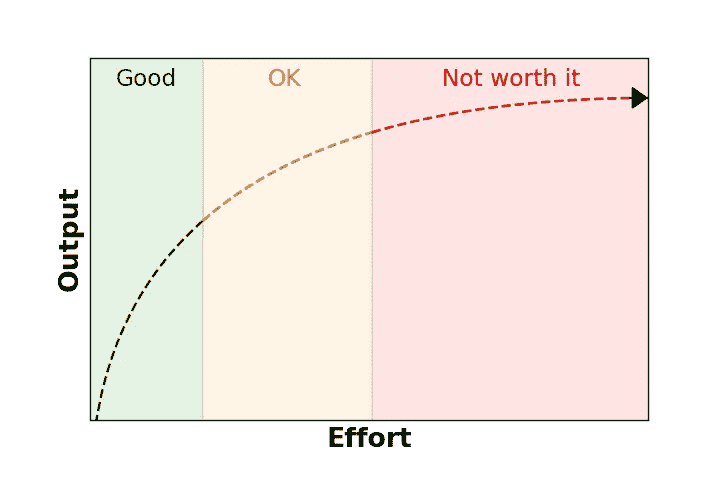
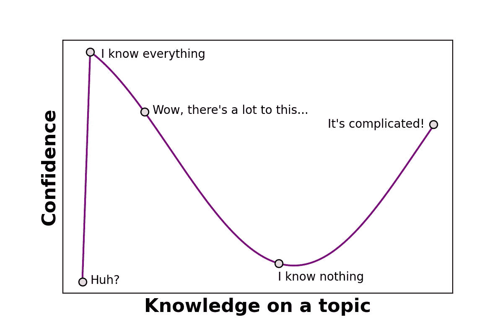

# 提升你影响力的商业和个人技能

> 原文：<https://towardsdatascience.com/business-and-personal-skills-to-supercharge-your-impact-22fbd43e32e9?source=collection_archive---------24----------------------->

## [办公时间](https://towardsdatascience.com/tagged/office-hours)

## 机器学习中人类的一面

由[埃罗尔·艾哈迈德](https://unsplash.com/@erol?utm_source=medium&utm_medium=referral)在 [Unsplash](https://unsplash.com?utm_source=medium&utm_medium=referral) 上拍摄的照片

无论你在处理数字和编写代码方面多么有天赋，如果你追逐实际上对你的公司没有帮助的问题，或者你不能让任何人采纳你的分析结果，那么你作为数据科学家的效率是有限的。同样，你如何在一个不断发展的领域保持动力和相关性？

在本帖中，我们将概述将你的技术技能转化为影响力所需的 ***业务*** 和 ***个人*** 技能。

但是当然，免责声明:到目前为止，我的数据科学职业生涯都是在员工少于 100 人的公司度过的。如果我在过去的五年里是甲骨文 135，000 名员工中的一员，这篇文章看起来可能会有所不同！我也从未在政府或非盈利部门工作过。

无论如何，我已经尽了最大努力来减少这种偏见，并写了一篇适用于任何规模和类型的组织的数据科学家的帖子。

# 理解商业意识

数据科学充满了诱人的兔子洞。我们的代码工作得很好，但是如果我们添加一种自动调优模型[超参数](https://machinelearningmastery.com/difference-between-a-parameter-and-a-hyperparameter/)的方法会怎么样呢？如果我们建立一种更好的方法来可视化我们的 NLP 模型的[高维向量空间](/lets-understand-the-vector-space-model-in-machine-learning-by-modelling-cars-b60a8df6684f)，可能利益相关者会更积极地参与进来。没有人要求这样做，但是如果我们为我们的数据质量输出建立一个光滑的仪表板，这样您就可以点击按钮，而不需要编写 SQL，会怎么样？

令人困惑的是，虽然兔子洞的尽头通常有一些商业价值，但通常不值得追求。当然，一个更准确或更容易理解的模型可能会在某种程度上帮助你的公司。

但是，这是对你的时间的最有效利用吗？

你能理解你同事的需求并与他们交流这个项目将如何增强他们的能力吗？

这个项目解决的是贵公司市场中未被满足的需求，还是“值得拥有”的需求？

我们将在本节的剩余部分探讨这些想法。

## 优化资源配置

这是一个数据科学家可能面临的两难境地的例子。贵公司要求您预测下个季度在纽约的销售额。一个月后，你展示你目前拥有的东西——一辆 [ARIMA 型号](https://www.machinelearningplus.com/time-series/arima-model-time-series-forecasting-python/)和一辆 [RMSE](https://www.statisticshowto.com/probability-and-statistics/regression-analysis/rmse-root-mean-square-error/) 大约 5000 英镑。虽然这很好，但是您已经确定了两个额外的[外生变量](/time-series-forecasting-a-getting-started-guide-c435f9fa2216)，您认为它们可以将误差降低到 2000！你用一个探索和整合这些变量的攻击计划来结束你的演讲。

令你惊讶的是，你的老板说没有。他们说，模型的准确性是可以接受的，不值得花时间(和风险)去进一步探索。你有一周的时间将你的模型产品化，之后你将开始一个新项目。

你很困惑，确信你的老板犯了一个错误。仅仅两个星期就有可能将模型误差减半，这怎么可能不值得呢？使用不太准确的预测，你的公司将付出真正的代价！

**要理解贵公司的观点，考虑其无时无刻不在的优化资源配置的需求。是的，一个不太准确的模型意味着你的公司使用了更糟糕的预测，这可能会导致不太准确的决策。*然而，这种不准确性的成本很可能低于你没有从事不同业务需求的* [*机会成本*](https://www.investopedia.com/terms/o/opportunitycost.asp) *。***

在公司需求的背景下，也许到目前为止投入到模型中的努力代表了 OK 努力与下图中的产出比的结束，或者甚至只是绿色区域的结束。

换句话说，**如果这意味着避免*更大的成本*，**比如[客户因订单错误而流失](https://blog.hubspot.com/service/what-is-customer-churn)，你的公司愿意支付更差型号的成本。对你的公司来说，停止你的预测工作，转而关注数据质量会更有价值。

努力与产出。图片作者。

在一个项目上被打断很容易让人感到沮丧，尤其是如果你已经投入了时间或者最终积累了动力。然而，重要的是要把你对一个项目的感觉和你对它是否值得追求的判断分开。

专注于你如何能最好地造福于你的公司，而不仅仅是追求你自己觉得有趣的问题，会让你成为一个更有效率的员工。[1]贵公司的[关键绩效指标](https://www.investopedia.com/terms/k/kpi.asp)和[路线图](https://www.productplan.com/learn/roadmap-basics/)将帮助您了解贵公司领导层认为哪些是有价值的。

接下来的章节将涵盖如何通过**授权给同事**和**了解市场**来最好地帮助你的公司。对这一点的深刻理解将有助于与你的老板、产品经理或其他内部部门进行更有成效的对话。这还将有助于建立对您可能提出的数据科学计划的信任，因为您将能够更好地交流它们将如何帮助公司。

## 授权给同事

让我们先把事情说清楚:**授权给同事的最好方式是*问问他们需要什么。通过从源头上了解同事的需求，而不是猜测他们想要什么，你会节省很多时间和精力。如果你的圆滑且信息丰富的仪表板回答了你的同事实际上没有问的问题，那就没关系了。***

你的非技术同事通常不需要复杂的机器学习来提高效率。对于不以编程为生的人来说，他们的主要痛点更可能是:

1.  他们花费在四处点击以收集或移动数据上的时间
2.  对他们负责的问题缺乏了解(例如数据质量)

幸运的是，这些领域可以直接自动化，并能极大地帮助你的同事。例如，你可以通过创建每晚运行的 Python 脚本，从各种来源提取数据，并输出一个 CSV，该 CSV 可以自动[提取到 Google Sheets](https://webapps.stackexchange.com/questions/40658/pull-csv-data-from-url-to-google-spreadsheet) 或作为电子邮件发送。[2](如果你听到的每个请求都是关于访问数据的，那么这是一个更大的问题，是软件工程或数据工程团队的问题。)

但是让我们假设你正在满足的需求是更技术性的，比如一个检测异常或预测销售的模型。对于这些更复杂的产品，**最重要的是*你的产品高度可靠且易于理解，****尤其是如果你的用户是面向客户的角色。*

*设身处地为你的同事着想:想象一下使用一些古怪的 Flask 应用程序与不耐烦的客户开会的噩梦，当客户盯着你时应用程序崩溃，然后不知道如何重启应用程序。你的不耐烦的顾客现在没有得到他们支付的服务，现在你需要尴尬而抱歉地收拾残局，说服他们继续做你的顾客。*

**

*“是啊，嗯……所以一小时前还有效。”由[上](https://unsplash.com?utm_source=medium&utm_medium=referral)的[间隔](https://unsplash.com/@headwayio?utm_source=medium&utm_medium=referral)拍摄*

*避免这样的头痛，以及学习使用新工具时效率低下的烦恼，会让同事对使用你的产品犹豫不决。这是事实，即使他们在理论上同意你的产品应该使他们更有生产力！*

***这里的关键是建立对你产品的信任。** [在你计划和构建产品的时候，尽可能经常地与你的利益相关者沟通](https://www.darzin.com/stakeholder-management-ultimate-guide)。一旦产品“完成”，预计要花大量的时间写文档，培训同事，回答他们的问题，并纳入他们的反馈。*

*如果可以的话，[观察你的同事们*实际上*如何现场使用你的产品](https://www.hotjar.com/usability-testing/)——这是对你是否完成了帮助他们的目标的最终测试。并时刻提醒他们*这个产品的意义在于帮助他们*；如果它需要改变才能真正有用，那只是工作流程的一部分。*

## *了解市场*

*你的公司不存在于真空中。在你办公室的墙外是**客户、竞争对手、投资者、**T21 和**监管者，他们都以不同的方式影响着你的业务。他们关心什么，随着时间的推移会有什么变化，这对你来说意味着什么？贵公司的核心产品是什么，它满足了市场的什么需求？***

**

*了解你的公司所处的生态系统就像下十维国际象棋。由[哈桑·帕夏](https://unsplash.com/@hpzworkz?utm_source=medium&utm_medium=referral)在 [Unsplash](https://unsplash.com?utm_source=medium&utm_medium=referral) 拍摄的照片*

*这些是你的销售、营销和领导团队通常花一整天时间思考的难题，所以不要因为不是专家而感到难过。但是为了极大地提高你能给公司带来的价值，**努力去理解你公司所处的*环境*。***

*问题*的正确答案:“为我们的客户建立一个支出预测器是否值得？”*例如，取决于你公司外部的很多因素。在与贵公司互动时，客户是否一直有此要求？竞争对手提供这种服务吗(如果提供，你能便宜点吗)？你的销售团队是否无意中听到行业领导者抱怨难以规划他们的财务？这些问题的答案因行业和时间的不同而不同，所以你需要关注它们，以确保你交付的产品是人们真正会使用的。*

*但是*创新*呢？创新包括为现有问题创造新的解决方案，或将现有问题重新定义为我们能够解决的问题。[3]在过去的十年里，随着机器学习的迅猛发展，我们已经在许多行业看到了这种情况。难道我们不能创建一个客观上有用的数据科学模型或应用程序，一个推动市场变化而不是跟随市场变化的模型或应用程序吗？*

*不幸的是，事实并非如此。问题是创新是回答问题的一种方法，而真正包含商业价值的是问题本身。创新本身并不包含商业背景——你可以很容易地“创新”出别人没有的问题解决方案！*

*机器学习改变了从农业到生态的工业**,因为它回答了人们关心的问题。有一个潜在的需求是机器学习能够解决的，但它没有创造出这个需求。为了让你的工作有影响力，你需要能够识别这些高价值的需求。[4]***

# *`self`参数*

*前一节涵盖了数据科学的业务方面:了解你的公司和同事的观点，以及更广泛的市场背景。我们现在将向内转移，专注于你最大限度地发挥你的潜力并持续交付出色工作所需的心态和习惯。*

## *CI:持续改进*

*当你开始学习一项技能时，很容易开始感到难以置信的自信。从经验来说，沿着阻力最小的路径学习可能很有诱惑力，只要坚持巩固现有知识的项目，而不是通过深入研究或拓展业务来真正挑战自己。*

*这种过度膨胀的自信有一个名字，叫做[邓宁-克鲁格效应](https://www.psychologytoday.com/us/basics/dunning-kruger-effect)和**如果你在一个话题上夸夸其谈自己的知识，然后在别人依赖你的时候却不能真正实现它，这可能会导致令人讨厌的惊喜。**了解邓宁-克鲁格效应将有助于避免这种情况，让你成为更成熟的学习者。*

**

*邓宁-克鲁格效应。图片作者。*

*我们如何真正变得有知识，避免陷入过度自信的陷阱？对我有效的一种心态是**拥抱攀登。我喜欢把学习想象成爬山:它很慢，需要付出艰苦的努力，而且抬头看看还有多远就很容易气馁。***

*很容易让人想到，一旦你到达山顶，你就“成功了”，终于可以放松了。但是每当我到达一个顶峰时，我总是发现还有更多需要攀登。*

*如果你想成为真正的知识分子，你只需要接受永远有更多东西要学的事实…并且不断学习！我每天都努力学习，至少学一点点。通过让学习成为一种习惯，我不必依赖断断续续的意志力。[5]那些火花太不频繁了，高级的话题需要反复接触才能真正理解。*

*同样重要的是要记住，总会有人比你更了解某个话题……这没关系。聪明人的存在不会贬低你知道多少。*

*最后，数据科学在不断发展。今天最流行的语言和框架很可能与十年前不同。Python 现在占据了统治地位，但是 Julia 正在获得牵引力。Tensorflow 六年前还不存在，但当它到来时，立即统治了机器学习领域。持续学习对于保持相关性至关重要。(或者，就像 COBOL 牛仔一样，等几十年，市场会回到你身边！)*

**

*一个科堡牛仔在他们的游艇上放松。伊万·班杜拉在 [Unsplash](https://unsplash.com?utm_source=medium&utm_medium=referral) 上的照片*

## *专注于终点线*

*数据科学跨越了广泛的领域，从[统计](https://mattsosna.com/DS-transition-2)到[分析](https://mattsosna.com/DS-transition-3)、[软件工程](https://mattsosna.com/DS-transition-4)和商业智能。这个范围如此之广，是因为从数据中提取见解的任务*和将这些见解传达给其他人的任务*并不完全属于一个技能类别——您的模型检测到的异常可能需要保存在某个数据库中，然后它们应该填充一个对利益相关者来说直观的仪表板，然后您应该引入更高级的统计数据来提高模型的准确性，等等。*

*除非你在一家大公司，有足够的资源将这些步骤分配给不同的专家，否则你可能会被期望完成所有的步骤。这可能会让你觉得工作堆积如山，超出了你的工作描述——当你的招聘人员只提到用 Python 分析数据时，你真的应该只是拿起 [Spark](https://spark.apache.org/docs/2.2.0/index.html) 或 [Terraform](https://www.terraform.io/intro/index.html) 或建立数据库或创建仪表板吗？*

*我认为谦逊和灵活性对于一名数据科学家来说非常重要，尤其是在你职业生涯的早期。从机器学习中提供实际的商业价值涉及的步骤比你开始之前看起来要多得多！关键决策者可能想要一个简单的方法来检查他们自己的结果，而不是一个笔记本；一家软件公司可能希望你的模型集成到产品中，而不是 S3 的随机 R 脚本。*

***关注可交付成果:能让消费者真正受益的东西。**尽一切努力做到这一点，无论是学习额外的技能、亲自与最终用户交谈，还是重做工作以纳入反馈。*

*通过关注终点线，你采用了基于*解决方案的*方法，而不是基于*工具的*方法。问题变成了“完成这项工作需要什么？”而不是“我能用 Python 做什么？”这就是为什么我觉得 R 与 Python 的辩论很愚蠢——学习适合工作的工具。*

# *总结想法*

*当考虑投资什么技能时，很容易跳到最新的闪亮的深度学习包，而不是屡试不爽的个人和人际交往技能。同样，如果没有积累一些特定领域的知识，你也只能走到这一步。特定领域的知识是帮助你确定应该追求的正确问题的 T2 背景。也许是因为这些技能难以量化，或者它们不适合放在简历上。*

*但是了解*如何最好地应用你的技术技能*来真正交付商业价值，对于成为一名高效的数据科学家来说是至关重要的。在这里投入时间，你会惊讶地发现你的工作会变得更加有意义和有趣。*

*最好，
哑光*

# *脚注*

## *1.优化资源配置*

*这听起来像是这一部分在争论*你想做的工作*和*对公司最有利的事情*是两个独立且不可调和的世界，但事实并非如此。**如果你专注于交付商业价值，即做真正推动公司积极变革的工作，那么这两个世界将会完全重叠。***

*问题是，如果你想*只*构建机器学习模型，而没有围绕模型的任何步骤*，例如清理数据、构建管道、征求并整合用户反馈。将你的目标从做“酷数据科学”转移到做“*有影响力的*数据科学”将有助于你的目标与公司的目标保持一致。**

*但是你也不应该期望你的工作在专业上完全满足你，在个人方面更是如此。离开学术界后，当我没有得到我想要的那么多教学时，一位前老板向我介绍了[三部曲编码训练营](https://www.trilogyed.com/programs/)，我现在很高兴地在那里做家教。的确，卡比尔·塞加尔[在《哈佛商业评论》上发表的这篇文章认为，每个人都应该至少有两种职业。)，因为这能让你享受不同的工作。](https://hbr.org/2017/04/why-you-should-have-at-least-two-careers)*

## *2.授权给同事*

*必须注意的是:当你的同事反馈进来时，很容易用一次性脚本引入大量的[范围蔓延](https://en.wikipedia.org/wiki/Scope_creep)。尽你所能，试着在前面建立范围，定义反馈被视为具有较慢周转时间的[特性请求](https://craft.io/knowledge-center/7-useful-tips-to-manage-feature-requests)的点。类似地，为了避免承担太多的[技术债务](https://en.wikipedia.org/wiki/Technical_debt)，在某些时候模块化代码以使修改更容易和更安全是很重要的。*

## *3.了解市场*

*这两种形式的创新来自 LinkedIn 数据科学经理潘武的一篇有趣的文章。*

## *4.了解市场*

*当我读本科的时候，我的一位导师说她攻读博士学位是为了学习如何提出更好的问题。我发现这种专注于理解*问*什么，而不是*如何*回答任何问题的方式，非常有见地。*

## *5.CI:持续改进*

*习惯研究者 James Clear 认为最有效率的人是那些最不努力控制自己的人。这是一个违反直觉的想法，改变了我的视角。*

*他说，关键是构建你的环境，使你不得不进行的自我控制最小化。如果你想减肥，把饼干埋在高架子后面。如果你想读更多的书，把一本书放在你的枕头上，这样当你上床睡觉的时候会被提醒。清奇的书 [*原子习惯*](https://jamesclear.com/atomic-habits) 中充满了类似这些有用的提示。*