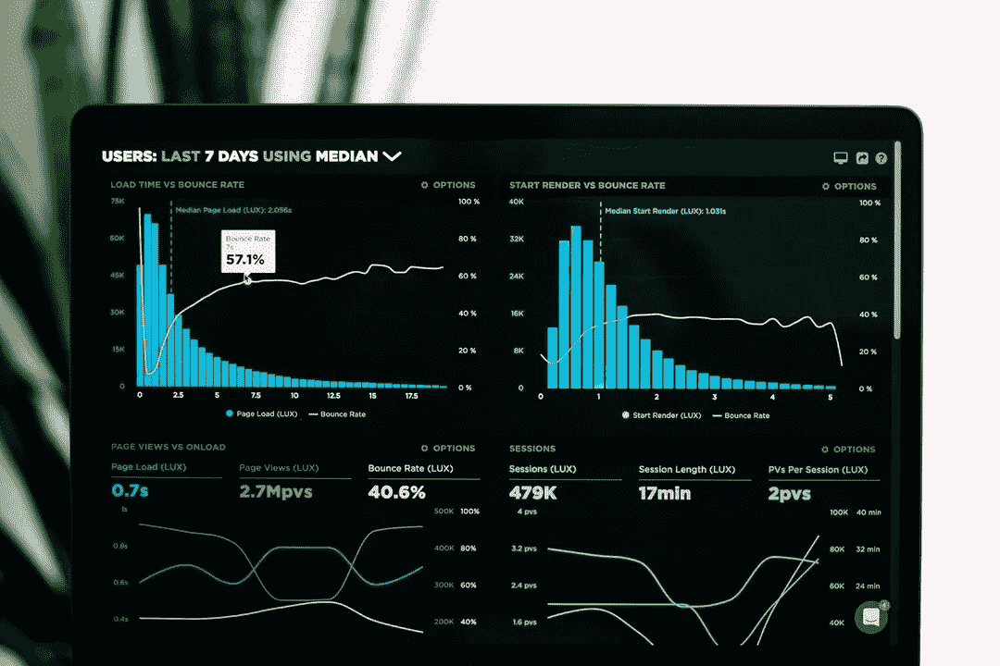

# 商业智能、数据科学及其对公共安全力量的影响

> 原文：<https://towardsdatascience.com/business-intelligence-data-science-and-its-impacts-on-public-security-forces-56c330457a80?source=collection_archive---------29----------------------->

## 数据科学是如何被用来打击犯罪的？

卢克·切瑟在 [Unsplash](https://unsplash.com/?utm_source=medium&utm_medium=referral) 上的照片

毫无疑问，在过去的二十年里，人类获取信息的方式发生了巨大的变化。直到 2000 年代，数据生成的主要负责人是公司、机构和公共服务部门，尽管如此，它们还是在内部进行，只有这个小宇宙来获取有用的知识，即使如此，它们也没有必要的技术来广泛探索它。仍在扩张的互联网还通过提供数据共享进行合作，特别是索引程序的创建(Altavista、雅虎、谷歌和不太知名的 Cadê是一些很好的例子)，允许在全球范围内进行搜索，这在历史上任何时候都被认为是不可能的。

但真正加强信息时代的是社交网络行为概念的计算实现。这些技术极大地改变了人类处理自己设备上生成的内容的方式，因为他们的创造不再局限于专业手段，每个人都开始自愿成为数据生成者。所有类型的媒体开始不间断地被分享，其数量和速度前所未有。照片、音频、文本或视频，每个用户的生活和习惯开始暴露在一个虚拟的陈列柜中，供任何想“看一看”的人使用。

以前不属于词汇或只是指未来科幻作品的词已经渗透到普通公民的生活中。*商业智能*、*大数据、数据科学、*和*数据湖*已经成为商业价值创造、行为、预测分析和标准创建的代名词。新的商业模式开始出现，不是基于汽车、房子或电脑等实物产品的价值，而是基于短暂的价值，即从信息中产生知识的价值。根据购买档案对购买的产品提出建议，对推荐电影的*流媒体*服务的用户进行行为分析，以及使用机器学习来帮助商业决策，这些都是这些公司的重点，然后他们发现了一个具有巨大探索能力的市场利基。

加纳外交官科菲·安南的名言“知识就是力量，信息正在解放”被那些将数据作为工作来源的人的指数增长所证明是具体的。更多的“经典”公司(考虑到相对较短的时间线)如谷歌、脸书和 Twitter 是基于分析和出售信息开始其职业生涯的，而服务提供商如优步和 Airbnb 分别被认为是其行动领域中最大的一些公司。然而，要达到这些水平，这些公司已经掌握了数据分析和机器学习技术的使用。

需要澄清与获取信息相关的两个主要概念(商业智能和数据科学)之间的差异，以便发掘公共安全所拥有的数据的最大价值。商业智能是指收集、组织、分析、共享和监控支持商业管理的信息的过程。它是一套技术和工具，用于帮助将原始数据转换为有意义和有用的信息，轻松解释大量数据，识别新的机会，并根据生成的信息实施有效的战略，以促进业务在市场中的竞争优势和长期稳定性。这个概念是第一个定义信息时代最复杂分析的概念之一，是它在关系数据库和数据仓库中注册的第一个应用。然而，随着大数据的出现，技术需要发展，商业智能只是更复杂的数据探索机制中的一个齿轮。

根据 Gartner Research 的研究，大数据一词已成为全球信息技术中使用最多的术语之一，指的是公司需要处理的大量信息。数据管理主要围绕两个基本问题发展:容量和处理能力。然而，挑战已经发生了变化，这不再是一个存储甚至处理能力的问题，而是随着数据变得更加复杂，有了各种各样的新来源，数据的收集速度达到了创纪录的水平；这就形成了一个维度树，可以定义为:“一组高容量、高速度和多样性的信息，需要创新的信息处理方式来改进想法和经济决策”(其主要概念如下图所示)，深化了数据分析的复杂性，并导致了数据科学的自然发展。

数据科学是一个跨学科领域，使用科学方法、流程、算法和系统从各种形式的数据中提取知识。该领域利用统计学、人工智能、数据库和科学可视化来成功实现其目标，即从存储的数据中提取最大可能的价值。根据这一知识，可以说，虽然商业智能已经以更结构化的方式处理和提供数据，但数据科学也以非结构化或半结构化的方式处理数据，鉴于其存储的数据可能具有特殊性(不同于其前身更肤浅和通用的方法)，在机构中应用商业智能需要更长的时间。

随着在公司内部探索大数据概念的可能性，存储数据的速度、数量和种类呈指数级增长，从而允许应用确保发现信息的技术，这在此技术之前是不可能的。然而，一个机构可能有几个大数据来源和极其不同的数据类型，例如来自社交网络和传感器网络的数据。因此，自然进化从这些条件中扩展开来，其中之一就是数据湖。从更广泛的角度来看，这些可以被描述为覆盖一系列异构主题和业务领域的巨大数据仓库。需要有效地组织这样的存储库，以便从中获得价值；它们需要应用各种技术来提取信息和知识，从而防止它们成为一组无用的数据(数据 Swamps)⁠.从更具体的角度来看，数据湖通常被认为是组织、公司或机构中的中央存储位置，任何类型、任何大小的数据都可以以任何数据速率、使用任何导入方法(初始、批处理、流)以其原始格式(本机、原始)进行复制。例如，由微软作为服务实现的 Azure 数据湖模型:该技术最初收集数据(1)，使用 Hadoop 或 Spark 处理数据(2)，以不同方式组合数据(3)，为分析执行转换(4)，为可视化和发布做准备，生成信息(5)，最后按需分发数据以供使用(6)。

但是，这些技术中的每一项意味着什么，最重要的是，它们对公共安全有什么影响？例如，一旦它们得到充分实施和掌握，下图显示了是否有可能通过数据分析指导下的警察行动来分析可疑模式并预测或预防某些犯罪行为？通过几个政府单独使用算法，如意大利的犯罪预测算法和国际刑警组织的语音生物识别系统，这个问题的答案已经是肯定的，因为近年来，各国政府已将部分重点放在收集、分析和合并输入其系统的数据上，旨在找到有助于改善其服务提供的标准。但是，公共机构拥有哪些数据，以及如何以最佳方式使用这些数据？

为了展示实用性，考虑来自公共安全部队的数据:文档、警方报告、警方行动和车辆数据是一些已知的存储。还有一些关于监狱系统的数据，以及在那里登记的所有人的健康状况。就其本身而言，仅通过来自该机构本身的数据(例如，文件、车辆和盗窃之间的关系)，就已经有可能识别出无数的模式。如果将这些数据整合到一个单一的数据湖中，加上来自开放来源(如社交网络)的数据，并由一组数据科学家负责实施和应用特定的算法来发现模式，这可能会改变整个警方调查系统的影响，因为这只是这一行动的反映。例如，考虑一名囚犯的越狱。有了相互关联的数据，就可以创建预测性分析，以找出被拘留者的健康状况(以及根据地区他可能需要去哪里取药)、他们的相互关系、根据以前的犯罪可能实施的犯罪、可能的休息点(家人和朋友)或可用于逃跑的车辆，以及根据他的行为对他将采取什么行动的百分比预测。这项技术将允许代理人将他们的努力集中在某些行动上，节省不必要的旅行，并为个体的重新捕获提供一个坚实的“起点”。而这只是可能的应用之一。

总之，数据分析技术有能力为公共安全服务(以及许多其他服务)增加巨大价值，从而允许代理人与支持其工作的可靠技术进行更大程度的集成，这将提高效率、降低风险并节省公共资金。对于那些认为汤姆·克鲁斯的《少数派报告》(警察在罪犯犯罪前将其抓获)只是幻想的人来说，这是因为他们没有考虑到可以在关于一个人的数据集中找到的模式的可能性以及回归或分类分析的力量。未来的警察不再是科幻情节，而是现实。

# 参考

Alserafi、t . Calders、a . Abello 和 o . Romero(2017 年)。DS-Prox:用于治理数据湖的数据集邻近挖掘。第 8199 卷，第 284-299 页。

BBC 新闻(2018)。我们能预测何时何地会发生犯罪吗？网址:[https://www.bbc.com/news/business-46017239.](https://www.bbc.com/news/business-46017239.)

Beyer，m .和 Laney，D. (2012)。“大数据:定义”的重要性。*高德纳*。URL:[https://www . Gartner . com/en/documents/2057415/the-importance-of-big-data-a-definition #:~:text = % 22 big % 20 data % 22% 20 warrants % 20 innovative % 20 processing，to % 20 business % 20 goals % 20 and % 20 objectives。](https://www.gartner.com/en/documents/2057415/the-importance-of-big-data-a-definition#:~:text=%22Big%20data%22%20warrants%20innovative%20processing,to%20business%20goals%20and%20objectives.)

b .卡森(2018)。老独角兽，新花样:Airbnb 估值天价。这是它赚取利润的大胆计划。*福布斯*。网址:[https://www . Forbes . com/sites/biz Carson/2018/10/03/old-unicorn-new-tricks-Airbnb-has-a-sky-high-evaluation-heres-its-audacious-plan-to-earn-it/？sh=78f39ee6fa30](https://www.forbes.com/sites/bizcarson/2018/10/03/old-unicorn-new-tricks-airbnb-has-a-sky-high-valuation-heres-its-audacious-plan-to-earn-it/?sh=78f39ee6fa30)

陈(2015)。优步想要征服世界，但是这些公司正在反击。*福布斯*。网址:[https://www . Forbes . com/sites/陈丽岩/2015/09/09/Uber-wants-to-conquet-the-world-but-these-companies-is-fighting-back-map/？sh=436feeae4fe1](https://www.forbes.com/sites/liyanchen/2015/09/09/uber-wants-to-conquer-the-world-but-these-companies-are-fighting-back-map/?sh=436feeae4fe1)

达尔，V. (2013 年)。数据科学和预测。Commun。美国计算机学会，56(12):64-73。

考夫曼(2018)。国际刑警组织推出国际语音识别数据库，使用来自 192 个执法机构的样本。*拦截*。网址:[https://the intercept . com/2018/06/25/INTERPOL-voice-identificati on-database/](https://theintercept.com/2018/06/25/interpol-voice-identification-database/)

道德和发展司，O. P. (2009 年)。商业智能成功因素:在全球经济中调整业务的工具。威利，第一版。