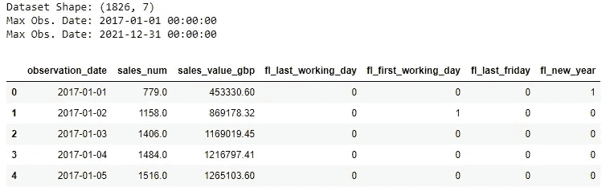
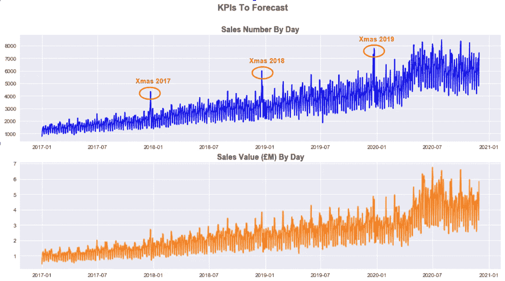
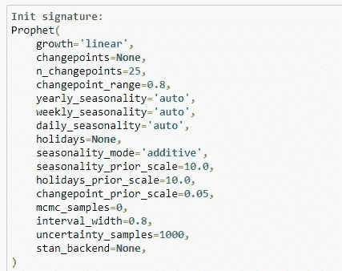
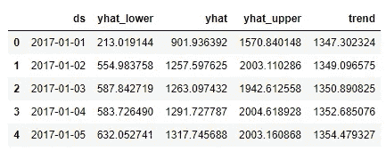
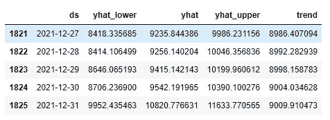
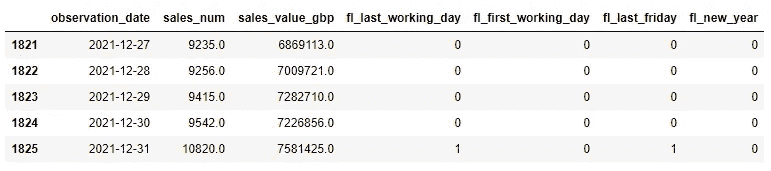
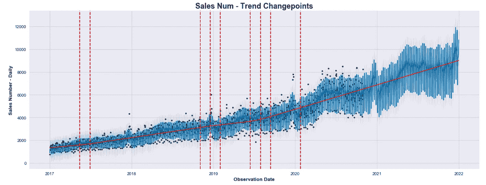
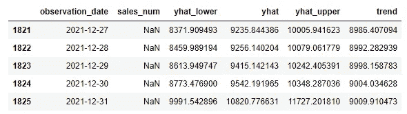
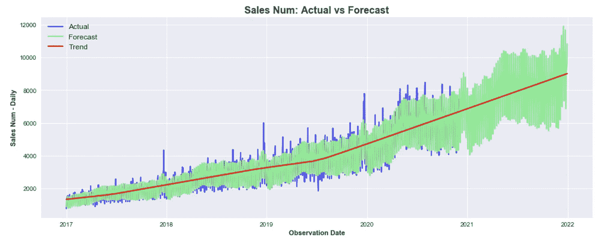
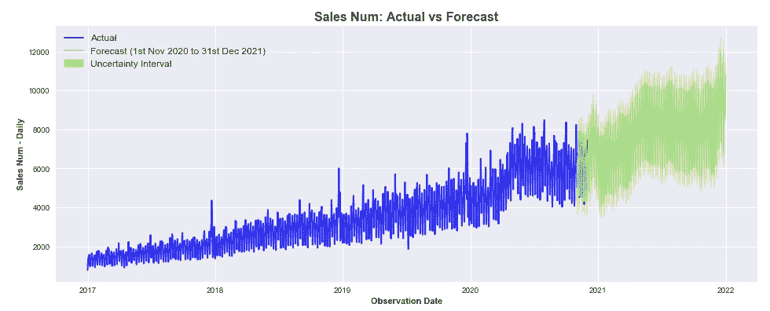

# 使用 Prophet 用 Python 预测业务 KPIs 第 1 部分

> 原文：<https://towardsdatascience.com/business-kpis-forecasting-with-python-using-prophet-part-1-1b8a97d45e3c?source=collection_archive---------18----------------------->

## [预测](https://towardsdatascience.com/tagged/forecasting) | [巨蟒](https://towardsdatascience.com/tagged/python) | [办公时间](https://towardsdatascience.com/tagged/office-hours)

## 了解如何通过使用 Prophet 预测未来绩效来为您的企业增值。


弗兰克·布施在 [Unsplash](https://unsplash.com?utm_source=medium&utm_medium=referral) 上拍摄的照片

*更新:你们中的许多人联系我，要求提供有价值的资源，以了解更多关于使用 Python****进行时间序列预测的信息。下面我分享两个我亲自参加的课程，强烈建议你扩展这方面的知识:***

*   [**Python 进行时间序列分析(使用 ARIMA、萨里马克斯、瓦尔马、先知)** 15 个多小时的内容](https://click.linksynergy.com/deeplink?id=533LxfDBSaM&mid=39197&murl=https%3A%2F%2Fwww.udemy.com%2Fcourse%2Fpython-for-time-series-data-analysis%2F)
*   [**【ETS，ARIMA】**](https://imp.i115008.net/7m5y6g)**→***非常高质量的课程！*

[* *使用代码 **JULY75** 在 UDACITY 球场享受 **75%的折扣*** *](https://imp.i115008.net/NK9qo1)

希望你也会发现它们有用！现在欣赏:D 的文章

# 介绍

想象一下:你是一名 ***数据分析师*** 或 ***商业智能分析师*** ，拥有构建 KPI、报告和提取这些指标的洞察力的经验，但在预测模型方面几乎没有经验。与此同时，你的公司不仅愿意追溯跟踪业绩，还需要战略或动态预测，但事实证明，没有具有类似背景的数据科学家。

您的经理找到您，声称您非常适合这份工作，因为您正好具备创建预测业务 KPI 的简单模型的背景和技能，并提醒您预测将在一周内完成…

***这种场景在快节奏的公司里不常见吗？***

***该不该慌？*** *不，保持一致*:如果您熟悉 Python 或 R，那么 [FB Prophet](https://facebook.github.io/prophet/docs/quick_start.html) 可以帮助您和您的团队实现更简单的*时间序列建模* *方法*，能够为您的业务规划和目标设定提供可靠的预测。

更详细地说，在其[开源项目网页](https://facebook.github.io/prophet/)上，脸书声明:“ *Prophet 是一个基于* ***加法模型*** *预测时间序列数据的程序，其中非线性趋势符合每年、每周和每天的季节性，加上* ***假日效应*** *。它最适用于具有* ***强季节性影响*** *和几个季节的历史数据的时间序列。Prophet 对缺失数据和趋势变化非常稳健，通常能够很好地处理异常值。*

听起来这个工具是万能药*！然后，让我们学习如何在真实的商业环境中用 Prophet 创造价值。*

# *教程的组织*

*在本教程中，我们将通过实现一个模型来预测以下两个 KPI，从而对 Prophet 进行测试:*

*   ***日销售额:** *虚构的商家每天处理的总销售额*。我选择了*“销售”*作为 KPI，但是您可能会选择*“订单”*或*“交易”*，这取决于您公司提供的产品或服务的类型。选择此指标进行预测是因为它显示每周、每月和每年的季节性，并且可以从其预测中得出其他指标。*
*   ***日销售额():** *每天处理的销售额，计算为日销售额*平均价格。*该指标表现出非常相似的季节性，但无法通过预测第一个 KPI 来准确得出。此外，每日销售额可用于得出每日收入( )以及估计平均*销售额*和*销售额* ( **每日销售额()/每日销售额**)。*

*本教程将分为三个部分:*

***第一部分(本文)**关注于如何构建初始数据集，该数据集不仅包括要预测的 KPI，还包括从业务知识中获得的*日期标志*，这些日期标志将用于改进第二部分中的预测。然后，我将展示如何用几行代码在 Prophet 中构建简单的模型。本文还将展示如何通过结合使用`matplotlib`和`fbprophet`内置绘图功能，高效、灵活地可视化您的预测。*

*[**第二部分**](/forecasting-business-kpis-with-python-using-prophet-part-2-e969739c9029) 将致力于通过添加定制的季节性、节假日和通过修改一些更高级的参数来改进原始预测模型。特别是，我将展示如何以编程方式使用原始数据集中的日期标志来创建“假日”数据帧，作为模型的输入，并详细说明如何明智地调整傅立叶顺序来提高预测的准确性。*

*[](/forecasting-business-kpis-with-python-using-prophet-part-2-e969739c9029) [## 使用 Prophet 用 Python 预测业务 KPIs 第 2 部分

### 了解如何通过使用 Prophet 预测未来绩效来为您的企业增值

towardsdatascience.com](/forecasting-business-kpis-with-python-using-prophet-part-2-e969739c9029) 

**第三部分**将是本教程的最后一篇，我将描述如何使用`numpy`进行快速模型评估，或者使用`statsmodels`中的评估方法或`fbprophet`包中固有的`cross validation`模块进行更高级的评估。

在本系列结束时，您将彻底了解如何使用 Prophet 来预测任何关键绩效指标，这些技能将帮助您为企业增加更多价值。有了这些前提，现在终于是开始编码的时候了！

# 1.导入包和数据集

第一部分的完整笔记本和数据集可在这里[获得。首先让我们导入将要使用的包。这里假设`fbprophet`已经成功安装在您的首选环境中:](https://github.com/anbento0490/code_tutorials/tree/master/Business%20KPIs%20Forecast)

由于这篇文章也将关注如何正确地可视化预测，我将使用`matplotlib`的*“seaborn”*风格，因为我发现它相当简洁。如果您希望使用不同的样式，请运行以下命令，显示可用样式的完整列表:

```
print(plt.style.available)
```

包含我们希望预测的 KPI 的数据集已经使用 SQL 查询获得，该查询在每日级别聚合两个感兴趣的指标(`sales_num`、`sales_value_gbp`)，然后生成四个日期标志(`fl_last_working_day`、`fl_first_working_day`、`fl_last_friday`和`fl_new_year`)。*观察到的*指标适用于从**2017–01–01**到***2020–11–30***的时间段，但数据集还包括我们希望预测的整个时间段的日期(运行到***2021–12–31***)。显示前 5 行导致以下结果:



如您所见，所有四个日期标志都是二进制变量，可以取值 0 或 1。例如，`fl_new_year`在每年的第一天等于 1，在其他地方等于 0，而`fl_last_friday`在每个月的最后一个星期五等于 1，在其他地方等于 0，依此类推，还有其他标志……
这些标志将用于引入特定的季节效应，以提高我们在 [**第二部分**](/forecasting-business-kpis-with-python-using-prophet-part-2-e969739c9029) 中的模型的准确性，但现在让我们只绘制我们的两个 KPI，看看它们看起来像什么:



很明显，`sales_num`和`sales_value_gbp`在过去三年中一直稳步增长，并且在圣诞节期间呈现出明显的季节性效应(尽管其对*销售额()*的影响不太明显)。如果我们随后放大并绘制 2019 年的`sales_num`，显然需要考虑多个季节性因素:


现在我们对这两个指标有了更好的理解，让我们看看如何预测它们在**2021–12–31**之前的每日价值。

# **2。拟合先知模型**

首先，定义一些我们将在预测练习中广泛使用的日期是很方便的:

`cutoff_date`是将用于训练模型(`2017–01–01`到`2020–10–31`)的周期的最后日期，而`test_end_date`是将用于评估模型准确性(`2020–11–01`到`2020–11–30`)的周期的最后日期。
实际上，正如你可能已经注意到的，测试期从一开始就与实际预测重叠(将在`2020–11–01`到`2021–12–31`之间运行)，这将允许我们将实际值与预测值进行比较。最后要定义的是我们希望预测的未来天数(`days_to_forecast`)，这可以通过将`forecast_end_date`和`forecast_start_date`传递给`pd.timedelta().days`来轻松实现。

接下来，是时候将我们希望预测的指标包括在列表中了:

```
kpis = [‘sales_num’, ‘sales_value_gbp’]
```

然后创建一个数据集，为`kpis`列表中的每个 KPI 训练我们的模型。请注意，`df_train`应仅包括两列(*观察日期和由* `for loop` *在任何给定时间*从列表中选择的单个 KPI)，并且`nan`值应被过滤掉或替换为零，这取决于具体的使用情况。此外，`fbprophet`要求根据观察日期变为`ds`并且模型度量变为`y`的约定来重命名训练数据集中的列:

现在，创建我们的模型并使用训练数据集对其进行拟合的一切都已就绪。这可以通过在循环中添加以下代码来轻松实现:

如果这是您第一次使用 Prophet，您可能想知道模型中指定的*参数*的含义。为了理解如何正确使用它们，重要的是要强调`Prophet()`预测函数已经带有以下默认参数(*在 Jupyter 笔记本中，它们可以通过将光标放在括号中间，然后键入* `shift + tab + tab`来显示):



使用 Shift + Tab 显示的默认参数

这意味着，使用 ***数据探索*** 和 ***业务知识*** 的组合，我们能够评估我们的模型构建应考虑:

*   两个 KPI 的潜在趋势的线性增长:这很容易通过简单的绘制数据来理解。如果趋势持续增长，没有任何饱和迹象，那么您应该将参数设置为**“线性”**(或者是*“****逻辑****“*)。
*   两个 KPI 的**乘法季节性模式**:当季节性因素的重要性随着时间的推移而增加，而不是在整个期间保持不变时，应首选**乘法**参数，而不是默认的**“加法”**参数。
*   是否存在**周**和**年季节性**:由于数据有每日粒度，`daily_seasonality`被设置为`False`，而`weekly_seasonality`和`yearly_seasonality`都被设置为`True`
    (默认值为`auto`)。但是，如果我们希望添加更多的季节性因素(例如一个月的成分)，该怎么办呢？在这种情况下(我们将在[第二部分](/forecasting-business-kpis-with-python-using-prophet-part-2-e969739c9029)中学习)，解决方案是使用`add_seasonality()`方法，指定一个定制组件。暂时让我们坚持由`Prophet()`预测者提供的默认选项。
*   一个**0.95**的不确定性区间宽度:我们马上会看到，Prophet 模型将输出一个预测值以及不确定性(或*置信*)区间的下限和上限。`interval_width`的默认值为 0.80，这意味着不确定性区间将只覆盖由[蒙特卡洛模拟](https://en.wikipedia.org/wiki/Monte_Carlo_method)产生的 80%的样本(默认为 *1000 个样本*)。为了提高间隔的准确性，最好将阈值提高到 **95%。**也让我们记住，这个区间只会跟踪趋势 中的 ***不确定性，然后忽略季节成分*中嵌入的波动性。****

既然我们知道了如何调整基本参数，我们最终可以预测 KPI 的未来值。为了做到这一点，第一步是创建一个包括观测数据和未来日期的数据集。在我们的例子中,`days_to_forecast`对应于未来的 426 天:

```
future_data = model.make_future_dataframe(periods=days_to_forecast)
```

然后是在`future_data`上运行`model.predict()`以获得最终预测的时候了。可以看到，我们只选择了四个最相关的列(即*观察日期* `ds`、*预测值* `yhat`、*不确定区间下限* `yhat_lower`和*上限* `yhat_upper` *界限*和底层`trend`):

```
forecast = model.predict(future_data)[[‘ds’,’yhat_lower’, ‘yhat’,’yhat_upper’, ‘trend’]]forecast.tail()
```

显示时，`sales_num`的`forecast`数据集的第一行和最后五行看起来像 *:*



销售编号的预测数据框架的标题



销售编号的预测数据框架的尾部

**请注意，在使用循环预测多个 KPI 时，该数据集中可用的最后一个预测将是为* `*kpis*` *列表中的最后一个指标计算的预测。*

你可能已经注意到 **Prophet 提供了观测日期和未来日期**的估计值，这意味着`forecast`包括从*2017–01–01*到*2021–12–31*的每一天的预测。这是一个需要记住的非常重要的细节，尤其是在下一节中，我们将可视化预测。
目前，我们希望保留`df`数据框中的原始观察值，并用预测值替换`NaN`值。这可以通过下面这行代码来实现:



# 3.可视化预测结果

在这一节中，我将介绍三种我认为在评估 Prophet 内置模型的性能时特别有用的可视化方法。实际上，绘制 ***观察值*** 和***预测值*** 使得比较模型(使用不同的参数)更加直接和直观。

## 即 1:一段时间内的趋势变化点

使用`fbprophet`时，您可以通过运行以下命令简单地绘制预测:

```
model.plot(forecast)
```

尽管嵌入在包中的绘图工具对于一个非常高层次的分析可能工作得很好，但是它非常简单并且很难调整。这些限制使得它很难在工作场所销售。然而，您可以直接使用 Prophet 构建一个有趣的图表，该图表显示一段时间内的 ***趋势变化点*** :



将趋势变点添加到预测值图中

在上图中，黑点表示观察值，而蓝线表示预测值。如上所述，当运行`model.predict(future)`数据时，会计算整个数据集的预测值。
显示的变点数量和*分段*潜在趋势的形状将根据分配给`changepoint_range`(默认值为 0.8)和`changepoint_prior_scale`(默认值为 0.05)参数的值而变化，因为它们直接影响模型对趋势变点的灵活性。

## 即 2:预测与实际重叠

将预测值与实际值(*观察值*)进行比较的一种更直观的方法是使用不同的颜色和不透明度来重叠两个时间序列。为此，我们需要一个数据框架，其中实际值和预测值保存在不同的列中:

```
# Join Original Dataset With Forecast
combined_df = df.join(forecast, how = ‘outer’)combined_df[['observation_date', 'sales_num', 'yhat_lower' , 'yhat', 'yhat_upper' ,'trend']].tail()
```



相关字段的组合 _df 的尾部

这意味着在用 `**df**` 中未来日期的预测值替换 `**NaN**` **值之前，应创建`**combined_df**` **，该预测值之前已获得，如下所示 **:******

```
df.loc[(df[‘observation_date’]>cutoff_date ),kpi]=forecast[‘yhat’]
```

这是因为我们将使用`matplotlib`来重叠两个不同的列，如下所示:



实际值与预测值重叠，以直观地评估绩效

我们现在可以清楚地看到，尽管当前的模型能够很好地适应潜在的趋势，但它在高峰日或特定假日(如圣诞节期间)仍然表现不佳。在[第二部分](/forecasting-business-kpis-with-python-using-prophet-part-2-e969739c9029)中，我们将学习如何实现包含假期的模型，使其更加精确。

## 即 3:分别显示预测和实际

在某种程度上，您可能希望向您的同事展示这个模型，而上面的可视化对于不太懂技术的观众来说可能仍然很混乱。最好将两个时间序列完全分开，先显示实际值，后显示预测值，包括不确定性区间:



实际值和预测值分别绘制

必须强调的是，在*2020–11–01*和*2020–11–30*之间，实际值和预测值仍然存在重叠，您应该记得，这是为了测试模型的准确性而选择的一个月时间。

# 4.快速模型评估

在本教程的最后一节，我们将使用**平均绝对百分比误差(MAPE)** 来计算单个值的模型性能。还有许多其他指标可用于评估预测模型的质量(**第三部分**将深入探讨该主题)，但目前单一指标可能更直观。为了计算 MAPE，我们首先创建一个使用`combined_df`作为输入的`combined_df_test`，但是只针对 2020 年 11 月。然后我们用`numpy`为`mape`写我们自己的公式:

```
Output:
MAPE: 6.73587980896684
```

运行上面的代码，我们得到的 MAPE 为 **6.73%** ，表明在所有预测点上，预测值与实际值的平均偏差为 **6.73%** 。对于一个半开箱即用的模型来说，这已经是一个相当不错的结果了，但是我们会在第二部 的 [**中尝试显著降低 MAPE。**](/forecasting-business-kpis-with-python-using-prophet-part-2-e969739c9029)

# **结论**

关于 ***用预言家*** 预测业务 KPI 的第一个教程到此结束，希望你已经喜欢了！如果你跟着做，你应该有足够的材料开始通过建立一个模型来预测未来的表现，为你的企业创造价值。

但是我们这里还没有完成:在*[***第二部分***](/forecasting-business-kpis-with-python-using-prophet-part-2-e969739c9029) 中，您将学习如何使用您的业务知识构建一个更复杂的模型，将特殊事件或季节性因素作为模型变量传递，而在 ***第三部分*** 中，您将学习如何使用 ***交叉验证*** 和其他 ***评估指标*** 来所以我看到你在那里，继续学习！*

*给读者的一个提示:这篇文章包括附属链接，如果你购买的话，我可以免费给你一点佣金。*

# ***你可能也会喜欢***

*[](/forecasting-business-kpis-with-python-using-prophet-part-2-e969739c9029) [## 使用 Prophet 用 Python 预测业务 KPIs 第 2 部分

### 了解如何通过使用 Prophet 预测未来绩效来为您的企业增值

towardsdatascience.com](/forecasting-business-kpis-with-python-using-prophet-part-2-e969739c9029) [](https://medium.com/analytics-vidhya/connect-to-databases-using-python-and-hide-secret-keys-with-env-variables-a-brief-tutorial-4f68e33a6dc6) [## 使用环境变量隐藏您的密码

### 关于如何在使用 Python 连接到数据库时使用环境变量隐藏密钥的教程

medium.com](https://medium.com/analytics-vidhya/connect-to-databases-using-python-and-hide-secret-keys-with-env-variables-a-brief-tutorial-4f68e33a6dc6) [](/7-fundamental-sql-concepts-you-will-be-challenged-with-in-faang-interviews-d26097a8d867) [## 在 FAANG 访谈中，您将面临的 7 个基本 SQL 概念

### 通过从真实面试中解决问题来练习，最终得到你应得的工作。

towardsdatascience.com](/7-fundamental-sql-concepts-you-will-be-challenged-with-in-faang-interviews-d26097a8d867) [](/3-ways-to-compute-a-weighted-average-in-python-4e066de7a719) [## Python 中计算加权平均值的 3 种方法

### 在这篇简短的教程中，我将展示如何在 Python 中计算加权平均值，要么定义自己的函数，要么使用…

towardsdatascience.com](/3-ways-to-compute-a-weighted-average-in-python-4e066de7a719)**