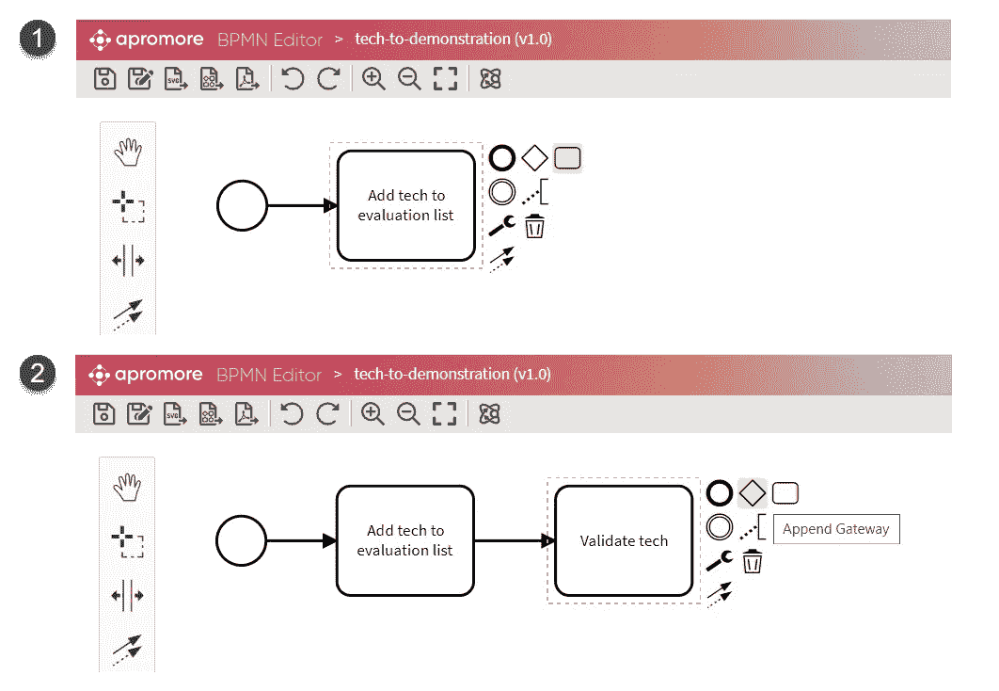

# 使用 Apromore 进行业务流程模拟和假设分析

> 原文：<https://towardsdatascience.com/business-process-simulation-and-what-if-analysis-with-apromore-7b70beddbeca?source=collection_archive---------28----------------------->

图片由作者提供，截图来自 Apromore

## 对我的流程来说，什么是最好的设计！？如果我收到两倍的订单会怎么样？如果我多雇两个专家会怎么样？

现代业务流程挖掘(BPM)工具能够生成业务流程的副本(也称为数字孪生),运行模拟并分析条件改变时会发生的情况(假设分析)。这篇文章一步一步地展示了如何在 [Apromore](https://apromore.org/) 中实现这一点，这是目前最先进的 BPM 工具之一。

**概要:**

1.  创建一个流程模型，
2.  定义模拟参数(任务需要多长时间，有多少资源可用)，
3.  通过添加/删除资源、更改流程任务的持续时间或修改流程的设计来创建模型的替代版本。
4.  运行模拟并比较结果。

# 创建流程模型

让我们首先在 Apromore 的 BPMN(业务流程模型和符号)编辑器中创建一个模型。顾名思义，您可以通过创建任务、网关并连接它们来构建传统的 BPMN 式流程。

为了这个演示的目的，我将对**技术到演示**的过程进行建模。这是我们部门的流程之一，旨在发现新的数字技术并向我们的业务部门展示。该过程具有以下步骤:

*   技术研究，
*   将技术添加到评估列表中，
*   验证技术，
*   根据评估结果将技术标记为“测试”或“保留”,
*   选择技术进行演示，
*   找到一个用于演示的用例，
*   执行概念验证，
*   演示一下。

下图显示了我们如何构建和连接流程的最初两个任务。

*图 1:用 Apromore 的 BPMN 编辑器构建流程模型(图片由作者提供—截图来自 Apromore)*

我们继续添加任务、网关和连接器，直到模型完成。是的，我知道这是同样的老无聊的 BPMN 的东西，但我保证事情很快会变得有趣得多:)！

*图 2:在 Apromore 的 BPMN 编辑器中完全构建的流程模型(图片由作者提供—截图来自 Apromore)*

# 定义模拟参数

Apromore 的 BPMN 编辑器通过“模拟参数”定义过程元素的动态特性，使我们的静态模型变得生动。下图说明了可以设置的不同类型的模拟参数:

1.  **General** —我们多长时间有一个新案例，正在模拟的流程实例(案例)的总数以及模拟的开始日期。
2.  **任务** —设置所有流程任务的持续时间分布(即:执行任务需要多长时间)。
3.  **时间表** —定义人员和机器的工作时间表(例如，专家从上午 9 点到下午 17 点工作)。
4.  **资源** —定义可用资源的类型和数量(人和机器)。
5.  **关口** —定义关口的转移概率(例如，通过评估的案例比例)。

*图 3:apro more 中不同类型的仿真参数(图片由作者提供—截图来自 Apromore)*

注意，这个工具可以将持续时间设置为概率分布。换句话说，我们可以说，平均来说，新病例每两周出现一次，但有时需要 5 天甚至 10 天的时间，有时新病例在前一个病例后几天出现。**在进行模拟时，这种概率性质极其重要，因为对于静态值，我们无法看到边缘情况(例如，可能发生的最坏情况是什么)**。

# 运行模拟

为所有任务定义模拟参数后，我们可以通过选择模型并使用“模拟模型”功能(1)来运行模拟。这产生了一个模拟的业务日志(2 ),我们可以打开并分析它。

*图 4:在 Apromore 中生成模拟流程日志(图片由作者提供—截图来自 Apromore)*

# 假设分析

假设分析是关于更改模拟参数(例如添加或删除资源)并重新运行模拟。这些步骤包括:

1.  在 BPMN 编辑器中更改一些模拟参数。
2.  运行模拟以创建替代流程日志。
3.  分析模拟日志以查看变化。

下图显示了*假设*我添加了一个额外的开发团队的结果。在商业模型的第一个版本中，我将开发团队的数量设置为 2，在第二个版本中，我将团队的数量增加到 3。在这两个版本中，都创建了模拟流程日志(img 1)。接下来我对比了一下进程日志的统计，看看，增加一个开发团队(img 2 & img 3)能有什么确切的效果。

我们的*假设分析*显示，对于 2 个开发团队(img 2)，执行 20 个从技术到演示的流程实例需要大约 1 年零 1 个月的时间。对于 3 个团队(img 3 ),相同数量的流程实例需要大约 11 个月。因此，**基于假设分析，我们可以得出结论，拥有一个额外的开发团队将使我们获得 2 个月的时间**。

*图 5:通过比较两个模拟的流程日志(作者提供的图片——来自 Apromore 的截图)，分析增加一个额外开发团队(img 2 有 2 个开发团队，img 3 有 3 个开发团队)的效果*

# 摘要

新颖的流程挖掘工具能够创建动态流程模型，用于模拟各种条件下的流程。假设分析就是模拟流程的几个不同版本，并比较结果。在设计新的业务流程时，这是一个非常有用的特性——人们可以尝试不同的流程设计，并修改资源数量以找到最佳设置。此外， **假设分析对现有流程非常有用，因为它能够 a)分析添加/删除资源的影响，b)通过增加引入的工作来测试流程的限制，c)在安全(模拟)环境中查看重新设计的影响**。总之，模拟和假设分析的结合具有将过程管理带入新时代的巨大潜力。