# 购买到死:用 Python 预测客户终身价值

> 原文：<https://towardsdatascience.com/buy-til-you-die-predict-customer-lifetime-value-in-python-9701bfd4ddc0?source=collection_archive---------0----------------------->

## [行业笔记](https://towardsdatascience.com/tagged/notes-from-industry)

## 端到端示例:Beta 几何/负二项分布模型(BG/NBD)，使用 Python 中的生存期

[La Catrina 女孩服装 Pixabay 上的免费照片](https://pixabay.com/photos/la-catrina-girl-costume-portrait-5824501/)Jose Sanchez _ photos

# 1.我们正在寻找的洞察力

今天的文章将把焦点放在**非契约性**商务环境上。我们希望预测客户的交易频率及其流失风险。

过去平均每 20 天购买一次产品，但 50 天没有活动的客户，必须被评定为增加的流失风险。她可能即将离开我们的业务，转向竞争对手的产品系列。当我们的应用程序向客户指出高流失风险时，营销团队可以考虑促销、折扣和其他外联活动。

我们想要的是一个能为我们标记流失风险客户的模型。我们还希望它能预测每个客户的购买量。同时，它应该计算我们所有客户的终身价值。

满足这些要求的数据科学方法被称为**Buy ' unt You Die 模型:BTYD (** [Wikipedia](https://en.wikipedia.org/wiki/Buy_Till_you_Die) ):从客户的“出生”(当她向我们的企业下第一个订单)到她“死亡”(当她转向竞争对手，从而对我们这个被她唾弃的企业而言已经死亡)。

我们在数据科学中最常遇到的客户流失模型适用于*合同*设置。客户与互联网提供商、移动电话网络、保险公司和基于订阅的服务提供商签订有期限限制的合同。契约环境中的企业可以对有流失倾向的客户有更清晰的认识。他们的原始数据显示，每当合同期限接近尾声时，风险就会上升。销售和营销团队往往会在客户开始考虑续订或取消订阅之前联系她。例如，IBM Telco 数据集已经成为解决*契约*流失问题的普遍例子，我们可以对其应用一系列众所周知的模型，如逻辑回归、随机森林、梯度推进方法和其他分类器。

然而，在一个非契约性的商业环境中，情况更加不明朗。销售和营销团队无法在其日程表中预见客户的高风险。我们通常应用于合同商业环境中客户流失问题的大多数分类模型不适用于非合同环境。流失日期是不透明的。

相反，我们需要通过做出分布假设来分析客户的购买行为。概率模型也将使我们能够预测购买量。

[购物中心橱窗 PhotoMIX 公司在 Pixabay](https://pixabay.com/photos/shopping-mall-shopwindow-1316787/) 上的免费照片

我们将要建立的模型将使营销团队能够将他们的工作重点放在那些被模型确定为转折点的客户身上。

在今天的文章中，我们将实现 2 口:

*   **贝塔几何/负二项(BG/NBD)模型**，
*   结合**伽玛-伽玛模型**估算客户终身价值。

这听起来比实际情况更可怕。数学很复杂——涉及到四种分布和贝叶斯推理。不过，大部分的数学知识将会被安全地保存起来。这个*寿命*包将为我们进行数字运算。虽然我会跳过方程，但我们应该理解这两个模型在得出预测时所应用的原理和假设。这就是为什么当我们建立和运行模型时，我会添加一些解释。

下面的屏幕截图显示了我们希望从模型中获得的输出示例。一个列出我们所有客户的数据框架，我们将为这些客户推导出以下绩效指标。

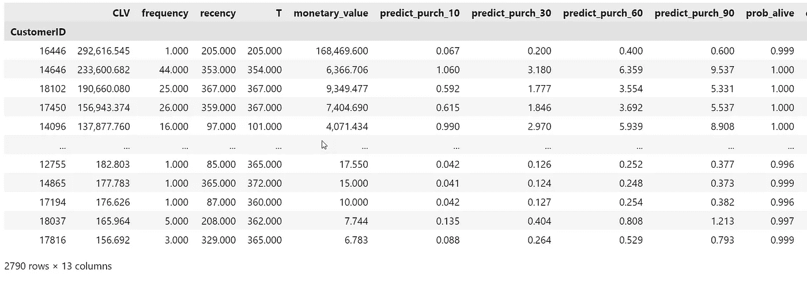

作者图片

*   **CLV** 表示**客户终身价值**:在这种情况下，是在一段选定时间内的收入，例如 12 个月。
*   四个**预测**列预测我们在接下来的 10、30、60 和 90 天内可以从每个客户那里预期的购买交易数量。
*   **prob_alive** 估计客户活着的概率。它的补充(1-p)相当于客户流失风险:远离我们的业务，偏向竞争对手。

# 2.属国

除了顶部的核心库，我们还安装并导入了生存期库。

*   [快速入门—寿命 0.11.2 文档](https://lifetimes.readthedocs.io/en/latest/Quickstart.html)
*   [明明白白::Anaconda.org](https://anaconda.org/conda-forge/lifetimes)
*   [寿命 PyPI](https://pypi.org/project/Lifetimes/)
*   康达安装-康达锻造寿命
*   pip 安装寿命

# 3.数据争论

我们要使用的数据源可以从加州大学欧文分校的机器学习库下载 Excel 文件。(2015).UCI 机器学习知识库。知识共享的属性。”

它包含一家英国在线零售商 2010 年和 2011 年的 542，000 条记录。

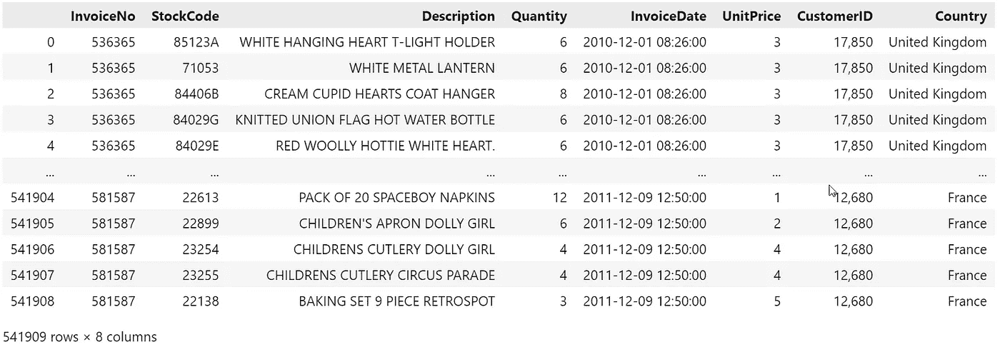

作者图片

首先，我们寻找没有可识别客户的记录。我们发现多达 135，000 个，分布在 3，710 个发票号码上。

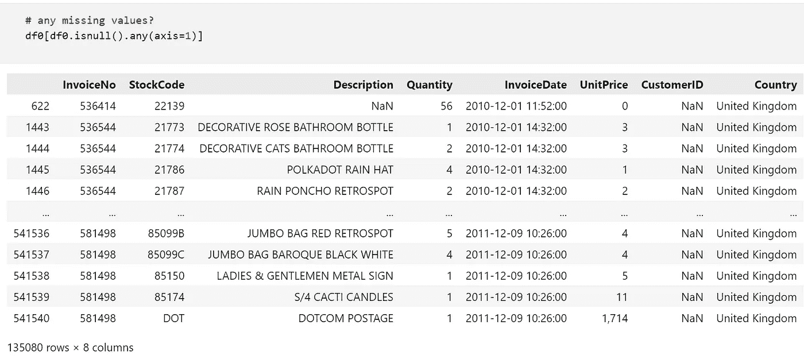

作者图片

假设，我们可以考虑使用发票号作为虚拟变量，每个虚拟变量代表一个未知的客户。但这会扭曲我们的模型。我们对回头客及其需求模式感兴趣。通过将这 3，700 个发票号码中的每一个解释为虚拟客户，我们将增加一次性购买者的数量。它们不会为我们提供一个可识别的趋势，相反会淡化我们可以为可识别的客户推断的模式，我们发现这些客户有 4300 个。因此，我们需要删除这 135，000 条缺少客户 ID 的记录。

在我们开始修改源数据之前，我们复制数据帧以保持原始源数据不变。

让我们回顾一下数字变量。

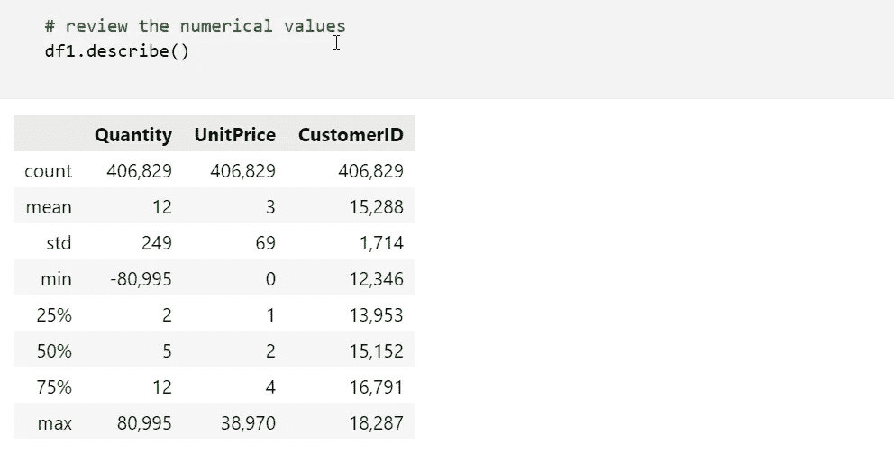

作者图片

我们观察负的量。这些肯定是产品退货或取消。我们需要删除他们的记录。

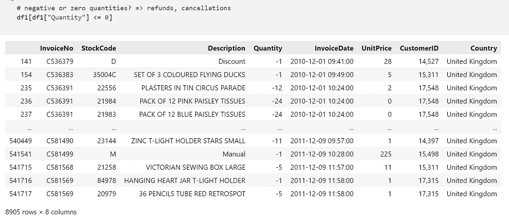

作者图片

在将数据集限制为正数之后，我们利用这个机会调整一些数据类型。

*   dt.date 方法从发票日期中删除时间部分。
*   Pandas 将客户 ID 解释为一个数字变量。让我们将其重新定义为对象/字符串类型。

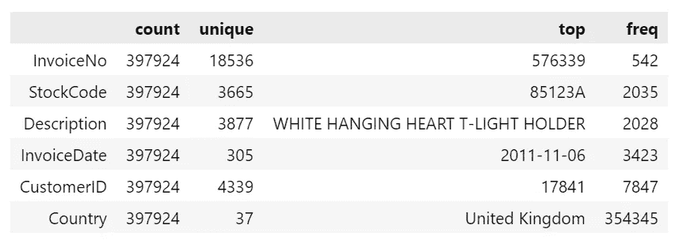

作者图片

该数据集包含时间范围内的 4，339 个唯一客户 id 和 305 个发票日期。

发票号、库存代码和描述不能为我们的分析提供有意义的信息，因此我们将其删除。

“国家/地区”列可能有助于客户细分。但是，尽管数据集包含的记录数量相对较高，有 400，000 条，但它并没有覆盖很长的一段时间:只有 2 年。如果我们试图将它分散在 20 个不同的国家中——其中一些国家几乎没有客户和交易——我们会稀释我们分析的原材料，并冒着得到不太可靠的结果的风险。因此，我们也删除“国家”列，并将分析全球客户行为。

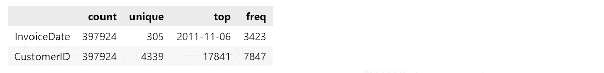

作者图片

为了确定交易的货币价值，以及随后所有客户的终身价值，我们通过将数量乘以相应的单价来插入一个新列“收入”。

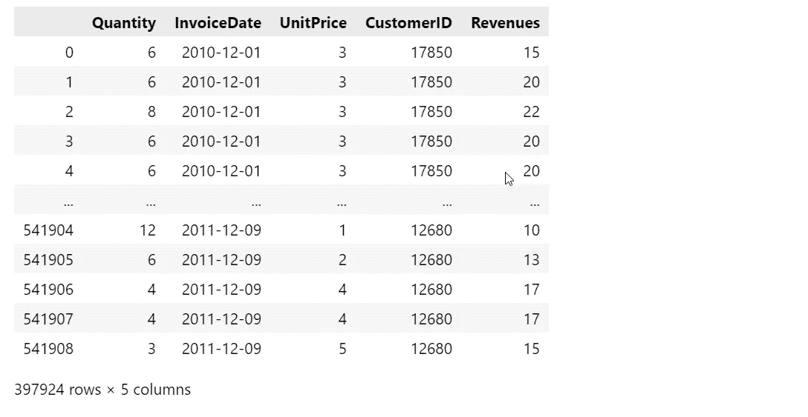

作者图片

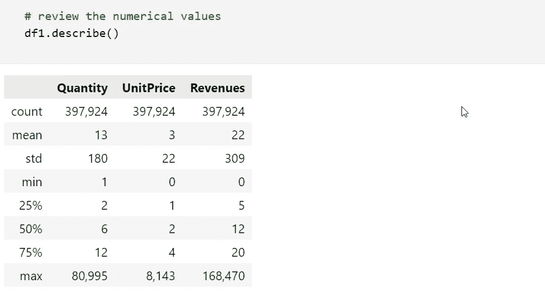

作者图片

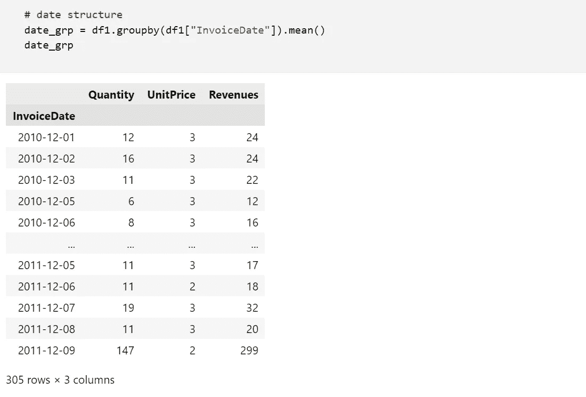

作者图片

# 4.生命周期中的 RFM 模型:新近性、频率和货币价值

贝塔几何/负二项分布模型做出的预测依赖于 RFM 概念的度量:新近性、频率、货币价值和所谓的客户年龄或寿命。

[提着纸袋走在街头的女人照片 Unsplash 上的自由女人形象](https://unsplash.com/photos/Xn7GvimQrk8)Jon Ly

RFM 概念基于这样一个公理，即最近下订单、购买更频繁、倾向于在交易中花费更多的客户很可能是回头客，也是最有价值的客户。虽然这听起来像是一个不言自明的分类，但 RFM 概念提供了 BG/NBD 模型可以从中得出其预测的基础。BG/NBD 在 RFM 指标中增加了分布假设。

## 4.1 定义

*   **最近**:客户第一次和最后一次(最近)交易之间的时间间隔
*   **频率**:顾客初次购买后*再次购买的时间段数*
*   **货币价值:**客户交易的平均价值(每笔交易的收入或利润)

此外，

*   **客户年龄 T** :客户第一次购买后的时间段数

寿命包将为我们计算这些值。为了理解它们的定义，让我们演示如何为一个选定的客户确定它们:ID = 14527。我们创建一个小型数据框架来保存客户的交易。

*   顾客的“出生日期”2010 年 12 月 5 日是她第一次购买的发票日期。
*   她最近一次购物是在 2011 年 12 月 7 日。
*   包含所有客户的完整数据集，延伸至 2011 年 12 月 9 日。我们将此作为我们分析范围的结束日期。
*   她的最近交易是她第一次和最后一次交易之间的天数:367 天。有点违背直觉，它没有计算她最近一次购物后的天数。
*   她的**年龄或寿命 T** 是她“出生”——第一张发票——和我们 2011-12-09:369 天分析范围结束之间的天数。
*   她的**频率**被定义为记录一次或多次重复购买的时间段数。这发生在第 53 天。第 18 行按照发票日期对数据集中的所有交易进行分组。然后减去 1，因为 RFT 和 BG/NBD 模型关注重复购买。它省略了初始事务。
*   请注意，这个定义几乎肯定不同于你在其他领域所理解的频率。在其他地方，频率表示单位时间内发生的次数。我们的数据集由每日发票记录组成。但是模型不会将频率定义为每天或每月或每年的平均发票数量。相反，它只计算自第二张发票以来的交易天数。在某种程度上，该模型将“时间单位”定义为所有*活动*天(每当记录发票时)的总数，并将该人工时间单位设置为 1.0。这是一个特定于客户的时间单位，它忽略了客户不活动的所有日历日。

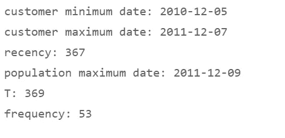

作者图片

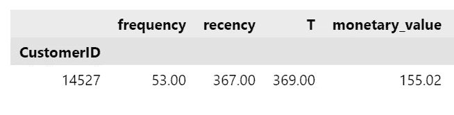

作者图片

寿命包为客户 14527 计算的值与我们刚才计算的值相同。

为了在我们的应用程序中实现更全面的传统 RFM 分析，我们可以将最近值、频率值和货币值分成五个部分，即所谓的五分位数。客户可能在容器#2 中具有新近值，在容器#3 中具有频率值，在容器#4 中具有货币值。那么客户的 RFM 分数等于 234。最高分 555。这种方法可以作为营销团队的客户细分启发式方法，类似于供应链管理中的 ABC 库存分析。

RFM 的概念是在 40 年前开发的，那时数据科学和计算资源还没有为客户细分提供更先进的技术。我们将对英国天然气公司/NBD 公司使用 RFM 指标，但不尝试 RFM 评分。

[网购服装 HutchRock 在 Pixabay](https://pixabay.com/photos/online-shopping-clothing-mobile-2900303/) 上的免费照片

## 4.2 训练和测试数据集的拆分

Lifetimes 使用术语*校准*和*保持期*来表示我们在大多数其他应用中标记的*训练*和*测试数据集*。

其函数*calibration _ and _ holdout _ data()*将校准周期的所选结束作为其自变量；和观察期的结束。下面的笔记本单元格为维持期保留了数据集中的最后 240 天。它在第 7 行计算校准周期的结束日期 *max_cal_date* 。我们希望使用完整的数据集，无论如何，它不会覆盖许多时间段。因此，我们将 *observation_period_end* 设置为数据集中的最新日期。

请注意，校准周期和保持周期之间的划分可能会非常严格。这个特定的数据集包含 400，000 条记录，但它们分布在 4，000 多个客户中，覆盖时间仅为两年。许多小客户隔几个月就提交重复订单。如果我们将维持期设置为很少的时间段，那么它将只包含少量小客户的重复交易。我们的风险是，它没有完全反映他们的需求模式。我发现短于 100 天的抵制期在这种情况下效果不好。理想情况下，应该接近 200 天。然而，如果我们为抵制期预留了太多的天数，同样的问题也会困扰培训阶段:短至 365 天的培训期可能无法捕获足够多的客户特定交易来确定他们的需求模式。

最好是通过从整个数据集中随机抽取客户来创建维持数据集，然后检查定型数据集中客户的购买行为是否不同于维持客户的行为。但是，许多寿命评估函数将时间段 t 作为其参数，如果校准和维持交易在同一时间段重叠，则这些函数将不起作用，即使客户保持分离。

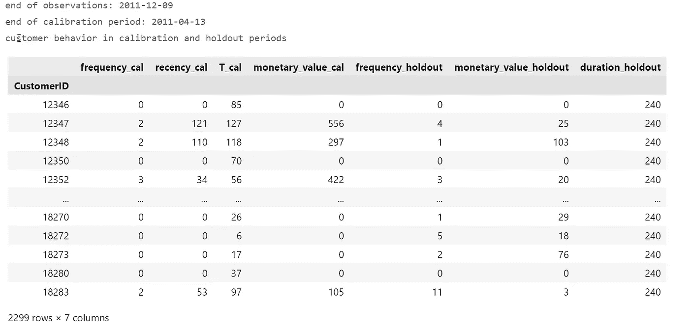

作者图片

*calibration _ and _ holdout _ data()*函数在训练数据集和测试数据集之间拆分数据集。同时，它计算每个客户的*最近值、频率*、*货币值、*和*年龄 T* 值。它创建一个新的数据帧，我们将其分配给变量 df_ch(“数据帧校准和保持”)。原始源数据 df1 是按照客户 ID 和发票号组织的；而 df_ch 使用唯一的客户 id 作为索引，并按客户汇总发票记录。

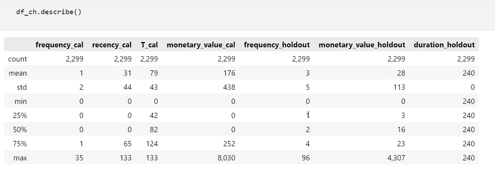

作者图片

下表显示了每个客户的平均频率(有效发票天数减 1)。大多数顾客只购买一次。请记住，频率为 0 表示客户没有重复交易—他刚刚完成了一次首次购买，但此后再没有回来。一小部分顾客会回来购买 6 次或更多次。这种模式凸显了我之前提到的困难:将数据集分为培训期和测试期，这两个时间段同样很好地反映了客户的需求模式，这些客户中的大多数人每隔几个月就会有一次从企业购买任何东西的适度冲动。

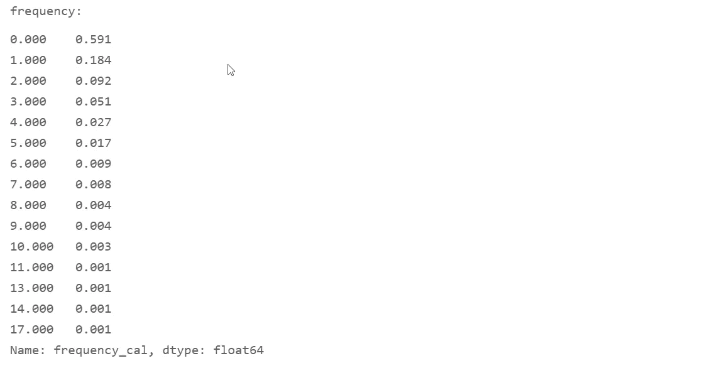

作者图片

为了形象化最近、频率和年龄 T 的模式，我们可以使用 Seaborn 的 distplots。

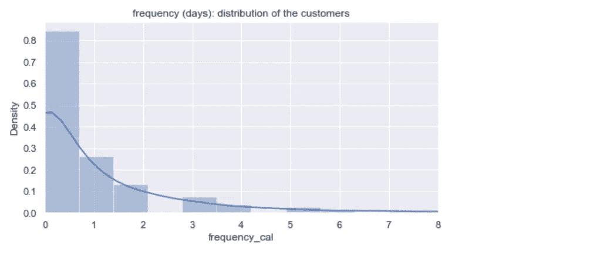

作者图片

我们再次观察到，在训练数据集涵盖的不到 1.5 年的时间里，只有少数客户会再次购买第二次或第三次产品。

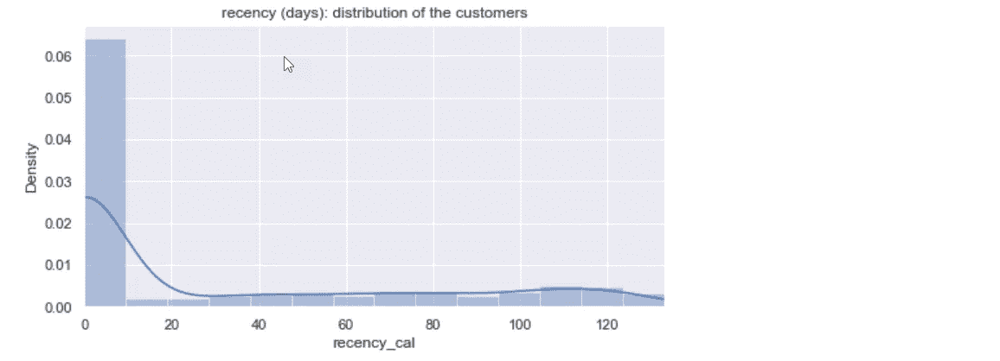

作者图片

最近度衡量客户第一次交易和最近一次交易之间的天数。由于他们中的大多数是一次性购买者，我们认为峰值出现在 0 天。

作者图片

客户年龄 T 表示自购买者“出生”以来的天数，即他们作为企业新客户的第一天:从他们第一次购买开始，一直到数据集结束。大多数客户是在过去 120 天或更长时间内上船的。在 4 个月的短期内，图表显示了在 20 天、40 天、60 天或 80 天前进行首次购买的新客户的平均水平。该图表表明，企业并未发现自己处于下滑趋势。在 120 天的时间里，它以稳定的速度吸引了新客户。

# 5.贝塔几何/负二项分布(BG/NBD)模型

## 5.1 BG/NBD 概念

在非契约性的商业环境中，顾客的购买行为并不遵循确定性的趋势。需求水平和流失率都是随机变量。像 BG/NBD 这样的分布模型描述了影响顾客行为的随机过程，无论是个体行为还是总体行为。

该方法依赖四个分布假设来模拟不确定性:

*   客户在一段时间内的**订单数量**遵循交易率为λ的**泊松分布**。这种泊松*计数*分布相当于假设交易之间的*时间*遵循具有相同交易速率λ的指数分布。
*   客户之间的**需求独立变化**:λ的异质性。λ的变化是一个随机变量，遵循具有形状参数 r 和比例α**的**伽马分布**。**
*   在任何购买之后，客户可能以概率 p 变得不活跃，并且远离该业务。**流失风险**遵循**几何分布**。
*   客户之间的**流失风险独立变化**:p 的异质性。流失或退出概率 p 的变化是一个随机变量，遵循 **Beta 分布。**

C:JFMKSC -2MKSC0098。DVI(brucehardie.com)

负二项分布“NBD”是从哪里来的呢？是否涉及第五次分配？没有，上面的四个要点没有留下空隙。前两个假设结合起来形成泊松-伽马混合分布。如果λ率是伽马随机变量，那么混合分布等于一个[负二项分布——维基百科](https://en.wikipedia.org/wiki/Negative_binomial_distribution#Gamma%E2%80%93Poisson_mixture)。

## 5.2 将 BG/NBD 模型拟合到观测值

寿命包将观测数据与分布进行拟合，以获得它们的参数。

作者图片

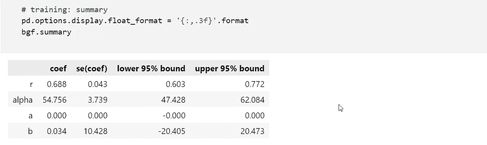

作者图片

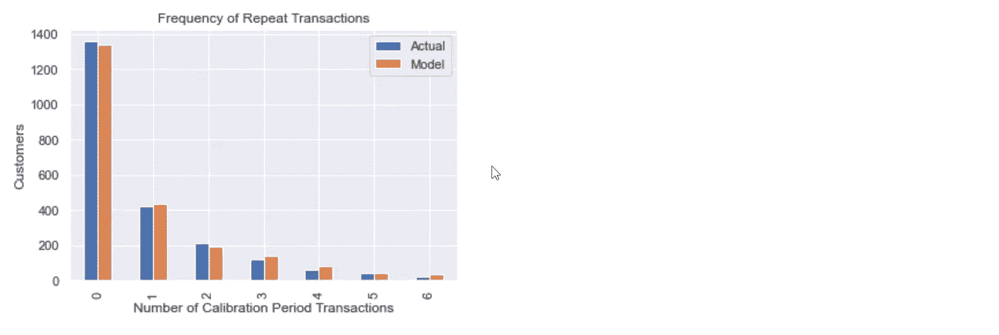

作者图片

*plot_period_transactions* 方法绘制一个图表，将训练数据集中的预测值与实际观察值进行比较。预测精度看起来相当不错。

寿命法*plot _ calibration _ purchases _ vs _ holdout _ purchases*将预测频率与测试期间的实际购买量进行比较。

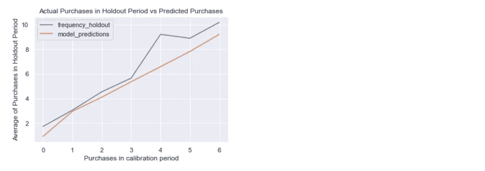

作者图片

我们看到模型预测的橙色线与蓝色的实际线非常接近，每个客户最多有 3 笔交易。对于较高的交易水平，该模型倾向于低估频率，因为很少有客户在短训练时间窗口内重复购买 3 次以上。

# 6.完整数据集的血糖/NBD 模型

我们示例中的数据集涵盖了一个很短的时间段，大多数客户的交易很少。在回顾了第 5 章中的训练和测试结果后，我倾向于在完整数据集上重新运行模型。

## 6.1 RFM:新近性、频率、货币价值和寿命测试

我们使用寿命函数*summary _ data _ from _ transaction _ data()*来获得完整数据集中每个客户的 RFM 简档。该函数将它们收集在一个新的、以客户为中心的数据框架 df_rft 中。

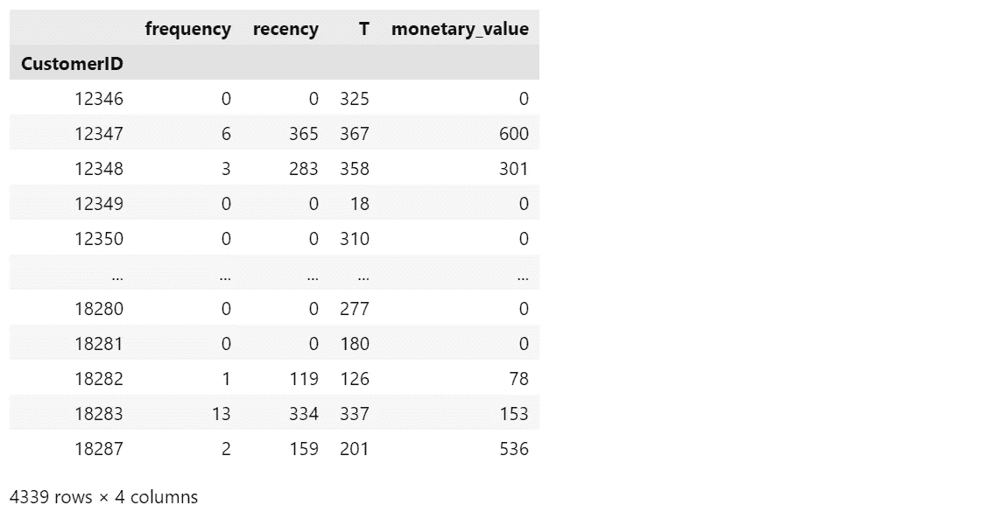

作者图片

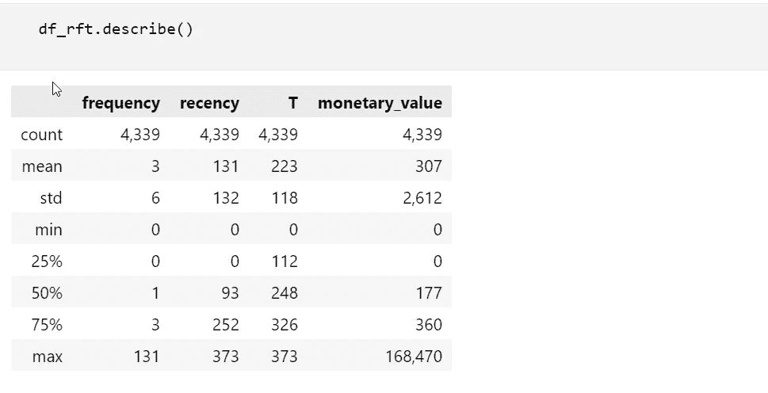

作者图片

## 6.2 拟合英国天然气公司/NBD 模型

我们将 Beta 几何/负二项分布模型拟合到 df_rft 中的完整数据集。

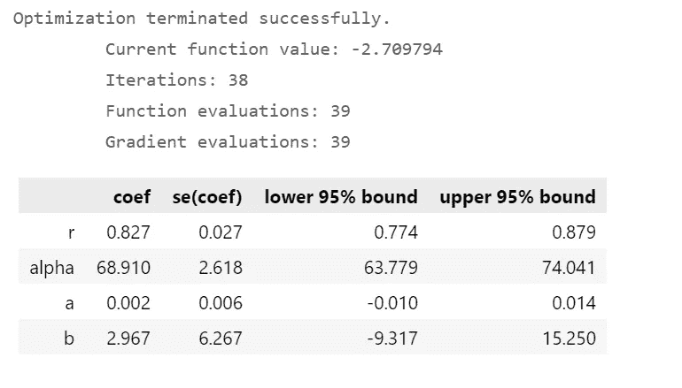

作者图片

为了检查预测的准确性，我们调用寿命的方法。该图表表明，该模型对购买数量的预测与实际观察结果非常接近。

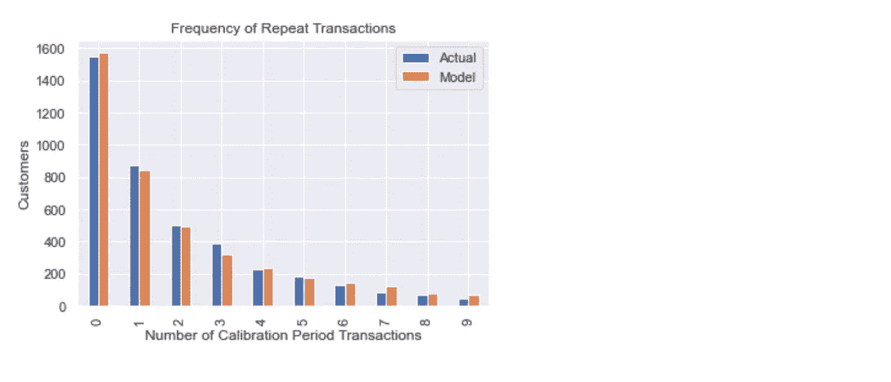

作者图片

## 6.3 预计购买量

*频率/最近矩阵*可视化了客户档案中的这两个属性如何预测她在选定时间段内的购买次数。

我们将绘制两个矩阵，分别用于 10 天和 90 天的预测期。第 15 行中的列表理解向第 6 行中的寿命方法*plot _ frequency _ recency _ matrix*提供两个预测范围。

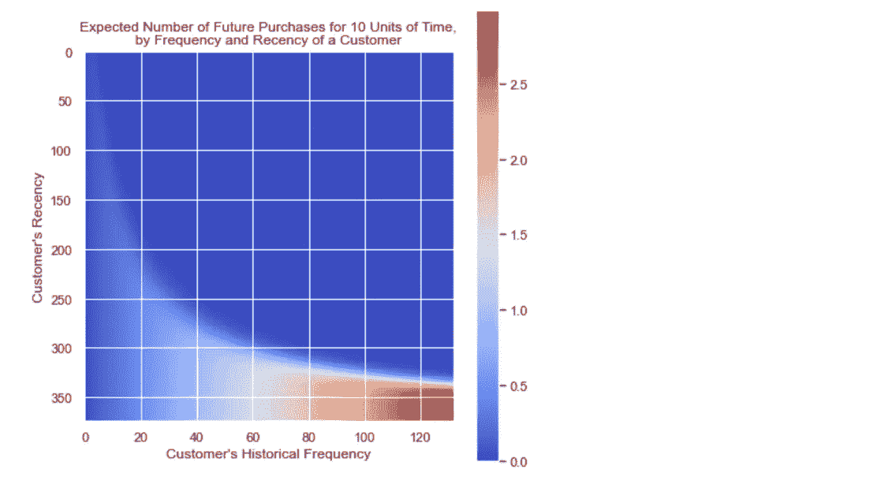

作者图片

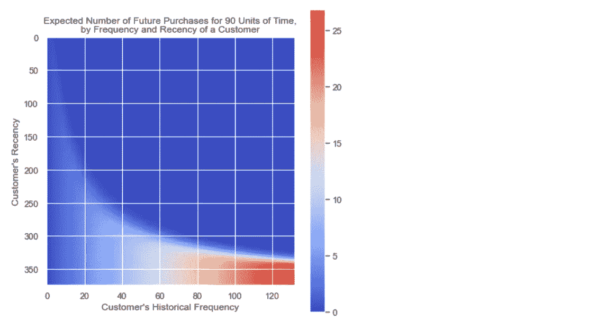

作者图片

频率/最近矩阵都显示了 10 天和 90 天的概率分布的相同形状，在右下角有一个红色的热区。分布的形状保持不变。它们只是在右边的刻度上有所不同:在更长或更短的天数内的购买次数。

每个矩阵都表明，一个高频率(80 次或更多交易)的客户，加上一个长时间的最近交易(第一次和最近一次交易之间超过 300 天)，将表现出最高的未来购买倾向:橙色到红色，这意味着在未来 90 天内有 15 到 25 次交易。

当然，尽管它看起来很吸引人，但用处有限。我们需要将视觉线索转化为针对单个客户的具体、量化的预测值。

让我们从数据集中随机挑选一个客户，例如 ID = 12748，并预测她在未来 30 天的购买量。

寿命预测功能评估客户的近期、频率和年龄；并得出结论，根据这个侧写，我们应该预计她在接下来的 30 天内会做 7.7 笔交易。

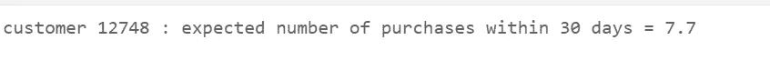

作者图片

下一个笔记本单元格将这个单一买家预测扩展到数据库中的所有客户。第 12 行中的列表理解询问 10、30、60 和 90 天内的预期购买量。它调用的助手函数， *predict_purch()，*会将其特定于客户的预测作为四个新列插入到 dataframe 中。

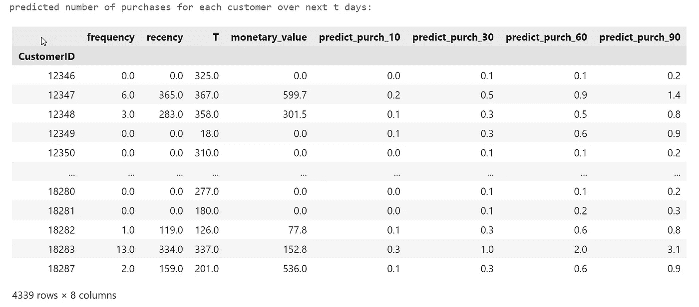

作者图片

接下来，我们可以根据这一预测对数据框架进行排序和筛选，例如，研究前 10 名客户，根据他们在未来 30 天内的预计购买次数进行排序。

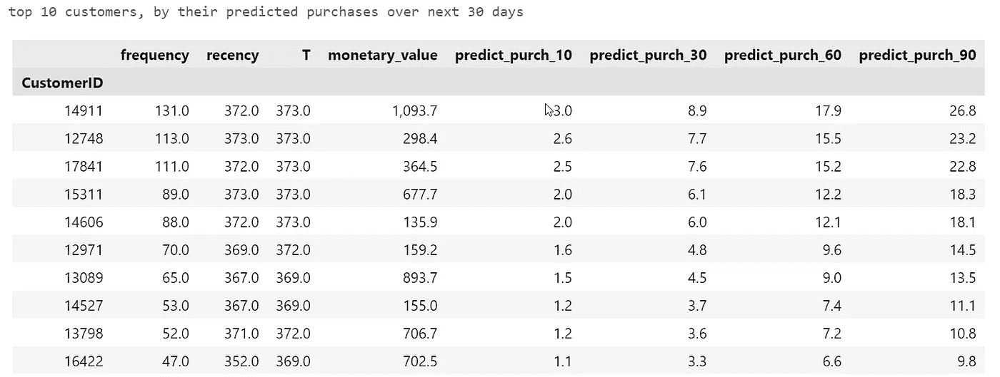

作者图片

当然，Seaborn 的 distplot 显示了一个严重向右倾斜的分布。只有少数挥金如土的人有意向或有能力一个月下一次以上的订单。

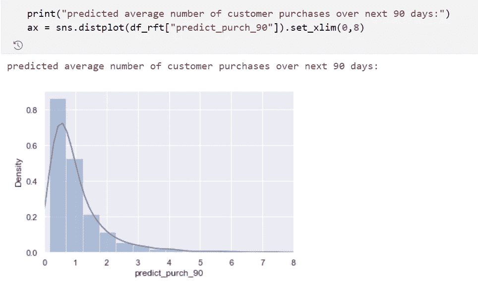

作者图片

生命周期法*probability _ of _ n _ purchases _ up _ to _ time*计算一段时间内每个客户的平均交易次数。

作者图片

## 6.4 客户流失概率

在前一章中，我们已经预测了每个客户的购买量。在下一步中，我们将估计客户的流失风险，或者相反，估计她在时间 t 活着(作为客户)的概率。

“寿命”方法*plot _ probability _ alive _ matrix*根据客户的频率和最近概况可视化生存概率。一个客户的交易覆盖了很长一段时间(高新近性)，有大量的交易，表现出一个坚实的，红色的生存概率。

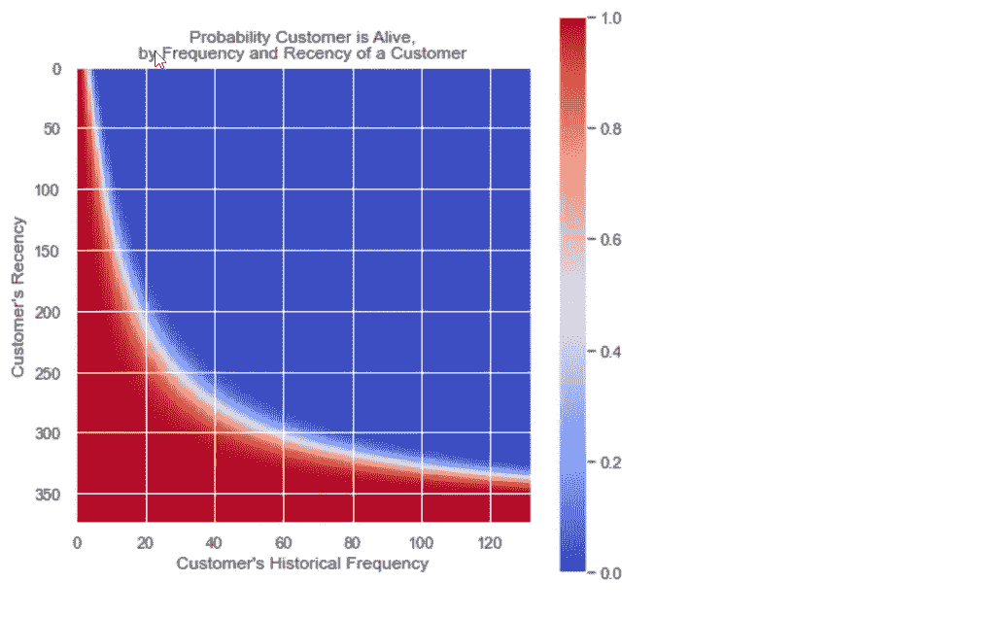

作者图片

我们将视觉线索转化为指标，以获得可操作的信息。

函数*conditional _ probability _ alive*计算每个客户的生存概率。我们将数组作为新列插入到数据帧中。

其描述性统计数据显示，鉴于当前的近期/频率特征，最不可靠的*客户的生存概率仍高达 75%。*

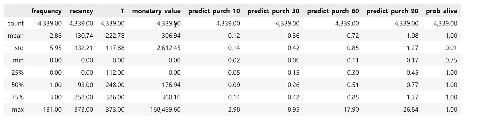

作者图片

只有少数客户的存活率低于 99%。如果我们将分析局限于不完全可靠的候选人，即存活率低于 90%的候选人，我们会发现四个客户。

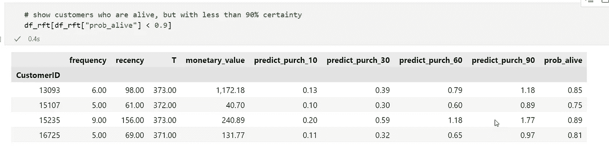

作者图片

让我们检查客户 ID 15107，评级为 75%。

寿命法 *plot_history_alive* 向我们展示了客户的交易和她存活的概率在 2 年的观察中是如何发展的。她在最初几个月完成了五次购买，但在 2011 年 3 月至 12 月期间一直没有行动。该模型仍然认为她有 75%的可能是一个活跃的客户，因为我们的数据集包含许多在 10 个月的过程中只是稍微活跃一些的客户。具有更多活跃客户的不同数据集，这些客户倾向于每月或每周订购一些东西，这将促使模型降低数月不活跃的客户的概率。

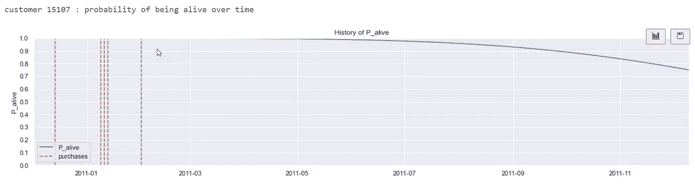

作者图片

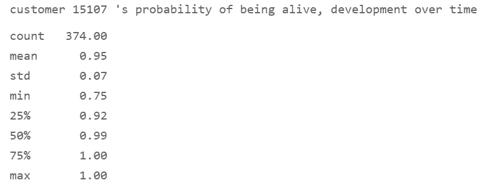

作者图片

# 7.客户终身价值

[电子商务在线销售 Mediamodifier 在 Pixabay](https://pixabay.com/photos/ecommerce-selling-online-2140603/) 上发布的免费照片

## 7.1 伽玛-伽玛模型

BG/NBD 模型使我们能够预测每个客户的交易数量和流失风险(相反，是存活的概率)。

现在我们要估计与计数数据相对应的**货币值**。我们将把血糖/NBD 结果链接到**伽玛-伽玛**模型中。

GG 模型基于以下假设

*   顾客的平均交易价值各不相同:例如，一些挥金如土的人可能倾向于在每笔交易中花费两倍于其他人的金额
*   *单个*客户*的平均*货币交易额在分析区间内*不随时间变化*；客户交易的价值围绕平均值变化，而平均值本身随着时间的推移保持稳定

时不变的平均交易值是我们想要确定的随机变量 Z。

1994 年，Schmittlein 和 Peterson 提出交易值遵循正态分布。但是正态分布延伸到负无穷大，并且围绕其均值对称——而现实世界的支出频率曲线是非负的，并且是右偏的，这一点通常很明显。Fader/Hardie 建议将 Gamma 分布作为反映客户平均交易价值的更合适的替代方法。他们将其比例参数定义为自己的伽马随机变量，因此标签为*伽马-伽马*模型。([γ_γ。DVI (brucehardie.com))](http://www.brucehardie.com/notes/025/gamma_gamma.pdf)

利用贝叶斯定理，他们推导出客户平均交易价值的条件期望值。观察到的交易越多，模型对先验分布的权重就越小，而对客户的观察均值的权重就越大。

GG 模型只适用于正的货币价值。因此，我们排除了单价为零的少数交易。

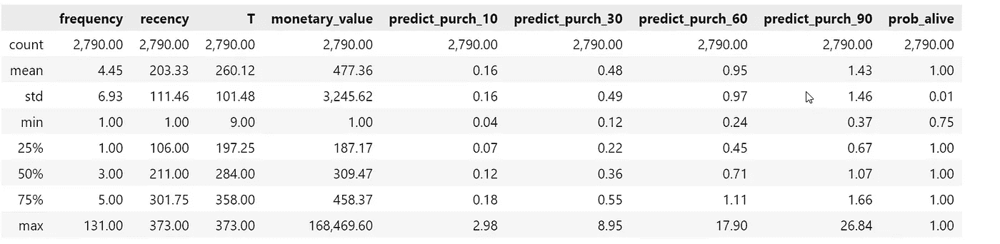

作者图片

GG 模型还要求购买频率独立于其货币价值。相关矩阵证实，在我们的例子中，皮尔逊相关系数达到适度的 0.016，足够低，我们将继续进行。

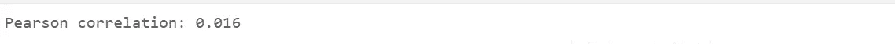

作者图片

## 7.2 根据 RFT 数据拟合伽马-伽马模型

我们实例化 Lifetimes '*gamma gamma fitter*，它将 BG/NBD 模型的频率和货币值作为其参数。

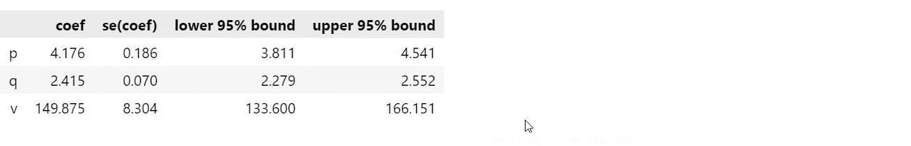

作者图片

## 7.3 GG 预测

在拟合 GG 模型后，我们可以使用寿命函数*计算每个客户的预期货币价值。*我们的源数据集不提供利润率，因此该函数，尽管其名称如此，返回预期的平均*收入*。

我们将结果作为一个新列“exp_avg_rev”插入到我们的数据框架中，同时插入预测平均收入和实际平均货币值之间的差异。

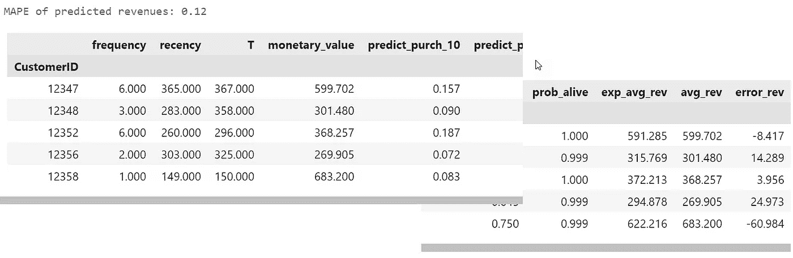

作者图片

## 7.4 客户终身价值 CLV

在我们的最终代码单元中，我们将再次将血糖/NBD 结果与拟合的伽马-伽马模型联系起来。

*   顾客的寿命代表了她第一次购买和观察数据结束日期之间的时间段。
*   同样，客户的“一生”指的是从她第一次交易到她未知的未来客户流失日期的时间，那时她将离开我们的业务。出于实际目的，应该将“生命周期”范围限制在用户定义的时间段内，例如下面第 3 行中我设置为超参数的未来 12 个月。

lifetimes ' customer _ lifetime _ value 函数将在所选的 12 个月期限内累加预测收入。

客户终身价值是贴现现金流(DCF)计算的结果。它基于货币的时间价值概念。一笔钱在近期比远期更有价值。我们现在赚的钱，我们可以立即投资，并开始产生利息或股息。一个现在就有收益流入企业的客户比一个在更遥远的未来贡献收入的客户更有价值。金钱的时间价值由 *customer_lifetime_value* 函数向我们请求的贴现率来表示。折扣应该反映我们公司的资本成本:加权平均

*   公司所欠贷款的利率
*   公司股东期望获得的股本回报率(股息率)。

这两个比率应根据股东和贷款人对公司资产负债表的出资额进行加权。

在这个例子中，我在第 2 行设置了 6%的低年利率。请注意，Lifetimes 实际上期望的是*月*贴现率。第 5 行将年利率转换为月利率。

*customer_lifetime_value 函数*采用我们从 BG/NBD 函数*summary _ data _ from _ transaction _ data:*recency、frequency、lifetime T 和 monetary value 中获得的所有四个指标。

它返回一个客户终身价值的数组，每个客户一个，我们将它作为一个新列“CLV”插入到我们的数据帧中。

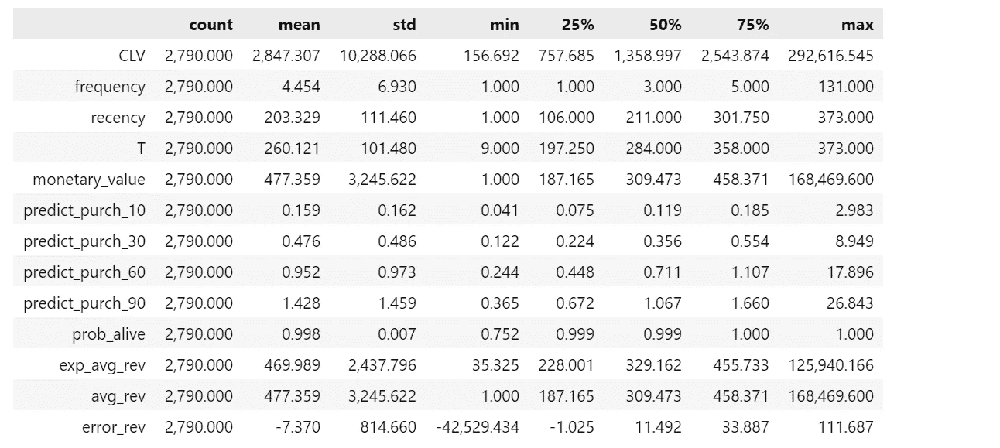

作者图片

所有客户的平均 CLV 为 2，847。

当我们根据客户价值对数据框架进行排序时，我们可以看到我们的前 5 名客户，他们的终身价值超过 100，000 英镑—显然是批发商；或者极度热衷于纪念品和礼物的私人消费者。

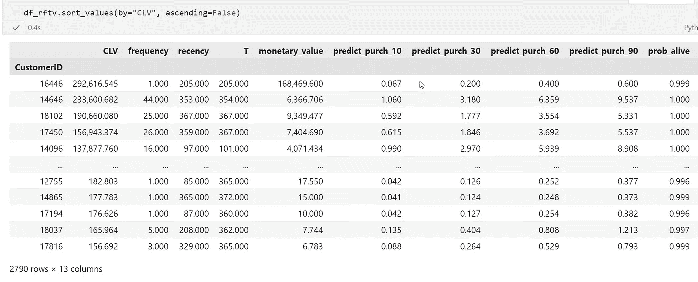

作者图片

# 8.结论

我们通常用于解决客户流失问题的大多数分类工具并不能很好地处理非合同环境。非合同商业环境中的流失日期是不透明的。

BG/NBD 模型将分布假设应用于观察数据。它使我们能够根据客户的新近度、频率和寿命来评估客户流失风险和未来购买。在第二步中，可以将 BG/NBD 模型的计数数据链接到估计货币值的伽马-伽马模型。

Jupyter 笔记本可在 GitHub 上下载: [h3ik0th/clv:客户终身价值 BG/NBD 模型(github.com)](https://github.com/h3ik0th/clv)

数据集:在线零售。(2015).UCI 机器学习知识库。 [UCI 机器学习知识库](https://archive-beta.ics.uci.edu/ml/datasets/online+retail)。该数据集根据知识共享署名 4.0 国际版(CC BY 4.0)许可协议进行许可。这允许为任何目的共享和改编数据集，只要给予适当的信任。