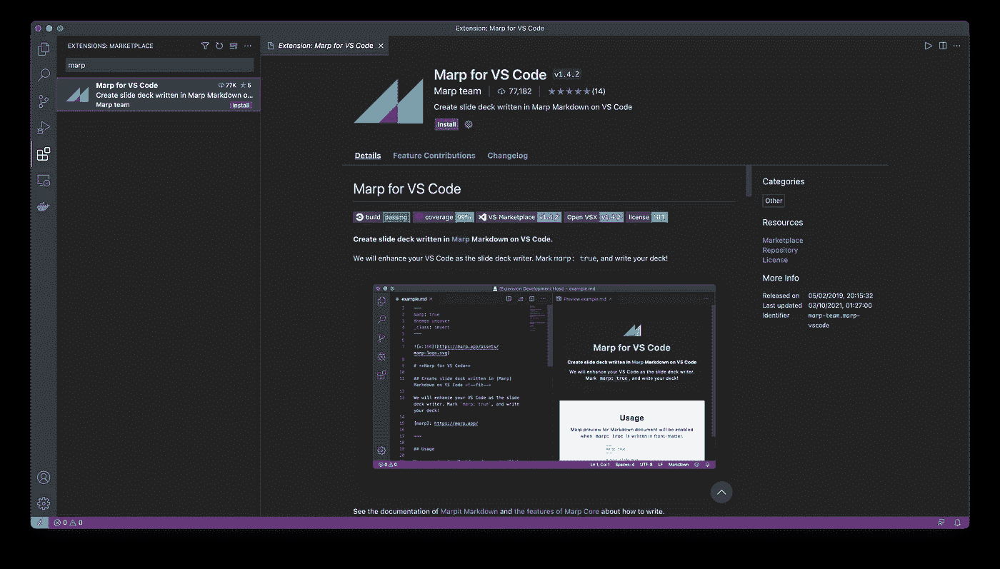
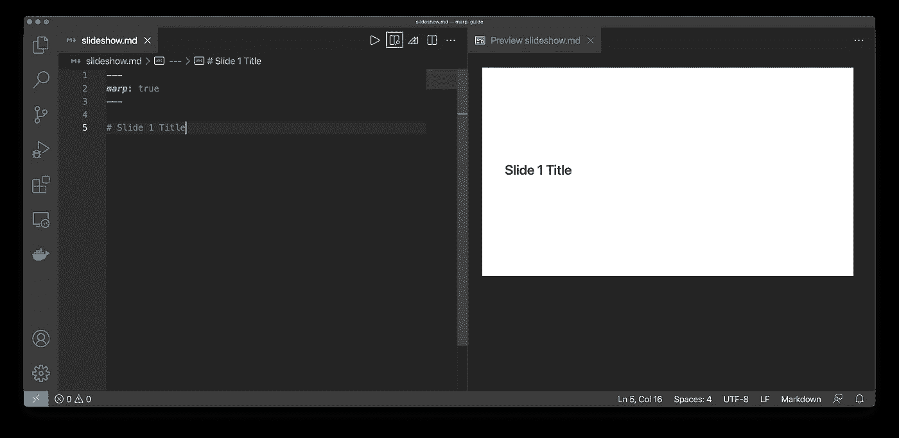
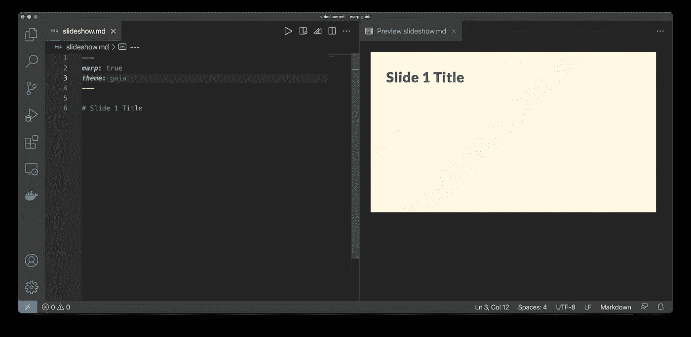
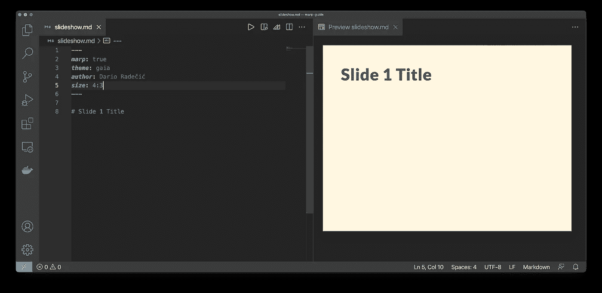
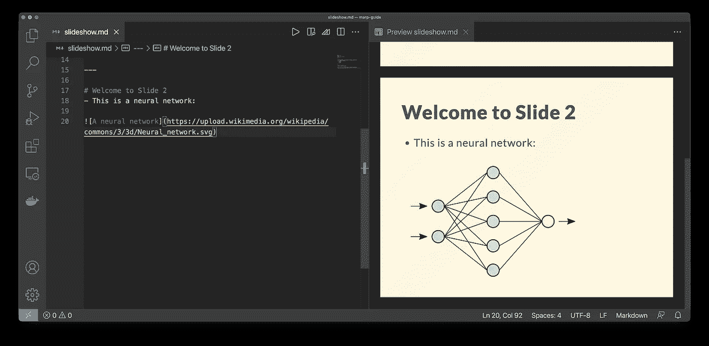
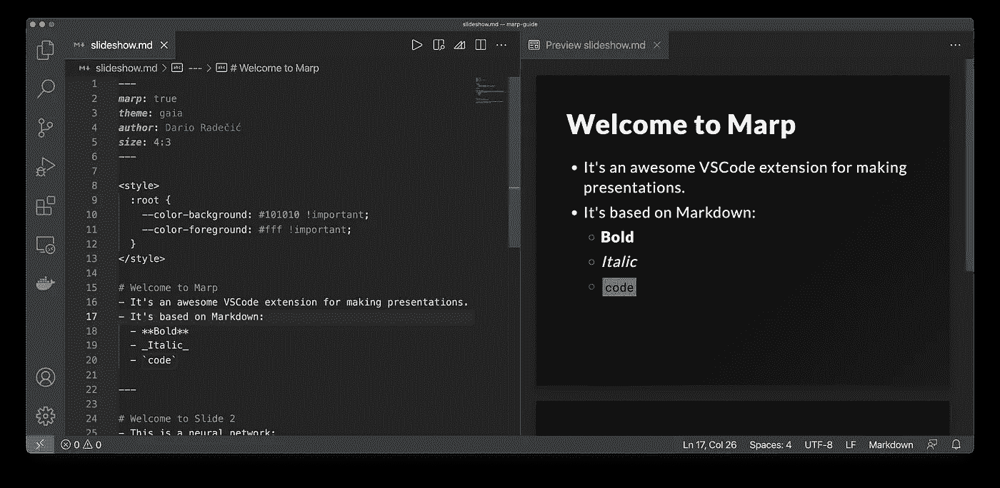
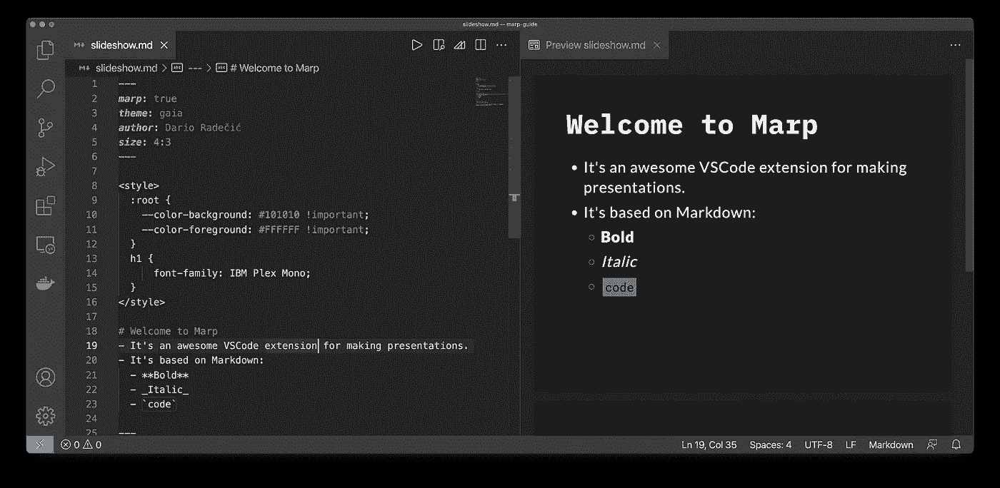
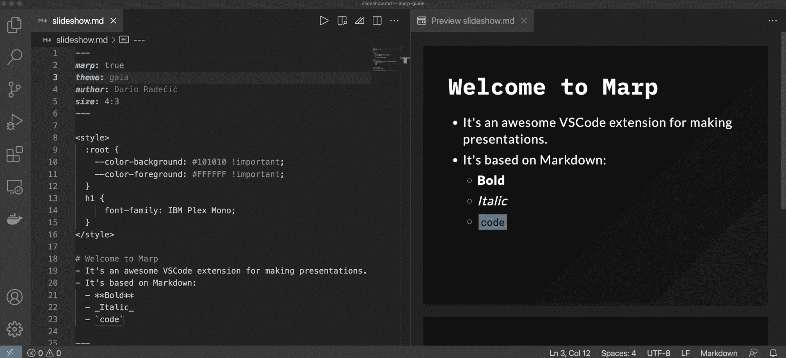
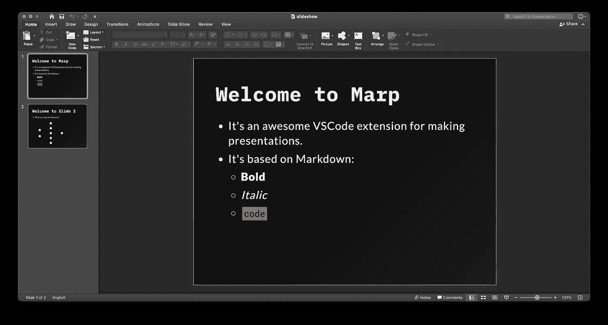

# 拜拜 PowerPoint。你好，马普！

> 原文：<https://towardsdatascience.com/bye-bye-powerpoint-hello-marp-3c0e3b3198b1?source=collection_archive---------1----------------------->

## 这个免费的基于 Markdown 的工具能取代 PowerPoint 吗？是的，但是有一个条件。


亚历克斯·利特温在 [Unsplash](https://unsplash.com/?utm_source=unsplash&utm_medium=referral&utm_content=creditCopyText) 上的照片

你觉得 PowerPoint 很烦人吗？我也是。它有时会滞后，并且有大量的选项。如果你想买更简单的东西，今天是你的幸运日。Marp 可能是节省你时间和精力的正确工具。

它是基于 Markdown 的 Visual Studio 代码扩展，允许您创建可以导出为 PPTX、PDF 和 HTML 的演示文稿。今天，你将学习基础知识，并创建你的第一个演示文稿。

不想看书？请观看我的视频:

# 如何安装 Marp

你应该已经安装了 [Visual Studio 代码](https://code.visualstudio.com)。这是一个代码编辑器，可以让你写任何东西，从自述文件到机器学习模型。如果你不把 Markdown 算作代码，你今天就不会写代码，这是不应该的。

一旦进入 Visual Studio 代码，点击*扩展*选项卡并搜索 *Marp* :



图 Visual Studio 代码中的 Marp(图片由作者提供)

点击*安装*按钮，几秒钟后就可以运行了。然后在机器上的任意位置创建一个文件夹，并在 VSCode 中打开它。

我将我的文件命名为`marp_slideshow`，并在其中创建了一个`slideshow.md`文件。你可以根据自己的喜好随意更改名字。

就这样，您现在可以开始制作您的第一张幻灯片了。

# Marp:创建您的第一张幻灯片

你有打开的`slideshow.md`文件吗？很好。继续样板文件。您必须指定您使用的是 Marp，因为 Markdown 文档在默认情况下不知道它:

```
---
marp: true
---
```

让我们在下面添加一个 H1 标签，这样屏幕上就有东西可看了:

```
# Slide 1 Title
```

您现在可以点击*预览*图标查看您的演示文稿:



图 2 — Marp 预览窗口(图片由作者提供)

到目前为止，一切顺利。让*预览*窗口开着——它会在你写的时候自动更新。

您还可以更改演示主题:

```
---
marp: true:
theme: gaia
---
```



图 3 —改变主题(作者图片)

我不太喜欢黄色，所以稍后我会告诉你如何改变它。

您可以按 CTRL + SPACE 列出所有可用的属性。其中两个是`author`和`size`，所以我们来调整一下:

```
---
marp: true:
theme: gaia
author: Dario Radečić
size: 4:3
---
```



图 4 —更改比率(作者图片)

您可以看到我们是如何从 16:9 提高到 4:3 的宽高比的，但这是个人偏好的事情。

## 添加内容

接下来，让我们看看如何使用 Markdown 向幻灯片添加内容。下面的代码片段增加了两个要点。第二个有子元素，每一个都有不同的样式。这些向您展示了如何加粗、斜体和预格式化您的文本:

```
# Welcome to MARP
- It's an awesome VSCode extension for making presentations.
- It's based on Markdown:
  - **Bold**
  - _Italic_
  - `code`
```

*简单，对吧？*现在一切应该是这样的:


图 5 —向幻灯片添加内容(作者提供的图片)

您可以通过键入`---`来创建新的幻灯片。

让我们给第二张幻灯片添加一张图片。我在[维基共享资源](https://upload.wikimedia.org/wikipedia/commons/3/3d/Neural_network.svg)上找到一个展示神经网络的，但是你可以自由使用其他的。

以下代码片段将标题、项目符号和图像添加到幻灯片中:

```
# Welcome to Slide 2
- This is a neural network:


```

它应该是这样的:



图 6 —向幻灯片添加图像(作者提供的图像)

今天让我们保持事情简单，所以我们将在这里停止与内容。接下来，我将向您展示如何定制演示文稿的风格。

# Marp:设计你的演示文稿

您可以通过添加样式表来自定义 MARP 演示文稿，但是这需要基本的 CSS 知识。您可能想回到文档的开头，打开 CSS 样式标签:

```
<style>
</style>
```

然后，您可以通过编辑 CSS 变量来自定义颜色。例如，下面是如何更改文本和背景颜色:

```
<style>
    :root {
        --color-background: #101010 !important;
	--color-foreground: #FFFFFF !important;
    }
</style>
```

你的演示会突然得到一个阴暗的主题:



图片 7 —设计 Marp 演示文稿(1)(图片由作者提供)

你也可以改变字体。例如，下面的代码片段将所有标题 1 元素设置为等宽字体:

```
h1 {
    font-family: IBM Plex Mono;
}
```



图片 8 —设计 Marp 演示文稿(2)(图片由作者提供)

这是一个自定义字体，所以如果你没有安装的话就用`Courier New`吧。您可以根据自己的喜好设计任何其他元素的样式——唯一的限制因素是您的 CSS 知识。

最后，我想向您展示如何导出演示文稿。

# Marp:导出演示文稿

您可以将演示文稿存储为 PowerPoint 文档、PDF 文件或 HTML。PNG 和 JPG 选项确实存在，但它们只会导出第一张幻灯片。

以下是开始导出的方法:



图 9 —导出演示文稿(作者图片)

我会将它保存为 PDF 和 Powerpoint 演示文档。

让我们现在打开 PDF 来验证导出是否成功:


图 10-Marp PDF 导出(图片由作者提供)

一切看起来都很好，接下来让我们检查 PPTX:



图 11 — Marp PPTX 导出(图片由作者提供)

PowerPoint 文档会打开，但您不能对幻灯片做任何操作。你不能修改文本或图像，所以这可能是一个潜在的障碍。

这就足够了。接下来让我们总结一下。

# 判决

总之，对我来说，Marp 看起来像是一个可行的 PowerPoint 替代品，因为编写和编辑 Markdown 文档很容易，而且它不会让你不知所措。不要误解我的意思，有选项没有错，但是我用幻灯片做的大部分事情都相对简单。

我几乎从不在演示文稿中添加动画和过渡，我总是将其保存为 PDF 文档。pdf 更容易分享和打开，因为你不需要启动一个资源密集型应用程序。此外，PowerPoint 有时会滞后，这是我不想处理的另一个问题。

如果你需要 Powerpoint 提供的所有功能，那么 MARP 对你来说可能太简单了。

你对 Marp 有什么看法？你认为它是一个可行的 PowerPoint 替代品吗，或者它的功能对于你的需求来说太基本了？请在下面的评论区告诉我。

*喜欢这篇文章吗？成为* [*中等会员*](https://medium.com/@radecicdario/membership) *继续无限制学习。如果你使用下面的链接，我会收到你的一部分会员费，不需要你额外付费。*

[](https://medium.com/@radecicdario/membership) [## 通过我的推荐链接加入 Medium-Dario rade ci

### 作为一个媒体会员，你的会员费的一部分会给你阅读的作家，你可以完全接触到每一个故事…

medium.com](https://medium.com/@radecicdario/membership) 

# 保持联系

*   注册我的[简讯](https://mailchi.mp/46a3d2989d9b/bdssubscribe)
*   订阅 [YouTube](https://www.youtube.com/c/BetterDataScience)
*   在 [LinkedIn](https://www.linkedin.com/in/darioradecic/) 上连接